## 内存虚拟化

### 前言

在CPU实现虚拟化的同时，我们要想到，当CPU在不同进程之间切换时，属于这些进程的存储空间是怎样变化的。在多道程序处理的系统中，CPU除了切换进程的执行外，同时要找到这些新开始执行的进程所在的存储空间。

我们可以把其它进程的内容放在磁盘上，把正在运行的进程的内容放在内存上。不过在运行时就会发现，这种方式太慢了，内存到磁盘的内容迁移会占用大量的CPU资源，于是我们自然想到可以把要并发执行的进程内容都放在内存中。

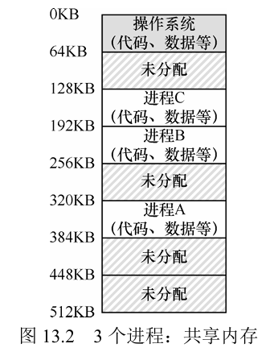

但这同时又带来新的问题。如果程序员可以直接指定不同进程的内容应该放在什么地方，那如何进行管理就成了一件麻烦事。因为进程使用的空间是可能增长的，为进程分配新空间，并且要保证新空间不能占用别的进程的空间，同时还得保证在使用时能顺利找到新的空间，这些都会占用程序员大量的精力，并且可能导致内存管理的混乱。于是，内存虚拟化出现了。

### 虚拟化内存的实质

我们不希望花大量的时间用在管理内存上。如果在对每个进程分配内存时，我们想直接填一个地址比如0x001这样的地址，而不是先在内存中找到一块足够大的空间，然后考虑这个空间够不够用，有没有什么影响，再把这块空间的地址分配出去。

同样的，在为进程分配堆空间和栈空间时，我们希望调用malloc函数时直接填想要的空间大小，而不是把堆要用哪块空间的地址填进去。

> 当程序在运行的时候，利用栈（stack）来保存当前的函数调用信息，分配空间给局部变量，传递参数和函数返回值。最后，堆（heap）用于管理动态分配的、用户管理的内存。
>
> 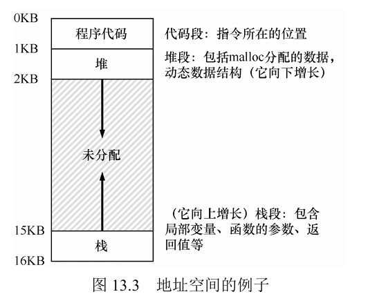

另外，我们还希望进程在运行时不要访问其它进程的空间，保证各个进程的安全。

为了实现这一目的，我们提出内存虚拟化。内存虚拟化的实现让进程有了一块专门的内存，这块内存的所有空间只属于这个进程自己，进程可以任意地使用这块内存的所有空间，不需要考虑其它进程。每个进程都是这样的，大家都有自己的内存，都可以随意使用内存的空间而无需担心打扰到其它进程。

听起来似乎很美好，就像假的一样，事实上，这就是假的。硬件和操作系统使用了一种方法，让进程使用一个好像只对自己开放的内存的地址，实际上这个地址会被自动转换成为真实内存中一个空间的物理地址。

我们把进程自以为自己使用的地址叫做虚拟地址，把进程实际使用的地址叫做物理地址。进程可以随意地使用虚拟地址，操作系统和硬件会把这些虚拟地址转换为物理地址，并且保证不同进程所用的空间不会相互干扰。

尽管进程所用的虚拟地址的地址空间很大，让我们不免担忧如果所有的进程都把地址空间完全占满，那岂不是会导致内存溢出。不过这份担心是多余的，大多是进程并不会完全占用地址空间，除了保留基本的空间存放程序和必要的参数外，大部分情况下都是需要时申请一块空间，不需要时释放空间，这些操作使得进程虽然不会直接占用所有空间，但会希望有预期的空间为其保留。虚拟地址的作用就是为进程提供足够的预期空间，在用到这些预期空间时，操作系统和硬件会进行地址转换提供给实际的内存空间，而这些内存空间又可能是其它进程刚刚释放或者还未使用的预期空间。

---

这样看来，虚拟化内存至少有三个好处：

1. 程序员不需要自己去找空间分配内存，所有的进程都可以直接从0x0000开始使用内存，毕竟对它们来说自己是独占内存的。

2. 所有的进程在运行时都直接使用内存作为存储空间，速度很快。毕竟如果真的让进程独占内存，那就要多一步从磁盘送数据到内存了。

3. 存储空间的实际分配交给操作系统和硬件，就不需要担心你某一天不小心把一个进程的数据放在另一个进程的空间上了。

---

虚拟化内存保证了所有进程都能实现大容量存储、高速运行、安全便捷，当然前提是这些内存不会直接占满自己的虚拟内存空间。


### 地址转换机制

地址转换直接来说就是在进程要访问虚拟内存时，由硬件和操作系统根据虚拟地址提供进程需要的实际物理地址。

> 下面是一个简单的地址转换的例子。进程将自己的代码和其它内容直接放在虚拟空间的开头，而实际上操作系统和硬件会在它访问空间之前将指针转移到合适的位置，不过进程自己不知道它已经被导向另一个地址了。
>
> 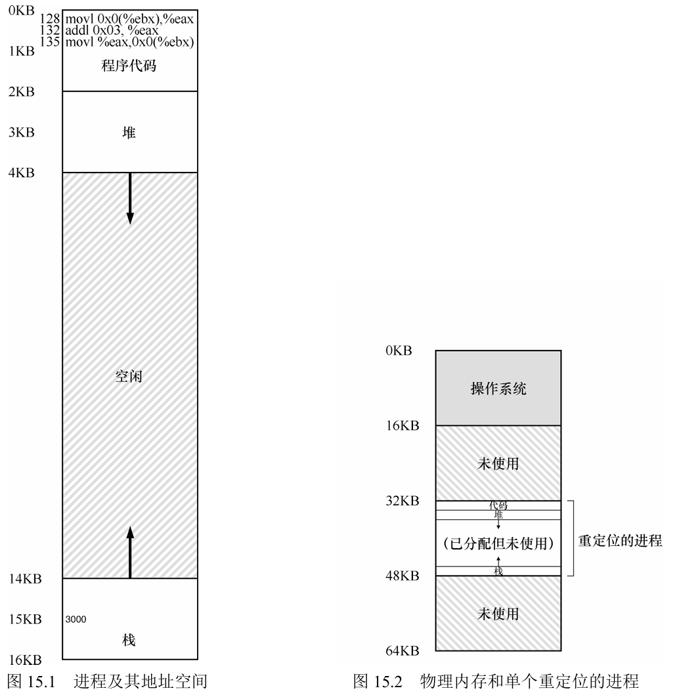

#### 动态重定位

动态重定位是基于基址/界限寄存器的硬件实现的地址转换的方式，与之对应的还有静态重定位。

这里介绍的动态重定位方式默认内存为每一个进程分配一个连续的空间。

动态重定位为CPU准备了两个寄存器，一个是基址寄存器，一个是界限寄存器。当进程访问内存时，比如从程序计数器中取指令地址，得到的地址是虚拟地址，虚拟地址的值会加上基址寄存器中存储的值形成新的地址，这个新地址就是进程指令的物理地址。在这个过程中，CPU会根据界限寄存器的值检测进程访问的地址空间有没有越界，如果进程的虚拟空间大小为16KB，而进程访问的虚拟地址是-1或者17K，那么马上就会发生中断，操作系统会停止该非法进程（有的界限寄存器也可能是在得到物理地址之后检查物理地址的）。

每个进程都有独属于自己的基址/界限寄存器，当进程切换时寄存器的值会保留在进程结构或者进程控制块中，新进程的基址/界限寄存器的值会写入寄存器，以此来确保每个进程所使用的空间是相互隔离的。

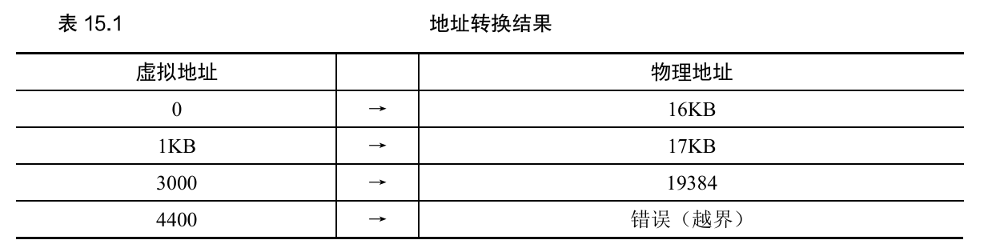

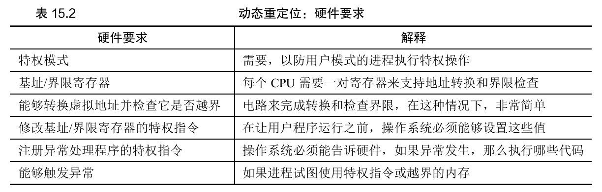

---

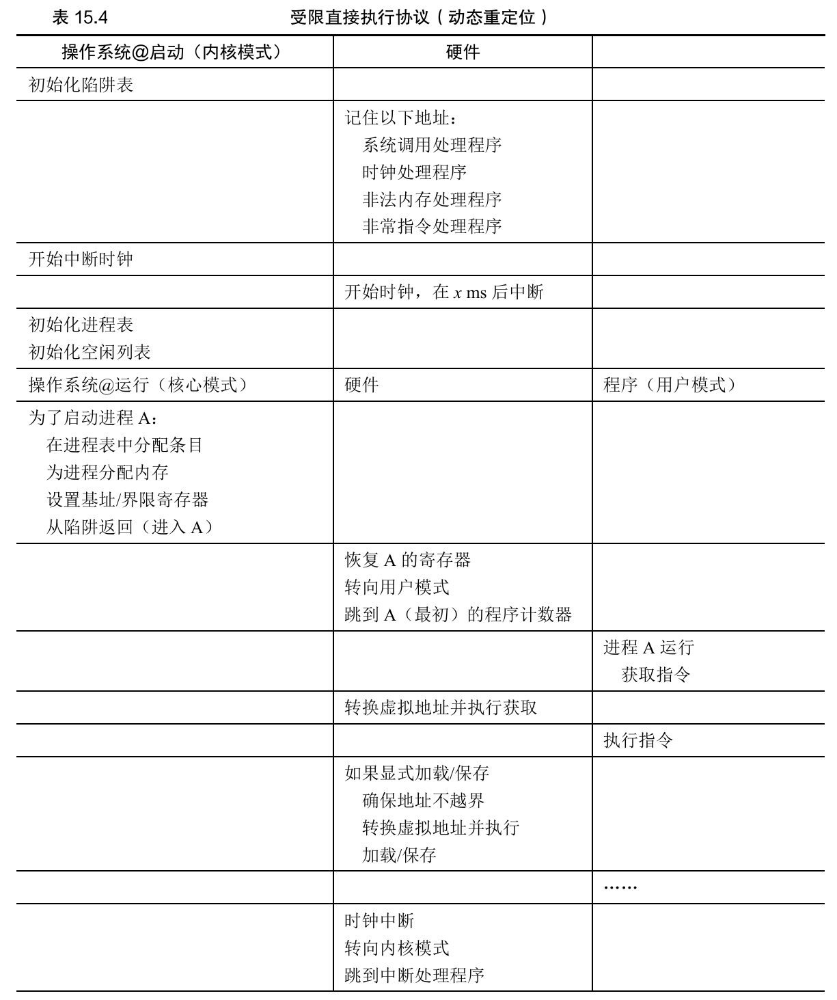
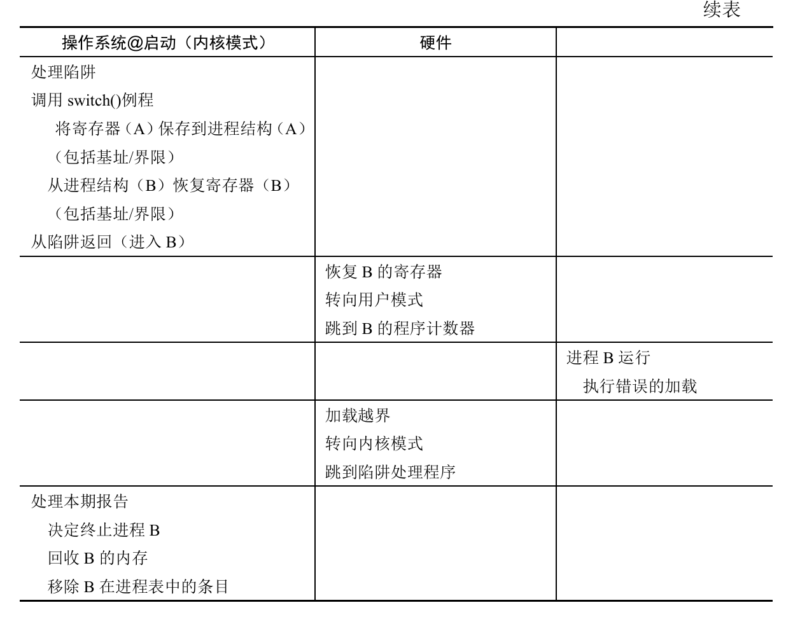

---

所谓动态重定位的意思就是在进程运行的过程中地址重定位，每次访问内存时都重定位，不影响进程本身的运行。与之相对的静态重定位则是将地址的转换程序加入到进程代码中，也就是当进程运行到访问内存时需要专门运行地址转换的代码，这种方式需要程序员自己判断如何分配内存。显然，这种方式和由程序员直接分配内存空间一样，低效且不安全。


这个方法虽然简单实现了内存虚拟化，但对内存资源的利用率还不够高。很明显可以看出，在分配的物理空间中有大量的空间作为进程未来可能使用但现在并没有用上的空间，这部分空间被进程独占，造成了内存的浪费。这种浪费我们一般称之为内部碎片。

#### 分段

我们已经知道对于一个进程来说，完整的一块地址空间应该包含代码、堆、栈以及堆和栈之间预留出来的空间。预留空间的存在导致内存的资源浪费，为了提高利用率，我们不再一次为一整个进程分配空间，而是为段分配空间。

一个段是一块连续的内容，比如进程的所有代码、进程的堆或栈，我们称之为代码段、堆段、栈段。

基于段分配内存的需要，一对基址/界限寄存器也被扩展为三对，并专属于某个段。CPU，更准确来说是CPU中管理内存的MMU，根据每对段寄存器的内容和虚拟地址来决定段的物理地址。

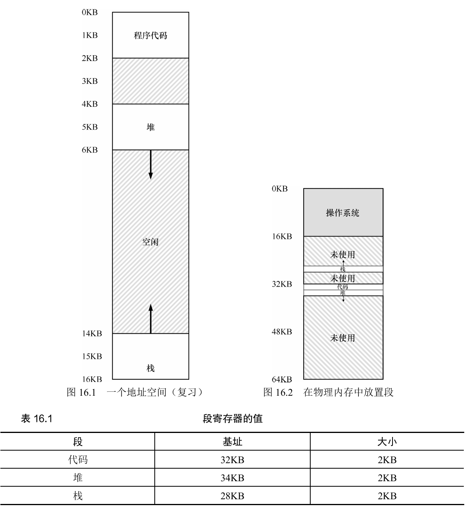

段寄存器除了要保存基址和界限外，还要有关于该段属于哪个部分的标识，段空间的增长方向，段空间是否被保护。在内存空间中，堆和栈的段空间增长方向往往相反。有的代码可能因为其通用性会被共享，这些代码段要设备保护位从而告诉进程该代码段只能读，不能写。

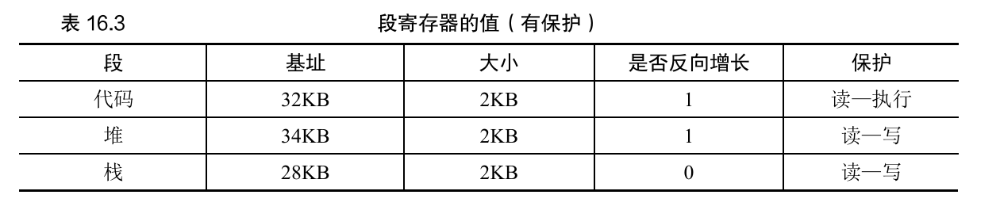

如果访问段的内存时出现了越界，就会发生段异常或者段错误。很多其它内存越界的情况也会被称为段异常或段错误（原因不明）。

分段有一个问题，我们称之为外部碎片。外部碎片是指由于分段而导致内存中的空闲空间被切割得七零八落，这些空闲空间加在一起或许很大，但作为碎片分散在内存中就很难用上。就好像方便面中的碎片一样，尽管看起来很多，但如果真的和面饼一起泡的话就很难捞出来。

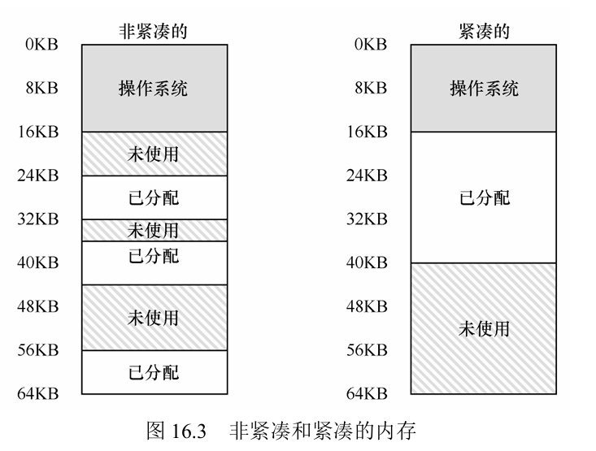

#### 空闲空间管理

对于空闲空间的分配管理主要针对外部碎片，要保证尽量少产生外部碎片，提高内存的利用率。

---

首先我们了解一下空间被分配和释放时发生了什么。

这是一个30字节的堆，它通常由c语言的malloc分配。

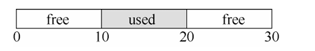

如果这个堆有空闲列表，那么空闲列表应该长这个样子。

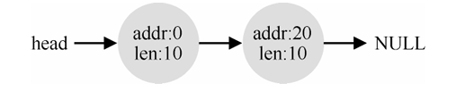

如果我们要申请超过10字节的空间，那么会失败，返回值为NULL。如果申请1字节空间就很容易。

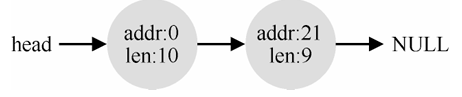

如果将占用的空间释放，就会产生下面的效果。

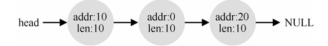

虽然看起来是一整块的空闲空间，但由于空闲列表将其分为三个部分，所以还是不能申请超过10个字节的空间，必须进行合并。


到这一步才完成了空闲空间的管理。

所以任何空闲列表的管理都涉及到空间的分割与合并。

---

接下来我们了解一下如何在空闲空间内部构建一个空闲列表。

为了追踪空闲空间和已分配的空间，我们会在这些空间块的头部放上一些信息，这种方式在C分配内存时很常用。


在上图中，申请20字节的空间实际上会分配更多空间，多余的空间作为头块，里面存放着这一整块空间的信息。size描述了该空间的大小，magic是幻数，用来验证完整性和其它信息。给用户实际返回的指针并不是头指针hptr，而是指向空间的ptr，在使用free函数释放空间时，free会根据ptr的位置找到hptr，从而知道自己要释放多大的空间。

这种加入头块的方法可以让我们知道那些分配的空间和未分配的空间的情况，比如下面这种。

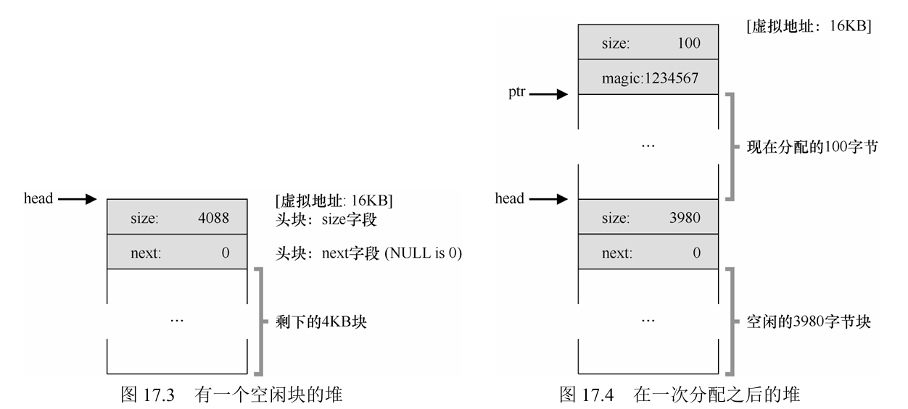

空闲块的头部是该块大小和指向下一个空闲块的指针，被分配的100字节空间头部是该块大小和验证完整性的幻数。

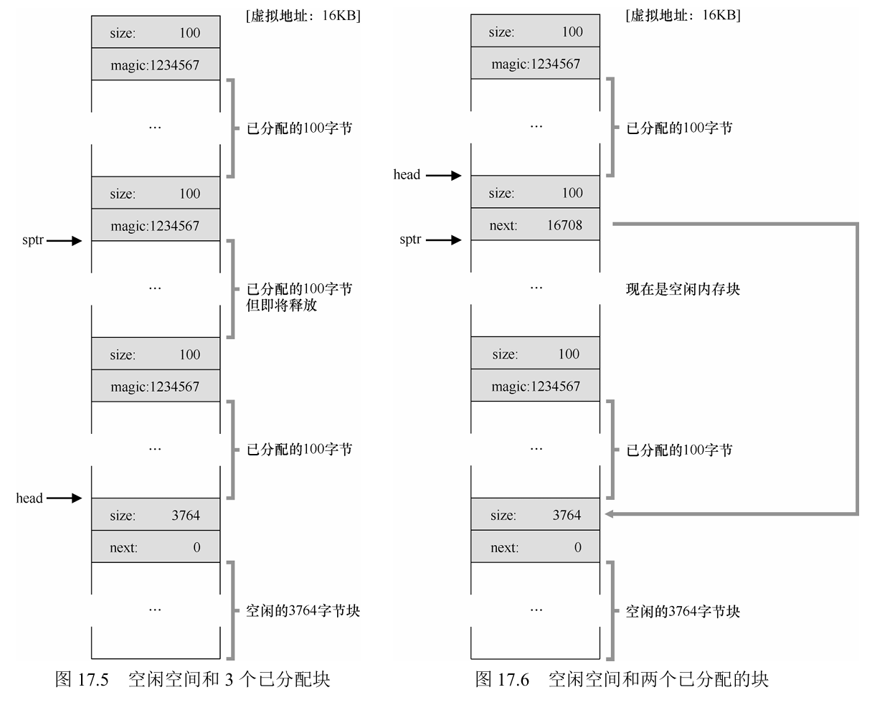

然后再分配两块空间，接着释放夹在中间的那一块。于是这个堆空间中就有了两个空闲块组成的空闲列表，一大一小。100字节的空闲内存块的指针指向了大的空闲块，这样两个空闲块就组成了一个链表，如果未来还有分割出来的空闲块就又会加入到这个链表中，通过链表就能得到所有的空闲块。

当所有的空间释放完后，就会形成下面这样由空闲空间碎片组成的链表。

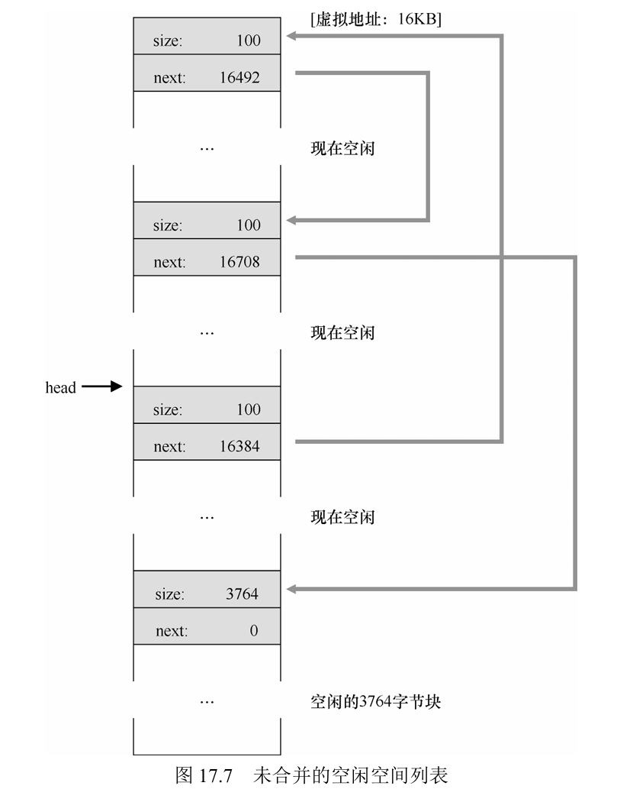

为了正常使用空闲空间，还需要最后一步，那就是通过遍历整个列表合并空闲块。

这就是管理空闲空间的底层机制，基于这样的机制，我们可以提出一些策略来保证对内存空间的利用率最大化。

---

不同的内存分配情况有不同的分配策略，对于同一种情况，有些策略的效果可能正好相反。

##### 最优匹配

遍历空闲列表，从所有大于等于待申请空间的空闲块中找到最小的那一个。

这样保证每次申请空间时尽量找到最合适的，从而将更多空间节省下来，但是遍历的开销很大。

##### 最差匹配

遍历列表，找到最大的空闲块。

这样做可以留下尽可能大的空闲块提供给其它请求。缺点是开销大，并且实践证明这种方式会产生很多碎片，不愧为最差之名。

##### 首次匹配

找到第一个足够大的块就返回地址，不需要遍历整个列表。

优点是开销小，缺点是很容易在靠前的空闲块充满碎片。由于碎片集中在靠前的位置，所以在释放空间时合并的也是靠前位置的更多，因此可以让空闲列表的元素根据地址排序（传统方式是根据空闲块产生的先后次序排序，毕竟是链表），这样就能保证空间释放后马上就能识别出是否需要合并。

##### 下次匹配

这种方式多维护一个指针，刚开始指针指向列表第一个元素，从该元素开始查找大小足够的第一个空闲块，完成后指针指向该块的下一个空闲块，下次查找时就从指针指向的这个块开始查找。

优点是开销小，并且将空闲块的查找扩散到整个列表，不会出现首次匹配那样的开头碎片多的情况。

##### 分离空闲列表

有的程序会频繁申请一种（或几种）固定大小的空间，对于这一类申请可以专门预留出空间并准备新的列表。

好处是这种列表不存在碎片，分割与合并都容易实现，开销小。

如果预留的空间不够，还可以从空闲列表中再申请空间。

##### 伙伴系统

为了提高合并时的效率，使用二分伙伴分配程序。

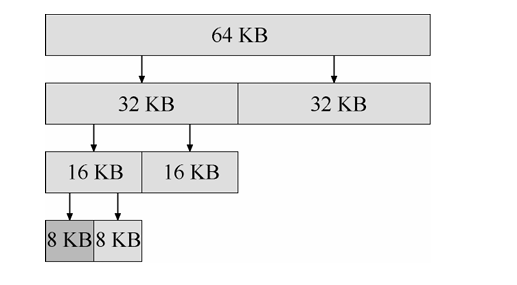

每次分配空闲空间时，都将一个大空间不断一分为二，直到分出恰好满足要求的块，虽然这样会产生内部碎片，但是在合并时，只要知道该块的伙伴有没有空闲，就知道当前块是否能够合并。


#### 分页

分段的方式很容易产生外部碎片，这是因为每个段的大小不统一，碎片多了之后很难找到合适的空闲空间满足新的需求。

通过分配统一大小的小空间，可以将碎片利用起来。将物理内存看成是由槽块组成的阵列，虚拟内存看成是由很多大小相同的小空间组成的大空间。把物理内存的每个槽块称为页帧，虚拟小空间称为虚拟页。

可以将其理解为一张大图分割为了很多大小相同的拼图碎片，每个段使用的空间就好像每个拼图碎片都有一小部分内容，这些碎片共同组合起来就形成了一整个段。与真实拼图不同的是，由于指针的存在，这些拼图碎片不必连续放在一起，只要指针指向的位置正确，哪怕它们分散在物理内存的各个角落，也跟放在一起没区别。

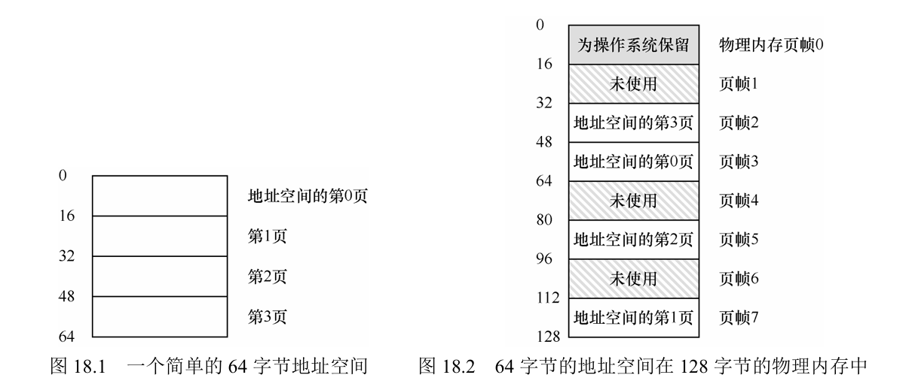

那么这些关键的指针放在哪里？与基址/界限寄存器和段寄存器不同的是，这些指针放在了内存中，准确来说，是内存的页表中。每个进程在内存中都有独属于自己的页表，页表上记录了虚拟页号对应的物理页帧号。

在进程访问内存时，CPU根据虚拟页号和页表得到真实的物理页号，然后把物理页号加上页内偏移量，就得到了真实的物理地址。

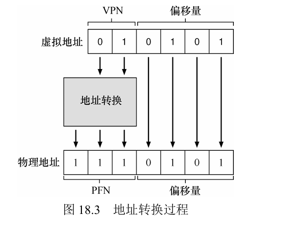

我们可以将页表简单理解为一个数组，虚拟页号就是该数组的索引，索引对应的元素就叫页表项，页表项里除了有物理页帧号外，还有一些操作位，比如保护位、有效位、脏位、存在位等。

由于页表放在内存中，所以每次要访问内存时，CPU需要先在页表寄存器访问一次内存找页表，然后根据页表再访问一次内存找到实际位置。每次内存访问都要访问两次，造成了很大开销。另外如果页表很大的话，那么内存空间就会浪费在存储页表而不是存储代码等有用数据上。


#### 快速地址转换

分页会让每一次内存访问都多一次查询页表的消耗，虽然提高了空间利用效率，但是速度太慢了。要改善这个问题，需要添加一个硬件缓冲，就像cache那样，把最近要访问的页表项放在这个缓冲中，这个缓冲叫做地址转换旁路缓冲TLB。

TLB用法很简单，CPU访问内存时先在TLB查找有没有对应的虚拟页号，如果有就拿出对应的页帧号，然后跟偏移量合成为物理地址，最后访问内存。如果没有找到对应的虚拟页号，那就访问内存的页表，找到对应的页表项，更新TLB。

TLB中一般会有32、64或128项页表项，由于TLB采用全相联映射，所以这些页表项的内容格式一般为`VPN|PFN|其它位`。其它位中要注意有效位不等同于页表的有效位，TLB的有效位实际表示的是TLB缓存有效，这个地址或许可以访问，只是在你缓存之前不知道而已；页表的有效位则表示该进程有没有权限访问。

在多进程切换运行时，TLB会将原来的进程的页表项有效位全部置零，从而达到清空缓存的目的，然后等待新的进程访问内存，从而更新缓存。但如果频繁地切换进程就要不断更新，开销很大，为了解决这个麻烦，需要在多个进程间共享TLB，简单来说就是在TLB中存储多个进程的页表项，不过这需要在页表项中多加一位ASID（地址空间标识符）来辨别不同页表项分别属于谁。

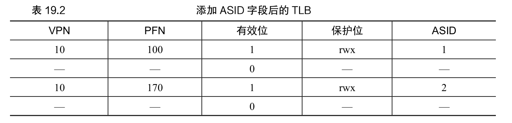

TLB在占满的情况下，要更新页表项就要顶替原来的页表项。这里介绍两个策略给予参考，一是最近最少使用LRU，让新的页表项顶替原来最少用到的；另一种是随机替换，也就是随机找一个进行替换。随机替换可以避免一种极端情况，比如循环遍历数组，数组大小占20个页，而TLB只有19个页表项，如果使用LRU就会导致每次新访问的都是刚刚被替换的，需要不断更新，随机替换就能很好地避免这一点。

> 一个实际的TLB表项一般长这个样子。地址空间为32位，页大小为4KB，12位为偏移量，VPN占19位，因为用户空间一般占一半，剩下一半由内核管理。
>
> G为全局位，表示该页是不是所有进程共享，3个C位为一致位，表示硬件如何进行缓存，脏位D表示该页是否被写入新数据但还没缓存，有效位V表示该映射是否有效。还有图中未展示的页掩码位，用来支持不同页大小。
>
> 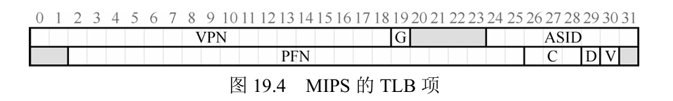

#### 多级分页

分页的方法固然让内存空间效率变高了，但是如果页表本身太大的话，也会占用很多内存。我们当然希望内存中多存一些有用的数据，而不是更多指针。

###### 更大的页

一个简单的方法是让每个页变大，只要页变大，那么页表项的数量就会少，页表也不会占太多内存。显而易见的是太大的页又会导致分配内存时一开始所遇到的问题——容易出现内部碎片。

这个时候前面我们介绍的页表项中控制页表大小的位就用到了，对于那些内存需求大的进程可以通过控制位分配更大的页，反之就分配较小的页，而这只需要牺牲一些开发者的头发，让系统设计更加复杂罢了。当然这种大小不一的页是否会导致同分段一样的外部碎片的产生，需要持保留意见。

###### 混合分段和分页

有的时候造成碎片的原因不在于进程数据使用的内存空间，而在于页表所使用的空间，如下所示：

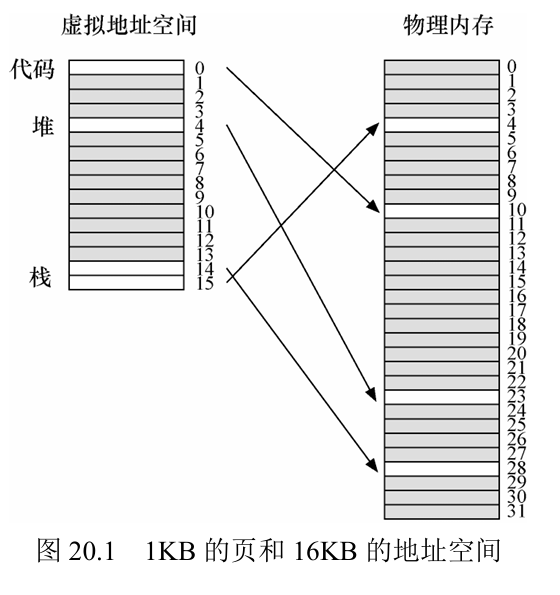

可以看到，进程对于虚拟空间的浪费完全体现在了页表上，而由于页表被放在内存中，因此这种浪费也一同出现在内存中。这比一开始直接在内存中为堆栈预留空间的做法好很多，但如果页表很大，尤其是基于多进程并发运行的需求而将很多进程的页表都放在内存时，就会造成相当大的浪费。

基于过去已有的经验，我们不需要再像别的办法处理这些浪费。就像刚开始在内存中遇到这种问题所采用的方法一样，对于页表的浪费，我们继续使用分段。具体来说，我们要为每个段准备一个页表，并将每个页表的地址放在对应的基址/界限寄存器中，这样就能避免对一整个进程使用一个页表时的浪费。

好处说完了，接下来该说说坏处了。我们应该还记得刚开始分段解决内部碎片问题后紧跟着产生的新问题，没错！就是外部碎片！牛逼的你可能已经意识到了，随着分段方式对页表的使用，外部碎片也一同出现在了页表中，准确来说是出现在了页表之间。大量外部碎片的出现会导致在内存中有很多零散的空间，但这些空间无法为新的段分配页表。

##### 多级分页

按照上一个标题的风格，这个本来应该叫“混合分页与分页”，不过这不太好听，并且我们要尊重原著，因为原著就是“多级分页”。

牛逼的你大概已经想到这一节要干什么了，没错，我们要处理上一节的分段导致的问题，并且依旧是用老方法——对页表使用分页。

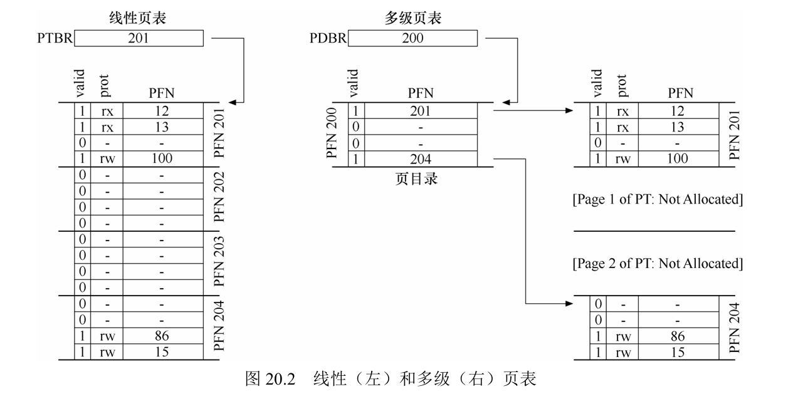

像上面的例子那样，把所有页表项都装进页里，然后为这些装着页表项的页做一个页表，这个页表可以叫页目录，也可以叫二级页表。

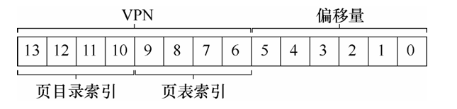

同时虚拟地址也被分成三份，根据页目录索引和页目录找到一级页表的真实地址，然后根据页表索引和一级页表找到真实待访问地址。开销肉眼可见的大，访问一次数据需要访问三次内存。

我们使用老经验解决问题的同时当然也要想到老方法可能导致的新问题，一级页表处理好了，二级页表还没有呢。二级页表使用的仍然是基址/界限寄存器，仍然有可能产生碎片问题。

俗话说祖宗之法不可变，但我们不能总用老祖宗的智慧（哪怕这是个现代社会的老祖宗）解决问题，这样讨论下去没完没了了。直接盖棺定论吧。对于二级页表出现的问题，我们仍然采用分页的方法，也就是开头讲的多级页表。

尽管所有多级页表的最顶层都采用的是基址/界限寄存器追踪地址的方式，但随着层数增加，系统对内存的利用率也越来越高，多级页表比一级页表产生的问题要小很多。

```c
1    VPN = (VirtualAddress & VPN_MASK) >> SHIFT 
2    (Success, TlbEntry) = TLB_Lookup(VPN) 
3    if (Success == True)    // TLB Hit 
4        if (CanAccess(TlbEntry.ProtectBits) == True) 
5            Offset   = VirtualAddress & OFFSET_MASK 
6            PhysAddr = (TlbEntry.PFN << SHIFT) | Offset 
7            Register = AccessMemory(PhysAddr) 
8        else 
9            RaiseException(PROTECTION_FAULT) 
10   else                  // TLB Miss 
11       // first, get page directory entry 
12       PDIndex = (VPN & PD_MASK) >> PD_SHIFT 
13       PDEAddr = PDBR + (PDIndex * sizeof(PDE)) 
14       PDE     = AccessMemory(PDEAddr) 
15       if (PDE.Valid == False) 
16           RaiseException(SEGMENTATION_FAULT) 
17       else 
18           // PDE is valid: now fetch PTE from page table 
19           PTIndex = (VPN & PT_MASK) >> PT_SHIFT 
20           PTEAddr = (PDE.PFN << SHIFT) + (PTIndex * sizeof(PTE)) 
21           PTE     = AccessMemory(PTEAddr) 
22           if (PTE.Valid == False) 
23               RaiseException(SEGMENTATION_FAULT) 
24           else if (CanAccess(PTE.ProtectBits) == False) 
25               RaiseException(PROTECTION_FAULT) 
26           else 
27               TLB_Insert(VPN, PTE.PFN, PTE.ProtectBits) 
28               RetryInstruction()
```

上面这段是多级页表情况下访问内存的伪代码，这段代码让我们意识到多级页表不是无敌的，随着页表层数增加，CPU访问内存的开销和复杂度也会变大。在TLB未命中时，处理过程会相当麻烦。

##### 反向页表

那么有什么东西可以摆脱祖宗之法呢？唉！🤓👆，这里刚好有一个。

反向页表采用的是反向映射的方法。一般来说从虚拟地址映射到页表是正向映射。反向映射保留一个全局的唯一页表，这一个页表映射到多个进程的虚拟地址，每当有进程访问内存时就在这一个页表上查。

鉴于全局只有这一个页表，可想而知这个页表会相当大，它不像TLB那样可以采用全相联映射的方式，对着反向页表采用遍历时间开销会非常大。为了解决这一问题我们采用散列表作为反向页表的数据结构，这样就可以在一定程度上直接将索引作为虚拟地址。


#### 超越物理内存

在之前所讨论的情形中，我们会为进程分配一个小于等于物理内存的虚拟地址空间，这样很好地实现了多道程序运行时每个进程都能使用完整内存的好处。但为了让更多的程序享受更大的内存，我们是否还可以做出一些优化？

答案当然是可行的，不要忘了，除了物理内存外，我们还有磁盘，并且磁盘的存储要远远超过内存。只要优化得当，我们就可以花磁盘的钱来得到内存的性能。

从理论上来讲，既然对数据的访问具有时间局部性和空间局部性，那我们只需要把所有进程最常用的页放在内存，不常用的放在磁盘，并保证当这些页的重要性发生改变时，操作系统能够及时地把磁盘中需要的页放在内存，把内存中不再常用的页放回磁盘，就可以实现更大存储，相同速度的假象。

尽管实际上可能无法达到这么完美，但相较只使用物理内存而言仍然是巨大的提升。

##### 机制

更大的虚拟空间需要底层硬件和操作系统的支持，我们首先要了解一些最常用的机制。

要实现超越物理内存的假象，首先需要硬盘腾出一块地方专门用来存放进程不太常用的页，这块地方叫做交换空间。一些页使用率降低时会被放在这里，如果有的页使用率提高，就会被放回内存。

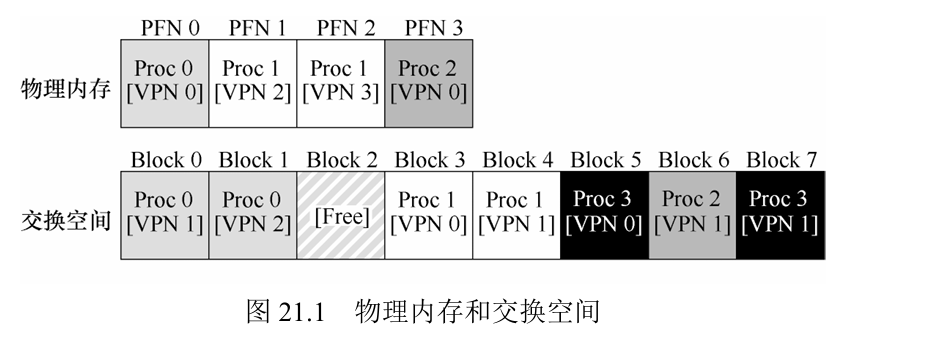

---

现在我们深入了解一下交换空间是如何被用到的。

假设有一个进程由于需要的存储空间过大，同时申请的空间又表现出良好的局部性，所以它的虚拟地址空间既由内存提供，也由磁盘提供。现在操作系统需要访问它的一块地址空间，首先根据TLB查询该空间的页，如果命中了，那就直接对该页执行相应操作；如果没有命中，那就找到页目录基址寄存器，然后找到对应页表，再从页表找到对应的页。

该进程的页在内存和磁盘中都有，要知道是去哪里找，需要再加一位来进行区分，这一位称为存在位。如果存在位有效，则需要的页在内存中，直接将该页的页表项加载在TLB中；如果无效，则要先将磁盘中的页放在内存中，然后将页表项交给TLB。无效的页表项中的地址就是该页在磁盘中的地址。

> 访问不存在于物理内存中的页，这种行为通常称之为页错误。页错误由操作系统处理。
>
> 页错误控制流算法（硬件）如下所示：
```c
VPN = (VirtualAddress & VPN_MASK) >> SHIFT;
(Success, TlbEntry) = TLB_Lookup(VPN);

if (Success == True) { // TLB Hit
    if (CanAccess(TlbEntry.ProtectBits) == True) {
        Offset = VirtualAddress & OFFSET_MASK;
        PhysAddr = (TlbEntry.PFN << SHIFT) | Offset;
        Register = AccessMemory(PhysAddr);
    } else {
        RaiseException(PROTECTION_FAULT);
    }
} else { // TLB Miss
    PTEAddr = PTBR + (VPN * sizeof(PTE));
    PTE = AccessMemory(PTEAddr);
    if (PTE.Valid == False) {
        RaiseException(SEGMENTATION_FAULT);
    } else {
        if (CanAccess(PTE.ProtectBits) == False) {
            RaiseException(PROTECTION_FAULT);
        } else if (PTE.Present == True) {
            // assuming hardware-managed TLB
            TLB_Insert(VPN, PTE.PFN, PTE.ProtectBits);
            RetryInstruction();
        } else if (PTE.Present == False) {
            RaiseException(PAGE_FAULT);
        }
    }
}

PFN = FindFreePhysicalPage();
if (PFN == -1) {               // no free page found
    PFN = EvictPage();        // run replacement algorithm
}

DiskRead(PTE.DiskAddr, PFN); // sleep (waiting for I/O)
PTE.present = True;           // update page table with present
PTE.PFN = PFN;               // bit and translation (PFN)
RetryInstruction();           // retry instruction
```

有时候会出现意外的情况，比如内存已经满了，不能接受从磁盘来的页。这时候需要把一些页拿出，与磁盘进行页交换。

当然在实际情况中等到内存满了再想起交换页就太晚了，那会让好不容易形成的假象变得漏洞百出。大多数操作系统会设置高水位线HW和低水位线LW，当内存中的空闲空间少于LW时就会把一些页换到磁盘，知道空闲空间不少于HW，这个后台进程称为交换守护进程或页守护进程。其它还有一些性能优化，比如把需要换出的页合并在一起后同时写入交换空间，提高硬盘的效率，IO允许这么做。

##### 策略

在使用磁盘的过程中我们不可避免地要考虑到，当需要交换一些页时，我们该把谁交出内存，把谁放入内存？

这个问题听起来有点蠢，因为是个人都能想到，当然要用不用的页换需要用的页。那么恭喜你，你想到了页交换策略中效率最高的最优替换策略。准确来说，最优替换策略指的是把未来即将使用的页放入内存，把很久之后才使用的页放在硬盘。

很遗憾的是，我们无法预测未来，因此最优替换策略是无法实现的，我们只能通过其它手段来接近它。

---

最简单的手段是FIFO和随机，完全不考虑任何局部性，只是单纯的因为实现起来不复杂，当然效率也是相当一般。当然随机可以避免一些特殊情况，比如说循环访问一个比内存页稍大一点的数组，FIFO会让你知道什么叫内存的空间，磁盘的速度。

更智能一些的策略比如像LRU，它相信程序的内存访问具有局部性，通过查看历史信息中哪些页被频繁访问从而决定将这些页保存在内存中。当然，它也有它的问题，和之前提到的一样，循环访问一个稍大一点的数组，有局部性，但这个局部性不好利用。

---

LRU看起来已经是相当好的策略了，那么问题来了，如何实现LRU，准确来说，怎么为这些页做个记录来让我们可以知道哪个是最近最少使用的那个。

一个简单的方法是为每个页都设置一个时间戳，需要交换页时找到那个时间最早的页。这个方法的时间复杂度是O(n)，页少的时候很好用，但如果页多的时候，开销就会很大。

为了降低开销，我们可以采取近似LRU的方法，不需要精准地确保换出的页是最近最少使用的，只要保证相对近相对少使用就可以。

我们为每个页设置一个使用位，当该页被引用时硬件将其使用位设为1，等到下一次再引用该页时，操作系统就会知道该页最近被使用过，将该页使用位置0的同时访问下一个页，如果下一个页使用位为0，那就将这一页交换。这种算法称为时钟算法，其中指向页的指针（准确来说是指向页表项的，毕竟页不是连续分布的）称为时钟指针。

时钟算法有一个小修改，考虑到如果一个内存页被写入某些内容的话，那要将它换出时就需要把新内容写入磁盘，这样的页称为脏页。换脏页的开销很大，我们希望换一些没被写过的页，这样只需要在内存的页表项修改一些存在位就可以了。因此我们为每个页又设置了一个脏位（修改位），并在考虑换出页时只换那些使用位和修改位都为0的页，当然极端情况下首先要考虑使用位为0的页。

最后我们再考虑一种特殊情况，如果进程总是申请超出内存容量的存储怎么办？在条件允许的情况下，系统会进行不断地换页，就像FIFO遇到大一点的数组那样，这种情况被称为抖动。一些早期操作系统检测到抖动后可能会选择放弃一些不常用进程的运行，从而处理这种内存超载情况，某些版本的Linux操作系统会选择直接杀死内存密集型进程，当然这个操作会比较危险。

页替换的策略是如此复杂，如果你实在不想了解这么复杂的东西，这里可以为你提供一个更加有效率，更加简单，更加强大的方法——买更多的内存，把超越物理内存的假象变成真的，就这么简单。


#### VAX/VMS 虚拟内存系统

这是一个真实的操作系统，但在这里我们只介绍关于它的内存管理方面的一部分内容，用于对前面内容的补充，更多详细内容请参考《OSTEP》。


##### 按需置零

当你申请一个新空间放在进程的堆上时，一般要将这个页的内容全部置零，这是为了保证这个页原来的内容不被该进程看到。

这样做的开销会很大，而且你也不一定使用这个页。按需置零要求操作系统在增加页时不用将页置零，而是设置保护位，将该页设置为对进程不可访问，直到进程需要写入内容时才会陷入操作系统进行置零和更改权限。

在多级缓存中，很多临时内容可以直接通过缓存使用，不需要写入内存，按需置零很好地保证了这些操作不会带来太大的开销。

##### 写时复制

不同的进程可能会共用到同一段代码或者数据，为了提高内存效率我们会把这些代码段设置为共享，并添加到不同进程的页表中去，比如下面的操作系统代码映射到不同进程页表中：

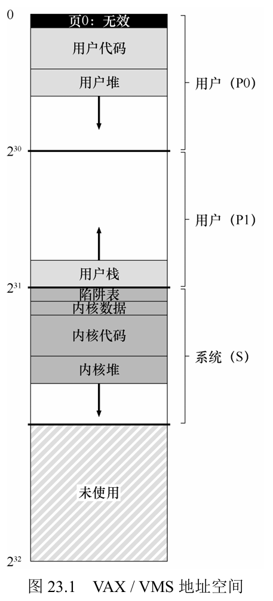

这么做可以避免需要操作系统时还要做正常进程切换的一大堆工作，就像直接调用用户程序的下一条指令一样，简单而快捷。当然，必须注意保护系统空间，不能让用户程序随意访问和修改系统空间的内容，因此加一些保护位设置权限是很有必要的。

当然有的共享代码允许写入，当进程需要写入时，为该进程复制一个新的副本，而原来的依然供给其它程序进行只读操作。

相比于每次有进程引用时都复制一个新副本，写时复制大大节省了开销和内存空间。

### 结束

在实现了CPU虚拟化和存储虚拟化之后，所有的进程都很高兴于自己获得了专有的CPU和存储，虽然大家在同一台机器上工作，但就环境而言简直是自己独立拥有一台机器一样！当然，操作系统和硬件知道这些只是假象，不过为了更好地让进程们方便工作，它们会处理好一切，以维护这个假象。
