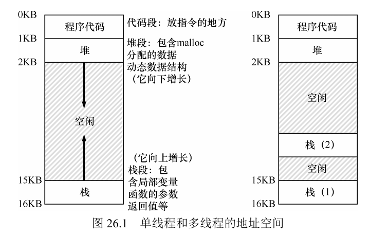
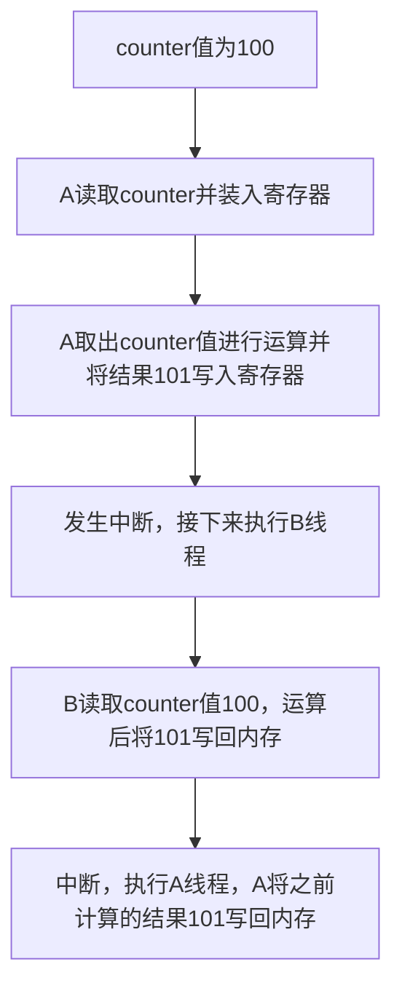

## 并发

### 介绍

在进程的内部有一种东西叫做线程，如果我们单纯地将进程理解为一道程序的执行和这道程序所占有的空间，那么线程就可以直接理解为是这道进程的执行。就像函数要分主函数和其它函数一样，线程也可以分为主线程和其它线程，每个线程都只执行自己的任务。

线程与进程的主要区别是，同一个进程中的多个线程是共享内存堆空间的，也就是每个线程都可以使用同一块内存。另外，线程有自己的线程控制块，程序计数器以及各种寄存器（当然这有可能是假象，不过虚拟化会处理好这一切）。线程的切换也涉及到上下文切换，不过不需要切换页表。

线程有自己的栈，可以保证有些空间只有线程自己使用，虽然多余的栈造成了地址空间管理的复杂性，不过所幸栈一般不会太大。下图是单线程和多线程的地址空间：



#### 实例

```c
#include <stdio.h> 
#include <assert.h> 
#include <pthread.h> 

// 线程执行的函数
void *mythread(void *arg) { 
    printf("%s\n", (char *) arg); // 打印传递给线程的参数
    return NULL; 
} 

int main(int argc, char *argv[]) { 
    pthread_t p1, p2; // 声明线程标识符
    int rc; // 用于存储返回码

    printf("main: begin\n"); // 表示主函数开始

    // 创建第一个线程，传递"A"作为参数
    rc = pthread_create(&p1, NULL, mythread, "A"); 
    assert(rc == 0); // 确保线程创建成功

    // 创建第二个线程，传递"B"作为参数
    rc = pthread_create(&p2, NULL, mythread, "B"); 
    assert(rc == 0); // 确保线程创建成功

    // 等待第一个线程结束
    rc = pthread_join(p1, NULL); 
    assert(rc == 0); // 确保连接成功

    // 等待第二个线程结束
    rc = pthread_join(p2, NULL); 
    assert(rc == 0); // 确保连接成功

    printf("main: end\n"); // 表示主函数结束
    return 0; 
}
```

如上图所示的案例，线程就像函数一样，需要创建和执行，并且可以肯定的是，无论是主线程还是这些分支线程，都是串行执行的，只不过为了保证能看到每个线程及时出效果，我们让这些线程快速地轮转执行，看起来就像是同时执行一样。

这样带来一个问题，那就是对于每个线程执行的任务来说，你不知道它们执行的顺序，可能是第一个先执行完，也可能是第二个先执行外，或者其中一个执行的过程中突然中断，让另一个去执行的。这种无序性会让某些共享空间变得异常混乱。


#### 并发下共享数据的问题

```c
#include <stdio.h> 
#include <pthread.h> 
#include "mythreads.h" 

// volatile告诉编译器不要对这个变量进行优化，每次从内存读写变量值而不是缓存中
static volatile int counter = 0; // 定义一个可变的计数器

// 线程函数 mythread()
void * mythread(void *arg) { 
    printf("%s: begin\n", (char *) arg); // 打印线程开始信息
    int i; 
    // 循环增加计数器
    for (i = 0; i < 1e7; i++) { 
        counter = counter + 1; // 增加计数器
    } 
    printf("%s: done\n", (char *) arg); // 打印线程完成信息
    return NULL; 
} 

// 主函数 main()
int main(int argc, char *argv[]) { 
    pthread_t p1, p2; // 声明两个线程
    printf("main: begin (counter = %d)\n", counter); // 打印主函数开始信息

    // 创建两个线程
    Pthread_create(&p1, NULL, mythread, "A"); 
    Pthread_create(&p2, NULL, mythread, "B"); 

    // 等待两个线程完成
    Pthread_join(p1, NULL); 
    Pthread_join(p2, NULL); 
    printf("main: done with both (counter = %d)\n", counter); // 打印主函数结束信息
    return 0; 
}
```

上面的代码希望A线程和B线程分别对变量counter加10000000，最后得到结果20000000。

实际上结果一般不会是20000000，应该低于这个数字，原因就是线程的执行是无序的。

具体过程可以参考下例：



可以看到，两个线程完全遵循串行执行，但由于对counter的读取写回操作不是原子的，导致它们分别读取和运算了相同的值，导致两次运算的效果等同于一次运算。

上述过程的中断发生在下面的指令执行过程中：

```C
mov 0x8049a1c, %eax  
add $0x1, %eax 
mov %eax, 0x8049a1c
```

如果不希望共享变量出现这种混乱，就要保证这三条指令必须在一起执行。


在之后的学习中，我们需要解决并发带来的这些问题，在此之前，我们有必要先了解一些基础概念。

- 临界区(critical section)：是访问共享资源的代码，上例中线程对counter进行读取运算部分的代码就是临界区。

- 竞态条件(race condition)：上例中两个线程竞争counter导致了错误的结果，这就是竞态条件。

- 不确定性(indeterminate)：counter的结果是不确定的，这就是不确定性。

- 互斥(mutual exclusion)原语：我们希望将三条执行运算的指令浓缩为一条，这一条就是互斥原语。

### 一些线程API

接下来的内容涉及到大量的并发代码，因此有必要介绍一些基本的线程API来增进理解。

#### 线程的创建和使用

##### (1) pthread_create()

该函数用来创建线程并执行。

```c
#include <pthread.h>  

int pthread_create(
    pthread_t *thread,                // 线程标识符的指针
    const pthread_attr_t *attr,      // 线程属性，NULL 表示使用默认属性
    void *(*start_routine)(void*),   // 线程执行的函数
    void *arg                         // 传递给线程函数的参数
);

// void* 可以转换为任意类型，推荐使用void*
```

##### (2) pthread_join()

该函数用于等待一个线程执行完成。

```c
#include <pthread.h>  
/*
pthread_t thread: 要等待的线程的标识符。
void **retval: 指向一个指针的指针，用于存储线程执行函数的返回值。
如果成功，pthread_join() 函数返回 0。如果失败，返回一个非零的错误码。
*/
int pthread_join(pthread_t thread, void **retval);
```

> 注意不要把栈空间里临时创建的指针返回给retval，那样做好比是你把自己曾经租过但已经到期的房间地址告诉你的朋友。


##### 案例

```c
#include <stdio.h>     // 包含标准输入输出库
#include <pthread.h>   // 包含线程库
#include <assert.h>    // 包含断言库
#include <stdlib.h>    // 包含标准库，用于malloc

// 定义一个结构体myarg_t，包含两个整型成员a和b
typedef struct myarg_t {
    int a;
    int b;
} myarg_t;

// 定义一个结构体myret_t，包含两个整型成员x和y
typedef struct myret_t {
    int x;
    int y;
} myret_t;

// 线程函数，接受一个void指针参数
void *mythread(void *arg) {
    myarg_t *m = (myarg_t *) arg; // 将参数转换为myarg_t指针
    printf("%d %d\n", m->a, m->b); // 打印结构体成员a和b的值
    myret_t *r = malloc(sizeof(myret_t)); // 分配内存给myret_t结构体
    r->x = 1; // 初始化结构体成员x
    r->y = 2; // 初始化结构体成员y
    return (void *) r; // 返回结构体指针
}

// 主函数
int main(int argc, char *argv[]) {
    int rc; // 用于存储线程创建和等待的返回值
    pthread_t p; // 线程标识符
    myret_t *m; // 用于存储线程函数返回值的指针
    myarg_t args; // 创建一个myarg_t结构体变量
    args.a = 10; // 初始化结构体成员a
    args.b = 20; // 初始化结构体成员b
    rc = pthread_create(&p, NULL, mythread, &args); // 创建线程
    assert(rc == 0); // 断言线程创建成功
    rc = pthread_join(p, (void **) &m); // 等待线程终止并获取返回值
    assert(rc == 0); // 断言线程等待成功
    printf("returned %d %d\n", m->x, m->y); // 打印线程函数返回的结构体成员x和y的值
    free(m); // 释放分配的内存
    return 0; // 程序结束
}
```

#### 锁

POSIX线程库提供一些函数，通过锁（lock）在临界区提供互斥。下面是一组最基本的函数。

```c
int pthread_mutex_lock(pthread_mutex_t *mutex);  // 上锁
int pthread_mutex_unlock(pthread_mutex_t *mutex);  // 解锁
```

举个例子：

```c
pthread_mutex_t lock;  
pthread_mutex_lock(&lock); 
x = x + 1; // or whatever your critical section is  
pthread_mutex_unlock(&lock);
```

在这个例子中，进入临界区的线程持有锁，然后进入临界区，执行完关键函数然后释放锁，让下一个等待持有锁的线程得到锁并进入临界区。

> 这种说法听起来很奇怪，持有锁？什么东西？我要一把锁干什么，为什么拿着它，为什么又要丢掉它？这可能是文化习俗和翻译的问题。我们可以换种理解方式，把`lock`当作是厕所门禁卡（别管什么奇怪的比喻，好用就行），首先是拿到门禁卡，然后解决个人问题，最后出来并把门禁卡交给下一个人。过程大概就是这样。

锁在使用前还要初始化，如下所示：

```c
// 直接使用默认值
pthread_mutex_t lock = PTHREAD_MUTEX_INITIALIZER; 

// 使用初始化函数（推荐使用这种动态方式），NULL为默认设置
int rc = pthread_mutex_init(&lock, NULL);  
assert(rc == 0); // always check success! 
```

初始化完成后，在使用时应该注意可能出现的bug，用一个函数封装一下：

```c
// Use this to keep your code clean but check for failures 
// Only use if exiting program is OK upon failure  
void Pthread_mutex_lock(pthread_mutex_t *mutex) { 
  int rc = pthread_mutex_lock(mutex); 
  assert(rc == 0); 
}
```

使用锁后记得用 `pthread_mutex_destroy()` 销毁。


有的时候等待所可能要很久，如果你没耐心，可以使用下面的函数规定什么时候停止等待：

```c
// 尝试获取锁，失败就放弃
int pthread_mutex_trylock(pthread_mutex_t *mutex);

// 尝试在规定时间内获取锁，失败就放弃
int pthread_mutex_timedlock(pthread_mutex_t *mutex, struct timespec *abs_timeout);
```

#### 条件变量

线程库还会提供条件变量，用来在一个线程完成任务的前半部分时通知另一个线程该完成后半部分了。由于条件变量也是临界区资源，因此需要配合锁来使用。使用这两个函数：

```c
// 把锁交给另一个线程，然后等待它完成一些工作
int pthread_cond_wait(pthread_cond_t *cond, pthread_mutex_t *mutex); 

// 通知等待的线程
int pthread_cond_signal(pthread_cond_t *cond); 
```

下面介绍一下最基本的用法：

```c
pthread_mutex_t lock = PTHREAD_MUTEX_INITIALIZER;  
pthread_cond_t cond = PTHREAD_COND_INITIALIZER;

// 这是线程1的部分
Pthread_mutex_lock(&lock);  
while (ready == 0) 
    Pthread_cond_wait(&cond, &lock);  
Pthread_mutex_unlock(&lock); 

// 这是线程2的部分
Pthread_mutex_lock(&lock);  
ready = 1;  
Pthread_cond_signal(&cond);  
Pthread_mutex_unlock(&lock); 
```

线程1先获得锁，然后发现 `ready = 0` 表示一些必要工作没有准备好，这时候把锁释放出去并等待（进入休眠）；线程2得到被释放的锁，然后做好准备工作，通过条件变量唤醒1，并把锁还给1；线程1执行自己的任务，然后再释放锁。

> 然我们用生活中的小例子理解一下这个过程。首先你拿到门禁卡来到厕所（别在意这个比喻，它不重要），发现这里有点脏，然后你把门禁卡挂在门口（释放锁），并留下自己的电话等着清洁员清洁后通知你（等待条件变量）；接下里某个清洁员过来完成工作后打电话通知你（通过条件变量发信号），顺便留下门禁卡（释放锁）；你过来解决个人问题，又把门禁卡挂上。


