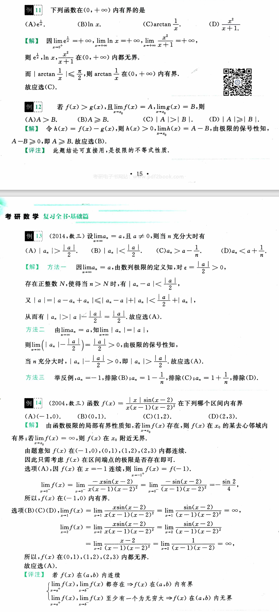
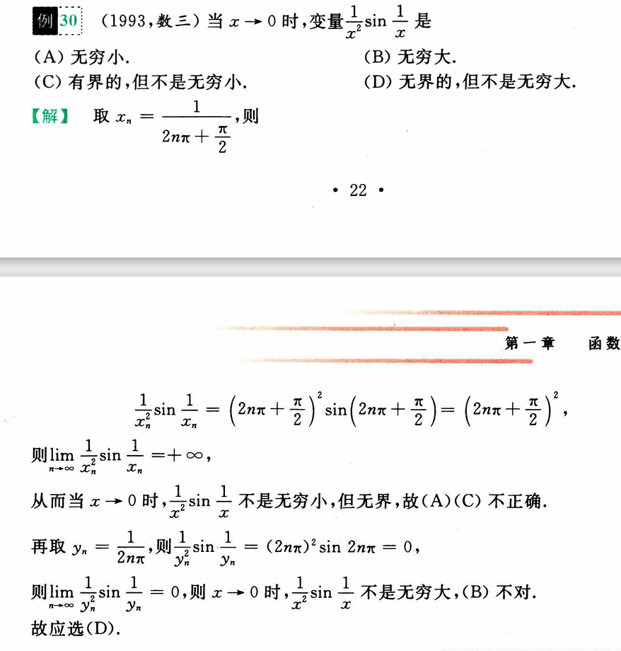

# 第一章 函数 极限 连续

考点：

    函数概念、表示法；

    有界性、单调性、周期性、奇偶性；

    复合函数、反函数、分段函数、隐函数；

    初等基本函数的性质及其图形；

    初等函数；

    函数关系的建立；

    数列极限与函数极限的定义及其性质；

    函数的左极限和右极限；

    无穷小量和无穷大量的概念及其关系；

    无穷小量的性质及无穷小量的比较；

    极限的四则运算；

    极限存在的两个准则：单调有限准则和夹逼准则

    函数连续的概念、函数间断点的类型、初等函数的连续性

    闭区间上连续函数的性质（有界性、最大值和最小值定理、介值定理）

两个重要极限：

$$
\lim_{x \rightarrow 0} \frac{\sin(x)}{x} = 1, \ \ \ \lim_{x \rightarrow \infty} (1 + \frac{1}{x})^{x} = e
$$

## 第一节 函数

### 函数的概念及常见函数

#### 1. 函数概念

有变量 x 和 y ，给定非空数集D，且 $x \in D$ ，有一对应关系 f，则：

$$
y = f(x), \ \ x \in D
$$

x 是自变量，y 是因变量，D 是定义域，所有的 y 构成值域。

函数的基本要素是 **定义域 D** 和 **对应关系 f** ，认为基本要素相同的函数是一样的。

---

对于函数的定义域应牢记以下结论：

分式的分母不为0；$\sqrt[2n]{x} \ (x \geq 0), \ \ \log_{a}(x) \ (x > 0)$ 

$\tan(x), \ \sec(x) \ (x \neq k\pi + \frac{\pi}{2}); \ \cot(x), \ \csc(x) \ (x \neq k\pi)$

$\arcsin(x), \ \arccos(x) \ (-1 \leq x \leq 1)$

> 定义域求解：1、依次找到限制条件；2、求出各个范围；3、合并结果。

---

#### 2. 分段函数

分段函数在定义域中划分多个段，每个段使用一个对应法则。虽然对应法则不同，但分段函数仍是 **一个函数**，而不是多个函数。

常见分段函数有以下五种形式：

#### 3. 复合函数

对于 $y = f(x), x \in D_f, y \in R_f$ 和 $u = g(x), x \in D_g, y \in R_g$ ，若能满足 $D_f \cap R_g \neq \varnothing$  ，则存在复合函数 $y = f(g(x)), x \in D_g, g(x) \in D_f$ 。

> 复合函数：
> 1. 根据要求直接代入，有特殊情况如 f(x-1)，则代入 x+1 来得到 f(x)
> 
> 2. 代入后计算新的表达式和定义域

#### 4. 反函数

对于 $y \in R_f$，**唯一存在** $x \in D$ ，则有 $x = f^{-1}(y)$。一般将 $y = f^{-1}(x)$ 称为 $y = f(x)$ 的反函数。

注：

    并不是所有函数都有反函数，必须要两个变量一一对应；

    单调函数一定有反函数，但反函数不一定都是单调函数。

$y = f(x)$ 和 $x = f^{-1}(y)$ 的图像重合，和 $y = f^{-1}(x)$ 的图像关于直线 $y = x$ 对称；

$y = f(x)$ 和 $y = f^{-1}(x)$ 的定义域和值域互换。

$f^{-1}[f(x)] = x, \ \ f[f^{-1}(x)] = x$ 

> 求反函数解法：
> 
> 将 x 和 y 互换，求出新的表达式。

#### 5. 初等函数

将幂函数、指数函数、对数函数、三角函数及反三角函数统称为基本初等函数。

**幂函数** $y = x^{\mu}$，$\mu$ 为实数。当 x 大于 0 时，幂函数都有定义。

**指数函数** $y = a^x$，$(a > 0, a \neq 1)$

定义域 $(- \infty, \ + \infty)$，值域 $(0, \ + \infty)$；

当 a > 1，单调增加；0 < a < 1，单调减少；

常见指数函数 $y = e^x$。

**对数函数** $y = \log_a(x)$，$(a > 0, a \neq 1)$

定义域 $(0, \ + \infty)$，值域 $(- \infty, \ + \infty)$；

当 a > 1，单调增加；0 < a < 1，单调减少；

常见对数函数 $y = \ln(x)$。

**三角函数** 

$$
y = \sin(x), \ y = \cos(x), \ y = \tan(x), \ y = \cot(x), \ y = \sec(x), \ y = \csc(x)
$$

（1）正弦函数 sin(x) 与余弦函数 cos(x)

定义域 $(- \infty, + \infty)$，值域 $(-1, 1)$；

奇偶性：sin(x) 是奇函数，cos(x) 是偶函数；

周期性：sin(x) 和 cos(x) 都以 $2\pi$ 为周期；

有界性：$|\sin(x)| \leq 1, \ |cos(x)| \leq 1$；

关系式：$\sin^2(x) + \cos^2(x) = 1$。

（2）正切函数 tan(x) 与余切函数 cot(x)

定义域：

$\tan(x)$ 定义域为 $D = \{x|x \neq k\pi + \frac{\pi}{2}, k \in Z \}$

$\cot(x)$ 定义域为 $D = \{ x|x \neq k\pi, k \in Z \}$

奇偶性：tan(x) 和 cot(x) 都是奇函数；

周期性：都以 $\pi$ 为周期；

关系式：$\tan(x) = \frac{\sin(x)}{\cos(x)}, \ \cot(x) = \frac{\cos(x)}{\sin(x)}, \ \tan(x) = \frac{1}{\cot(x)}$

（3）正割函数 sec(x) 与余割函数 csc(x)

定义域：

$\sec(x)$ 定义域为 $D = \{x|x \neq k\pi + \frac{\pi}{2}, k \in Z \}$

$\csc(x)$ 定义域为 $D = \{ x|x \neq k\pi, k \in Z \}$

奇偶性：sec(x) 是偶函数，csc(x) 奇函数；

周期性：都以 $2\pi$ 为周期；

关系式：$\sec(x) = \frac{1}{\cos(x)}, \ \csc(x) = \frac{1}{\sin(x)}$

$\sec^2(x) = 1 + \tan^2(x), \ \csc^2(x) = 1 + \cot^2(x)$

**反三角函数** 

$$
y = \arcsin(x), \ y = \arccos(x), \ y = \arctan(x), \ y = arccot(x)
$$

(1) 反正弦函数 arcsin(x) 和反余弦函数 arccos(x)

定义域 $[-1, 1]$，值域：

arcsin(x) 的值域为 $[-\frac{\pi}{2}, \frac{\pi}{2}]$，arccos(x) 的值域为 $[0, \pi]$；

单调性：arcsin(x) 单调递增，arccos(x) 单调递减；

奇偶性：arcsin(x) 是奇函数；

有界性：$|\arcsin(x)| \leq \frac{\pi}{2}, \ 0 \leq \arccos(x) \leq \pi$

关系式：$\arcsin(x) + \arccos(x) = \frac{\pi}{2}, \ x \in [-1, 1]$

(2) 反正切函数 arctan(x) 与反余切函数 arccot(x)

定义域 $(-\infty, +\infty)$，值域：

arctan(x) 为 $[-\frac{\pi}{2}, \frac{\pi}{2}]$，arccot(x) 为 $[0, \pi]$；

单调性：arctan(x) 单调递增，arccot(x) 单调递减；

奇偶性：arctan(x) 是奇函数；

有界性：$|\arctan(x)| < \frac{\pi}{2}, \ 0 < arccot(x) < \pi$

关系式：$\arctan(x) + arccot(x) = \frac{\pi}{2}$

由 **常数和基本初等函数** 经过 **有限次** 四则运算和有限次的函数复合所构成并可用一个式子表示的函数，称为初等函数。

#### 6. 隐函数

有 $F(x, y) = 0$，对于 $\forall x \in D$，存在唯一的 y 满足 $F(x, y) = 0$，由此得到的关系式 $y = y(x)$ 称为由$F(x, y) = 0$ 确定的隐函数。

#### 7. 参数方程确定的函数

由

$$
\begin{cases}
x = \phi(t), \\
& \alpha \leq t \leq \beta \\
y = \psi(t),
\end{cases}
$$

确定的函数 $y = f(x), \ a \leq x \leq b$

#### 8. 幂指函数

$$
y = u(x)^{v(x)}, \ u(x) > 0,
$$

幂指函数的讨论常利用恒等式 $u(x)^{v(x)} = e^{v(x)ln(u(x))}$

### 函数的性质

#### 1. 单调性

对于区间 I 上的函数 y = f(x) ，有任意两点 $x_1 < x_2$，若 $f(x_1) > f(x_2)$ 或 $f(x_1) < f(x_2)$ 恒成立，则称函数 y = f(x) 在 I 上单调递增或单调递减。

#### 2. 奇偶性

设函数 y = f(x) 定义域 D 关于原点对称，对于任意 $x \in D$ ，若 f(x) = f(-x) 恒成立，则该函数为 D 上的偶函数，若 f(-x) = -f(x) 恒成立，则该函数为 D 上的奇函数。

> 求奇偶性解法：使用定义法，证明公式成立即可求解。

#### 3. 周期性

存在一最小正实数 T，使 $f(x + T) = f(x)$，称 T 为函数 f(x) 的最小正周期或周期，y = f(x) 是以 T 为周期的周期函数。

证明 $\tan(4x + 1)$ 的周期为 $\frac{\pi}{4}$ 如下：

> 求周期性解法：1、求单个已知周期函数的周期；2、利用运算规则求总周期。

#### 4. 有界性

y = f(x) 在 X 上存在一正数 M，使得 $\forall x(|f(x)| \leq M)$ ，则称 f(x) 在 X 上为有界函数，否则为无界函数。

> 求有界性解法：通过观察函数中各个变元的变化趋势（使用函数图像或导数）判断边界是否存在。

## 第二节 极限

### 极限的概念与性质

#### 1. 数列极限

$\forall \varepsilon > 0$; 存在 **正整数 N** ；当 n > N 时，恒有 $|x_n - a| < \varepsilon$ ，常数 a 为极限，记作 

$$
\lim_{n \rightarrow \infty}x_n = a
$$

> 求数列极限解法：
> start

一、使用 $\lim_{n \rightarrow \infty}q^n = 0 (|q| < 1)$ 或 $\lim_{n \rightarrow \infty}\frac{1}{n^\alpha} = 0 (\alpha > 0)$；

二、使用 $\lim_{n \rightarrow \infty} x_{2n-1} = \lim_{n \rightarrow \infty} x_{2n} = a$；

三、两个常用极限公式

四、夹逼准则

五、定义

> end

#### 2. 函数极限

$\exists X > 0; \ x > X; |f(x) - A|  < \varepsilon$，记作：

$$
\lim_{x \rightarrow + \infty} f(x) = A
$$

$x < -X$，则：

$$
\lim_{x \rightarrow - \infty} f(x) = A
$$

$|x| > X$，则：

$$
\lim_{x \rightarrow \infty} f(x) = A
$$

> 求函数极限解法：分别求证 $-\infty$ 和 $+\infty$ 的极限。

##### 自变量趋于有限值时函数的极限

$\forall \varepsilon > 0; \ \exists \delta > 0; 0 < |x - x_0| < \delta \Rightarrow |f(x) - A| < \varepsilon$，记作：

$$
\lim_{x \rightarrow x_0} f(x) = A
$$

若 $x_0 - \delta < x < x_0$，则左极限：

$$
\lim_{x \rightarrow x_0^-} f(x) = f(x_0^-) = f(x_0 - 0) = A
$$

若 $x_0 < x < x_0 + \delta$，则右极限：

$$
\lim_{x \rightarrow x_0^+} f(x) = f(x_0^+) = f(x_0 + 0) = A
$$

定理：

$$
\lim_{x \rightarrow x_0} f(x) = A \Leftrightarrow \lim_{x \rightarrow x_0^-} f(x) = \lim_{x \rightarrow x_0^+} f(x) = A
$$

> 求有限值极限解法：求左右极限。

#### 3. 极限的性质

##### 有界性

数列 $\{ x_n \}$ 收敛 $\Rightarrow$ 数列 $\{ x_n \}$ 有界。反之不成立，如 $x_n = (-1)^n$；

极限 $\lim_{x \rightarrow x_0} f(x)$ 存在，则 $f(x)$ 在 $x_0$ 去心邻域有界。反之不成立，如 $f(x) = \frac{1}{sin(x)}$。

##### 保号性

**（1）** 设数列极限 $\lim_{n \rightarrow \infty} x_n = A$，则 $\exists N > 0$，当 $n > N$ 时，$x_n$ 与 $A$ 同号。即：

$$
A > 0, \ n > N \Rightarrow x_n > 0
$$

$A < 0$ 同理。另有结论：

$$
n > N, \ x_0 \geq 0 \Rightarrow A \geq 0
$$

$x_0 \leq 0$ 同理。

**（2）** 设函数极限 $\lim_{x \rightarrow x_0}f(x) = A$，则 $\exists \delta > 0$，当 $x \in \mathring{U}(x_0, \delta)$，$f(x)$ 和 $A$ 同号。即：

$$
A > 0, \ x \in \mathring{U}(x_0, \delta) \Rightarrow f(x) > 0
$$

$A < 0$ 同理。另有结论：

$$
x \in \mathring{U}(x_0, \delta), f(x) \geq 0 \Rightarrow A \geq 0
$$

$f(x) \leq 0$ 同理。

> 求解函数有界性或证明不等式：
> 
> 1、通过求解函数极限判断函数有界性
>
> 2、利用极限保号性证明不等式

#### 4. 函数极限与数列极限的关系

已知 $\lim_{x \rightarrow x_0}f(x) = A$，则：

$$
\lim_{n \rightarrow \infty}x_n = x_0 \ (x_n \neq x_0) \Rightarrow \lim_{n \rightarrow \infty} f(x_n) = A
$$

> 上述例题首先凑 $1^{\infty}$ 重要极限，然后使用洛必达法则求 $\frac{0}{0}$ 型。

### 无穷小量与无穷大量

#### （一）无穷小量

##### 1. 无穷小量的概念

当 $x \rightarrow x_0$ 或 $x \rightarrow \infty$ 时 $f(x) = 0$，则说 $f(x)$ 在 $x \rightarrow x_0$ 或 $x \rightarrow \infty$ 时的无穷小量。

无穷小量是伴随 **极限过程** 的 **变量**，若 $\lim_{n \rightarrow \infty} x_n = 0$，则称数列 $\{x_n\}$ 也是无穷小量。

##### 2. 无穷小的性质

1、 **有限** 个无穷小的和是无穷小；

2、 **有限** 个无穷小的积是无穷小；

3、无穷小量与 **有界** 量的积仍为无穷小。

> 利用无穷小的性质可快速求出函数极限。

##### 3. 无穷小的比较

$\alpha$ 和 $\beta$ 是同一极限过程中的无穷小，$\alpha \neq 0$；

(1) $\lim \frac{\beta}{\alpha} = 0 \Rightarrow$ $\beta$ 是比 $\alpha$ 高阶的无穷小，记作 $\beta = o(\alpha)$；

(2) $\lim \frac{\beta}{\alpha} = \infty \Rightarrow$ 低阶；

(3) $\lim \frac{\beta}{\alpha} = c \neq 0 \Rightarrow$ 同阶；

(4) $\lim \frac{\beta}{\alpha} = 1 \Rightarrow$ 等价，记作 $\alpha \sim \beta$；

(5) $\lim \frac{\beta}{\alpha^{k}} = c \neq 0 \Rightarrow$ k 阶。

> 通过代换常用等价无穷小得到 $x^n$ ,然后对比不同的 $x^n$。

##### 4. 极限值与无穷小之间的关系

$$
\lim f(x) = A \Leftrightarrow f(x) = A + \alpha(x), \ \ \lim \alpha(x) = 0
$$

> 使用高阶等价无穷小代替极限过程，求出表达式再计算。

#### （二）无穷大量

##### 1. 无穷大量的概念

当 $x \rightarrow x_0$ 或 $x \rightarrow \infty$ 时 $f(x) \rightarrow \infty$，则说 $f(x)$ 在 $x \rightarrow x_0$ 或 $x \rightarrow \infty$ 时的无穷大量。记为：

$$
\lim_{x \rightarrow x_0} f(x) = \infty
$$

> 求函数极限首先需要知道左右极限。

##### 2. 无穷大量的性质

1、两个无穷大量的积仍为无穷大量；

2、无穷大量和有界变量之和仍为无穷大量；

3、无穷大量与非零常数乘积仍为无穷大量。

> 无穷大量的性质可以用来进行无穷大量的比较。

##### 3. 常用的无穷大量的比较

1、洛必达法则可以证明：

$$
x \rightarrow \infty \Rightarrow ln^{\alpha}x \ll x^{\beta} \ll a^x; \ \ \ \alpha > 0, \ \beta > 0, \ a > 1
$$

> 通过函数图像可以观察得到无穷大之间的大小。

##### 4. 无穷大量与无界变量的关系

(1) 数列 $x_n$ 是无穷大量：

$$
\forall M > 0, \exists N > 0 \Rightarrow |x_n| > M \ (n > N)
$$

(2) 数列 $x_n$ 是无界变量：

$$
\forall M > 0, \exists N > 0 \Rightarrow |x_N| > M
$$

可以看出，无穷大量一定为无界变量，无界变量不一定是无穷大量。函数情形类似。

> 这道题主要考察关于无穷大量和无界变量的定义。

#### （三）无穷大量与无穷小量的关系

在同一极限过程中，$\lim f(x) = 0 \Rightarrow \lim \frac{1}{f(x)} = \infty \ (f(x) \neq 0)$，同理 $\lim f(x) = \infty \Rightarrow \lim \frac{1}{f(x)} = 0$。

若 $f(x) \equiv 0$，尽管存在 $\lim f(x) = 0$，但 $\frac{1}{f(x)}$ 无意义，所以 $\frac{1}{f(x)}$ 不是无穷大量。

> 可根据函数的单调性和连续性判断是否无穷大，也可根据特殊点判断。

### 极限的计算

#### 1. 四则运算

若 $\lim f(x) = a, \ \lim g(x) = b$，则：

$$
\lim[f(x) \pm g(x)] = \lim f(x) \pm \lim g(x) = a \pm b
$$

$$
\lim[f(x) \cdot g(x)] = \lim f(x) \cdot \lim g(x) = a \cdot b
$$

$$
\lim \frac{f(x)}{g(x)} = \frac{\lim f(x)}{\lim g(x)} = \frac{a}{b} \ \ (b \neq 0)
$$

根据四则运算可得以下推论(**n 为正整数**)：

$$
\lim cf(x) = c \lim f(x) = c \cdot a
$$

$$
\lim [f(x)]^n = [\lim f(x)]^n = a^n
$$

$$
\lim [f(x)]^{\frac{1}{n}} = [\lim f(x)]^{\frac{1}{n}} = a^{\frac{1}{n}}
$$

> 还应注意到在极限是否存在（即极限是常数还是无穷大）的问题上：
>
> (1) 存在 $\pm$ 不存在 = 不存在； (2) 不存在 $\pm$ 不存在 = 不一定；
> 
> (3) 存在 $\times (\div)$ 不存在 = 不一定；(4) 不存在 $\times (\div)$ 不存在 = 不一定

> 求解极限注意事项：
>
> (1) 发现 $\frac{0}{0}$ 型时应注意公式是否满足等价代换条件，如不满足应该使用等价变换；
>
> (2) 求极限时应注意函数中不同部分的极限运算是否满足四则运算的推论，如不满足应该使用等价变换；
>
> (3) 若已知函数极限存在求参数，可使用高阶无穷小代替极限过程，然后直接求解方程式。

#### 2. 利用两个重要极限

(1) 第一重要极限：

$$
\lim_{x \rightarrow 0} \frac{\sin(x)}{x} = 1
$$

推广：

$$
\lim_{x \rightarrow 0} \frac{\tan(x)}{x} = 1, \ \lim_{x \rightarrow 0} \frac{\arcsin(x)}{x} = 1, \ \lim_{x \rightarrow 0} \frac{\arctan(x)}{x} = 1,
$$

$$
\lim_{x \rightarrow 0} \frac{1 - \cos(x)}{x^2} = \frac{1}{2}, \ \lim_{x \rightarrow 0} \frac{\sin(\alpha x)}{x} = \alpha, \ \lim_{x \rightarrow 0} \frac{\sin(\alpha x)}{\sin(\beta x)} = \frac{\alpha}{\beta} \ \ (\beta \neq 0)
$$

(2) 第二重要极限：

$$
\lim_{x \rightarrow \infty}(1 + \frac{1}{x})^x = e
$$

推广：

$$
\lim_{x \rightarrow \infty}(1 - \frac{1}{x})^x = \frac{1}{e}, \ \lim_{x \rightarrow \infty}(1 + \frac{a}{x})^{bx} = e^{ab}, \ \lim_{x \rightarrow \infty}(1 + \frac{a}{x})^{bx + c} = e^{ab}
$$

若 $\lim \alpha(x) = 0, \lim \beta(x) = \infty, \lim [\alpha(x) \cdot \beta(x)] = A$，则：

$$
\lim [1 + \alpha(x)]^{\beta(x)} = \lim [1 + \alpha(x)]^{\frac{1}{\alpha(x)} \cdot \alpha(x) \beta(x)} = e^{\lim [\alpha(x) \beta(x)]} = e^A
$$

> (1) $\frac{0}{0}$ 型可以使用洛必达法则；
> 
> (2) $1^{\infty}$ 型直接凑 $(1 + \alpha(x))^{\beta(x) + c}$。

#### 3. 利用等价无穷小替换求极限

等价无穷小替换定理：在某一变换过程下 $f_1(x) \sim f_2(x), \ g_1(x) \sim g_2(x)$，且存在 $\lim \frac{f_2(x)}{g_2(x)}$，则有

$$
\lim \frac{f_1(x)}{g_1(x)} = \lim \frac{f_2(x)}{g_2(x)}
$$

> 利用等价无穷小求解极限时，要注意是否满足等价条件，例如加减运算后极限是否存在。

#### 4. 利用洛必达法则求极限

若满足以下三个条件：

$$
(1) \ \lim_{x \rightarrow x_0}f(x) = \lim_{x \rightarrow x_0}g(x) = 0 \ (或 \infty)
$$

$$
(2) \ f(x) \ 和 \ g(x) \ 在 \ \mathring{U}(x_0, \delta) \ 内可导，且 \ g'(x) \neq 0
$$

$$
(3) \ \lim_{x \rightarrow x_0} \frac{f'(x)}{g'(x)} 极限存在或为 \infty
$$

则：

$$
\lim_{x \rightarrow x_0} \frac{f(x)}{g(x)} = \lim_{x \rightarrow x_0} \frac{f'(x)}{g'(x)}
$$

> 使用洛必达法则求极限时应该尽可能使用等价替换先简化函数形式。

#### 5. 利用夹逼准则求极限

如果 $g(x) \leq f(x) \leq h(x) \ (x \in \mathring{U}(x_0, \delta))$，并且 $\lim g(x) = A, \ \lim h(x) = A$，则 $\lim f(x) = A$。

> 经验汇总：
>
> (1) 形式上高度相似的分数形式函数的夹逼，可以通过对分子或分母放缩得到左右函数；
> 
> (2) 形式上类似数列之和的极限，一般可采取保留 1 项或 m 项最大值进行放缩；
>
> (3) 放缩应不要使新函数在极限形式上与原函数差距过大，如不要把 $(\frac{2}{3})^{\infty}$ 放缩为 $1^{\infty}$。

#### 6. 利用单调有界数列极限准则求极限

单调有界数列必有极限。首先用数学归纳法证明数列单调有界，然后求解 $\lim_{n \rightarrow \infty} x_n = a$，即：

> 一般数列的第 n 项都与前几项有关联，所以有 $x_n = f(x_{n-1})$，当 $n \rightarrow \infty$ 时，有 $x_n \rightarrow a$ 和 $x_{n - 1} \rightarrow a$，则存在 $f(a) = a$，此时可求解出 a。

#### 7. 利用无穷小的性质求极限

> 无穷小和有界量的乘积仍为无穷小。

#### 8. 利用函数的连续性求极限

(1) 若 $f(x)$ 在 $x_0$ 处连续，则 $\lim_{x \rightarrow x_0}f(x) = f(x_0)$；

(2) 若 $f(x), \ \varphi(x)$ 连续，则 $\lim_{x \rightarrow x_0} f[\varphi(x)] = f[\lim_{x \rightarrow x_0} \varphi(x)]$；

(3) 若 $\lim f(x) = A > 0, \ \lim g(x) = B$，则：

$$
\lim f(x)^{g(x)} = [\lim f(x)]^{\lim g(x)} = A^B
$$

> 使用第二条规则时应注意对函数整体使用，不能单独用于某个部分。

#### 9. 利用泰勒公式求极限

(带皮亚诺余项的泰勒公式) 设 $f(x)$ 在 $x = x_0$ 处 n 阶可导，则：

$$
f(x) = f(x_0) + f'(x_0)(x - x_0) + \frac{f''(x_0)}{2!}(x - x_0)^2 + \cdots + \frac{f^{(n)}(x_0)}{n!}(x - x_0)^n + o(x - x_0)^n.
$$

特别是当 $x_0 = 0$ 时，

$$
f(x) = f(0) + f'(0)x + \frac{f''(0)}{2!}x^2 + \cdots + \frac{f^{(n)}(0)}{n!}x^n + o(x^n).
$$

> 将超越式展开至幂函数项的同阶无穷小即可。

#### 10. 求极限的其它方法

(1) 导数定义；

(2) 定积分定义；

(3) 级数收敛的性质。

## 第三节 函数的连续性

### 连续性的概念

**1、** 设 $f(x)$ 在 $x_0$ 某邻域有定义，若

$$
\lim_{\Delta x \rightarrow 0} \Delta y = \lim_{\Delta x \rightarrow 0} [f(x_0 + \Delta x) - f(x_0)] = 0
$$

则称 $f(x)$ 在点 $x_0$ 处连续，$x_0$ 为连续点。

若 $\lim_{x \rightarrow x_0} f(x) = f(x_0)$，也称 $f(x)$ 在 $x_0$ 处连续。

由上述定义可得，$f(x)$ 在 $x_0$ 处连续 $\Leftrightarrow$ (1) $f(x_0)$ 有定义；(2) $\lim_{x \rightarrow x_0} f(x)$ 存在为 $A$；(3) $A = f(x_0)$。

同时 $f(x)$ 在 $x_0$ 处连续证明 $x_0$ 处极限存在，反之不然。

**2、**

$$
\lim_{x \rightarrow x_0^-} f(x) = f(x_0) \Rightarrow 左连续
$$

$$
\lim_{x \rightarrow x_0^+} f(x) = f(x_0) \Rightarrow 右连续
$$

连续的充要条件是同时满足左连续和右连续。

**3、** 若 $f(x)$ 在 (a, b) 上每一点都连续，则称 $f(x)$ 在 (a, b) 内连续；若在 a 点右连续，在 b 点左连续，且在 (a, b) 内连续，则称 $f(x)$ 在 [a, b] 上连续。

> (1) 连续的要求是极限值和函数值相等；
> 
> (2) 对于函数分段的讨论除了要看自变量的范围，还要看参数的范围；
>
> (3) 对于周期函数来说，不同周期内存在极限相同的点，例如 sin(x) 的等价无穷小不止存在于 $x \rightarrow x_0$ 上。

### 连续函数的运算与初等函数的连续性

#### 1. 连续函数的运算

**1、** $f(x)$ 和 $g(x)$ 在 $x_0$ 处连续，则 $f(x) \pm g(x)$ ，$f(x) \cdot g(x)$ ，$\frac{f(x)}{g(x)} \ (g(x_0) \neq 0)$ 也在 $x_0$ 处连续。

**2、** 如果 $\lim_{x \rightarrow x_0} g(x) = g(x_0) = u_0$，且 $\lim_{u \rightarrow u_0} f(u) = f(u_0)$，则

$$
\lim_{x \rightarrow x_0} f(g(x)) = f[\lim_{x \rightarrow x_0} g(x)] = f(g(x_0))
$$

**3、** 连续的单调函数的反函数同样连续且满足单调性。

#### 2. 初等函数的连续性

(1) 基本初等函数在 **定义域** 内连续；

(2) 初等函数在 **定义区间** 内连续。定义区间是指定义域内的区间，例如分段函数的每个分段的区间上是连续的。

> 由基本初等函数组成的单一函数表达式可以直接判断在定义域内连续。

### 间断点及其分类

#### 1. 间断点的定义

若 $f(x)$ 在 $x_0$ 的邻域有定义，但在 $x_0$ 点不连续，则称 $f(x)$ 在 $x_0$ 点间断，$x_0$ 是 $f(x)$ 的间断点。

$x_0$ 为 $f(x)$ 的间断点 $\Leftrightarrow$ $f(x)$ 在 $x_0$ 处不连续。以下三个条件任意一个不满足即可判定间断点：

$$
\begin{cases}
(1) \ f(x_0) 有定义 \\
(2) \ \lim_{x \rightarrow x_0} f(x) 存在 \\
(3) \ \lim_{x \rightarrow x_0} f(x) = f(x_0)
\end{cases}
$$

#### 2. 间断点的分类

第一类间断点：左右极限都存在。

    1、可去间断点：左右极限相等；

    2、跳跃间断点：左右极限不相等。

第二类间断点：左右极限至少有一个不存在。

    1、无穷间断点：左极限或右极限为无穷；

    2、振荡间断点：极限振荡。

> (1) 初等函数的间断点基本来自定义域，可以使用判断定义域的方法判断间断点；
>
> (2) 间断点不代表在这个点上一定没有定义，只要左右极限不相等都可以视为间断点；
>
> (3) 对于 $\lim_{n \rightarrow n_0}f(x, n)$，由于这里 x 可能充当了 n 的参数项，所以不能通过定义域判断间断点，可以通过对关键参数的判断确定间断点，例如 $x^n$，该函数在 $x < 0, 0 < x < 1, x > 1$ 处都有不同变化趋势，因此可对 1 进行间断点判断；

### 闭区间上连续函数的性质

**最值定理**：闭区间上连续，则必有最大最小值.

**有界值定理**：闭区间上连续，则函数必有界.

**介值定理**：在闭区间 $[a, b]$ 上连续，且 $f(a) \neq f(b)$，则对于任意 $f(a)$ 和 $f(b)$ 之间的值 C，必有一点 $\xi$，使 $f(\xi) = C$.

推论：$f(x)$ 在 $[a, b]$ 上连续，则 $f(x)$ 可取任意在最大值和最小值之间的值.

**零点定理**：$f(x)$ 在 $[a, b]$ 上连续，且 $f(a) \cdot f(b) < 0$，则在 $(a, b)$ 上至少存在一点 $\xi$，满足 $f(\xi) = 0$.

> 零点定理可用于证明 $f(x) = 0$ 的根存在；
>
> 介值定理和最值定理可以联合使用证明 $f(x) = C$.

## 附加

形如 $f(x)^n$ 首先应通过 $e^{n\ln(f(x))}$ 进行降次，然后再计算。

对于 $\lim_{x \rightarrow \infty} f(x)^x$ 应及时想到重要极限：

$$
\lim_{x \rightarrow \infty} (1 + \frac{1}{x})^x = e
$$

---

应尽量少的对表达式进行近似变换，有条件时最好不要进行近似变换。

---

、、、、

