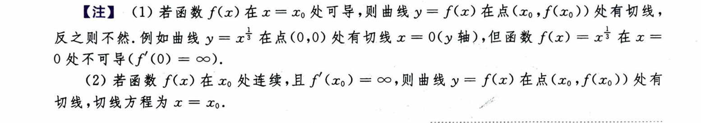
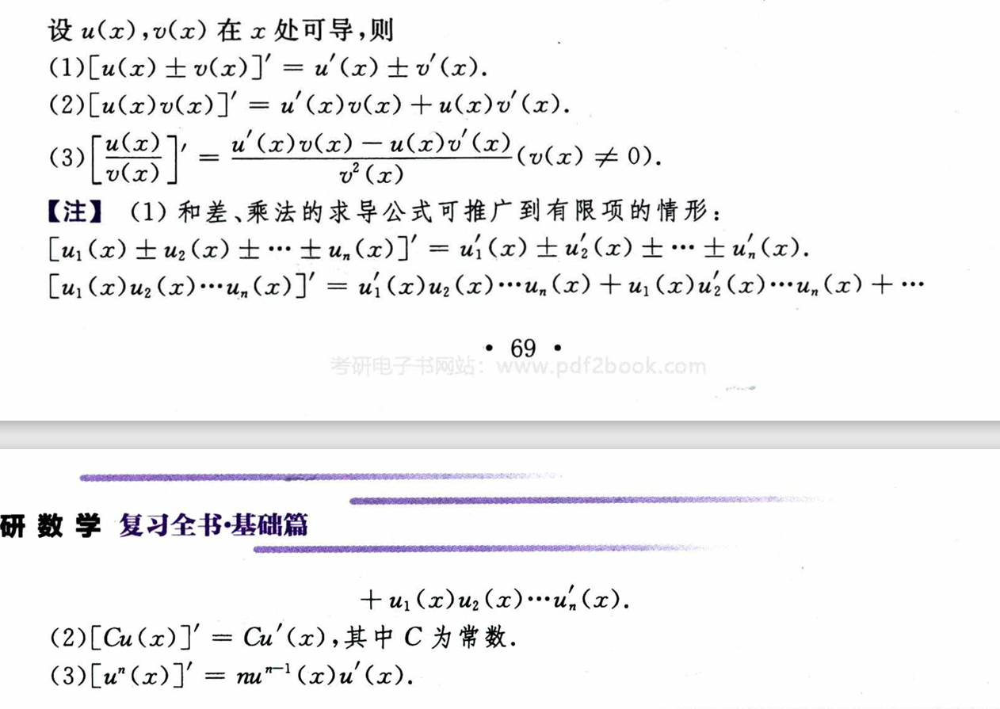
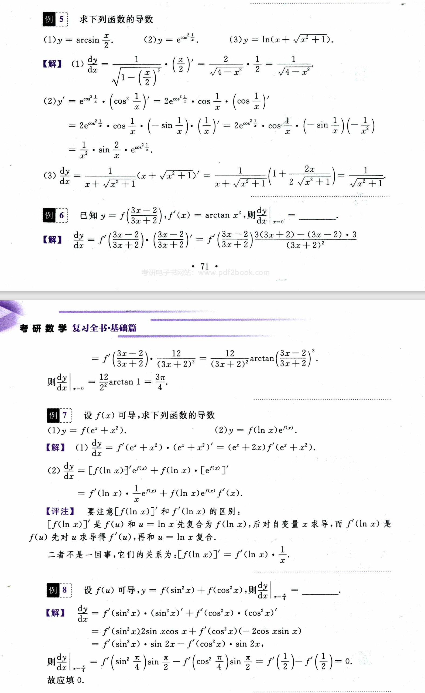
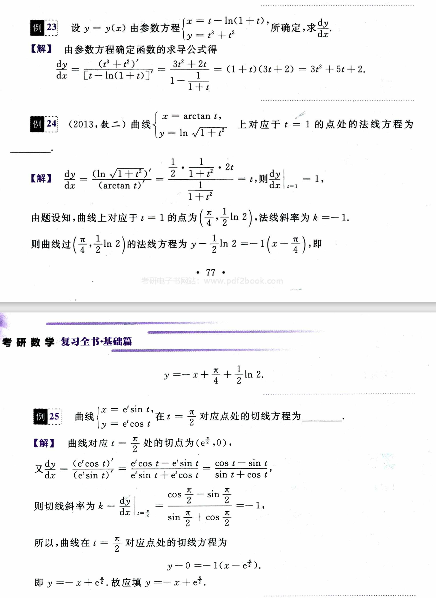

# 第二章 一元函数微分学

考点：

    导数和微分的概念；

    导数的几何意义和物理意义；

    函数的可导性与连续性之间的关系；

    平面曲线的切线和法线；

    导数和微分的四则运算；

    基本初等函数的导数；

    复合函数、反函数、隐函数以及参数方程确定的函数的导数；

    高阶导数；

    一阶微分形式的不变性；

    中值定理；

    不等式与零点问题；

    导数应用.

## 第一节 导数与微分的概念

### 导数的概念及几何意义

#### 1. 导数的概念

**导数**：$y = f(x)$ 在 x_0 的邻域内有定义，如果存在极限

$$
\lim_{\Delta x \rightarrow 0} \frac{\Delta y}{\Delta x} = \lim_{\Delta x \rightarrow 0} \frac{f(x_0 + \Delta x) - f(x_0)}{\Delta x}
$$

则称 $f(x)$ 在 $x_0$ 处可导，此极限值为导数，记作 $f'(x_0)$ 或 $y'|_{x = x_0}$ 或 $\frac{dy}{dx} |_{x = x_0}$.

如果极限不存在，则认为在 $x_0$ 处不可导。

**左导数**：左邻域有定义，且存在左极限

$$
\lim_{\Delta x \rightarrow 0^-} \frac{\Delta y}{\Delta x} = \lim_{\Delta x \rightarrow 0^-} \frac{f(x_0 + \Delta x) - f(x_0)}{\Delta x}
$$

称为左导数，记为 $f_{-}'(x_0)$.

**右导数**：右邻域有定义，且存在右极限

$$
\lim_{\Delta x \rightarrow 0^+} \frac{\Delta y}{\Delta x} = \lim_{\Delta x \rightarrow 0^+} \frac{f(x_0 + \Delta x) - f(x_0)}{\Delta x}
$$

称为右导数，记为 $f_{+}'(x_0)$

导数存在的 **充要条件** 是左右导数存在且相等。

**区间上可导及导函数**：$y = f(x)$ 在 $(a, b)$ 每一点都可导，则称 $f(x)$ 在区间 $(a, b)$ 内可导，称 $f'(x)$ 为导函数，简称导数。且若同时存在 $f_{+}'(a)$ 和 $f_{-}'(b)$，则称 $f(x)$ 在区间 $[a, b]$ 上可导。

> (1) 若函数表达式未知，通过提高幂次，可以改变极限的阶，从而将极限控制在 0 或 $\infty$，或者将原来微小的差异扩大化；
>
> (2) 定义法求导数仍然是求极限问题.

#### 2. 导数的几何意义

导数 $f'(x_0)$ 在几何上表示 $y = f(x)$ 在点 $(x_0, f(x_0))$ 上的 **斜率**。若可导则有切线方程

$$
y - f(x_0) = f'(x_0)(x - x_0)
$$

如果 $f'(x_0) \neq 0$，则有法线方程

$$
y - f(x_0) = - \frac{1}{f'(x_0)} (x - x_0)
$$

如果 $f'(x_0) = 0$，则切线方程为 $y = f(x_0)$，法线方程为 $x = x_0$.

> (1) 涉及到曲线相切，垂直之类的关系时首先从图像入手，然后考虑求导计算；
>
> (2) 除了用斜率和一定点确定直线，还可以用两点确定一条直线；

### 微分的概念及几何意义

#### 1. 微分的概念

**微分** 设函数 $y = f(x)$ 在 $x_0$ 某邻域内有定义，若增量 $\Delta y = f(x_0 + \Delta x) - f(x_0)$ 可以表示为

$$
\Delta y = A \Delta x + o(\Delta x) \ (\Delta x \rightarrow 0)
$$

A为不依赖 $\Delta x$ 的常数，则称函数在 $x_0$ 处可微，称 $A \Delta x$ 为微分，记作 $d y = d f(x) = A \Delta x$.

在 $x_0$ 处可微的充要条件是在 $x_0$ 处可导，且有 $dy = f'(x_0) dx = f'(x_0) \Delta x$.

> 微分的概念主要考察公式 $dy = f'(x)dx$.

#### 2. 微分的几何意义

微分 $dy = f'(x_0)dx$ 在几何上表示函数上的切线的增量.

$\Delta y = f(x_0 + \Delta x) - f(x_0)$ 在几何上表示函数增量.

当 $|\Delta x|$ 充分小时，可认为 $\Delta y \approx dy$.

> 通过几何意义可判断函数增量大小和正负.

### 连续、可导、可微之间的关系

(1) 若 $y = f(x)$ 在 $x_0$ 处可导，则在该处连续。反之不成立.

(2) 左右导数均存在则一定连续，不连续一定不可导.

(3) 可导 $\Leftrightarrow$ 可微.

> (1) 一定要注意可导一定连续，连续不一定可导；
>
> (2) 求导中存在对 $x$ 求极限，所以对包含 $x$ 的 n 次幂的函数，$n < 1$ 和 $n > 1$ 有很大差别.

## 第二节 导数与微分的计算

### 导数的计算

#### 1. 基本初等函数的导数公式

#### 2. 四则运算求导法则

 
> 有时候遇到过于复杂的求导问题，可以使用定义法快速得到结果.

#### 3. 复合函数的求导法则

若 $u = \varphi(x)$ 在 $x$ 处可导，$y = f(u)$ 在 $u = \varphi(x)$ 处可导，则 $y = f(\varphi(x))$ 在 $x$ 处可导，有 $(f(\varphi(x)))' = f'(u) \cdot \varphi '(x)$，即 **链式法则**

$$
\frac{dy}{dx} = \frac{dy}{du} \cdot \frac{du}{dx}
$$

> (1) 复合求导后的结果记得合并化简，实在化不了就算了；
>
> (2) 复合求导要分好层再求，否则容易漏；
>
> (3) 导数和极限混合在一起时，先求极限再求导.

#### 4. 反函数求导法则

若 $y = f(x)$ 单调可导，且 $f'(x) \neq 0$，则其反函数 $x = \varphi(y)$ 的导数为

$$
\varphi'(y) = \frac{dx}{dy} = \frac{1}{\frac{dy}{dx}} = \frac{1}{f'(x)}
$$

即反函数的导数互为倒数.

> 利用反函数求导法则时要注意 $x$ 和 $y$ 的关系.

#### 5. 隐函数求导法

对有确定函数关系 $y = y(x)$ 的方程 $F(x, y) = 0$，两边同时对 $x$ 求导，整理后得到 $\frac{dy}{dx}$.

隐函数求导公式由 $F'_x + F'_y \cdot \frac{dy}{dx} = 0$ 可得：

$$
\frac{dy}{dx} = - \frac{F'_x}{F'_y}
$$

> 两边求导，有值时提前代值.

#### 6. 对数求导法

对函数两边同时取对数化为隐函数求导问题，例如 $y = f(x)^{g(x)}$，可化为 $\ln(y) = g(x) \ln (f(x))$.

> 对数求导的结果注意将式中的 $y$ 转换为 $y$ 对 $x$ 的表达式.

#### 7. 参数方程确定的函数求导法

设 $y = y(x)$ 由 $x = \varphi(t), y = \psi(t)$ 确定，则有

$$
\frac{dy}{dx} = \frac{\frac{dy}{dt}}{\frac{dx}{dt}} = \frac{\psi'(t)}{\varphi'(t)}
$$

> 参数方程求导不要混淆 $x'_t$ 和 $y'_t$ 的位置.

#### 8. 分段函数求导

分段函数首先在定义域内求导，然后在间断点通过左右导数判断是否可导.

> 分段函数求导注意判断间断点的导数.

#### 9. 有关导数的重要结论

可导的偶函数的导数是奇函数，因为 $[f(x) = f(-x)]' \Leftrightarrow [f'(x)  = - f'(-x)]$;

可导的奇函数的导数是偶函数，因为 $[f(x) = - f(-x)]' \Leftrightarrow [f'(x) = f'(-x)]$;

可导的周期函数的导数仍然是具有相同周期的周期函数.

> 注意原函数的性质.

### 高阶导数的计算

#### 1. 高阶导数的定义

若导函数 $y' = f'(x)$ 仍然对 $x$ 可导，则称 $y'$ 的导数为二阶导数，记作 $y'', f''(x), \frac{d^2 y}{dx}, \frac{d^2 f}{dx}$.

同理可得三阶导数 $y''', f'''(x), \frac{d^3 y}{dx}, \frac{d^3 f}{dx}$.

四阶导数 $y^{(4)}, f^{(4)}(x), \frac{d^4 y}{dx}, \frac{d^4 f}{dx}$.

n 阶导数 $y^{(n)}, f^{(n)}(x), \frac{d^n y}{dx}, \frac{d^n f}{dx}$.

#### 2. 高阶导数的计算

(1) 直接法：若高阶导数存在规律，则通过观察 $y', y'', y'''$ 直接得到 $y^{(n)}$;

(2) 间接法：利用高阶导数四则运算及常见高阶导数公式进行代换.

> (1) 求高阶导数时可以利用奇偶、周期函数的特性;
>
> (2) 对简单函数求高阶导用直接法，复杂函数用间接法.

#### 3. 几类函数的二阶导数求法

(1) 抽象复合函数 $y = f[\varphi(x)]$

一阶导数 $\frac{dy}{dx} = f'[\varphi(x)] \cdot \varphi'(x)$,

二阶导数 $\frac{d^2 y}{dx^2} = f''[\varphi(x)] \cdot [\varphi'(x)]^2 + f'[\varphi(x)] \cdot \varphi''(x)$.

> 使用复合函数求二阶导公式时注意函数的层数.

(2) 方程 $F(x, y) = 0$ 所确定的隐函数的二阶导数的求法

利用隐函数求导法对两边连续求导，或先求出一阶导，再求二阶导.

> 隐函数求二阶导注意 $y'$ 也是关于 $x$ 的函数.

(3) 参数方程所确定的函数求二阶导

一阶导 $\frac{dy}{dx} = \frac{\psi'(t)}{\varphi'(t)}$

二阶导 $\frac{d^2 y}{dx^2} = \frac{\psi''(t) \cdot \varphi'(t) - \psi'(t) \cdot \varphi''(t)}{[\varphi'(t)]^3}$

> 参数方程确定的函数可以先求出 $[y'_x]'$, 再求 $\frac{[y'_x]'}{x'_t}$.

### 微分的计算

可微函数 $y = f(x)$ 的微分是 $dy = f'(x)dx$.

微分四则运算和复合函数微分同导数四则运算法则和复合函数求导，只是多了一项 $dx$.

> (1) 函数求微分可直接对函数求导再乘 $dx$;
>
> (2) 对方程确定的函数可以通过两边同时求微分运算 $dy$.

## 第三节 中值定理、不等式与零点问题

### 中值定理

#### 费马定理

函数 $f(x)$ 在 $x_0$ 某邻域内有定义，且 $f(x_0)$ 是 $f(x)$ 的一个极值，若导数存在，则 $f'(x_0) = 0$.

**罗尔定理** 函数 $f(x)$ 在闭区间 $[a, b]$ 连续，在开区间 $(a, b)$ 可导，且 $f(a) = f(b)$, 则至少存在 $\varepsilon \in (a, b)$, 使 $f'(\varepsilon) = 0$.

> 费马定理通过极值找导数零点，罗尔定理通过等值找导数零点.

#### 拉格朗日中值定理

设 $f(x)$ 在闭区间 $[a, b]$ 上连续，在开区间 $(a, b)$ 上可导，则至少存在一点 $\varepsilon \in (a, b)$, 使 $f(b) - f(a) = f'(\varepsilon) (b - a)$.

> 对于例7的第二问证明，应尽量保留原条件，即不能看到 $\frac{1}{f'(\eta)}$ 就直接使用反函数，也不能随意根据变形后的公式构造函数。首先应分析题意，根据题中总体条件猜想 $\frac{a}{f'(\eta)} = k(a+b)$，通过 $f'(x)$ 与 $a+b$ 的潜在关系进行推导. 

#### 柯西中值定理

设 $f(x), g(x)$ 在闭区间 $[a, b]$ 连续，在开区间 $(a, b)$ 可导，且 $g'(x) \neq 0, x \in (a, b)$, 则存在 $\varepsilon \in (a, b)$, 由拉格朗日中值定理可得

$$
\frac{f(b) - f(a)}{g(b) - g(a)} = \frac{f'(\varepsilon)}{g'(\varepsilon)}.
$$

    拉格朗日中值定理尚且能从直觉判断出确实存在一条复合要求的切线的斜率，而涉及到两个函数的柯西中值定理则已经无法直观察觉到这样的斜率是否存在.

> (1) 柯西中值定理有四项，出题时一般给出一个函数和两个值，剩下的函数自己构造;
>
> (2) 由于柯西中值定理可由拉格朗日中值定理得到，因此对于题中给出的等式可先根据已知函数保留拉格朗日中值定理的固定部分，然后自定义函数等于剩余部分，由剩余部分推导出可构造的函数即可;以例8为例，直接变形得到 $\frac{2 \varepsilon f'(\varepsilon)}{g'(\varepsilon)} = f(1) - f(0)$, 虽然逻辑上不严谨，但是可以直接得到构造函数的导数形式.

#### 泰勒定理

 设 $f(x)$ 在闭区间 $[a, b]$ 上有 $n$ 阶 **连续** 导数，在开区间 $(a, b)$ 上有 $n+1$ 阶导数，$x_0 \in [a, b], x \in [a, b]$ 是任意两点，至少存在一点 $\varepsilon$ 在 $x_0$ 与 $x$ 之间，使

$$
f(x) = f(x_0) + f'(x_0)(x - x_0) + \frac{f''(x_0)}{2!} (x - x_0)^2 + \cdots + \frac{f^{(n)}(x_0)}{n!}(x - x_0)^n + R_n(x),
$$

$$
R_n(x) = \frac{f^{(n+1)}(\varepsilon)}{(n+1)!} (x - x_0)^{(n+1)}
$$

该公式称为具有 **拉格朗日余项** 的 n 阶泰勒公式。如果仅有 n 阶导数(或 n-1 阶连续导数)，则 $R_n(x) = o((x - x_0)^n)$ 称为 **佩亚诺余项** 。称 $x_0 = 0$ 时的泰勒公式为麦克劳林公式.

> (1) 复杂函数使用泰勒展开前先化简;
>
> (2) 求诸如 $x_0=1$ 处的泰勒公式时可以将原函数变形为 $f(x-1)$ 再泰勒展开，注意展开后的变量为 $(x-1)$ 而不是 $x$;
>
> (3) 在求 $\frac{0}{0}$ 和 $\frac{\infty}{\infty}$ 泰勒展开项一直到同阶但不等价的程度;
>
> (4) 不等式证明中如果突然出现一项相对特别大的数字或者高阶导数，以至于明显不能用拉格朗日中值定理和柯西中值定理求证时，其可能来自泰勒展开式中的高阶项，未知数可能来自拉格朗日余项.

### 不等式的证明

**微分学解不等式** 已知在区间 $(a, b)$ 内 $f(x)$ 和 $g(x)$ 可导，欲证明 $f(x) \leq g(x)$ 或 $f(x) \geq g(x)$, 首先构造 $\varphi(x) = f(x) - g(x)$，然后使用下述方法证明.

**(1) 单调性**

如果 $\lim_{x \rightarrow a^+} \varphi (x) \geq 0$, 且在 $(a, b)$ 上 $\varphi'(x) \geq 0$, 则 $\varphi(x) \geq 0$;

如果 $\lim_{x \rightarrow b^-} \varphi(x) \geq 0$, 且在 $(a, b)$ 上 $\varphi'(x) \leq 0$, 则 $\varphi(x) \geq 0$;

如果 $(a, b)$ 区间分成两个，左边满足上述第一条，右边满足上述第二条，则 $\varphi(x) \geq 0$.

上述情况对半开区间、开区间、无穷区间同样成立.

**(2) 最值**

如果 $(a, b)$ 内 $f(x)$ 有最小值，且最小值 $> 0$, 则 $f(x) > 0$. 最大值同理.

**(3) 用拉格朗日中值公式**

如果题中给出 $x \in (a, b)$, 证明 $f(b) - f(a) > A(b - a)$, 只需证明 $f'(\varepsilon)> A$ 即可.

**(4) 用拉格朗日余项的泰勒公式**

如果题中条件有高阶导数或突兀的相对大数字，使用拉格朗日余项的泰勒公式(推荐)或多次拉格朗日中值公式.

> (1) 拉格朗日中值定理除了用于两常量 $(a, b)$ 区间上，也可以用于两变量 $(x_1, x_2)$ 区间上;
>
> (2) 有时候通过拉格朗日中值定理可以得到在几何意义上的不等关系，如果不能将几何意义合适地转换为代数意义，可以直接按最简单方式构造 (随意构造，不要多想)，最后结果必然成立.

### 零点问题

#### 由介值定理证

**由连续函数介值定理或连续函数零点定理证**

> 根据导数判断零点.

#### 由罗尔定理证

**导函数零点的存在性** 导数存在，则有结论：若 $f(x)$ 有 $k$ 个零点，则 $f'(x)$ 至少有 $(k-1)$ 个零点; $\cdots$; $f^{(k-1)}(x)$ 至少有1个零点.

**至多有几个零点** 导数存在，则有结论：如果 $f'(x)$ 至多有 $k$ 个零点，则 $f(x)$ 至多有 $k+1$ 个零点.

> 函数及其导数的有界性仅能在有界区间上确定.

## 第四节 导数应用

#### 1. 函数单调性

$f(x)$ 在 $[a, b]$ 上连续，在 $(a, b)$ 内可导，则

(1) $f'(x) > 0$, $f(x)$ 单调递增;

(2) $f'(x) < 0$, $f(x)$ 单调递减.

#### 2. 函数的极值

设 $f(x)$ 在 $x_0$ 某邻域内有定义，若该邻域内 $(\forall x) f(x) \leq f(x_0)$，则称 $x_0$ 为极大值点，$f(x_0)$ 为极大值，极小值同理。极大(小)值点称为极值点，极大(小)值称为极值。导数为 0 的点称为驻点.

**极值的必要条件** 若 $x_0$ 为极值点且 $f(x)$ 在该处可导，则 $f'(x_0) = 0$.

**极值的第一充分条件** 设 $f(x)$ 在 $x_0$ 邻域内可导且 $f'(x_0) = 0$, 若 $f'(x)$ 在 $x_0$ 两侧异号，则 $x_0$ 为极值点.

**极值的第二充分条件** 设 $f(x)$ 在 $x_0$ 处二阶可导，若 $f'(x_0) = 0$ 且 $f''(x) > 0$ 或 $f''(x) < 0$, 则 $x_0$ 为极值点.

#### 3. 函数的最大值与最小值

$f(x)$ 在闭区间 $[a, b]$ 上有定义，若 $\forall x \in [a, b], f(x_0) \geq f(x)$, 则 $x_0$ 为最大值点，$f(x_0)$ 为最大值。最小值同理，且两者统称为最值，$x_0$ 为最值点.

连续函数 $f(x)$ 求 $[a, b]$ 上的最值：

第一步，在开区间 $(a, b)$ 上求出拐点和不可导的点 $x_0, x_1, \cdots, x_n$;

第二步，求出 $x_0, x_1, \cdots, x_n$ 和端点 $a, b$ 处的函数值;

第三步，比较以上函数值，得到两个最值.

#### 4. 曲线的凹凸性

设 $f(x)$ 在区间 $I$ 上连续，存在 $x_1, x_2$ 两点，若

$$
f(\frac{x_1 + x_2}{2}) < \frac{f(x_1) + f(x_2)}{2}
$$

则 $f(x)$ 在 $I$ 上为凹函数;

若

$$
f(\frac{x_1 + x_2}{2}) > \frac{f(x_1) + f(x_2)}{2}
$$

则 $f(x)$ 在 $I$ 上为凸函数.

设函数 $f(x)$ 在 $[a, b]$ 连续，在 $(a, b)$ 二阶可导，若 $f''(x) > 0$, 则为凹函数；若 $f''(x) < 0$, 则为凸函数.

**拐点** 连续曲线弧上凹与凸的分界点称为拐点.

**拐点的必要条件** 若函数 $f(x)$ 二阶可导，则在拐点处 $f''(x_0) = 0$.

**拐点的第一充分条件** 若函数 $f(x)$ 在 $x_0$ 的某去心邻域内二阶可导，且 $f''(x_0) = 0$, 两侧异号，则 $(x_0, f(x_0))$ 为拐点，否则不为拐点.

**拐点的第二充分条件** $f''(x_0) = 0$, 若此时 $f'''(x_0) \neq 0$, 则为拐点，否则不能确定.

#### 5. 曲线的渐近线

**水平渐近线** 若 $\lim_{x \rightarrow \infty} f(x) = A$, 那么 $y = A$ 是 $f(x)$ 的水平渐近线.

**铅直渐近线** 若 $\lim_{x \rightarrow x_0} f(x) = \infty$, 那么 $x = x_0$ 是铅直渐近线.

**斜渐近线** 若 $\lim_{x \rightarrow \infty} \frac{f(x)}{x} = a$, 且 $\lim_{x \rightarrow \infty} [f(x) - ax] = b$, 那么 $y = ax + b$ 是曲线 $y = f(x)$ 的斜渐近线.

#### 6. 函数的作图

利用函数的单调性、极值、曲线的凹凸性、拐点及渐近线可以作出函数曲线.

#### 7. 曲线的弧微分及曲率

设 $y = f(x)$ 在 $(a, b)$ 内有连续导数，则有弧微分

$$
ds = \sqrt{1 + y'^2} dx
$$

设 $y = f(x)$ 有二阶导数，则有曲率

$$
K = \frac{|y''|}{(1 + y'^2)^{\frac{2}{3}}}
$$

称 $\rho = \frac{1}{K}$ 为曲率半径.

若曲线 $y = f(x)$ 在点 $M(x, y)$ 处的曲率为 $K$. 在点 $M$ 处曲线的法线上取一点 $D$, 使 $|DM| = \frac{1}{K} = \rho$, 以 $D$ 为圆心，$\rho$ 为半径的圆称为曲线在点 $M$ 处的 **曲率圆**，圆心 $D$ 称为曲线在点 $M$ 处的 **曲率中心**.

#### 8. 相关变化率

设 $x = x(t), y = y(t)$ 都是可导函数，变量 $x$ 与 $y$ 有一定关系，则 $\frac{dx}{dt}$ 与 $\frac{dy}{dt}$ 也有一定的关系，这种相互依赖的变化率称为相关变化率.

#### 例题

> (1) 极值是邻域内的最值，与导数存不存在没关系，如例 5 就采用保号性判断极值;
>
> (2) 隐函数的导数不好判断图像，这时候可以求二阶导来得知是哪个极值;
>
> (3) 很多时候不能明确得知函数的图像，这时候就需要使用各种定理来准确判断函数的部分特征，如例 7;
>
> (4) 判断渐近线时要严格按照定义来.

----