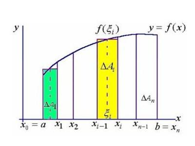
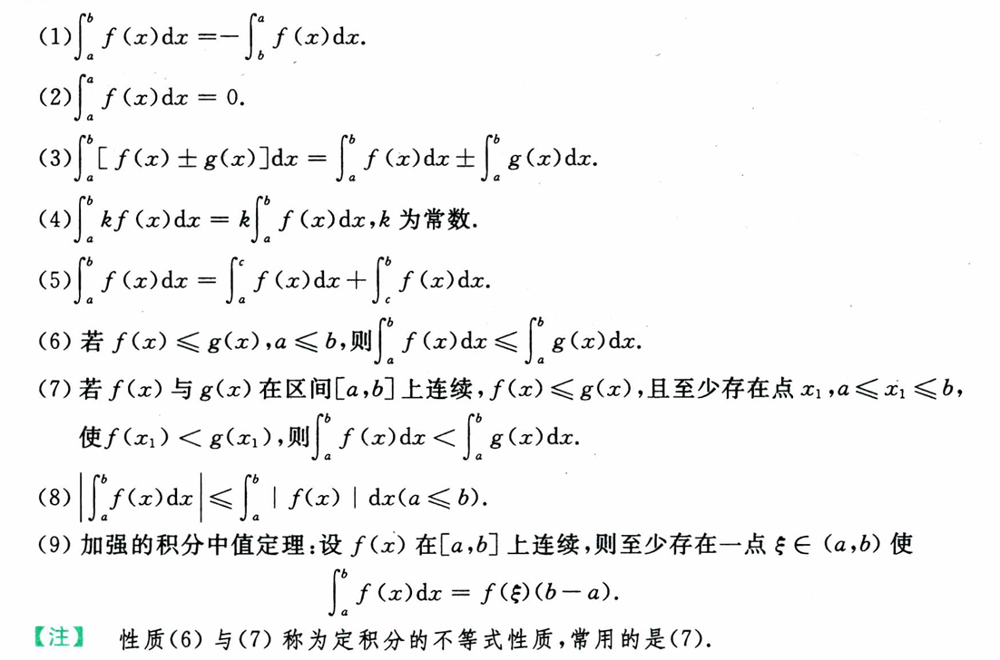
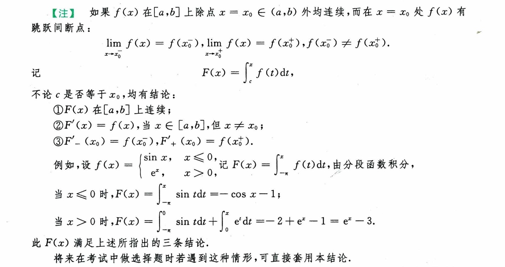
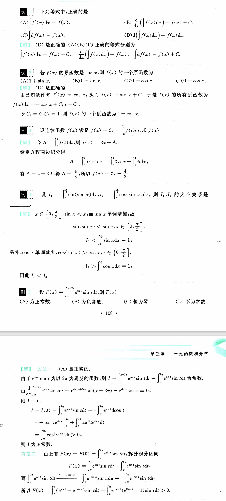
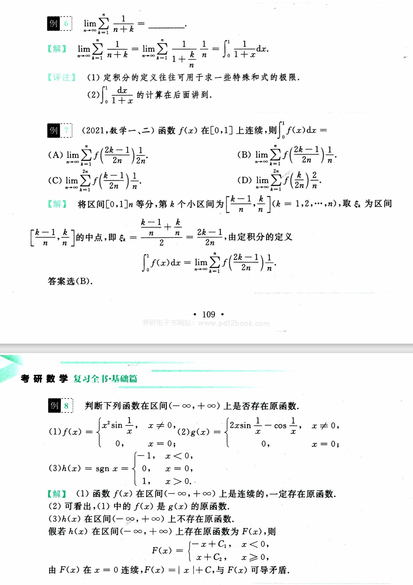
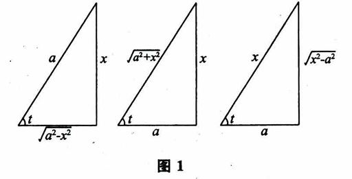

# 第三章 一元函数积分学

考点：

    原函数和不定积分的概念；

    不定积分的基本性质；

    基本积分公式；

    定积分的概念和基本性质；

    定积分中值定理；

    积分上限的函数及其导数；

    牛顿——莱布尼兹公式；

    不定积分和定积分的换元积分法与分部积分法；

    反常（广义）积分；

    定积分的应用（平面图形的面积、平面曲线的弧长、旋转体的体积及侧面积、平行截面面积为已知的立体体积、功、引力、压力、质心、形心等）函数的平均值；

    有理函数、三角函数的有理式和简单无理函数的积分.

## 第一节 不定积分与定积分的概念、性质

### 原函数、不定积分和定积分

设 $F'(x) = f(x), x \in (a, b)$, 则称 $F(x)$ 为 $f(x)$ 在 $(a, b)$ 上的 **原函数**.

$F(x) + C$ 是 $f(x)$ 的 **全体原函数**，并称为 $f(x)$ 的 **不定积分**，记作

$$
\int f(x) dx = F(x) + C
$$

**不定积分的性质** 以下均设被积函数在讨论区间上连续，则有

(1) $(\int f(x) dx)' = f(x); \ d \int f(x) dx = f(x)dx$.

(2) $\int f'(x) dx = f(x) + C; \ \int d f(x) = f(x) + C$.

(3) $\int (f(x) \pm g(x)) dx = \int f(x) dx \pm \int g(x) dx$.

(4) $\int k f(x) dx = k \int f(x) dx, \ k \neq 0$.

**定积分** 设 $f(x)$ 在 $[a, b]$ 上有界，作以下四步：

(1) 分割：将 $[a, b]$ 划分为 n 个小区间 $[x_{i - 1}, x_i], \ i = 1, 2, \cdots, n$, 记 $\Delta x_i = x_i - x_{i-1}$ 表示第 i 个区间的长度;

(2) 近似：在每个小区间上任取一点 $\xi_i$, 作以 $f(\xi_i)$ 为高，$\Delta x_i$ 为底的矩形;

(3) 求和：$S_n = \sum_{i = 1}^n f(\xi_i) \Delta x_i$;

(4) 取极限：记 $\lambda = max\{\Delta x_i\}, \lim_{\lambda \rightarrow 0} \sum_{i = 1}^{n} f(\xi_i) \Delta x_i$.

如果上述极限存在（与分法和取高方法无关），则称 $f(x)$ 在 $[a, b]$ 上可积，并称该极限为 $f(x)$ 在 $[a, b]$ 上的定积分，记作

$$
\int_{a}^{b} f(x) dx = \lim_{\lambda \rightarrow 0} \sum_{i = 1}^{n} f(\xi_i) \Delta x_i
$$

**说明**

1. 若 $f(x)$ 恒为正号，则定积分表示曲线与区间围成的曲边矩形的面积；若恒为负号，则表示面积的相反数；若不定号，则表示正区间和负区间的面积之差；

2. 定积分是积分和的极限，只与被积函数和区间有关，与变量名无关.

### 积分的基本性质

**定积分的性质** 以下除特别说明外，均设 $f(x)$ 和 $g(x)$ 在对应区间可积，则

**定积分存在定理**

(1) 设 $f(x)$ 在 $[a, b]$ 上连续，则 $\int_{a}^{b} f(x) dx$ 存在;

(2) 设 $f(x)$ 在 $[a, b]$ 上有界，且只有有限个间断点，则 $\int_{a}^{b} f(x) dx$ 存在.

**原函数存在定理** 设 $f(x)$ 在 $[a, b]$ 上连续，则 $f(x)$ 必有原函数.

**注**

1. 若 $f(x)$ 有第一类间断点，则不存在原函数；

2. 初等函数存在原函数，但原函数不一定为初等函数；

3. 若 $f(x)$ 不连续，则原函数是否存在与定积分是否存在不相干.

**变限积分** 设 $f(x)$ 在 $[a, b]$ 上可积，则存在 $x \in [a, b]$ 得到

$$
\Phi(x) = \int_{a}^{x} f(t) dt
$$

称为变上限的定积分，同理可得变下限定积分 $\Phi(x) = \int_{x}^{b} f(t) dt$, 这两种统称为变限积分.

**不定积分与定积分的关系** 设 $f(x)$ 在 $[a, b]$ 上连续，则 $(\int_{a}^{x} f(t) dt)'_{x} = f(x)$, 所以 $\int_{a}^{x} f(t) dt$ 是 $f(x)$ 的一个原函数，则有 $\int f(x) dx = \int_{a}^{x} f(t) dt + C$.

**牛顿-莱布尼兹定理** 设 $f(x)$ 在 $[a, b]$ 上连续，$F(x)$ 是 $f(x)$ 的一个原函数，则

$$
\int_{a}^{b} f(x) dx = F(x) |_{a}^{b} = F(b) - F(a)
$$

**补充**

证明周期函数在任何长为一周期的区间上的定积分都相等：

$$
\int_{x}^{x+T} f(t) dt = \int_{x}^{0} f(t) dt + \int_{0}^{T} f(t) dt + \int_{T}^{x+T} f(t) dt
$$

因为

$$
\int_{x}^{0} f(t) dt + \int_{T}^{x+T} f(t) dt = 0
$$

所以

$$
\int_{x}^{x+T} f(t) dt = \int_{0}^{T} f(t) dt
$$

> (1) 例四使用不等式得到两积分的不等关系;
>
> (2) 例五用到结论 **周期函数在任何长为一周期的区间上的定积分都相等** ;
>
> (3) 例六使用定积分定义求特殊和式的极限;
>
> (4) 例七可以从几何意义判断区间片段和高所在的点是否一致;
>
> (5) 例八振荡间断点可能有原函数.

## 第二节 不定积分与定积分的计算

### 基本积分公式

以下公式中，$\alpha$ 和 $a$ 均为常数，除声明外 $a > 0$.

$$
(1) \int 0 dx = C, \ \ \ (2) \int 1 dx = \int dx = x + C, \ \ \ (3) \int x^{\alpha} dx = \frac{1}{\alpha + 1} x^{\alpha + 1} + C \ (\alpha \neq -1),
$$

$$
(4) \int \frac{1}{x} dx = \ln |x| + C, \ \ \ (5) \int a^x dx = \frac{a^x}{\ln a} + C \ (a > 0, a \neq 1), \ \ \ (6) \int e^x dx = e^x + C,
$$

$$
(7) \int \sin x dx = - \cos x + C, \ \ \ (8) \int \cos x dx = \sin x + C, \ \ \ (9) \int \tan x dx = - \ln |\cos x| + C,
$$

$$
(10) \int \cot x dx = \ln | \sin x | + C, \ \ \ (11) \int \sec x dx = \ln |\sec x + \tan x| + C, \ \ \ (12) \int \csc x dx = \ln |\csc x - \cot x| + C,
$$

$$
(13) \int \sec^2 x dx = \tan x + C, \ \ \ (14) \int \csc^2 x dx = - \cot x + C, \ \ \ (15) \int \frac{1}{a^2 + x^2} dx = \frac{1}{a} \arctan \frac{x}{a} + C,
$$

$$
(16) \int \frac{1}{a^2 - x^2} dx = \frac{1}{2a} \ln |\frac{a + x}{a - x}| + C, \ \ \ (17) \int \frac{1}{\sqrt{a^2 - x^2}} dx = \arcsin \frac{x}{a} + C,
$$

$$
(18) \int \frac{dx}{\sqrt{x^2 \pm a^2}} = \ln |x + \sqrt{x^2 \pm a^2}| + C.
$$

### 基本积分方法

**1. 凑微分法 (第一换元法)**

设 $f(u)$ 连续，$\varphi (x)$ 具有连续的一阶导数公式，则

$$
\int f(\varphi(x))\varphi'(x)dx = \int f(\varphi(x))d \varphi(x) \overset{u = \varphi(x)}{=} \int f(u) du
$$

$$
\overset{如果}{=} F(u) + C = F(\varphi(x)) + C.
$$

**2. 换元积分法 (第二换元法)**

设 $f(x)$ 连续，$x = \varphi(t)$ 有连续导数 $\varphi'(t)$，则

$$
\int f(x)dx = (\int f(\varphi(t)) \varphi'(t)dt)|_{t = \psi(x)}
$$

$\psi(x)$ 表示 $\varphi (t)$ 的反函数.

**3. 常见的几种典型换元法**

以下式子中，$R(u, v)$ 表示 $u, v$ 的有理函数.

(1) $\int R(x, \sqrt{a^2 - x^2})dx, \int R(x, \sqrt{x^2 \pm a^2})dx$ 类型，$a > 0$.

含 $\sqrt{a^2 - x^2}$，令 $x = a \sin t, dx = a \cos t dt$,

含 $\sqrt{x^2 + a^2}$，令 $x = a \tan t, dx = a \sec^2 t dt$,

含 $\sqrt{x^2 - a^2}$, 令 $x = a \sec t, dx = a \sec t \tan t dt$.

(2) $\int R(x, \sqrt[n]{ax + b}, \sqrt[m]{ax + b}) dx$ 型，$a \neq 0$.

令 $\sqrt[mn]{ax + b} = t, x = \frac{t^{mn} - b}{a}, dx = \frac{mn}{a} t^{mn - 1} dt$.

> mn 取 m 与 n 的最小公倍数即可.

(3) $\int R(x, \sqrt{\frac{ax + b}{cx + d}})dx$ 型

令 $\sqrt{\frac{ax + b}{cx + d}} = t, x = \frac{dt^2 - b}{a - ct^2}, dx = \frac{2(ad - bc)t}{(a - ct^2)^2}dt$, 其中设 $ad - bc \neq 0$.

(4) $\int R(\sin x, \cos x)dx$ 型

命 $\tan \frac{x}{2} = t$, 则 $\sin x = \frac{2t}{1 + t^2}, \cos x = \frac{1 - t^2}{1 + t^2}, dx = \frac{2}{1 + t^2}dt$.

> 此称万能代换，这样代换通常会产生复杂的计算，非到不得已时不用.

> (1) 例1中可积的函数及其原函数都连续;
>
> (2) 例2凑微分时尽可能围绕变元凑;
>
> (3) 例3可以让上下两边同时乘 $1-\cos x$, 然后求解;
>
> 

---