# Linux Ubuntu环境下的以太坊编程基础

> 本资料主要来源于北京信息科技大学计算机学院教师郭东超。

## 前言

环境准备：VM虚拟机和Ubuntu镜像。在学习通区块链课程下以提供准备好的Ubuntu镜像，该镜像下以准备好编程环境。

**重要说明（来自学习通资料）：**

首先下载文件夹内所有文件，然后`UbuntuBlockchain2023.part01.rar`，右键点该文件进行解压。

全部解压至一个文件夹，文件夹内应该有25个文件（及文件夹）。

然后，启动虚拟机，读取该文件夹下的虚拟机镜像，启动虚拟机。

用户名（管理员）user123
密码user123456

---

## 软硬件环境

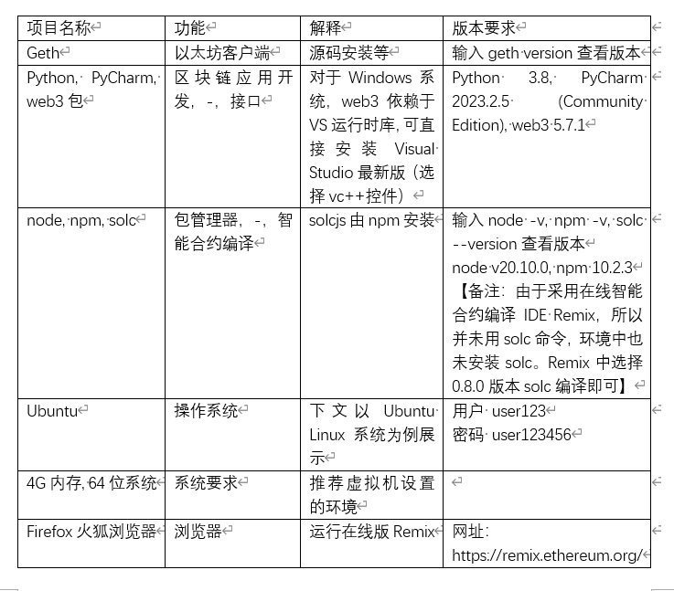

---

## Geth客户端使用

### 文件配置及初始化

Geth与Remix联合调试Ubuntu环境下的链启动命令，首先当前文件夹下要有配置文件genesis.json，文件内容如下：

```json
{
  "config": {
    "chainId": 666,
    "homesteadBlock": 0,
    "eip150Block": 0,
    "eip150Hash": "0x0000000000000000000000000000000000000000000000000000000000000000",
    "eip155Block": 0,
    "eip158Block": 0,
    "byzantiumBlock": 0,
    "constantinopleBlock": 0,
    "petersburgBlock": 0,
    "istanbulBlock": 0,
    "ethash": {}
  },
  "nonce": "0x0",
  "timestamp": "0x0",
  "extraData": "0x0000000000000000000000000000000000000000000000000000000000000000",
  "gasLimit": "0x47b760",
  "difficulty": "0x2000",
  "mixHash": "0x0000000000000000000000000000000000000000000000000000000000000000",
  "coinbase": "0x0000000000000000000000000000000000000000",
  "alloc": { },
  "number": "0x0",
  "gasUsed": "0x0",
  "parentHash": "0x0000000000000000000000000000000000000000000000000000000000000000"
}
```

此外如果需要进行编程，还需要其它配置：

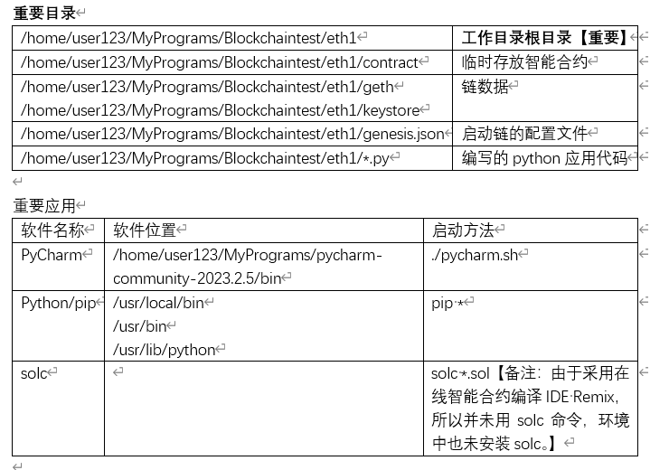

然后切换目录到工作目录根目录下，右键打开terminal，输入私链初始化与启动命令，初始化并启动链。

链初始化：
```bash
geth --datadir . init genesis.json
```

链启动：
```bash
geth --datadir . console --networkid 666 --port 30303 --allow-insecure-unlock --http --http.api debug,admin,eth,miner,net,txpool,personal,web3 --http.corsdomain="*" --vmdebug --ws --ws.origins="*" --ws.api="eth,web3,personal,net"
```

接着重新打开一个端口，执行命令：

```bash
geth attach ipc:./geth.ipc
```

输入上述命令后，私链即刻启动，并进入geth交互模式。


### 常用命令

#### 新建账户

```bash
# personal.newAccount(“密码”)
personal.newAccount("123")
```

#### 查看所有/某个账户

```bash
# eth.accounts
eth.accounts

# eth.accounts[0]
eth.accounts[0]
```
#### 查看挖矿的账户是哪个

```bash
# eth.coinbase
eth.coinbase
```

#### 开始挖矿

```bash
# miner.start()
miner.start()
```

#### 停止挖矿

```bash
# miner.stop()
miner.stop()
```

#### 重新指定挖矿账户

```bash
# miner.setEtherbase
miner.setEtherbase(eth.accounts[1])
```

#### 解锁账户

**在以太坊，凡是涉及到账户操作（外部账户：以太发送、发布、调用合约等）都需要事先解锁账户。**

```bash
# personal.unlockAccount(eth.accounts[0],"密码",解锁时限)
personal.unlockAccount(eth.accounts[0],"123")
personal.unlockAccount(eth.accounts[0],"123",3000)
```

#### 交易

**注意此操的交易还未记账，要挖矿后此交易才可能被打包执行，以太币发送成功。**

```bash
# personal.sendTransaction({from:发送方账户,to:接收方账户,value:发送以太币数目},"发送方账户密码")

personal.sendTransaction({from:eth.accounts[0],to: eth.accounts[1],value:web3.toWei(5,"ether")},"123")
```

#### 查询账户余额

```bash
# eth.getBalance
eth.getBalance(eth.accounts[0])
```

#### 停止私链运行

```bash
# exit
exit
```

#### 测试1

为了在本地测试私链，可新建立2个新账号，密码分别为“123”、“456”，假设其中eth.accounts[0]为挖矿账户。接着打印两个账户信息。开始挖矿，如此使得挖矿账户中累积以太币少许。然后停止挖矿。接着可测试从accounts[0]发送几个以太币至accounts[1]。

接着可查看当前各个账户余额。挖矿后，可再次观察accounts[1]的余额是否已增加。

**链初始化**

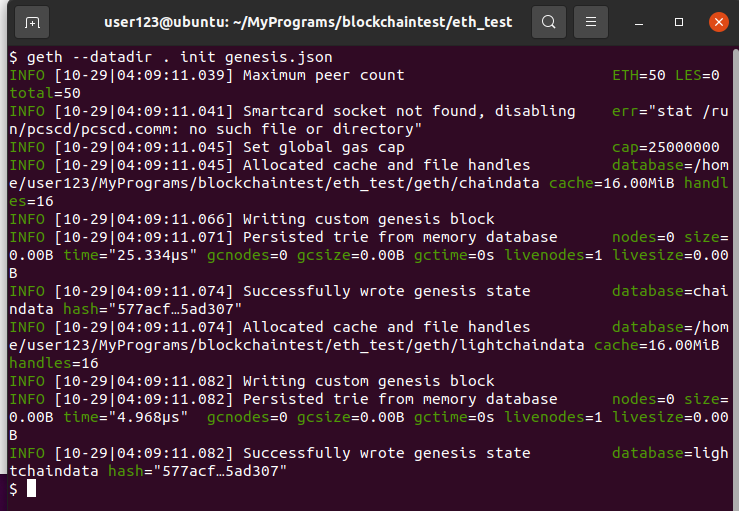

**链启动**

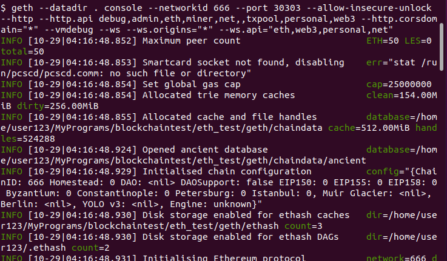

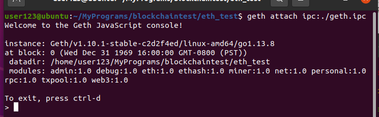

**创建账户**

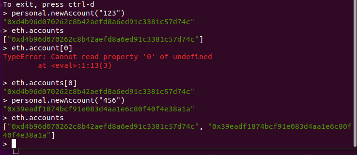

**查看挖矿账户和余额**

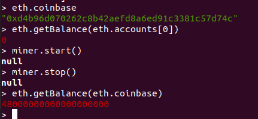

**交易后再查看**

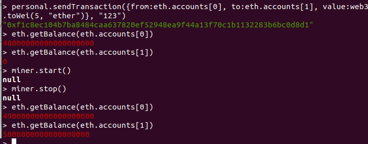

### 遇到的bug

#### 私有链启动时错误

在私有链启动时遇到了错误：

```bash
ERROR[10-29|04:38:41.333] Snapshot extension registration failed   peer=1b02f693 err="peer connected on snap without compatible eth support"
```

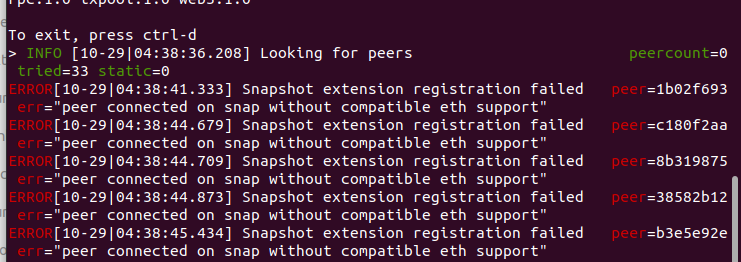

在网上查找得知，这是我尝试连接的对等节点的错误，而不是我的节点的错误有问题的对等体是 peer 。我的节点正常，此问题不会阻止它同步。

由于私有网络的 `bootnode` 尝试连接到其默认 `bootnode` 列表中的节点造成的。通过设置清除 `bootnode` 的 `bootnode` 列表后，节点就可以正确连接了。`--bootnodes=`。

该问题可以不用理会，直接再开一个终端连接即可。

---

## 脚本程序连接至私链

启动私链后，可运行下述Python代码测试能否连接上该私链。

```python
from web3 import Web3
myWeb3 = Web3(Web3.WebsocketProvider("ws://127.0.0.1:8546"))
# 检查是否连接成功
if myWeb3 .eth.getBlock(0) is None:
    print("connection fails")
elif myWeb3 .isConnected():
    print("successful connection")
```


启动私链后不要在geth交互下执行python命令，重新打开一个终端。

为了能够直接从命令行执行Python脚本，你需要使其可执行。使用以下命令：

```bash
chmod +x hello.py
```

现在你可以直接从命令行执行这个脚本了。有两种方法：

使用python3命令。

```bash
python3 hello.py
```

使用终端执行，但是你需要确保你的脚本是一个可执行的Python脚本，并且第一行正确地指定了Python解释器。你的脚本应该是这样的:

```python
#!/usr/bin/env python3
from web3 import Web3
myWeb3 = Web3(Web3.WebsocketProvider("ws://127.0.0.1:8546"))
```

```bash
./hello.py
```

### 智能合约编写与测试

在工作目录根目录下新建空文件夹contract，稍后存放合约。打开浏览器Firefox等，访问在线智能合约编译Remix - Ethereum IDE，网址为：`https://remix.ethereum.org/`。

在contracts文件夹下，新建智能合约“HelloWorld.sol”，粘贴如下代码。或直接粘贴至Remix中。

```solidity
// SPDX-License-Identifier: GPL-3.0
pragma solidity >=0.6.0 <0.9.0;

contract HelloWorld{
    uint mynumber;
    constructor() public{
       mynumber = 0;
    }
    function get() public view returns(uint) {
        return mynumber;
    }
    function set(uint n) public{
        mynumber = n;
    }
}
```

#### 编译

如图，最左侧功能区包括四个按钮“File explorer”（各类文件与代码管理）、“Search in files”、“Solidity compiler”、“Deploy & run transactions”

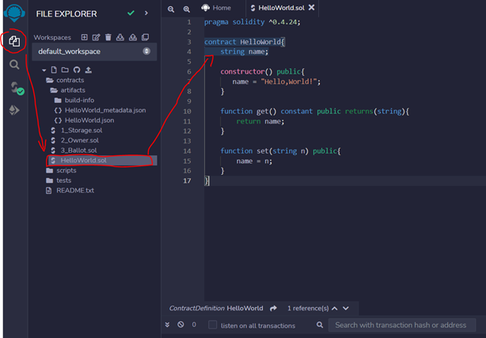

切换至代码编译功能区，在“contracts”目录下新建“HelloWorld.sol”文件，粘贴代码。编译的方法如下图。

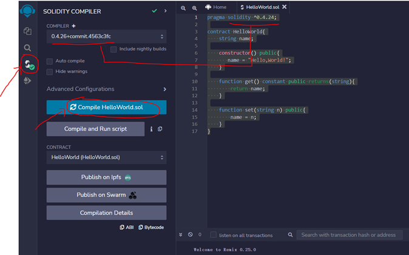

Remix支持自动编译，在编译之前需要选配与代码要求相对应的版本。如图要求大于0.4.24版本，则需要ctrl+s保存合约后自动编译或者点击Compile按钮。对于上述代码，选择0.8.10以上版本。如果出现最左侧工具栏中的绿色对勾，则标识编译成功。一般编译错误的原因包括但不限于所选编译的版本不对应、语法问题等。

上面的代码编译时会出现警告，编译功能颜色为黄色，因为在Solidity版本0.6.2及以后，构造函数（constructor）的public关键字被忽略，因为构造函数不能被外部合约或用户直接调用（它们只能在部署时执行）。这意味着在构造函数上指定public是没有意义的，因为对于这个特定目的来说，它不存在。当然代码仍然可以编译成功，不过如果你愿意去除构造器中的`public`关键字，那自然更加的海阔天空嘛。

编译成功后，点击“ABI”，将合约接口配置内容粘贴出来，在contracts目录下，新建文件名为HelloWorld.abi，将内容粘贴进去。

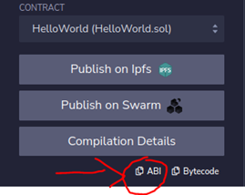

典型的abi文件内容如下（以HelloWorld.sol为例）：

```json
[
	{
		"inputs": [],
		"stateMutability": "nonpayable",
		"type": "constructor"
	},
	{
		"inputs": [],
		"name": "get",
		"outputs": [
			{
				"internalType": "uint256",
				"name": "",
				"type": "uint256"
			}
		],
		"stateMutability": "view",
		"type": "function"
	},
	{
		"inputs": [
			{
				"internalType": "uint256",
				"name": "n",
				"type": "uint256"
			}
		],
		"name": "set",
		"outputs": [],
		"stateMutability": "nonpayable",
		"type": "function"
	}
]
```

#### 部署与运行

先点击`HelloWorld.sol`文件界面，然后进入此功能界面，在Remix的左侧工具栏选择“Deploy & run transactions”。功能区包括“Environment”、“Account”、“Gas limit”、“Value”、“Contract”、“Deployed Contracts”等。

“Environment”，里面包括一些虚拟环境，单纯测试合约可以用这个，比如下图的Remix VM [London]这个环境。也可以连接至由客户端Ganache创建的链，即选择“Ganache Provider”，或者由Geth通过http方式提供的接口，即选择“External Http Provider”。

以合约1.1 HelloWorld部署运行为例。这里我们选择测试用的虚拟环境“Remix VM [Cancun]”，如下图。随即，点击“Deploy”，通过当前的账户Account部署所选择的合约Contract-HelloWorld.sol，部署成功后，合约的若干功能会被以JS的形式显示在左下方，如图的get/set方法。点击get，右下方即刻会显示合约执行的结果，显示当前HelloWorld类中的某个属性的数值。

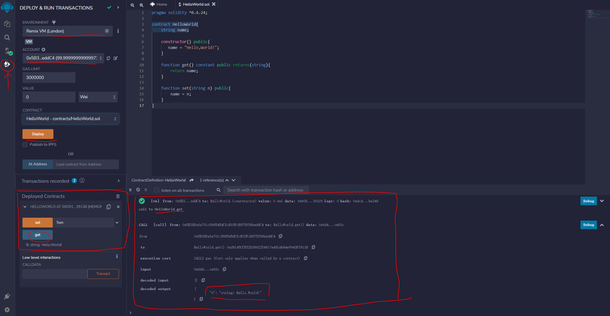

可以继续测试合约的set方法，把属性数值进行更改，在网页上面set按钮的后面输入对话框中填写新数值，然后点击set按钮。效果如下图。

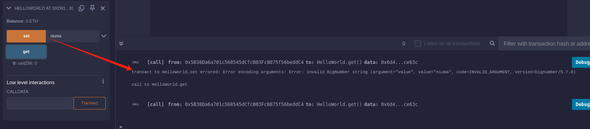

特别注意，按正常流程来说，应该调用合约，挖矿成功后，状态才会产生变化，但由于选择的是虚拟环境，因此点击set后会即刻产生变化。


#### 私链部署与编程调用

在浏览器版本Remix中，首先在“Environment”中选择“Custom – External Http Provider”，即采用HTTP方式连接到本地由Geth启动的私链。然后，观察“Account”观察私链中各个账户信息，核对是否连接的是本地链。接着，在“Gas limit”部分选择“Custom”，数值默认的3000000即可，如下图。

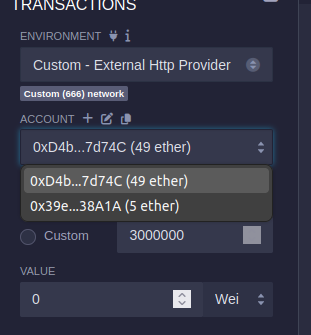

确认需要部署的合约名后，点“deploy”部署该合约。部署某合约后，可复制该合约的合约地址用于后续编码，如下图。点击Deploy后挖矿一次，使得合约部署。

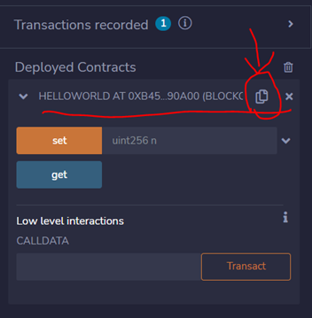

如果部署过程中弹出错误，需先解决错误再进行如下操作，否则合约可能无法成功部署。有可能是被部署的合约在编译过程中，选择的编译器版本比较高，如果是的话，需要选择一个比较低的版本后（但仍然在合约首行规定的范围内）再尝试重新部署，直到不弹出错误提示；也可能是由于使用的账户未解锁，需要解锁账户后再尝试重新部署，直到不弹出错误提示。

“Deploy”合约后，需要挖矿才能使得该合约被实际部署。在挖矿后，可以用两种方式测试合约，一种上文有所述，即Remix会自动可视化展示该合约，另一种为外部脚本调用该合约，方式如下：

以如下Python代码方式调用合约，调用合约的一个方法。注意，“调用合约方法”这个行为本身会被打包为一个transaction发往链，待下次挖矿后，才会被执行。

注意：`self.myContractAddr = '0x187dD755c77efB69c5Aa2199c27253642D55de6C'`此行代码中的地址，需要被替换为合约的实际被成功部署后的地址。

```python
from web3 import Web3
import json


class ethereumHandler():
    def __init__(self):
        self.web3 = Web3(Web3.WebsocketProvider("ws://127.0.0.1:8546"))
        # 检查是否连接成功
        if self.web3.eth.getBlock(0) is None:
            print("Failed to connect!")
        elif self.web3.isConnected():
            # read the abi
            # r"D:\blockchaincode\contract\myContract_sol_baseContract.abi", 'r'
            with open("./contract/HelloWorld.abi", 'r') as fo:
                preabi = fo.read()
                # print(self.preabi)
                myabi = json.loads(preabi)
                self.myContractAddr = '0x187dD755c77efB69c5Aa2199c27253642D55de6C'
                self.myContract = self.web3.eth.contract(address=self.myContractAddr, abi=myabi)
                print("Successfully connected")
            print(self.myContract.all_functions())

    """检查传入地址是否正确，不正确则转换为正确地址并返回"""

    def CheckAddress(self, _address):
        if self.web3.isChecksumAddress(_address):
            return _address
        else:
            return self.web3.toChecksumAddress(_address)

    def unlockAccount(self, _addr):
        self.web3.geth.personal.unlockAccount(self.CheckAddress(_addr), "123")

    def GetNum(self):
        num = self.myContract.functions.get().call()
        print("获取的号码为 ", num)

    def SetNum(self, _address, _newnum):
        self.unlockAccount(_address)
        tx_hash = self.myContract.functions.set(_newnum).transact({'from': _address})
        return self.web3.toHex(tx_hash)


if __name__ == '__main__':
    e1 = ethereumHandler()
    print('===================')
    e1.SetNum(e1.web3.eth.accounts[0], 5)
    print('===================')
    #e1.GetNum()
```

执行上述代码后，需要再次挖矿。而后，可通过Remix的快捷按钮调用合约get方法，查看当前合约属性的数值，如图：

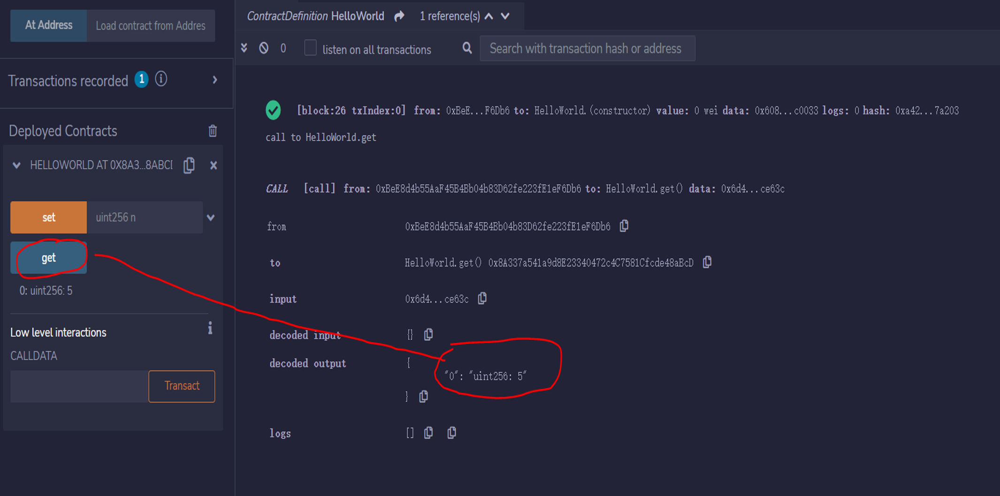

如果发现get到的结果不符合之前set的值，可以查看挖矿进程是否完成了一次挖矿。

