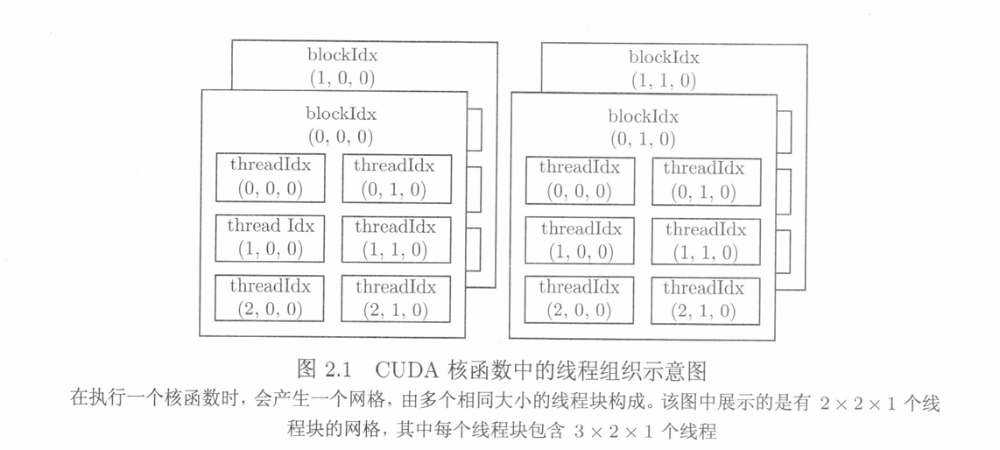
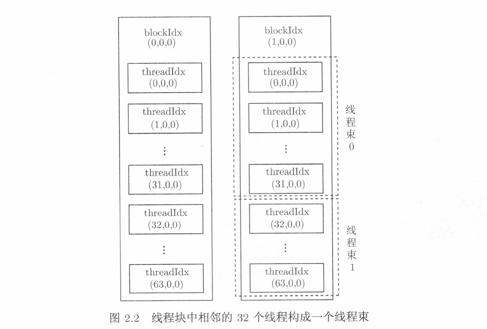

## cuda编译和执行

cuda使用nvcc进行编译和执行，文件名后缀为.cu。nvcc编译时自动包含头文件`cuda.h`和`cuda_runtime.h`，并且`cuda.h`中已经声明了`stdlib.h`，因此不需要再声明了。

nvcc先将设备代码编译为PTX(parallel thread execution)伪汇编代码，再将PTX代码编译为二进制的cubin目标代码。

将源代码编译为PTX代码时需要通过`-arch=compute_XY`指定虚拟架构的计算能力，来确定代码能使用的CUDA功能。将PTX代码编译为cubin代码时需要通过`-code=sm_ZW`指定真实架构的计算能力，来确定可执行文件能够使用的真实GPU。

真实架构的计算能力必须大于或等于虚拟架构的计算能力。

编译器具有默认的计算能力，可以在不手动指定的情况下直接运行。

### cuda编程：Hello World!

cuda可以使用和c++的`hello world`一致的代码，这是因为nvcc在编译.cu文件时会将c++部分的代码交给g++或者cl编译器编译，只有涉及到使用GPU时的代码才会由nvcc自己编译。

本次测试使用VS2022提供的环境，若要在命令行使用需提前配置好cl编译器的环境。

代码如下：

```cpp
#include <stdio.h>

int main() {
	printf("Hello World!");
	return 0;
}
```

使用以下代码编译生成可执行文件，然后执行：
```bash
nvcc -o my_cuda_program my_cuda_program.cu
./my_cuda_program
```

### 使用核函数的cuda程序

cuda程序的c++部分由cpu实现，核函数部分由gpu实现。一个典型的、简单的cuda程序应该如下所示：

```cpp
int main(void) {
    主机代码
    核函数调用
    主机代码
    return 0;
}
```

cuda程序使用cpu执行主机代码，当执行核函数时，cuda让cpu去调用gpu执行。

下面是调用核函数的`hello world`的cuda程序

```cpp
#include <stdio.h>

// 核函数定义，声明__global__，返回值必须为空，void和__global__没有顺序要求
void __global__ hello_from_gpu() {

	// 核函数不支持c++的iostream，因此这里使用的是c的stdio
	printf("Hello World from GPU!\n");
}

int main() {

	// 核函数调用
	/*
	* <<<网格大小，线程块大小>>>
	* <<<1, 1>>> 表示该核函数调用使用1 * 1 = 1个线程
	*/
	hello_from_gpu <<<1, 1 >>> ();

	// 调用cuda运行时API，同步主机与设备，促进缓冲区刷新
	cudaDeviceSynchronize();


	return 0;
}
```

调用核函数时需要用到<<<网格大小，线程块大小>>>，这是核函数组织线程的使用，每个核函数使用的线程数是线程块的数目*线程块中线程的数目，线程块的数量就是网格大小，线程块内线程的数目就是线程块大小。

为了充分利用gpu资源，一般核函数使用的线程数要多于gpu的计算单元数目

```c++
#include <stdio.h>

void __global__ hello_from_gpu() {
	printf("Hello World from GPU!\n");
}

int main() {
	hello_from_gpu <<<2, 4 >>> ();  // 8个线程

	cudaDeviceSynchronize();

	return 0;
}
```

### 线程索引

核函数调用的每个线程都有自己的身份标识，就在核函数的内建变量中。

> gridDim.x: 核函数调用的线程块的数量，也就是网格大小
>
> blockDim.x: 核函数的线程块中线程的数量，也就是线程块大小
>
> blockIdx.x: 核函数中某个线程块的标识，整数，范围为(0, gridDim.x - 1)
>
> threadIdx.x: 核函数中线程块里的线程的标识，整数，范围为(0, blockDim.x - 1)

通过线程标识可以知道某个结果到底是哪一个线程执行得到的，如下所示：

```cpp
#include <stdio.h>

void __global__ hello_from_gpu() {
	const int bid = blockIdx.x;
	const int tid = threadIdx.x;
	printf("Hello World from block %d and thread %d!\n", bid, tid);
}

int main() {
	hello_from_gpu << <2, 4 >> > ();  // 8个线程
	cudaDeviceSynchronize();

	return 0;
}
```

输出结果为：
```bash
Hello World from block 1 and thread 0!
Hello World from block 1 and thread 1!
Hello World from block 1 and thread 2!
Hello World from block 1 and thread 3!
Hello World from block 0 and thread 0!
Hello World from block 0 and thread 1!
Hello World from block 0 and thread 2!
Hello World from block 0 and thread 3!
```

当然也有从第1个线程块开始执行的，因为线程块之间的运算是相互独立的。


### 多维网络

blockIdx和threadIdx都是结构体uint3的变量，x是uint3的成员，与此同时还有y和z：

```cpp
struct __device_builtin__ uint3
{
	unsigned int x, y, z;
};

typedef __device_builtin__ struct uint3 uint3;
```

同样的，gridDim和blockDim来自类型dim3，有成员x, y, z。

通过构造函数可以修改核函数调用的线程数，比如要定义2*2*1的网格和3*2*1的线程块：

```cpp
dim3 grid_size(2, 2); // 1可以省略不写，这里等价于dim3 grid_size(2, 2, 1);

dim3 block_size(3, 2); //省略1不写
```

此时核函数中的线程组织如下：



同一线程块中还可以细分线程束：



下面尝试使用多维线程块输出`hello world`：

```cpp
#include <stdio.h>

void __global__ hello_from_gpu() {
	const int b = blockIdx.x;
	const int tx = threadIdx.x;
	const int ty = threadIdx.y;
	printf("Hello World from block-%d and thread-(%d, %d)!\n", b, tx, ty);
}

int main() {
	const dim3 block_size(2, 4);
	hello_from_gpu << <1, block_size >> > ();
	cudaDeviceSynchronize();

	return 0;
}
```

输出结果如下：

```bash
Hello World from block-0 and thread-(0, 0)!
Hello World from block-0 and thread-(1, 0)!
Hello World from block-0 and thread-(0, 1)!
Hello World from block-0 and thread-(1, 1)!
Hello World from block-0 and thread-(0, 2)!
Hello World from block-0 and thread-(1, 2)!
Hello World from block-0 and thread-(0, 3)!
Hello World from block-0 and thread-(1, 3)!
```

可以看到变化最快的是线程块的最内层，也就是x。


> 无论如何定义，一个线程块最大的线程数不能超过1024。

