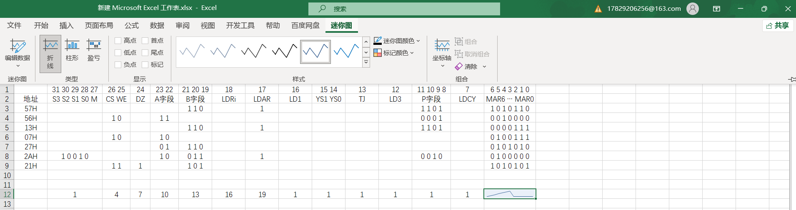

# excel基础

## 界面设置

### 自定义功能区

如下图所示，随机选择一个选项卡右键点击，打开自定义功能区，勾选需要的功能。

## 基础操作

### 快速填充数据

如下图，在开始工具栏有一个填充选项卡，下面有一个快速填充功能。

> 示例如下：
>
> 
>
> 上图中只需要输入第一个名字作为示例，剩下的使用快速填充直接就可以填好。

除了最基本的填充，稍微复杂的也可以实现。

> 
> 多列填充时要注意列与列之间必须是相连的，不能有空白列插在中间。
>
> 

**注意事项：如果觉得快速填充的内容不满意，可以先手动填充多个内容。**

### 快速分析

选中内容，点击右下角的图标可以选择功能。

下图中的条件格式也可以快速把表格中的数据项根据相对大小填充颜色或者图标来表示数值差异。

如果要查看图标的具体释义，可以点击条件格式的管理规则。

选中后，点击编辑规则。

在插入中可以根据选中的数据选择需要的图表来描绘数据。

选择迷你图，就会在单元格内生成图片。选中单元格，在新出现的选项卡可以对迷你图进行设置。

### 录入数据

数据录入规范：横向录入

数据录入方式：

- Tab键：右移一个单元格；

- Enter键：换到下一行最开始使用Tab键的单元格。

- shift + Tab：左移一个单元格

- shift + Enter：上移一个单元格

#### 特殊数据录入

**(1) 时间**

时间数据格式：`2021-3-12` 或 `2021/3/12`。

输入时间快捷键：

- `ctrl + ;` ：输入当天日期；

- `ctrl + shift +;` ：输入当前时间；

- now函数：输入now()，敲击回车，直接显示当前日期加时间。

**(2) 百分比数字**

可以直接输入`30%`，也可以先选中单元格，在开始选项卡常规一栏中选择百分比，然后直接输入数字。

在常规选项下面可以决定保留几位小数。

**(3) 分数**

可以直接输入小数0.2，如果要输入分数1/5，需要按照格式 `0 1/5` 输入，否则会被误认为是日期。

**(4) 过长数字**

excel单元格最长可以输入15位数字，超出位直接设为0，并以科学计数法表示。

如果要输入长数字，需要先选中单元格，在常规中选择文本格式，然后就可以输入了。或者在输入完后，在数字之前输入英文单引号也可以设为文本格式。

#### 原位填充

快捷键 `ctrl + Enter`，点击后选中位置不变，停留在原单元格。

如果选中多个单元格，使用快捷键后所有选中单元格都显示相同内容。

### 团队数据整合

excel不支持云端协作填写数据，如果需要协作使用，可以使用其它云端工具，比如简道云，参考视频：`https://www.bilibili.com/video/BV1Gq4y1M716?spm_id_from=333.788.player.switch&vd_source=e014d5ba2c4382e2e4f2bef66e7b06d7&p=7`

#### 数据格式规范

如果一定要多人使用excel，那么应该确保所有人都按照规范填写数据，下面的这些功能可以提供保障。

**(1) 输入提示**

在数据选项卡中点击数据验证，选择第一项。

在弹出框输入你要提示别人的信息。

点击确定，在选中的单元格中输入时就会看到提示信息。

**(2) 下拉列表**

有的内容不需要填写，只用从已有的选项中选择，就可以使用下拉列表功能。

同样在数据验证中，选择设置，允许中选择序列，来源中填写下拉列表的选择内容，使用英文逗号分隔开。

**(3) 数据验证与出错警告**

在填写身份证号或者电话号时，有的人可能会少填几位。使用数据验证和出错警告可以提示数据格式是否正确。

首先选中单元格，然后同样在数据验证的设置中允许栏选择文本长度，数据选择等于，如果是电话号，长度就填11，其它情况类似。

确定后，如果输入了格式不对的信息就会出现默认报错内容。

可以在出错警告中设置合适的提示信息。

#### 多表合并

