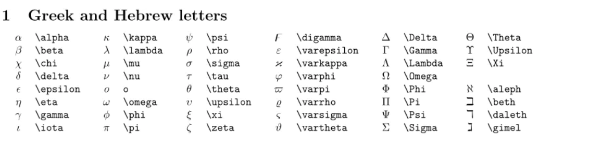
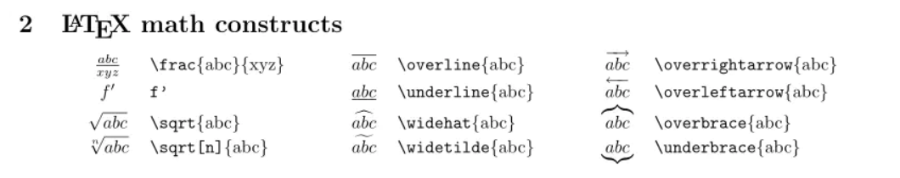
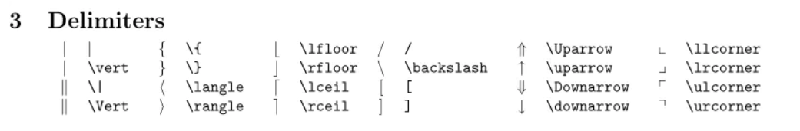
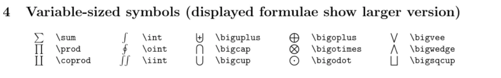
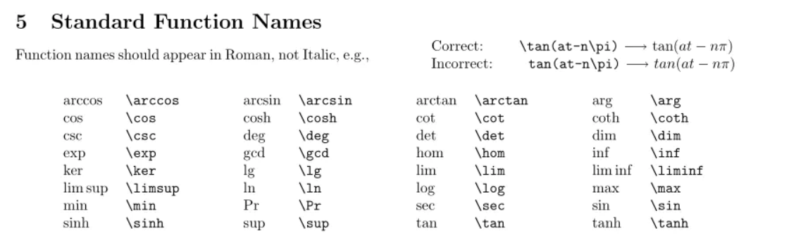
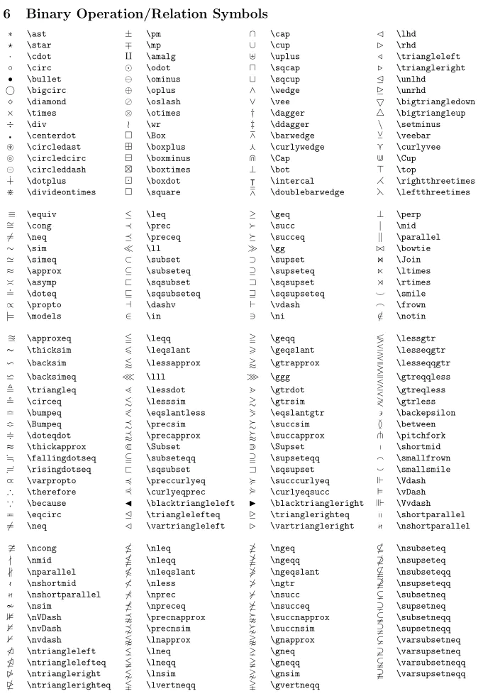
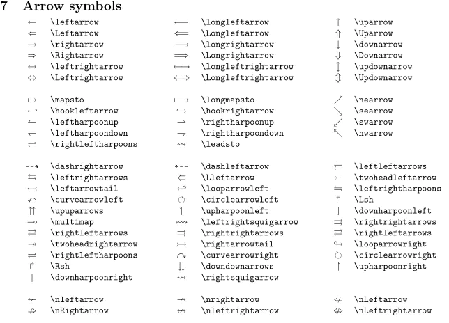
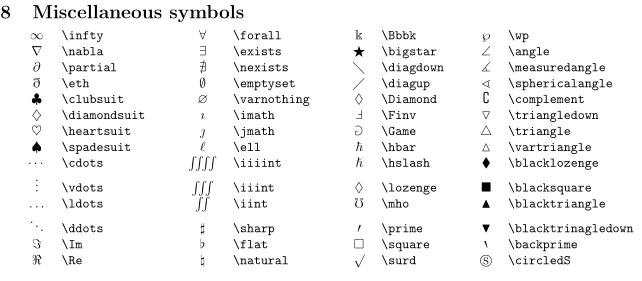

# markdown数学公式语法

在具有markdown数学公式语法解析支持的情况下，可以通过编写数学语句展示常规输入法难以展示的数学公式。

行内输入：\$ + esc，会出现\$$字样，在这两个美元符号之间输入LaTex语法，即可实现在行内插入公式。

例如：$example$

在行间输入：\$\$ + 回车，会出现一对\$\$ \$\$的符号，在这一对符号之间输入LaTex语法，即可实现在行间插入公式。

例如：

$$
example
$$

## 常用一般方法

### 输入希腊字母

希腊字母的LaTex语法见下图：



示例：

希腊字母：$\alpha$; $\beta$; $\Upsilon$。

### 插入一些数学结构

方法与插入希腊字母一样，如下：



数学结构示例：

除法：$\frac{abc}{xyz}$

上划线：$\overline{abc}$

开根号：$\sqrt[n]{abc}$

### 插入定界符



示例：$|$; $\Vert$;

将上述定界符与`\left`和`right`组合使用可以使得定界符匹配其内容的高度。

比如要构建一个如下的矩阵的行列式：

```
\left |\begin{matrix}
    a & b & c \\
    d & e & f \\
    g & h & i
\end{matrix} \right|
```

$$
\left |\begin{matrix}
    a & b & c \\
    d & e & f \\
    g & h & i
\end{matrix} \right|
$$

### 可变大小的符号



示例：$\sum$; $\bigsqcup$;

### 插入函数名



示例：$\tan(at-n\pi)$; $\cos(a+\pi/2)$;

### 二进制运算符和关系运算符



示例：$\nleqq$; $\pm$; $\bigtriangledown$;

### 插入箭头符号



示例：$\Longleftarrow$; $\nearrow$; $\nLeftarrow$;

### 插入其它符号



示例：$\spadesuit$; $\blacksquare$; $\square$;

### 上下标

我们可以使用`^`来输出上标，使用`_`来输出下标，使用`{}`包含作用范围。

示例：

> \sin^2(\theta) + \cos^2(\theta) = 1

$$
\sin^2(\theta) + \cos^2(\theta) = 1
$$

> \sum_{n=1}^\infty k

$$
\sum_{n=1}^\infty k
$$

> \int_{a}^{b} f(x) dx

$$
\int_{a}^{b} f(x) dx
$$

> \lim_{x \to \infty} \exp(-x) = 0

$$
\lim_{x \to \infty} \exp(-x) = 0
$$

### 输出矩阵

矩阵中的各元素通过用`&`来分隔，`\\`来换行。

示例：

```
\begin{matrix}
    a&b&c \\
    d&e&f \\
    h&i&g
\end{matrix}
```

$$
\begin{matrix}
    a&b&c \\
    d&e&f \\
    h&i&g
\end{matrix}
$$

```
\begin{bmatrix}
    a&b&c \\
    d&e&f \\
    h&i&g
\end{bmatrix}
```

$$
\begin{bmatrix}
    a&b&c \\
    d&e&f \\
    h&i&g
\end{bmatrix}
$$

```
\begin{Bmatrix}
    a&b&c \\
    d&e&f \\
    h&i&g
\end{Bmatrix}
```

$$
\begin{Bmatrix}
    a&b&c \\
    d&e&f \\
    h&i&g
\end{Bmatrix}
$$

```
\begin{vmatrix}
    a&b&c \\
    d&e&f \\
    h&i&g
\end{vmatrix}
```

$$
\begin{vmatrix}
    a&b&c \\
    d&e&f \\
    h&i&g
\end{vmatrix}
$$

```
\begin{Vmatrix}
    a&b&c \\
    d&e&f \\
    h&i&g
\end{Vmatrix}
```

$$
\begin{Vmatrix}
    a&b&c \\
    d&e&f \\
    h&i&g
\end{Vmatrix}
$$

### 输出分段函数

用`\begin{cases}`和`\end{cases}`来构造分段函数，中间则用`\\`来分段。

```
f(x)=
\begin{cases}
2x, \ \ \ x<0 \\
3x, \ \ \ x\geq 0 \\
\end{cases}
```

$$
f(x)=
\begin{cases}
2x, \ \ \ x<0 \\
3x, \ \ \ x\geq 0 \\
\end{cases}
$$

分段函数加上 `\displaystyle` 保留分数字体大小:

```
MB(H, E) = 
\begin{cases}
1, & P(H) = 1 \\ \\
\displaystyle \frac{max \{P(H | E), P(H) \} - P(H)}{1 - P(H)}, & P(H) \neq 1
\end{cases}
```

$$
MB(H, E) = 
\begin{cases}
1, & P(H) = 1 \\ \\
\displaystyle \frac{max \{P(H | E), P(H) \} - P(H)}{1 - P(H)}, & P(H) \neq 1
\end{cases}
$$

### 字体

> \mathbf{ABCDEFGHIJKLMNOPQRSTUVWXYZabc123}

$\mathbf{ABCDEFGHIJKLMNOPQRSTUVWXYZabc123}$

> \mathcal{ABCDEFGHIJKLMNOPQRSTUVWXYZabc123}

$\mathcal{ABCDEFGHIJKLMNOPQRSTUVWXYZabc123}$

> \mathfrak{ABCDEFGHIJKLMNOPQRSTUVWXYZabc123}

$\mathfrak{ABCDEFGHIJKLMNOPQRSTUVWXYZabc123}$

> \mathsf{ABCDEFGHIJKLMNOPQRSTUVWXYZabc123}

$\mathsf{ABCDEFGHIJKLMNOPQRSTUVWXYZabc123}$

> \mathbb{ABCDEFGHIJKLMNOPQRSTUVWXYZabc123}

$\mathbb{ABCDEFGHIJKLMNOPQRSTUVWXYZabc123}$

### 补充

> 这里是2024/12/12 09点49分，突然发现任意和存在符号在其它符号里，只是我没有看见。

$\forall$ : \forall;

$\exists$ : \exists;

$\mathring{N}$: \mathring{N}

在等号上添加注释使用 `[a \overset{\text{假设}}{=} b]`: $[a \overset{\text{假设}}{=} b]$


## 测试

根据语法做出一些测试。

---

区块链节点值计算公式：

$$
H=Hash(H_{left}\|H_{right})
$$

目标值计算公式：

$$
Target = \frac{2^{256}}{Difficulty}
$$

Nonce值判断条件：

$$
Hash(BlockHeader\|Nonce) \leq Target
$$
---

