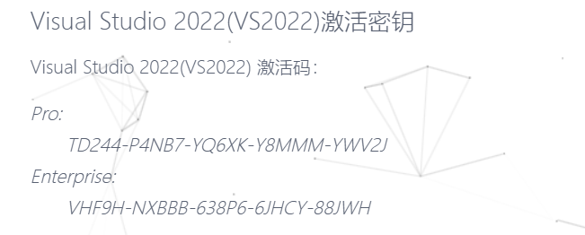

### VS2022的安装

VS2022之后的版本可以安装在指定文件夹


### CUDA安装

安装cuda前使用`nivdia-msi`查看自己的cuda驱动版本，我的是12.2，可以下载12.2之前的版本。

vs2022的17.10版本之后只支持cuda12.4以上，因此我选择vs2022的老版本。

微软不提供vs老版本的社区版，因此使用专业版，需要密钥。




#### cuda的卸载重装

由于nvprof只支持cuda10.1之前的版本，所以需要卸载重装。

参考网址：`https://blog.csdn.net/qq_62928482/article/details/139636706`; `https://blog.csdn.net/weixin_44606139/article/details/127493438`; `https://blog.csdn.net/chen565884393/article/details/127905428`;


#### nvprof支持的版本

~~nvprof在cuda10.1后不再随着cuda更新，如果想要进行性能测试就要下载Nsight System，但是NVIDA官网没有本地文件，必须连服务器。~~

~~智普清言说nvprof不支持cuda10.1后的版本，但从一些网页资料来看nvprof仍然支持至少11.1版本。~~

```bash
======== Warning: nvprof is not supported on devices with compute capability 8.0 and higher.
                  Use NVIDIA Nsight Systems for GPU tracing and CPU sampling and NVIDIA Nsight Compute for GPU profiling.
                  Refer https://developer.nvidia.com/tools-overview for more details.
```

来自终端的报错，说明nvprof确实不能支持8.0以上的cuda。但是有的资料确实现实可以支持。资料来自`https://www.cnblogs.com/AIxiaodi/p/13766461.html`。

经过考察后发现，nvprof实际上不能支持的是计算能力8.0以上的cuda，也就是说无论我用哪个版本的cuda都不行。


#### nvprof无法使用

参考网址：`https://www.cnblogs.com/AIxiaodi/p/13766461.html`

#### 使用Nsight System

安装网址：`https://developer.nvidia.com/tools-downloads`

使用方法的参考网址：`https://zhuanlan.zhihu.com/p/362796754`; `https://zmurder.github.io/CUDA/Nsight/Nsight%20Systems%E5%9F%BA%E7%A1%80/`; `https://blog.csdn.net/HTMCW/article/details/136801104`

#### 云服务安装cuda

参考网址：`https://blog.csdn.net/h3c4lenovo/article/details/119003405`


#### VM虚拟机上安装cuda

参考网址：`https://blog.csdn.net/sizaif/article/details/115794358`; `https://docs.pingcode.com/baike/2727496`; `https://www.cnblogs.com/suzhoulaowang/p/18202228`; `https://docs.irichard.wang/selfhosted/vm/cuda-vm/`; `https://blog.csdn.net/m0_56514535/article/details/131855585`;

**经过网络上无数小伙伴的试错，已经确认虚拟机上安装和使用cuda成功率极低**


### VM虚拟机

#### VM和Ubuntu的卸载重装

参考网址：`http://www.corina.cc/article/131/`; `https://blog.csdn.net/YSA_SFPSDPGY/article/details/131701495`


VM和Ubuntu下载使用网址：`https://blog.csdn.net/weixin_74195551/article/details/127288338`


Ubuntu下载时VM提示找不到系统，参考网址：`https://blog.csdn.net/qq_44251824/article/details/100584354`

#### VM使用时异常

Ubuntu界面鼠标位置偏移：`https://blog.csdn.net/CarlSunnnn/article/details/114984769`

报错信息`无法连接虚拟设备 sata0:1，因为主机上没有相应的设备。您要在每次开启此虚拟机时都尝试连接此虚拟设备吗?`解决方案参考网址：`https://blog.csdn.net/qq_43780850/article/details/122334632`


#### 在VM中打开.vmdk文件

参考网址：`https://blog.csdn.net/weixin_45221204/article/details/139583824`

