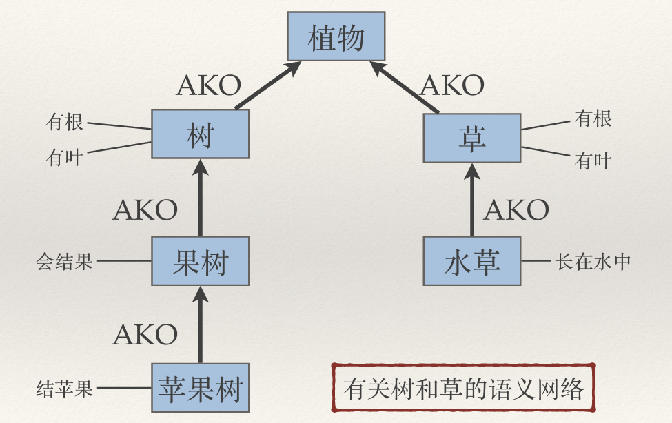
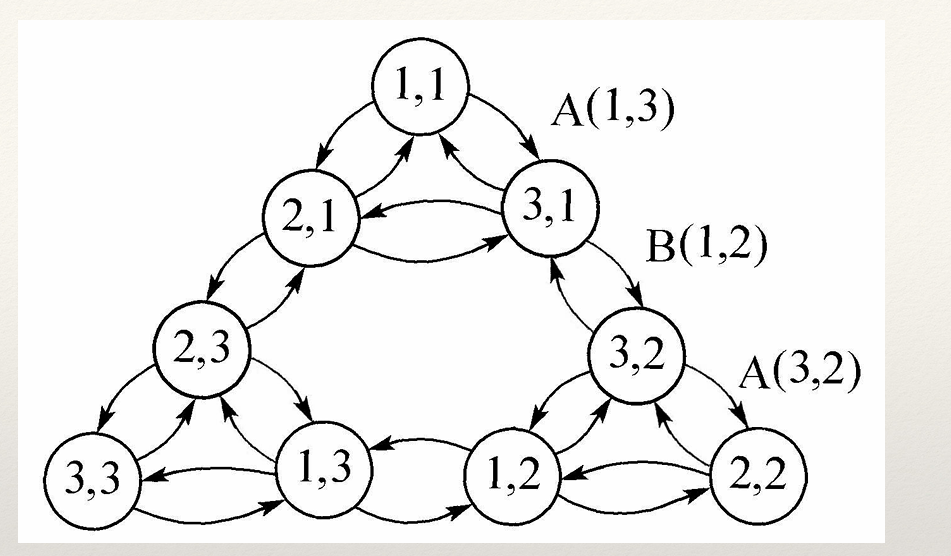

# 第二章 知识的表示方法

> 参考资料：北京信息科技大学人工智能课程PPT、教辅书、智普清言、chatgpt；

## 谓词公式

对于事实性知识“张三是学生，李四也是学生”可以用谓词公式表示为：

$$
ISSTUDENT(张三) \wedge ISSTUDENT(李四)
$$

ISSTUDENT(x)是一个谓词，表示x是学生。

对于规则性知识“如果x，则y”，通常以蕴含符号 ($\rightarrow$) 来表示：

$$
x \rightarrow y
$$

---

**例题1**

设有下列事实性知识：
- 张晓辉是一名计算机系的学生，但他不喜欢编程序。
- 李晓鹏比他父亲长得高。

用谓词公式表示。

解：

1. 定义谓词如下：

- COMPUTER(x): x是计算机系的学生。
- LIKE(x, y): x喜欢y。
- HIGHER(x, y): x比y长得高。

涉及个体：张晓辉(zhangxh)，编程序(programming)，李晓鹏(lixp)，以函数FATHER(lixp)表示李晓鹏的父亲。

2. 将个体代入谓词，得到：

COMPUTER(zhangxh), ~LIKE(zhangxh, programming), HIGHER(lixp, FATHER(lixp))

3. 根据语义连接：

$$
COMPUTER(zhangxh) \wedge ~LIKE(zhangxh, programming)
$$

$$
HIGHER(lixp, FATHERE(lixp))
$$

**例题2**

有如下规则性知识：

- 人人爱劳动。
- 所有整数不是偶数就是奇数。
- 自然数都是大于零的整数。

用谓词公式表示。

解：

1. 定义谓词：

- MAN(x): x是人。
- LOVE(x, y): x爱y。
- N(x): x是自然数。
- I(x): x是整数。
- E(x): x是偶数。
- O(x): x是奇数。
- GZ(x): x大于零。

2. 代入并连接：

$$
(\forall x) (MAN(x) \rightarrow LOVE(x, labour))
$$

$$
(\forall x) (I(x) \rightarrow E(x) \vee O(x))
$$

$$
(\forall x) (N(x) \rightarrow GZ(x) \wedge I(x))
$$

---

## 产生式

产生式通常用于表示具有 **因果关系** 的知识，基本形式是 $P \rightarrow Q$ ，或者 (IF P THEN Q)。P是前提，Q是结论或操作。

产生式 **没有真值**。

### 知识表示方法

#### 1.确定性规则

表示方法：

$P \rightarrow Q$ 或者 (IF P THEN Q)

P是前提，Q是结论或操作。

#### 2.不确定性规则

表示方法：

$P \rightarrow Q (置信度)$ 或者 (IF P THEN Q (置信度))

P是前提，Q是结论或操作，置信度表示事实匹配条件的相似度。

#### 3.确定性事实

表示方法：

(对象，属性，值) 或 (关系，对象1，对象2)

例如：

“老李年龄是40岁”：(Li, Age, 40)

“老李、老张是朋友”：(Friend, Li, Zhang)

#### 4.不确定性事实

表示方法：

(对象，属性，值，可信度值) 或 (关系，对象1，对象2，可信度值)

例如：

“老李的年龄很可能是40岁”：(Li, Age, 40, 0.8)

“老李和老张是朋友的可能性不大”：(Friend, Li, Zhang, 0.1)

### 产生式系统

#### 产生式系统的组成

产生式系统由规则库、综合数据库和推理机三部分组成。

#### 产生式系统的推理方式

1. 正向推理

2. 反向推理

3. 双向推理

## 语义网络

语义网络用来描述语义联系，最简单的语义网络可由如下三元组表示：

- (节点1，弧，节点2)

如下图基本网元中A和B代表节点，R表示A和B之间的某种语义联系。

多个基本网元构成一个语义网络。

### 常用的语义联系

下列关系仅为介绍，实际使用中无需按照固定单词。

#### 1.类属关系

常用类属关系如下：

- AKO(a-kind-of): 是一种。

- AMO(a-member-of): 是一员。

- ISA(is-a): 是一个。

#### 2.包含关系

Part-of: 是一部分。

(两只手，Part-of，人体)

#### 3.占有关系

Have: 有。

(张三，Have，一支钢笔)

#### 4.时间关系

- Before: 在前。

- After: 在后。

- During: 在......期间。

(张三入学，Before，李四入学)

#### 5.位置关系

- Located-on: 在上。

- Located-at: 在。

- Located-under: 在下。

- Located-inside: 在内。

- Located-outside: 在外。

#### 6.相近关系

- Similar-to: 相似。

- Near-to: 接近。

#### 7.推论关系

(身体好，推出，经常参加体育锻炼)

#### 8.因果关系

If-then: 如果A，那么B。

#### 9.组成关系

Composed-of: 表示某一事物由其它事物构成。

#### 10.属性关系

IS: A是B的属性。

- (老张，IS，40岁)

- (小刘，IS，漂亮)

### 知识表示方法

#### 1.事实性知识

“山鸡是一种鸡”；“鸡是一种飞禽”；“飞禽是一种动物”。

#### 2.情况和动作的表示

##### 情况的表示

“一只名叫‘神飞’的小燕子从3月到11月占有一个巢。”

需要表示情况“占有”，所以不能把“占有”作为弧。

##### 动作和事件的表示

“张三送给李四一支钢笔”。

- 把“送给”作为动作节点。

- 把整个事件作为一个“事件”节点。

“黄河⼤学与长江⼤学两校篮球队在长江⼤学进⾏⼀场⽐赛，结局的⽐分是98:110”

#### 3.逻辑关系

##### 合取和析取的表示

增加合取节点和析取节点表示。

“参加⽐赛者有⼯⼈、有⼲部、有⾼的、有低的。”该语句有如下四种情况：

- ⼯⼈、⾼的；
- ⼯⼈、低的；
- ⼲部、⾼的；
- ⼲部、低的。

##### 全称量词和存在量词的表示

存在量词可以用“是一种”或“是一个”表示。全称量词可以采用网络分区技术表示，该技术的核心思想是将一个 **子空间** 作为一个大空间的节点，称为 **超节点** 。

“每个学⽣都学习了⼀门程序设计语⾔”

GS是⼀个概念节点，它表⽰具有全称量化的⼀般事件。g是⼀个实例节点，代表GS中的⼀个具体例⼦。，s是⼀个全称变量，表⽰任意⼀个学⽣; l是⼀个存在变量，表⽰某⼀次学习; p是⼀个存在变量，表⽰某⼀门程序设计语⾔。

---

"每个学⽣都学习了所有程序设计语⾔课程"

##### 规则性知识表示

“如果A，那么B”

将A和B分别作为节点，“如果...那么...”作为关系 $R_{AB}$ 。

### 语义网络表示步骤

1. 确定对象和对象的属性；

2. 分析对象间的关系；

3. 整理语义网络。

#### 例1

(1) 树和草都是植物。

(2) 树和草是有根有叶的。

(3) ⽔草是草，且长在⽔中。

(4) 果树是树，且会结果。

(5) 苹果树是果树中的⼀种，它结苹果。

解：

1. 对象有植物、树、草、水草、果树、苹果树。
各对象的属性：树和草-有根有叶；水草-长在水中；果树-会结果；苹果树-结苹果。

2. 对象之间的关系：树和草是植物；水草是草；果树是树；苹果树是果树。

3. 语义网络如下：

#### 例2

苹果树枝繁叶茂，上⾯结了很多苹果，有⼤的，也有⼩的，有红的，也有绿的。

解：

1. 对象：苹果树、苹果。
对象属性：苹果树-枝繁叶茂；苹果-大红大绿、小红小绿。

2. 对象关系：苹果结在苹果树上。

3. 语义网络如下：

## 状态空间

状态空间由问题的所有可能初始状态构成的集合S，算符集F，目标状态集合G组成，即(S, F, G)。

从初始状态集S出发，经过一系列的算符运算，到达目标状态，所用的算符序列就构成了问题的一个解。

用状态空间解题步骤如下：

1. 定义状态的描述形式；

2. 表示问题的初始状态和目标状态集合；

3. 定义一组可转换状态的算符。

**例：二阶 Hanoi 塔问题**

已知三个柱⼦1，2，3和两个盘⼦A，B（A⽐B⼩）。初始状态下，A，B依次放在1柱上。⽬标状态是A，B依次放在柱⼦3上。条件是每次可移动⼀个盘⼦，盘⼦上⽅是空项⽅可移动，⽽且任何时候都不允许⼤盘在⼩盘之上。

解：

1、设用 $S_{k} = (S_{KA}, S_{KB})$ 表示问题状态， $S_{KA}$ 表示A所在柱号， $S_{KB}$表示B所在的柱号。

2、各状态的形式描述如下：

$S_0 = (1, 1)$, $S_1 = (1, 2)$, $S_2 = (1, 3)$

$S_3 = (2, 1)$, $S_4 = (2, 2)$, $S_5 = (2, 3)$

$S_6 = (3, 1)$, $S_7 = (3, 2)$, $S_8 = (3, 3)$

初始状态集和 $S = \{S_0\}$ ，目标状态集合 $G = \{S_8\}$ 。

3、定义算符A(i, j)表示把A从i柱移到j柱，B(i, j)表示把B从i柱移到j柱。可得算符组F：

A(1, 2), A(1, 3), A(2, 1), A(2, 3), A(3, 1), A(3, 2)
B(1, 2), B(1, 3), B(2, 1), B(2, 3), B(3, 1), B(3, 2)

4、构造状态空间图，可得最短路径为A(1, 2)，B(1, 3)，A(2, 3)，长度为3，如下所示。

