# 确定性推理方法

## 命题逻辑

能够分辨真假的语句称为 **命题**。

一个语句如果不能再进一步分解成更简单的语句，并且又是一个命题，则称此命题为 **原子命题** 。

一般 $P, Q, R$等大写拉丁字母表示命题，(T, F)表示命题的真假。

特定的命题称为命题常量，抽象的命题称为命题变量。

### 命题公式

#### 连接词

下列连接词使用优先级按由高到低排序。

~: 表示否定。

$\vee$ : 表示“或”关系。

$\wedge$ : 表示“与”关系。

$\rightarrow$ : 表示“蕴含”。

$\leftrightarrow$ : 表示“当且仅当”。

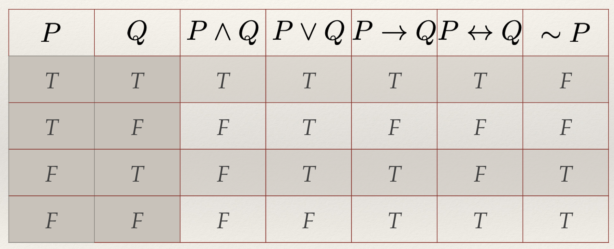

#### 命题公式

1. 原子命题也是命题公式。

2. 若A是命题公式，则~A也是命题公式。

3. 若A和B都是命题公式，则连接A和B后的命题也是命题公式。

4. 只有按1~3所得的公式才是命题公式。

## 谓词逻辑

### 谓词和个体

谓词逻辑将原子命题分解为 **谓词** 和 **个体** 两部分。

在“贝多芬是作曲家”中，“贝多芬”是个体，“是作曲家”是谓词；在“张三是李四的老师”这句话中，“张三”和“李四”是个体，“x是y的老师”是谓词。

一个谓词，一个个体称为 **一元谓词**；一个谓词，多个个体称为 **多元谓词**。

谓词的一般形式是：

$$
P(x_0, x_1, ..., x_n)
$$

P是谓词，括号内是个体。在一个谓词中，个体变元的取值范围称为 **个体域**。

### 谓词公式

谓词公式和命题公式的连接词一样：

$$
\sim, \vee, \wedge, \rightarrow, \leftrightarrow
$$

量词包含全称量词 $(\forall x)$ 和存在量词 $(\exists x)$。

谓词演算中，由单个谓词构成的不含任何连接词的公式，称为 **原子谓词公式** ，或简称原子。由原子谓词公式构成的称为 **合式公式** 。

一个谓词公式中，量词后面跟着的单个谓词或括起来的合式公式称为该谓词的 **量词辖域** 。辖域中与量词同名的变元称为 **约束变元** ，不受约束的称为 **自由变元** 。例如：

$$
(\forall x) (P(x) \rightarrow (\exists y)R(x, y))
$$

其中 $(\forall x)$ 的辖域是 $(P(x) \rightarrow (\exists y)R(x, y))$ ，辖域内的x是受 $(\forall x)$ 约束的变元；而 $(\exists y)$ 的辖域是 $R(x, y)$ ，其中y是受约束的变元。

#### 谓词公式的解释

给谓词P的所有个体赋值，取值来自个体域D，使P为T或F，则称为公式P在D上的一个解释。

例：设个体域 (D = {1, 2})，求公式 $A = (\forall x) (P(x) \rightarrow Q(f(x), b))$ 在D上的一个解释，并指出在此解释下公式A的真值。

解：首先设个体常量b及函数f(x)的指派值为

$$
b = 1, f(1) = 2, f(2) = 1
$$

对谓词指派的真值为

$$
P(1) = F, P(2) = T, Q(1, 1) = T, Q(2, 1) = F
$$

这里由于已指派b = 1，所以Q(1, 2)与Q(2, 2)不可能出现，故没有给他们指派真值。

上述指派是对A的一个解释，在此解释下，当x = 1时有

$$
P(1) = F, Q(f(1), 1) = Q(2, 1) = F
$$

所以，$P(1) \rightarrow Q(f(1), 1)$ 的真值为T。当x = 2时，

$$
{P(2) = T, Q(f(2), 1) = Q(1, 1) = T}
$$

所以，$P(2) \rightarrow Q(f(2), 1)$ 的真值为T。因为对于个体域(D = {1, 2})上的所有x均有A的真值为T，所以公式A在此解释下的下的真值为T。

谓词公式的真值都是针对某一解释而言的，同一公式在一种解释下为T，在另一种公式解释下可能为F。

#### 谓词公式的永真性和可满足性

谓词公式P在D上的任意解释真值为T，则称P在D上永真；谓词公式P在任意非空个体域的任意解释为T，则称P永真。

与之对应，在D上任意解释为F则称在D上永假；在任意个体域解释为F则称P永假。

如果至少存在一个解释使P为T，则称P是可满足的；不存在则称P是不可满足的，与永假相同。

#### 谓词公式的等价性与永真蕴含

P和Q在D上取值相等，则称P和Q在D上等价，若D是任意个体域，则称P和Q等价，记作 $P \Leftrightarrow Q$ 。

下面是一些常用等价式：

1. 交换律

$$
P \vee Q \Leftrightarrow Q \vee P
$$

$$
P \wedge Q \Leftrightarrow Q \wedge P
$$

2. 结合律

$$
(P \vee Q) \vee R \Leftrightarrow P \vee (Q \vee R)
$$

$$
(P \wedge Q) \wedge R \Leftrightarrow P \wedge (Q \wedge R)
$$

3. 分配律

$$
P \vee (Q \wedge R) \Leftrightarrow (P \vee Q) \wedge (P \vee R)
$$

$$
P \wedge (Q \vee R) \Leftrightarrow (P \wedge Q) \vee (P \wedge R)
$$

4. 德·摩根定律

$$
\sim (P \vee Q) \Leftrightarrow \sim P \wedge \sim Q
$$

$$
\sim (P \wedge Q) \Leftrightarrow \sim P \vee \sim Q
$$

5. 否定之否定律

$$
\sim (\sim P) \Leftrightarrow P
$$

6. 吸收律

$$
P \vee (P \wedge Q) \Leftrightarrow P
$$

$$
P \wedge (P \vee Q) \Leftrightarrow P
$$

7. 补余律

$$
P \vee \sim P \Leftrightarrow T
$$

$$
P \wedge \sim P \Leftrightarrow F
$$

8. 逆否定律

$$
P \rightarrow Q \Leftrightarrow \sim P \rightarrow \sim Q
$$

9. 连接词化归律

$$
P \rightarrow Q \Leftrightarrow \sim P \vee Q
$$

$$
P \leftrightarrow Q \Leftrightarrow (P \rightarrow Q) \wedge (Q \rightarrow P)
$$

$$
P \leftrightarrow Q \Leftrightarrow (P \wedge Q) \vee (\sim P \wedge \sim Q)
$$

10. 量词转换律

$$
\sim (\exists x) P \Leftrightarrow (\forall x) (\sim P)
$$

$$
\sim (\forall x) P \Leftrightarrow (\exists x) (\sim P)
$$

11. 量词分配律

$$
(\forall x) (P \wedge Q) \Leftrightarrow (\forall x) P \wedge (\forall x) Q
$$

$$
(\exists x) (P \vee Q) \Leftrightarrow (\exists x) P \vee (\exists x) Q
$$

如果 $P \rightarrow Q$ 永真，则称P永真蕴含Q，且称Q为P的逻辑结论，P为Q的前提，记作 $P \Rightarrow Q$ 。

下面是一些常用永真蕴含式：

1. 化简式

$$
P \wedge Q \Rightarrow P, P \wedge Q \Rightarrow Q
$$

2. 附加式

$$
P \Rightarrow P \vee Q, Q \Rightarrow P \vee Q
$$

3. 析取三段论

$$
\sim P, P \vee Q \Rightarrow Q
$$

4. 假言推理

$$
P, P \rightarrow Q \Rightarrow Q
$$

5. 拒取式

$$
\sim Q, P \rightarrow Q \Rightarrow \sim P
$$

6. 假言三段论

$$
P \rightarrow Q, Q \rightarrow R \Rightarrow P \rightarrow R
$$

7. 二难推论

$$
P \vee Q, P \rightarrow R, Q \rightarrow R \Rightarrow R
$$

8. 全称固化

$$
(\forall x) P(x) \Rightarrow P(y), y \in D
$$

9. 存在固化

$$
(\exists x) P(x) \Rightarrow P(y), ((y \in D) \wedge (P(y) = T))
$$

这些永真蕴含式又称为推理规则，除此外还有以下规则：

1. P规则（前提引入）：在推理的任何步骤上都可以引入前提；

2. T规则（过程引入）：推理时如果前面的步骤有永真蕴含式S，可以把S引入推理过程；

3. CP规则（过程推导）：如果从前提集合和R中推出S，则可以从前提集合推出 $R \rightarrow S$ ；

4. 反证法：$P \Rightarrow Q$ ，当且仅当 $P \wedge \sim Q \Leftrightarrow F$ 。

#### 置换与合一

置换是形如 $\{t_1/x_1, t_2/x_2, ..., t_n/x_n\}$ 的有限集， $t_i$ 是项（常量、变量、函数）， $x_i$ 是变量。不含任何元素的置换称为空置换，用 $\varepsilon$ 表示。

置换可以用于某个谓词公式或某个项，例如：

如果

$$
\theta = \{c/x, f(d)/y, t/z\}, P = Q(x, y, z), u = g(x, y)
$$

那么

$$
P\theta = Q(c, f(d), t), u\theta = g(c, f(d))
$$

置换乘法将两个置换合为一个置换，例如：

$$
\theta = \{f(y)/x, z/y\}, \lambda = \{a/x, b/y, y/z\}
$$

则

$$
\theta \cdot \lambda = \{f(y) \cdot \lambda/x, z \cdot \lambda/y, a/x, b/y, y/z\} 
$$

即 $\theta \cdot \lambda = \{f(b)/x, y/y, a/x, b/y, y/z\}$

先删除a/x和b/y，再删除y/y，得：

$$
\theta \cdot \lambda = \{f(b)/x, y/z\}
$$

---

置换结合律：

$$
(\theta \cdot \lambda) \cdot \mu = \theta \cdot (\lambda \cdot \mu)
$$

除了空置换，置换的交换律不成立，即只有 $\varepsilon \cdot \theta = \theta \cdot \varepsilon$ 。

---

设有公式集 $\{E_1, E_2, \cdots, E_n\}$ 和置换 $\theta$ ，使

$$
E_1\theta = E_2\theta = \cdots = E_n\theta
$$

便称 $E_1, E_2, \cdots, E_n$ 是可合一的，且 $\theta$ 称为 **合一置换** 。

若 $E_1, E_2, \cdots, E_n$ 有合一置换 $\sigma$ ，且对 $E_1, E_2, \cdots, E_n$ 的任意置换 $\theta$ 都存在一个置换 $\lambda$ ，使 $\theta = \sigma \cdot \lambda$ ，则称 $\sigma$ 是 $E_1, E_2, \cdots, E_n$ 的 **最一般合一置换** ，记为 mgu。最一般合一置换并不是唯一的。

##### 最一般合一置换的求法

在对两个谓词公式中的项从左到右进行比较时，那些不相同的项构成的集合称为不一致集，例如：

$$
E_1: P(x, y, z)
$$

$$
E_2: P(x, f(a), g(b))
$$

从左到右逐个比较，发现两个不一致集：

$$
D_1 = \{y, f(a)\}, D_2 = \{z, g(b)\}
$$

---

下面是求公式 $\{E_1, E_2\}$ 的最一般合一置换的方法：

1. 令 $W = \{E_1, E_2\}$ 。

2. 令 $k=0, W_k = W, \sigma_{k} = \varepsilon;$ $\varepsilon$ 是空置换，表示不作置换。

3. 如果 $W_k$ 只有一个表达式，则算法停止， $\sigma_{k}$ 就是所要求的mgu。

4.  找出 $W_k$ 的不一致集 $D_k$ 。

5. 若 $D_k$ 中存在元素 $x_k$ 和 $t_k$ ，其中 $x_k$ 是变元， $t_k$ 是项，且 $x_k$ 不在 $t_k$ 中出现，则置：

$$
\sigma_{k+1} = \sigma_{k} \cdot \{t_k/x_k\}; W_{k+1} = W_k \{t_k/x_k\}; k = k + 1
$$

6. 算法终止，W的mgu不存在。

**示例**：设 $E_1 = P(a, v, f(g(y))), E_2 = P(z, f(a), f(u))$ ，求 $E_1$ 和 $E_2$ 的mgu。

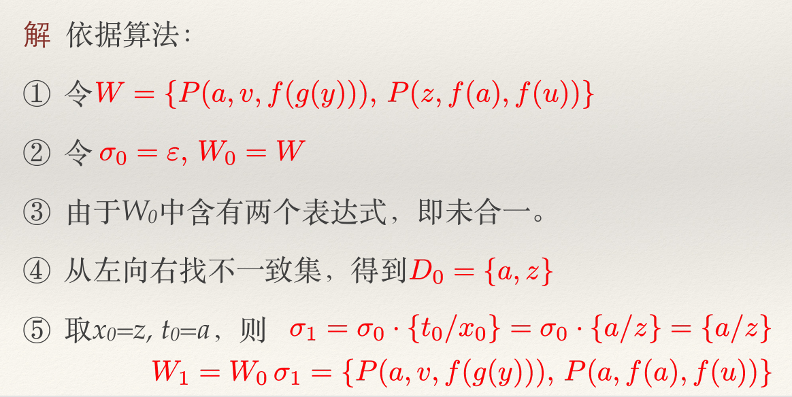

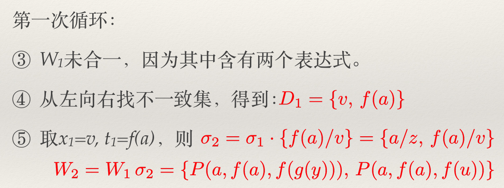

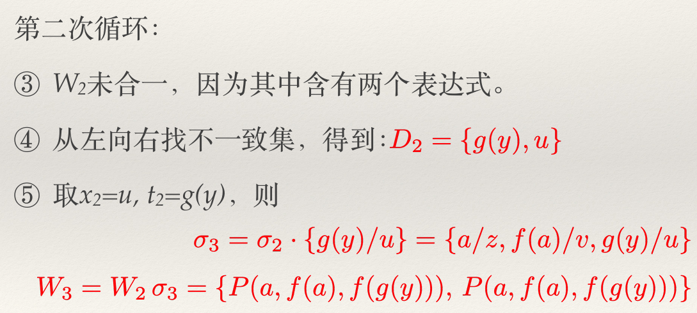

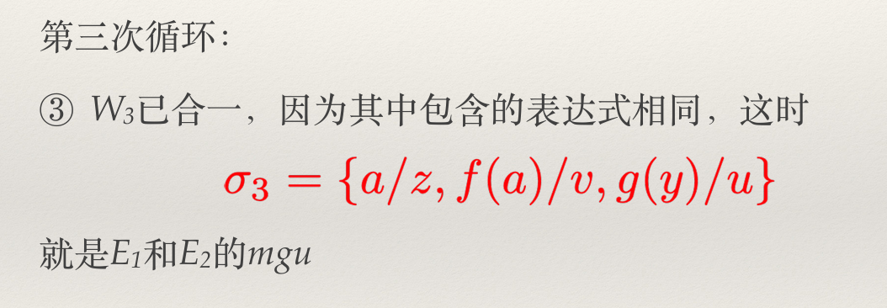

## 自然演绎推理方法

自然演绎推理就是用永真蕴含式等推理规则进行推理。

自然演绎推理时一定要注意避免肯定后件的错误和否定前件的错误。肯定后件的错误是指在 $P \rightarrow Q$ 中，认为Q正确P就一定正确；否定前件的错误是认为P错误Q就一定错误。

**示例1**

设已知如下事实：

$$
R, S, R \rightarrow T, S \wedge T \rightarrow P, P \rightarrow Q
$$

求证：Q为真。

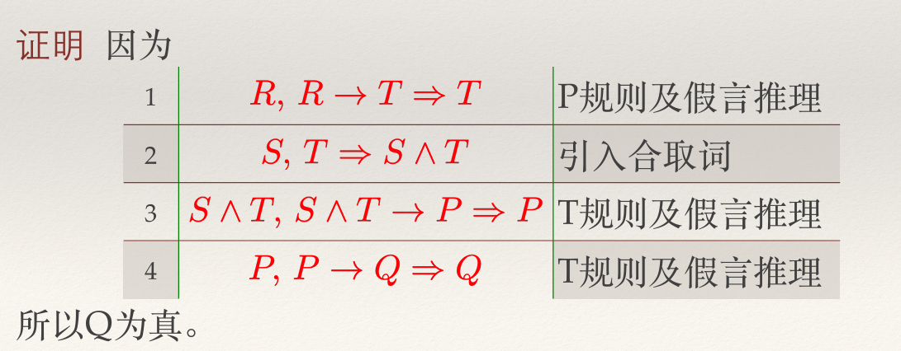

**示例2**

设已知如下事实：

1. 只要是需要室外活动的课，郝亮都喜欢。

2. 所有的公共体育课都是需要室外活动的课。

3. 篮球是一门公共体育课。

求证：郝亮喜欢篮球这门课。

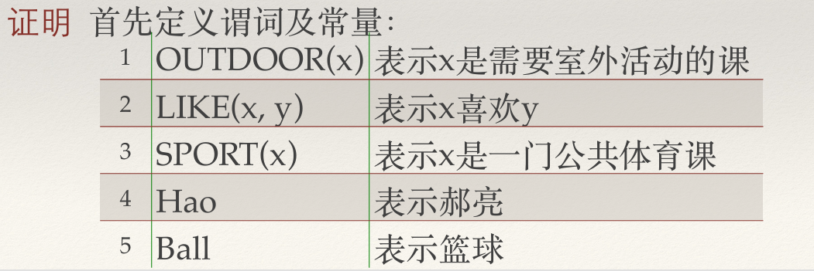

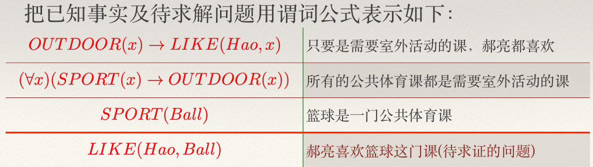

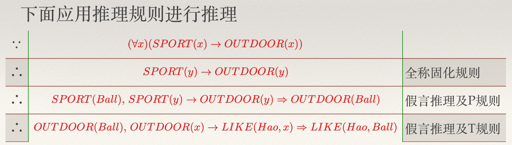

## 归结推理方法

### 谓词公式与子句集

对谓词演算的研究可以划归为对范式的研究。

#### 范式

**1. 前束型范式**

量词集中在公式最前面，辖域中没有 $\rightarrow$ 和 $\leftrightarrow$ 且为合取范式，例如：

$$
(\forall x)(\exists y)(\forall z)(P(x) \wedge F(y, z) \wedge Q(y, z))
$$

前面的所有量词组成首标，看起来杂乱无章。

**2. Skolem范式** 

消去前束范式中的存在量词后即为Skolem范式，或称Skolem标准型。例如，用 f(x) 代替上面前束型范式的y，即可得到Skolem范式：

$$
(\forall x)(\forall z)(P(x) \wedge F(f(x), z) \wedge Q(f(x), z))
$$

**将谓词公式转化为Skolem标准型**

例1：将如下谓词公式化为Skolem标准型。

$$
G = (\forall x)((\forall y)P(x, y) \rightarrow \sim (\forall y)(Q(x, y) \rightarrow R(x, y)))
$$

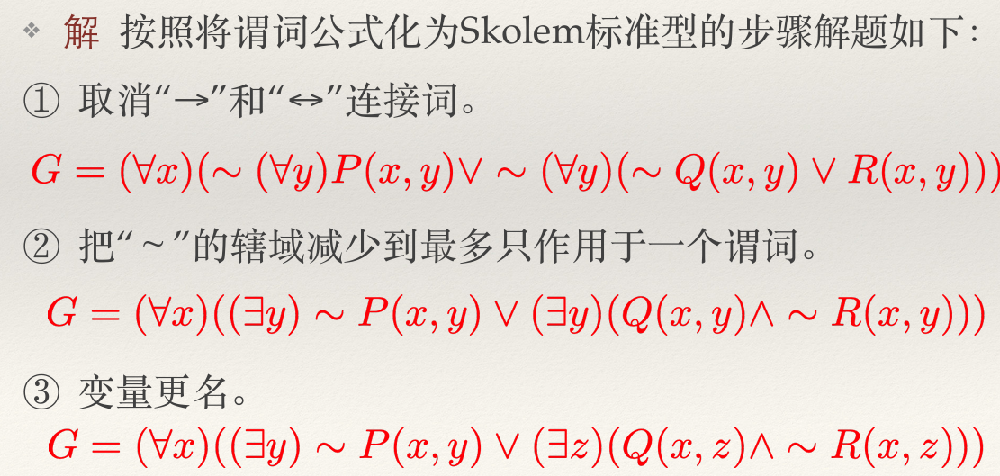

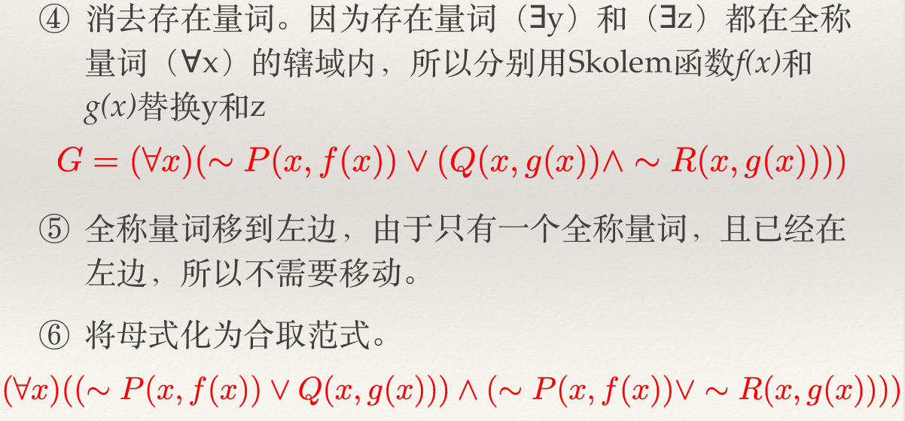

#### 子句与子句集

不含有连接词的谓词公式叫原子公式，简称原子，也叫 **文字**，例如： $P(x), \sim P(x, c), R(x, y)$ 。

子句是由文字组成的析取式，例如： $P(x) \vee \sim Q(x, y), \sim P(x, c) \vee R(x, y, f(x))$ 。

不包含任何文字的子句称为 **空子句** ，记为 $NIL$ 。空子句永假。

子句构成的集合称为子句集，例如将上面的谓词公式G消去全称量词后用逗号代替合取符号可得到其子句集S：

$$
S = \{ \sim P(x, f(x)) \vee Q(x, g(x)), \sim P(x, f(x)) \vee R(x, g(x)) \}
$$

谓词公式和其子句集不等价，但在 **不可满足的意义上是一致的** ，可以将谓词公式的不可满足性问题转化为其子句集的不可满足性问题。

### Herbrand理论

Herbrand构造了一个特殊域Herbrand域（H域），只要证明谓词公式在该域上不可满足，就能证明谓词公式在所有域上都不可满足（永假）。

#### H域

设谓词公式G的子句集为S，按照下述方法构造的个体变元域 $H_{\infty}$ 称为公式G或子句集S的Herbrand域，简称 **H域** 。

1、令 $H_0$ 是S中所出现的常量的集合。若无常量出现，则任取常量 $a \in D$ ，规定 $H_0 = \{ a \}$

2、令

$$
H_{i+1} = H_i \cup \{ S中所有形如f(t_1, \cdots, t_n)的元素 \}
$$

其中 f() 是 G 中任一函数符号，t 是 $H_i$ 中的元素，i = 0, 1, 2, ..., n。

**示例**

例1：求子句集 $S = \{ T(x) \wedge Q(z), R(f(y)) \}$ 的H域。

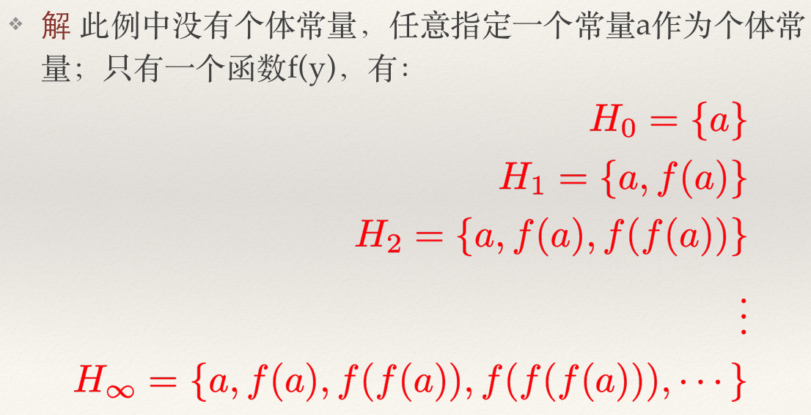

例2：求子句集 $S = \{ \sim R(z), P(x) \vee \sim Q(y) \}$ 的H域。

解: $H_0 = \{ a \}$, $H_1 = H_0$, $H_2 = H_1$, ..., $H_{\infty} = \{ a \}$

---

### 归结原理

归结原理的基本思想：检查⼦句集S中是否有空⼦句，若有，则表明S是不可满⾜的；若没有，就在⼦句集中选择合适的⼦句对其进⾏归结推理，如果能推出 **空⼦句** ，就说明⼦句集S是 **不可满⾜** 的。

#### 命题逻辑中的归结原理

设有两个子句：

$$
C_1 = P \vee C'_1
$$

$$
C_2 = \sim P \vee C'_2
$$

消去互补文字后得：

$$
C_{12} = C'_1 \vee C'_2
$$

$C_{12}$ 就是 $C_1$ 和 $C_2$ 两个子句的归结式，消去互补对的过程就是归结。没有互补对的两个子句没有归结式。

由此可得归结推理规则: $C_1 \wedge C_2 \Rightarrow C_{12}$

**归结推理过程**

例：证明子句集 $S = \{ \sim P \vee Q, \sim Q, P \}$ 是不可满足的的。

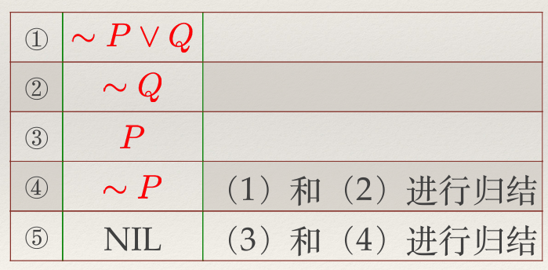

#### 一阶谓词逻辑中的归结原理

一阶谓词逻辑要先使用合一置换后再进行归结。例如：

$$
C_1 = P(x) \vee Q(x)
$$

$$
C_2 = \sim P(a) \vee T(z)
$$

作合一置换 $\sigma = \{a/x\}$ ，是最一般合一置换，得到：

$$
C_1 \sigma = P(a) \vee Q(a)
$$

$$
C_2 \sigma = \sim P(a) \vee T(z)
$$

归结后得到: $Q(a) \vee T(z)$

**定义：** 设 $C_1$ 和 $C_2$ 是两个没有相同变元的子句， $L_1$ 和 $L_2$ 分别是 $C_1$ 和 $C_2$ 的文字，如果 $L_1$ 和 $\sim L_2$ 有 mgu $\sigma$ ，则把

$$
C_{12} = (C_1 \sigma - \{ L_1 \sigma \}) \cup (C_2 \sigma - \{ L_2 \sigma \})
$$

称为子句 $C_1$ 和 $C_2$ 的一个二元归结式。

**示例**

例1：设 $C_1 = \sim P(a) \vee Q(x) \vee R(x), C_2 = P(y) \vee \sim Q(b)$ ，求其二元归结式。

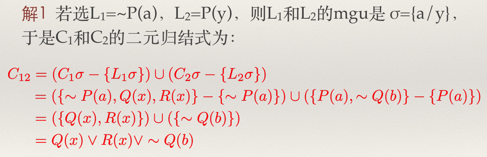

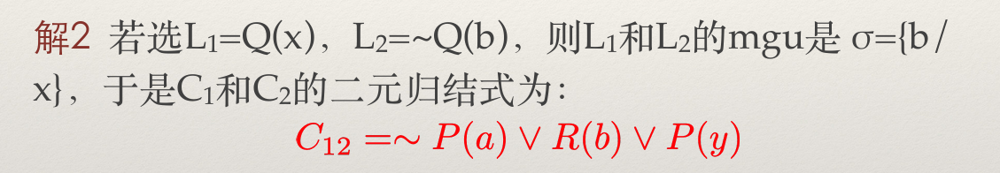

例2：设 $C_1 = P(x) \vee \sim Q(x), C_2 = Q(g(x))$ ，求其二元归结式。

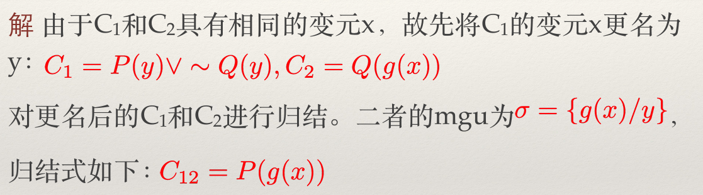

例3：设 $C_1 = \sim Q(f(g(a))) \vee R(b), C_2 = Q(x) \vee Q(f(y)) \vee R(g(y))$ ，求其归结式。

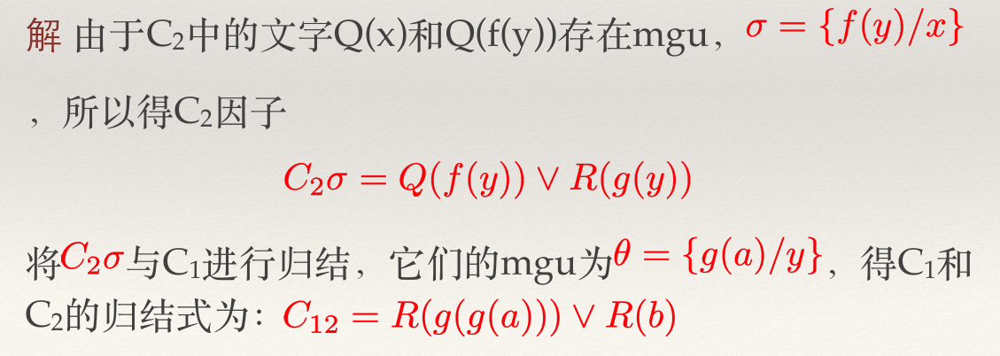

> 对于⼀阶谓词逻辑，从不可满⾜的意义上说，归结原理是完备的。

#### 利用归结原理进行定理证明

若要证明 $A_1 \wedge A_2 \wedge \cdots \wedge A_n \rightarrow B$ 为真，只需使用归结原理证明如下谓词公式的子句集为永假即可：

$$
(A_1 \wedge A_2 \wedge \cdots \wedge A_n) \wedge \sim B
$$

**示例**

例1：已知

$$
A: (\forall x) ((\exists y) (P(x, y) \wedge Q(y))\rightarrow (\exists y) (R(y) \wedge T(x, y)))
$$

$$
B: \sim (\exists x)R(x) \rightarrow (\forall x)(\forall y)(P(x, y) \rightarrow \sim Q(y))
$$

求证B是A的逻辑结论。

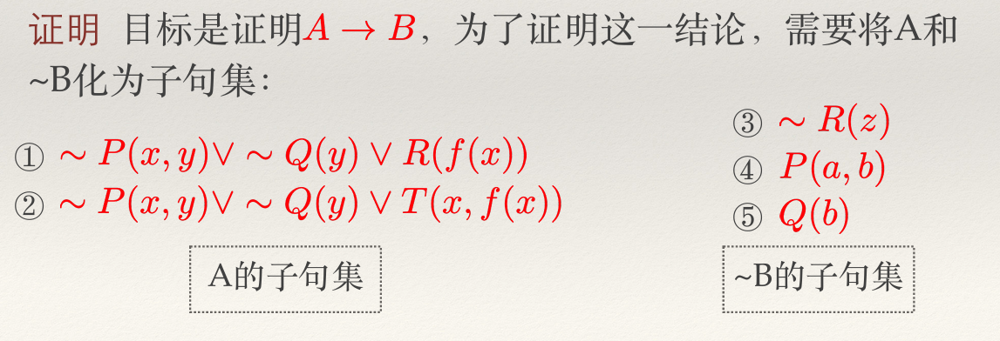

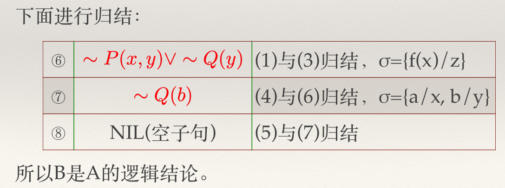

#### 利用归结原理进行问题求解

例：某⼈被盗，公安派出所派出5个侦察员去调查。 研究案情时，侦察员A说：“赵与钱中⾄少有⼀⼈作案”；侦察员B说：“钱与孙中⾄少有⼀⼈作案”；侦察员C说：“孙与李中⾄少有⼀⼈作案”；侦察员D说：“赵与孙中⾄少有⼀⼈与此案⽆关”；侦察员E说：“钱与李中⾄少有⼀⼈与此案⽆关”。如果这5个侦察员的话都是可信的，试问谁是盗窃犯呢？

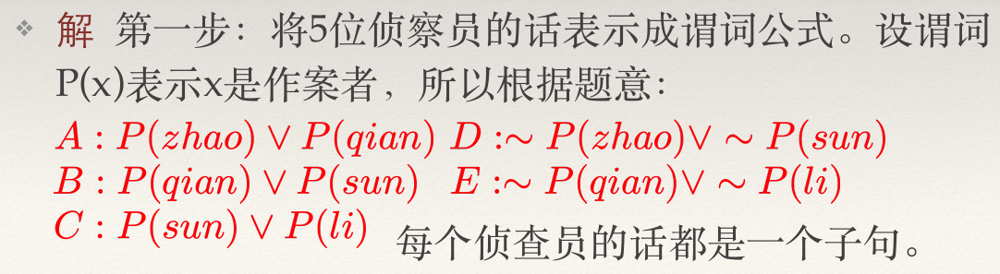

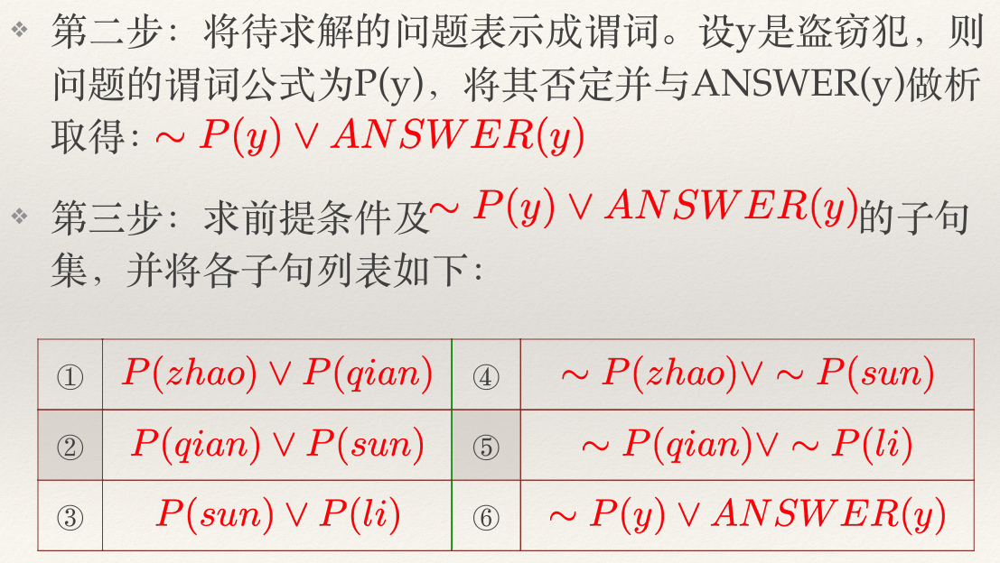

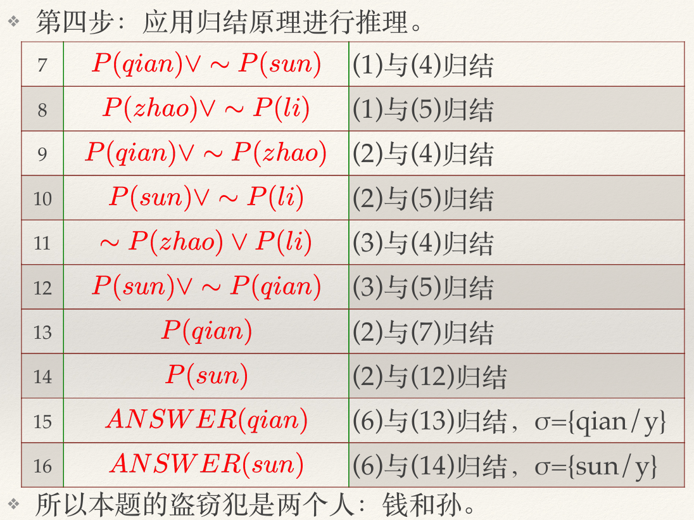

