# 搜索策略

搜索分为盲目搜索和启发式搜索。

盲⽬搜索又称⽆信息搜索，在搜索过程中只能按照实现规定的规则，没有中间信息辅助。

启发式搜索又称有信息搜索，在搜索过程中可以根据中间信息调整搜索方向。

## 盲目搜索

将问题的当前状态作为 **初始状态** ，对初始状态使用 **算符** 生成一组后继状态，如果后继状态中有 **目标状态** 则停止，并将从初始状态到目标状态的一系列算符作为问题的解，否则从后继状态再选择初始状态进行操作，直到出现目标状态或无可用的算符。

状态空间搜索算法将一个已生成后继节点的节点称为 **已扩展结点** ， 放在 CLOSED 表中；未生成后继节点的称为 **未扩展结点**，放在 OPEN 表中。

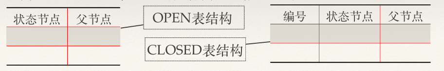

### 状态空间搜索的一般算法

1. 建⽴⼀个只含有初始节点S0的搜索图G，把S0放⼊OPEN表中。
2. 建⽴CLOSED表，且置为空表。
3. 判断OPEN表是否为空表，若为空，则问题⽆解，退出。
4. 选择OPEN表中的第⼀个节点，把它从OPEN表移出，并放⼊CLOSED表中，将此节点记为节点n。
5. 考察节点n是否为⽬标节点，若是，则问题有解，并成功退出。问题的解即可从图G中沿着指针从n到S0的这条路径得到。
6. 扩展节点n⽣成⼀组不是n的祖先的后继节点，并将它们记作集合M，将M中的这些节点作为n的后继节点加⼊图G中。
7. 对那些未曾在G中出现过的（即未曾在OPEN表上或CLOSED表上出现过的）M中的节点，设置⼀个指向⽗节点（即节点n）的指针，并把这些节点加⼊OPEN表中；对于已在G中出现过的M中的那些节点，确定是否需要修改指向⽗节点（n节点）的指针；对于那些先前已在G中出现并且已在CLOSED表中的那些M中的节点，确定是否需要修改通向它们后继节点的指针。
8. 按某⼀任意⽅式或按某种策略重排OPEN表中节点的顺序。
9. 转第(3)步。

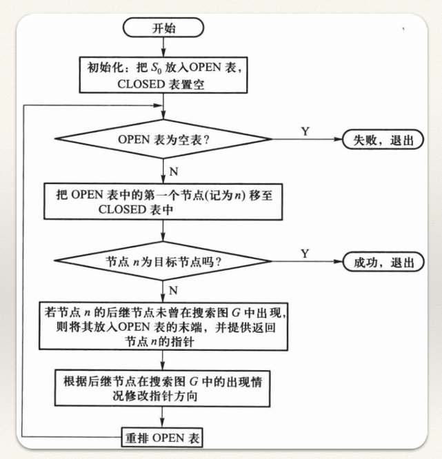

### 宽度优先搜索策略

宽度优先搜索(Breadth-First Search, BFS)又称为⼴度优先搜索，是⼀种盲⽬搜索策略。

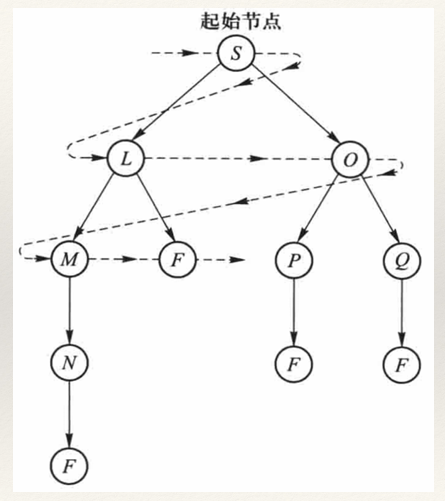

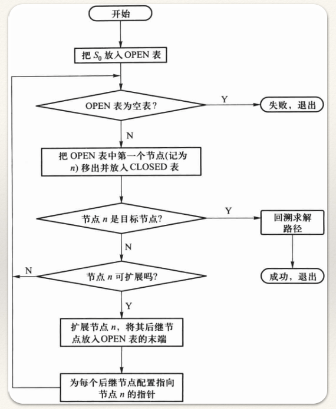

#### 八数码问题

设在3×3的⼀个⽅格模盘上，摆放着⼋个数码1、2、3、4、5、6、7、8，有⼀个⽅格是空格，其可能的初始状态如图（a）所⽰，要求对空格执⾏下列的操作/算符：

空格左移，空格上移，空格右移，空格下移

使⼋个数据最终按图（b）的格式摆放，图（b）称为⽬标状态Sg。要求寻找从初始状态到⽬标状态的路径。

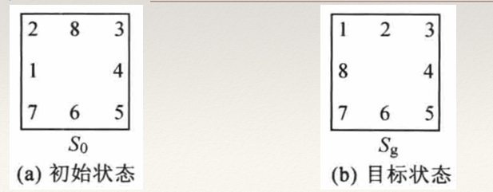

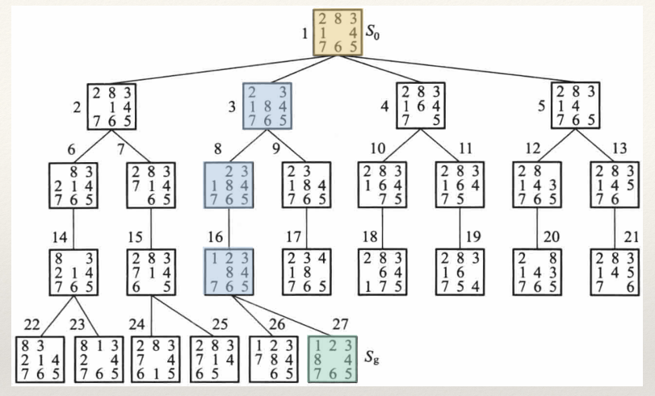

宽度优先搜索的盲⽬性较⼤，当⽬标节点距离初始节点较远时，将会产⽣⼤量的⽆⽤节点， **搜索效率低** ；但是⽤宽度优先搜索总可以找到它的解，⽽且是搜索树中，从初始节点到⽬标节点的路径最短的解，也就是说，宽度优先搜索策略是 **完备** 的。

### 深度优先搜索策略

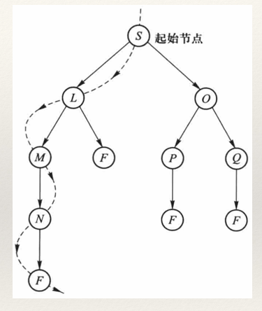

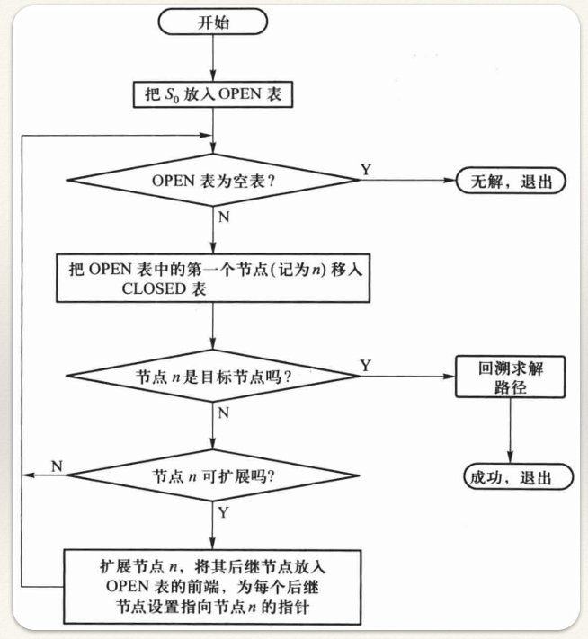

#### 八数码问题

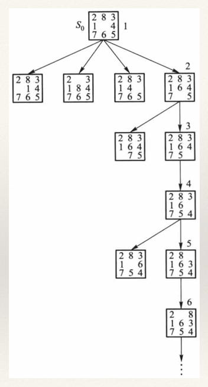

为了防⽌在⽆解的分⽀上进⾏⽆效的搜索，对搜索的分⽀深度进⾏⼀定的限定，这就是 **有界深度优先搜索** (Bounded Depth-First Search)。

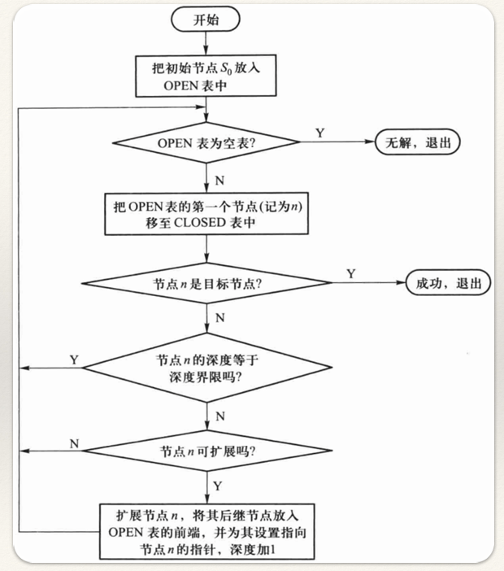

设⼋数码难题的初始状态及⽬标状态分别如图（a）和图（b）所⽰，⽤有界深度优先搜索策略（深度界限 $d_m$ =5）求解问题。

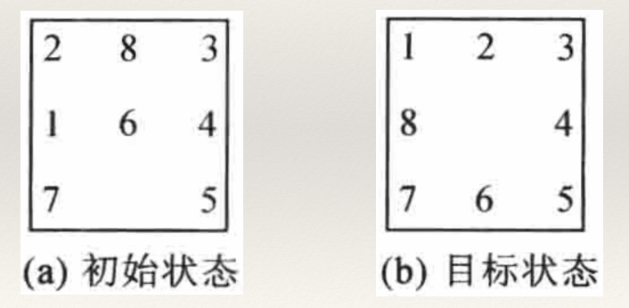

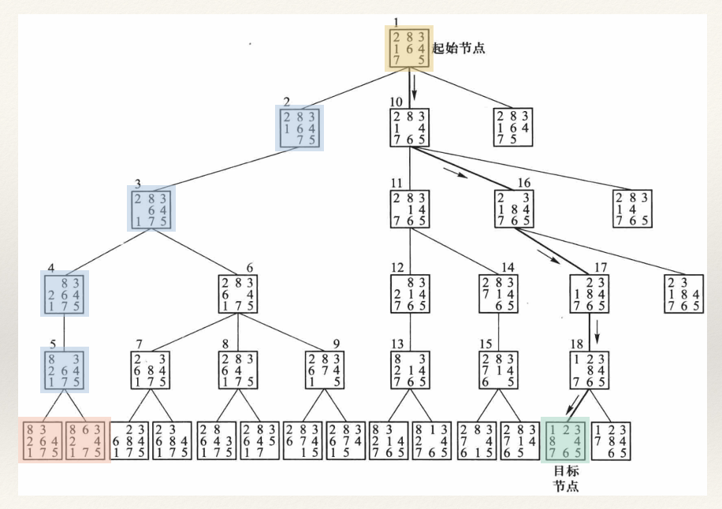

有界深度优先搜索策略是 **不完备** 的。

### 代价树

#### 宽度优先搜索

把有向边上标有代价的搜索树称为代价搜索树，简称代价树。

代价树中，把从节点 i 到其后继节点 j 的连线的代价记为 C(i, j)，⽽把从初始节点 S0 到任意节点 x 的路径代价记为 g(x)，则 g(j)=g(i)+C(i, j)。

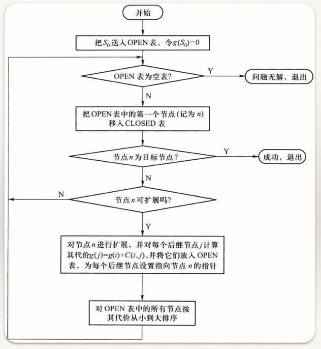

##### 推销员旅行问题

假设A、B、C、D和E是五个城市，推销员从城市A出发，到达城市E，⾛怎样的路线费⽤最省？五个城市间的交通图及每两个城市间的旅⾏费⽤如右图所⽰，图中的数字即是旅⾏费⽤。

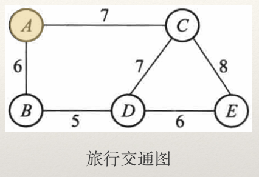

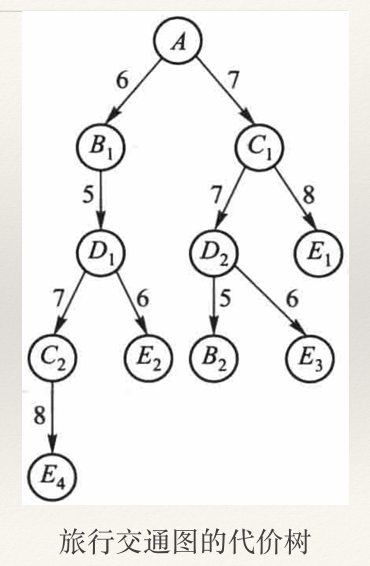

从城市A向城市E旅⾏，费⽤最省的路线为：A $\rightarrow$ C $\rightarrow$ E

#### 深度优先搜索

深度优先搜索法则是从刚刚扩展的节点之后继节点中选择⼀个代价最⼩的节点移⼊CLOSED表，并进⾏扩展或判断。

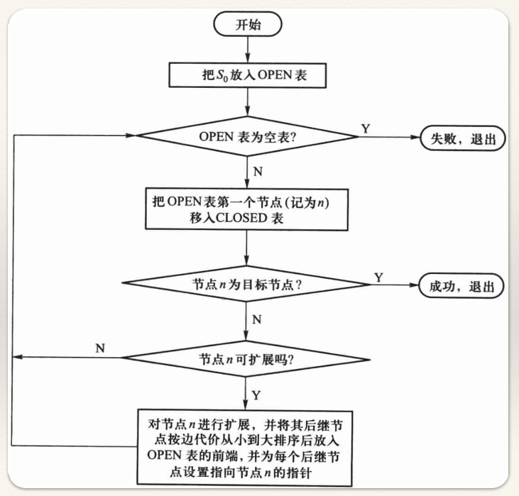

## 启发式搜索

样可⽤于指导搜索过程且与具体问题求解有关的控制性信息称为 **启发信息** 。

通常可以构造⼀个函数来表⽰节点的“希望”程度，称这种函数为 **估价函数** 。估价函数的任务就是估计待搜索节点的重要程度，给它们排定次序。

把估价函数f(x)定义为从初始节点经过节点x到达⽬标节点的最⼩代价路径的代价估计值。它的⼀般形式为：

$$
f(x) = g(x) + h(x)
$$

其中：

- g(x)为初始节点S0到节点x已实际付出的代价；

- h(x)是从节点x到⽬标节点Sg的最优路径的估计代价。

搜索的启发信息主要由h(x)来体现，故把h(x)称作启发函数。

⼀般地，在f(x)中，

- g(x)的⽐重越⼤，搜索⽅式就越倾向于⼴度优先搜索⽅式；

- h(x)的⽐重越⼤，越倾向于深度优先搜索⽅式。

### 局部最佳优先搜索

当对某⼀个节点扩展之后，对它的每⼀个后继节点计算估价函数f(x)的值，并在这些后继节点的范围内，选择⼀个f(x)的值最⼩的节点，作为下⼀个要考察的节点。

### 全局最佳优先搜索

它的思想类似于宽度优先搜索，所不同的是，在确定下⼀个扩展节点时，以与问题特性密切相关的估价函数f(x)作为标准，不过这种⽅法是在OPEN表中的全部节点中选择⼀个估价函数值f(x)最⼩的节点，作为下⼀个被考察的节点。

#### 八数码问题

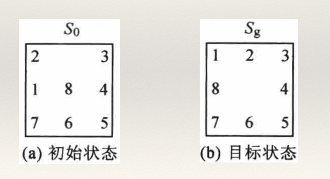

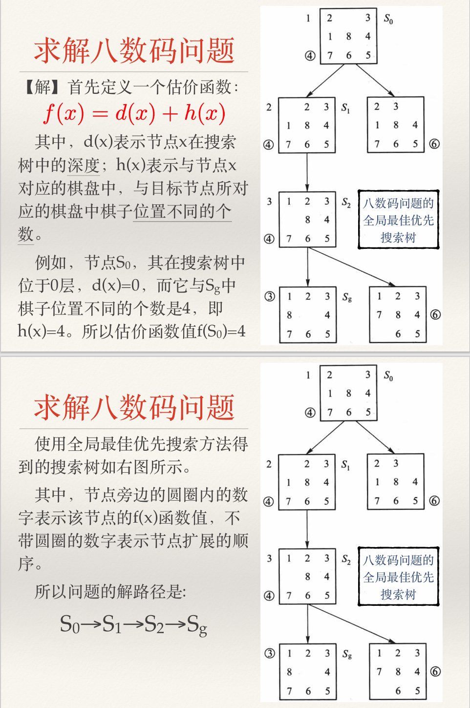

### A*算法

A* 算法中， $f(x) = g(x) + h(x)$ 是对 $f^{*}(x) = g^{*}(x) + h^{*}(x)$ 的一种近似或估计。

$f^{*}(x)$ 表⽰从节点S0到节点x的⼀条最佳路径的实际代价加上从节点x到⽬标节点的⼀条最佳路径的代价之和。

$g^{*}(x)$ 从节点S0到节点x之间最⼩代价路径的实际代价。

$h^{*}(x)$ 从x节点到⽬标节点的最⼩代价路径上的代价。

---

g(x) 是 g*(x)的估计，是⽐较容易求得的，它就是从初始节点S0到节点x的路径代价，可以通过由节点x到节点S0回溯时，把所遇到的各段弧线的代价加起来⽽得到，显然恒有 g(x)≥g*(x)。

h(x) 是对 h*(x) 的估计，它依赖于有关问题领域的启发信息，它就是我们上述提到的启发函数，其具体形式要根据问题的特性来进⾏构造。

在 A* 算法中要求启发函数 h(x)是 h*(x) 的下界，即对所有的x均有 $h(x) \leq h^{*}(x)$ ，能保证A*算法找到最优解。

如果对启发函数h(x)，不限制条件 $h(x) \leq h^{*}(x)$ ，则这种状态空间图的搜索算法称为A算法。

