# 不确定推理方法

## 可信度方法

可信度，也可以称为确定性因子，是对某一事物或现象为真的相信程度。

### 知识不确定性的表示

知识以产生式规则表示，知识的不确定性则以可信度CF(H, E)表示，一般形式为(IF E THEN H (CF(H, E)))。其中：

1. E 是前提条件或证据；

2. H 是结论；

3. CF(H, E) 是该条知识的可信度。

在专家系统 MYCIN 中，CF(H, E) 被定义为 

$$
CF(H, E) = MB(H, E) - MD(H, E)
$$

其中，MB(Measure Belief) 表示信任增长度，表示当有证据匹配E时，结论H为真的信任增长度；同理，MD(Measure Disbelief) 称为不信任增长度。

$$
MB(H, E) = 
\begin{cases}
1, & P(H) = 1 \\ \\
\displaystyle \frac{max \{P(H | E), P(H) \} - P(H)}{1 - P(H)}, & P(H) \neq 1
\end{cases}
$$

$$
MD(H, E) = 
\begin{cases}
1, & P(H) = 0 \\ \\
\displaystyle \frac{min \{P(H | E), P(H) \} - P(H)}{- P(H)}, & P(H) \neq 0
\end{cases}
$$

MB(H, E) 与 MD(H, E) 是互斥的，值域都为 [0, 1]。当 MB(H, E) > 0 时，MD(H, E) = 0；当 MD(H, E) > 0 时，MB(H, E) = 0。

由 MB(H, E) 和 MD(H, E) 得到 CF(H, E):

$$
CF(H, E) = 
\begin{cases}
\displaystyle MB(H, E) - 0 = \frac{P(H | E) - P(H)}{1 - P(H)} & P(H | E) > P(H) \\ \\
0 & P(H | E) = P(H) \\ \\
\displaystyle 0 - MD(H, E) = \frac{P(H | E) - P(H)}{P(H)} & P(H | E) < P(H)
\end{cases}
$$

CF(H, E)的取值范围是 [-1, 1]，当 CF(H, E) > 0 时，越接近 1，表明 E 越支持 H 为真；当 CF(H, E) < 0 时，越接近 -1，表明 E 越支持 H 为假；当 CF(H, E) = 0 时，表明 E 和 H 没有关系。

### 证据不确定性的表示

证据的不确定性使用 CF(E) 表示，值域为 [-1, 1]，含义和知识的不确定性表示一样。

如果证据有多个，那么合取关系的证据取最小的证据可信度，析取关系的证据取最大的证据可信度，即对于

$$
E = E_1 \wedge E_2 \wedge \cdots \wedge E_n
$$

可信度为

$$
CF(E) = min\{ CF(E_1), \ CF(E_2), \ \cdots, \ CF(E_n) \}
$$

对于

$$
E = E_1 \vee E_2 \vee \cdots \vee E_n
$$

可信度为

$$
CF(E) = max\{ CF(E_1), \ CF(E_2), \ \cdots, \ CF(E_n) \}
$$

### 不确定性的推理计算

**1. 只有单条知识支持结论，计算结论可信度**

已知知识 

$$
IF \ \ E \ \ THEN \ \ H
$$

则

$$
CF(H) = CF(H, E) \times max\{ 0, CF(E) \}
$$

**2. 多条知识支持同一结论， 计算结论可信度**

多条知识的综合可以通过两两合成来实现，下面介绍两条知识的情况。

已知

$$
IF \ \ \ E_1 \ \ \ THEN \ \ \ H \ \ \  (CF(H, E_1))
$$

$$
IF \ \ \ E_2 \ \ \ THEN \ \ \ H \ \ \  (CF(H, E_2))
$$

CF(H) 可分两步算出：

1、计算单个知识可信度

$$
CF_1(H) = CF(H, E_1) \times max\{ 0, CF(E_1) \}
$$

$$
CF_2(H) = CF(H, E_2) \times max\{ 0, CF(E_2) \}
$$

2、用如下公式求出综合影响

$$
CF_{1, 2} = 
\begin{cases}
CF_1(H) + CF_2(H) - CF_1(H) \times CF_2(H) & CF_1(H) \geq 0, \ CF_2(H) \geq 0 \\ \\
CF_1(H) + CF_2(H) + CF_1(H) \times CF_2(H) & CF_1(H) < 0, \ CF_2(H) < 0 \\ \\
\displaystyle \frac{CF_1(H) + CF_2(H)}{1 - min(|CF_1(H)|, \ |CF_2(H|))} & CF_1(H) 和 CF_2(H)异号
\end{cases}
$$

**3. 已知结论原始可信度，更新结论可信度**

已知规则 (IF E THEN H (CF(H, E))) 及 CF(H)，求 CF(H | E)。即在加入证据 E 后求 H 在新条件下的可信度。

分三种情况讨论：

1、CF(E) = 1 时，即证据肯定出现时，

$$
CF(H | E) = 
\begin{cases}
CF(H) + CF(H, E) - CF(H, E) \times CF(H) & CF(H) \geq 0, \ CF(H, E) \geq 0 \\ \\
CF(H) + CF(H, E) + CF(H, E) \times CF(H) & CF(H) < 0, \ CF(H, E) < 0 \\ \\
\displaystyle \frac{CF(H, E) + CF(H)}{1 - min(|CF(H)|, |CF(H, E)|)} & CF(H) 与 CF(H, E) 异号
\end{cases}
$$

2、当 0 < CF(E) < 1 时，

$$
CF(H | E) = 
\begin{cases}
CF(H) + CF(H, E) \times CF(E) - CF(H, E) \times CF(E) \times CF(H) & CF(H) \geq 0, \ CF(H, E) \geq 0 \\ \\
CF(H) + CF(H, E) \times CF(E) + CF(H, E) \times CF(E) \times CF(H) & CF(H) < 0, \ CF(H, E) < 0 \\ \\
\displaystyle \frac{CF(H, E) \times CF(E) + CF(H)}{1 - min(|CF(H)|, |CF(H, E) \times CF(E)|)} & CF(H) 与 CF(H, E) 异号
\end{cases}
$$

3、当 CF(E) $\leq$ 0 时，说明条件中不加入证据，规则不可使用，对 H 可信度无影响。

#### 可信度方法举例

**1. 多条知识下，合成法求结论可信度**

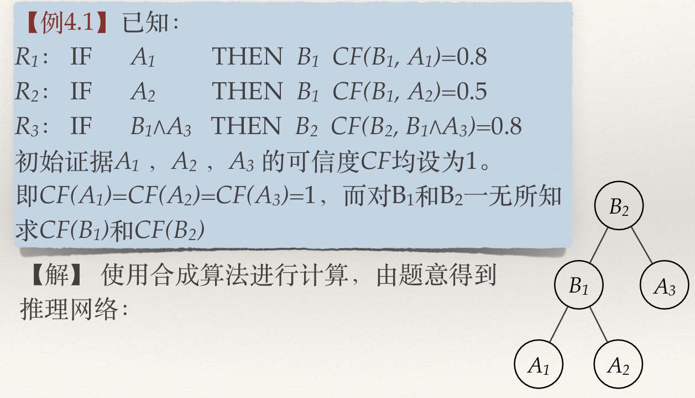

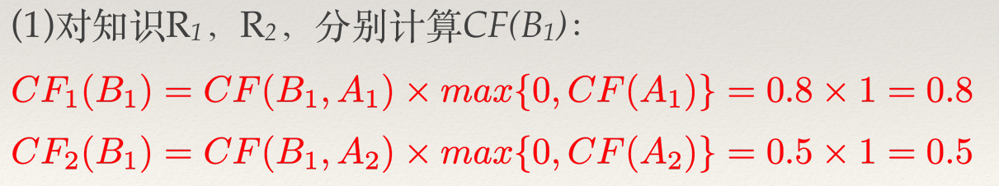

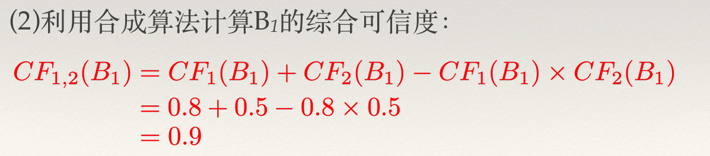

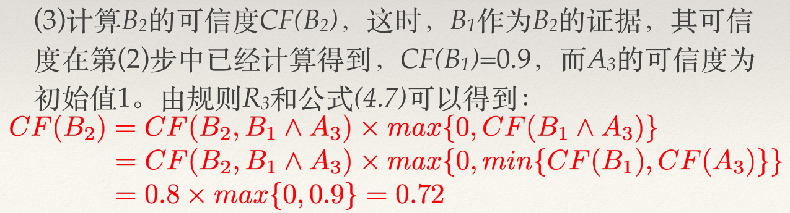

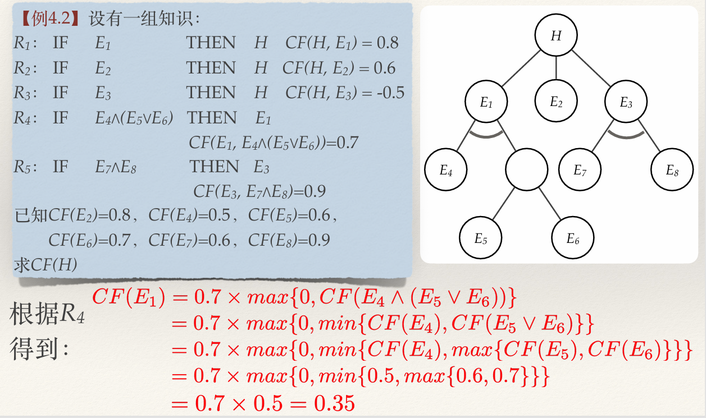

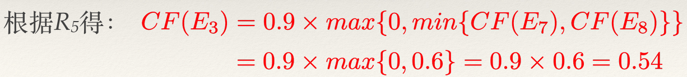

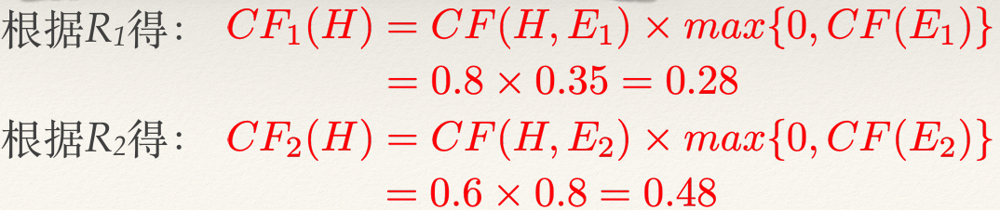

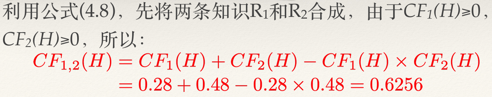

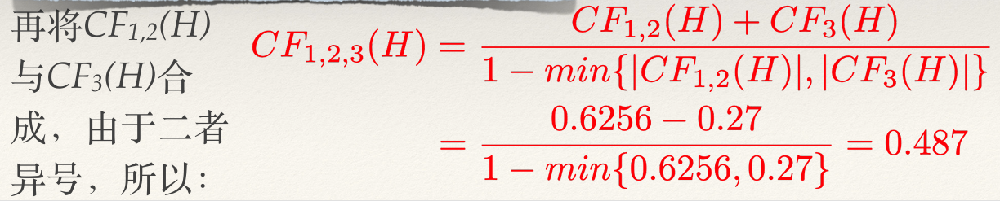

**2. 多条知识下，更新法求结论可信度**

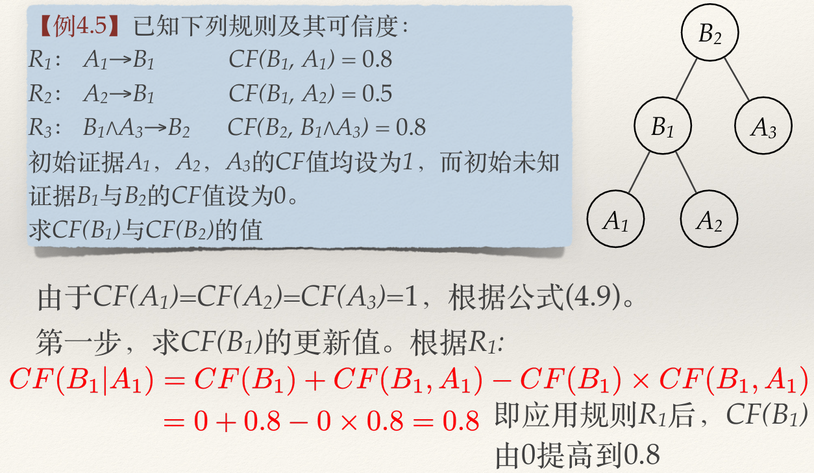

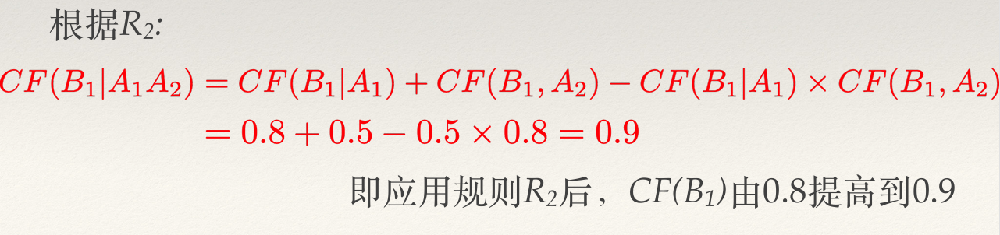

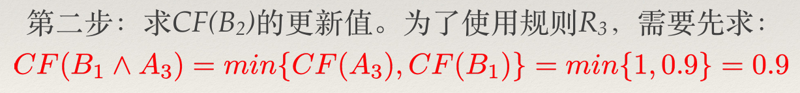

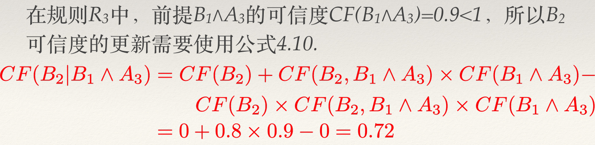

## 主观 Bayes 方法

主观Bayes⽅法又称主观概率论，是由R.O.Duda等⼈于1976年提出的⼀种不确定推理模型，它是对概率论中基本Bayes公式的改进，是⼀种基于概率逻辑的⽅法。

### 基本 Bayes 公式

设事件 $B_1, B_2, \cdots, B_n$ 是彼此独立、互不相容的事件， $B_1 \cup B_2 \cup \cdots B_n = \Omega(全集)$ ，且 $P(B_i) > 0 \ (i = 1, 2, \cdots, n)$ 。对于任一事件 A 能且只能与 B 事件集合中的一个同时发生，而且 $P(A) > 0$ ，则有

$$
P(B_i | A) = \frac{P(A|B_i)P(B_i)}{\sum_{j=1}^{n} P(A|B_j)P(B_j)} \ \ \ i=1, 2, \cdots, n
$$

如果产生式规则 $IF \ \ \  E \ \ \ THEN \ \ \ H_i$ 中的前提条件 E 代替 Bayes 公式中的 A，用 $H_i$ 代替 $B_i$ ，就可以得到

$$
P(H_i | E) = \frac{P(E|H_i)P(H_i)}{\sum_{j=1}^{n} P(E|H_j)P(H_j)} \ \ \ i=1, 2, \cdots, n
$$

这样就可以根据 H 的先验概率求出其条件概率。

有时有多个证据支持多个结论，可以对 Bayes 公式进行扩充，得到

$$
P(H_i | E_1 E_2 \cdots E_m) = \frac{P(E_1|H_i) \times \cdots \times P(E_m|H_i) \times P(H_i)}{\sum_{j=1}^{n} P(E_1|H_j)\times \cdots \times P(E_m|H_j) \times P(H_j)} \ \ \ i=1, 2, \cdots, n
$$

### 主观 Bayes 方法的推理网络

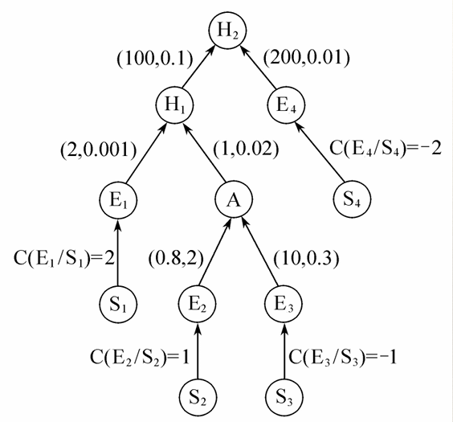

推理⽹络中的连接实际上就是测定⼀个结论的概率变化是如何地影响了其他结论。

推理⽹络中的每⼀个节点 H 都有⼀个先验概率 P(H)，每条规则都有⼀个数值对 (LS, LN) 表⽰规则强度。每条规则的 (LS, LN) 值以及每个节点的先验概率 P(H) 均由领域专家给出。

### 知识不确定性的表示

在主观 Bayes 推理网络中，知识（规则）是一条弧，不确定性用数值对 (LS, LN)来表述，用产生式规则表示为

$$
IF \ \ \ E \ \ \ THEN \ \ \ (LS, LN) \ \ \ H \ \ \ (P(H))
$$

其中，

1、LS 表示规则成立的充分性，LN 表示规则成立的必要性，定义如下：

$$
LS = \frac{P(E|H)}{P(E|\sim H)}
$$

$$
LN = \frac{P(\sim E|H)}{P(\sim E|\sim H)} = \frac{1 - P(E|H)}{1 - P(E|\sim H)}
$$

LS 和 LN 的取值范围为 [0, + $\infty$ ]

2、E 是该知识的前提条件。

3、H 是结论。

### 证据不确定性表示

##### 1. 单个证据不确定性表示

证据可信度 C(E|S) 与后验概率 P(E|S) 的关系，如下表所示：

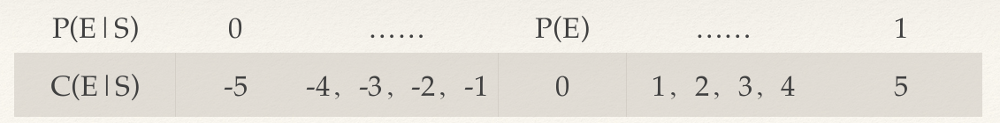

可用解析表达式表示如下：

$$
C(E|S) =
\begin{cases}
\displaystyle 5 \times \frac{P(E|S) - P(E)}{1 - P(E)} & P(E) < P(E|S) \leq 1 \\ \\
\displaystyle 5 \times \frac{P(E|S) - P(E)}{P(E)} & 0 \leq P(E|S) \leq P(E)
\end{cases}
$$

给了 C(E|S) 就相当于给了证据的概率 P(E|S)，

$$
P(E|S) = 
\begin{cases}
\displaystyle \frac{C(E|S) + P(E) \times (5 - C(E|S))}{5} & 0 \leq C(E|S) \leq 5 \\ \\
\displaystyle \frac{P(E) \times (C(E|S) + 5)}{5} & -5 \leq C(E|S) < 0
\end{cases} 
$$

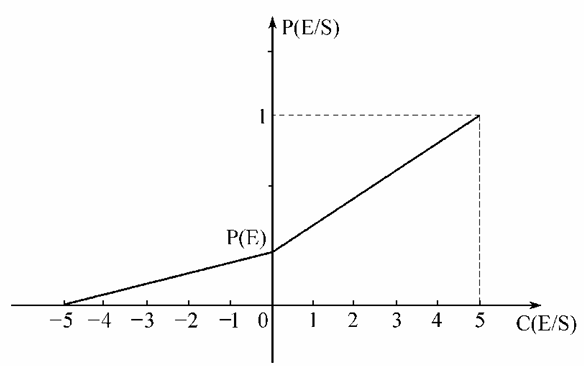

##### 2. 组合证据不确定性的确定方法

若

$$
E = E_1 \wedge E_2 \wedge \cdots \wedge E_n
$$

则

$$
P(E|S) = min\{ P(E_1|S), P(E_2|S), \cdots, P(E_n|S) \}
$$

---

若

$$
E = E_1 \vee E_2 \vee \cdots \vee E_n
$$

则

$$
P(E|S) = max\{ P(E_1|S), P(E_2|S), \cdots, P(E_n|S) \}
$$

---

若

$$
\sim E
$$

则

$$
P(\sim E|S) = 1 - P(E|S)
$$

### 不确定性的推理计算

这里了解下几率函数 $O(x)$ ，它与概率的关系为

$$
O(x) = \frac{P(x)}{1 - P(x)} \ \ \ \ \ \ P(x) = \frac{O(x)}{1 + O(x)}
$$

且有

$$
O(H|E) = LS \times O(H) \ \ \ \ \ O(H|\sim E) = LN \times O(H)
$$

##### 1. 确定性证据

(1) **证据肯定出现** 时，P(E) = P(E|S) = 1，由Bayes公式可得

$$
\begin{cases}
\displaystyle P(H|E) = \frac{P(E|H) \times P(H)}{P(E)} \\ \\
\displaystyle P(\sim H|E) = \frac{P(E|\sim H) \times P(\sim H)}{P(E)} 
\end{cases}
$$

经过一系列变换后可得

$$
P(H|E) = \frac{LS \times P(H)}{(LS - 1) \times P(H) + 1}
$$

(2) **证据肯定不出现** 时，P(E) = P(E|S) = 0，由Bayes公式可得

$$
\begin{cases}
\displaystyle P(H|\sim E) = \frac{P(\sim E|H) \times P(H)}{P(\sim E)} \\ \\
\displaystyle P(\sim H|\sim E) = \frac{P(\sim E|\sim H) \times P(\sim H)}{P(\sim E)} 
\end{cases}
$$

经过一系列变换后可得

$$
P(H|\sim E) = \frac{LN \times P(H)}{(LN - 1) \times P(H) + 1}
$$

(3) 知识规则强度 (LS, LN) 的意义

充分性量度 LS 越大，表明 E 越支持 H为真。LS = 1 时表示 E 和 H没有关系；LS < 1 时表示 E 的出现使 H 为真的概率下降；LS > 1 时表示 E 的出现使 H 为真的概率上升。

必要性量度 LN 越大，表明 $\sim$ E 越支持 H为真。LN = 1 时表示 $\sim$ E 和 H没有关系；LN < 1 时表示 $\sim$ E 的出现使 H 为真的概率下降；LN > 1 时表示 $\sim$ E 的出现使 H 为真的概率上升。

因此 LS 和 LN 的取值存在三种情况：

$$
\begin{cases}
LS > 1 \ \ \& \ \ LN < 1 \\
LS < 1 \ \ \& \ \ LN > 1 \\
LS = LN = 1
\end{cases}
$$

分别表示 E 支持 H 为真，E 不支持 H 为真，E 和 H 无关。

##### 2. 不确定性证据

(1) **概率表示** 证据不确定性

在观察 S 之下，用户可以用 P(E|S) 表达证据 E 为真的程度。现在就要在观察 S 下确定 H 的后验概率 P(H|S)，使用如下公式：

$$
P(H|S) = P(H|E) \times P(E|S) + P(H|\sim E) \times P(\sim E|S)
$$

根据 P(E|S) = 0, P(E), 1 三个特殊点可求得 P(E|S) 的函数 P(H|S) 的解析表达式：

$$
P(H|S) = 
\begin{cases}
\displaystyle P(H|\sim E) + \frac{P(H) - P(H|\sim E)}{P(E)} \times P(E|S) & 0 \leq P(E|S) < P(E) \\ \\
\displaystyle P(H) + \frac{P(H|E) - P(H)}{1 - P(E)} \times [P(E|S) - P(E)] & P(E) \leq P(E|S) \leq 1
\end{cases}
$$

该公式被称为 EH 公式，下图是它的分段线性插值图。

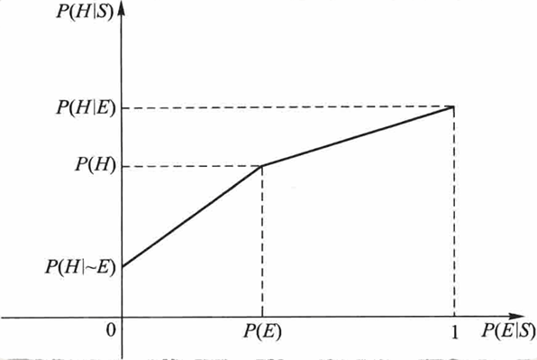

(2) 用 **可信度表示** 证据不确定性

将 P(E|S) 与 C(E|S) 的关系转换式代入 EH 公式可得：

$$
P(H|S) = 
\begin{cases}
\displaystyle P(H|\sim E) + [P(H) - P(H|\sim E)] \times [\frac{1}{5} C(E|S) + 1] & C(E|S) \leq 0 \\ \\
\displaystyle P(H) + [P(H|E) - P(H)] \times \frac{1}{5} C(E|S) & C(E|S) > 0 
\end{cases}
$$

该公式称为 CP 公式。

### 结论不确定性的合成与更新算法

##### 1. 结论不确定性的合成算法

若已知结论 H，前提 $E_i$ 和对应的观察 $S_i$ ，可通过下式求出多条知识支持的 H 的后验概率：

$$
O(H|S_1, S_2, \cdots, S_n) = \frac{O(H|S_1)}{O(H)} \times \frac{O(H|S_2)}{O(H)} \times \cdots \times \frac{O(H|S_n)}{O(H)} \times O(H)
$$

$$
P(H|S_1, S_2, \cdots, S_3) = \frac{O(H|S_1, S_2, \cdots, S_n)}{1 + O(H|S_1, S_2, \cdots, S_n)}
$$

##### 2. 结论不确定性的更新算法

⾸先利⽤第⼀条规则对结论的先验概率进⾏更新，再把得到的更新概率当作第⼆条规则的先验概率；再⽤第⼆条知识对其进⾏更新，把更新后得到的值作为第三条知识的先验概率；再使⽤第三条知识对结论的概率进⾏更新……。这样继续更新直到所有的规则使⽤完。

### 主观 Bayes 方法应用举例

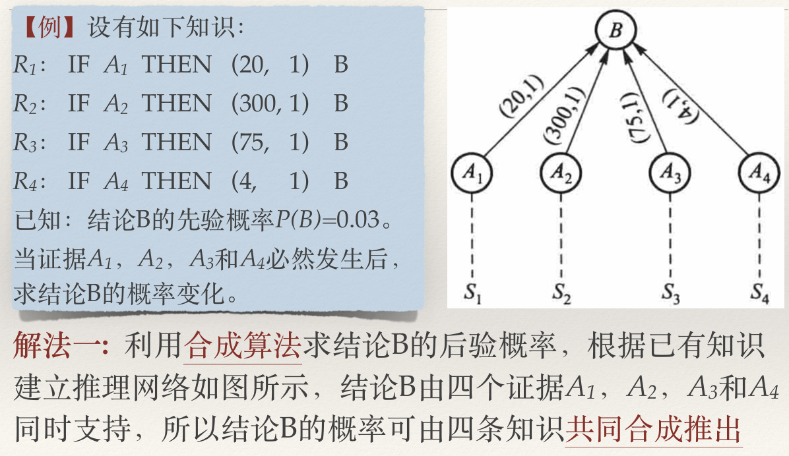

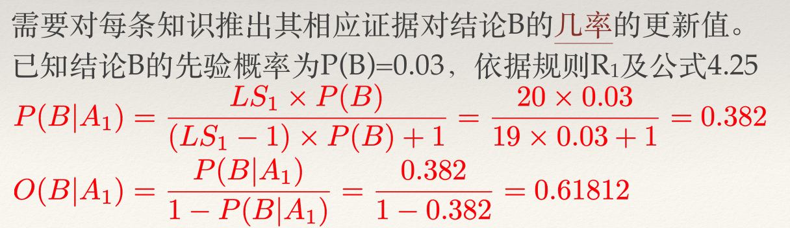

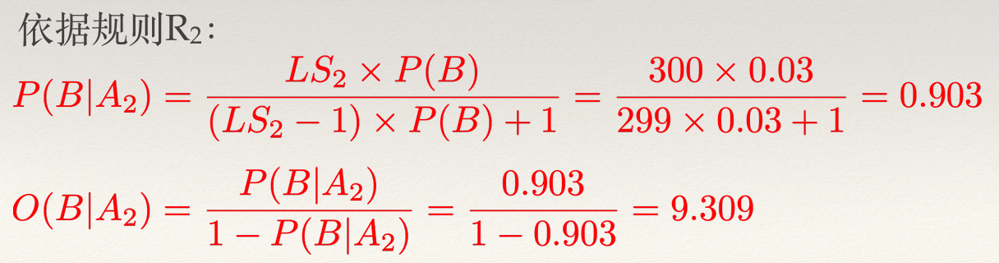

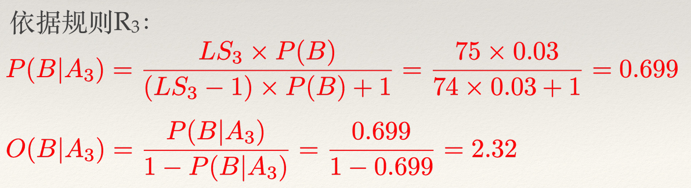

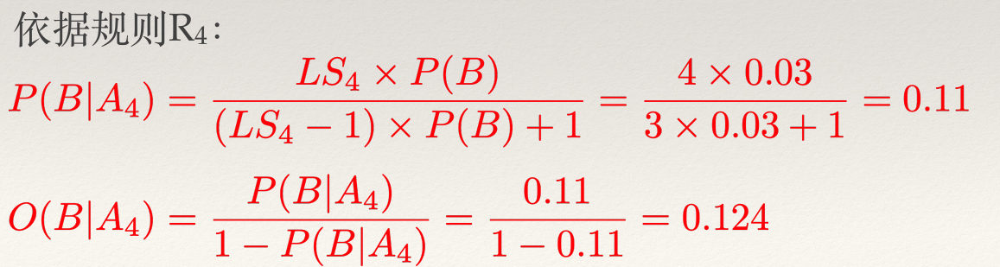

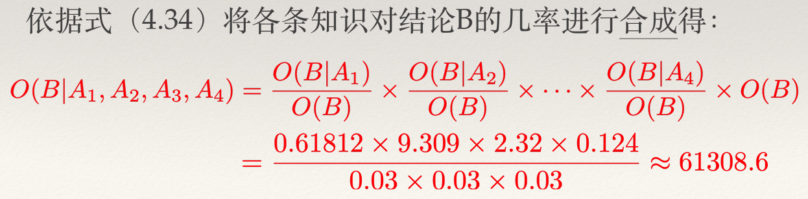

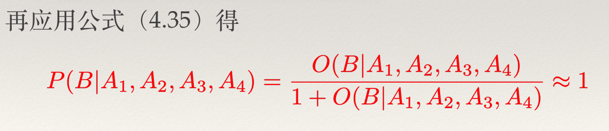

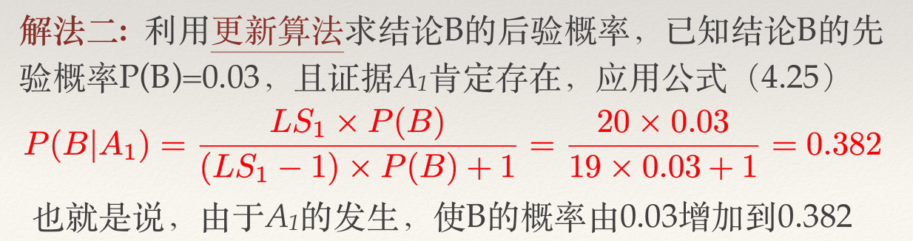

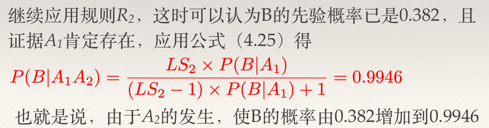

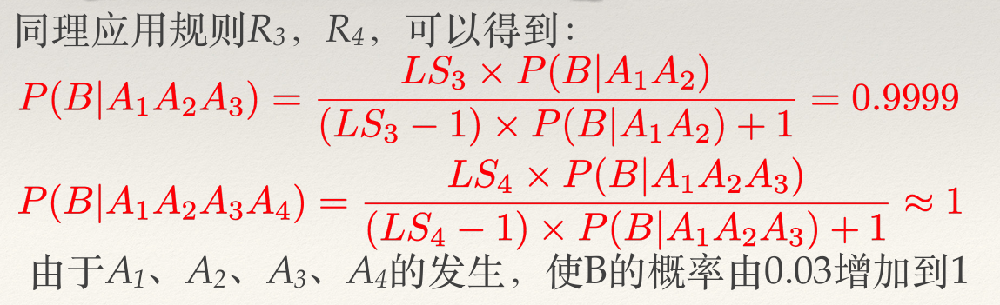

