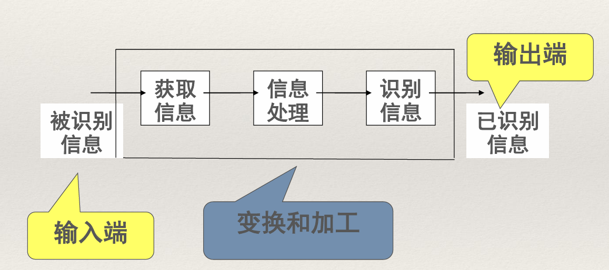
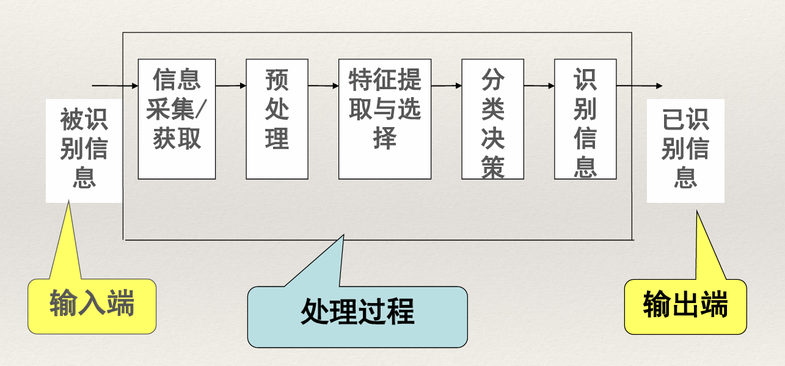
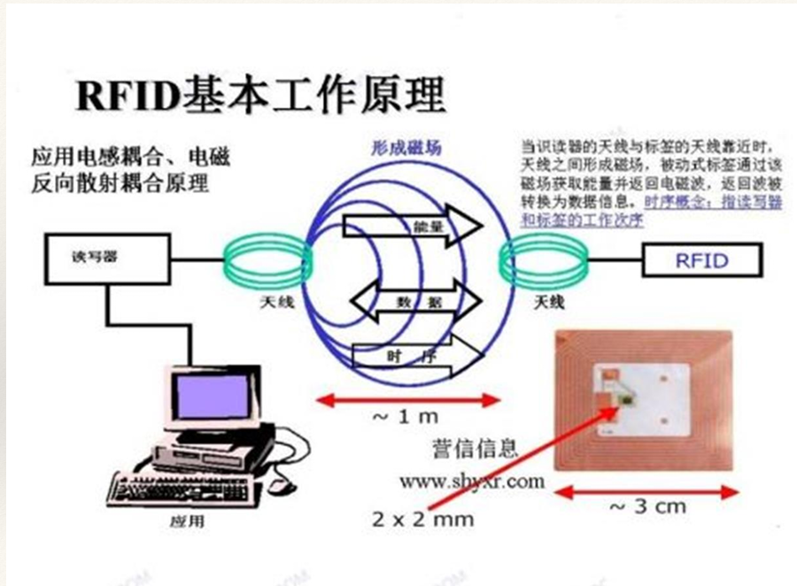
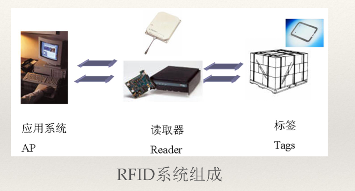
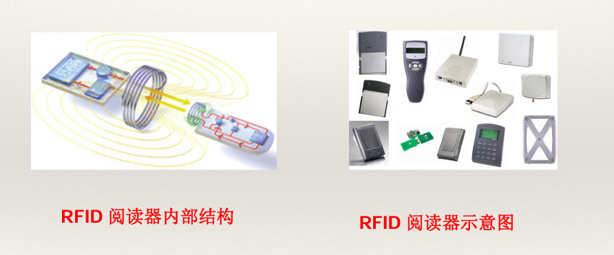
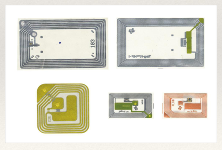
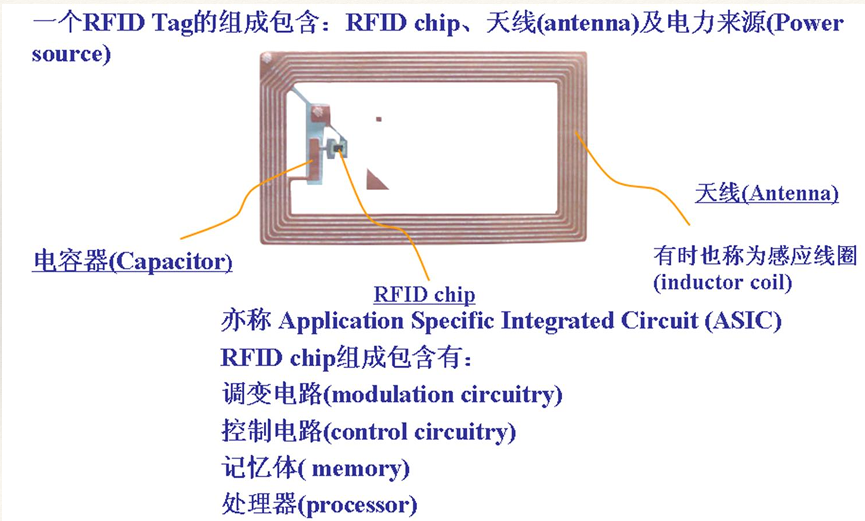
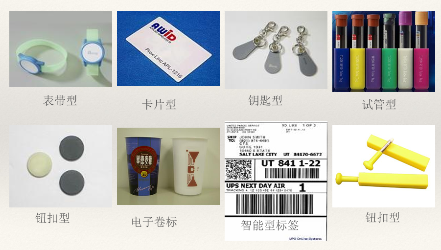
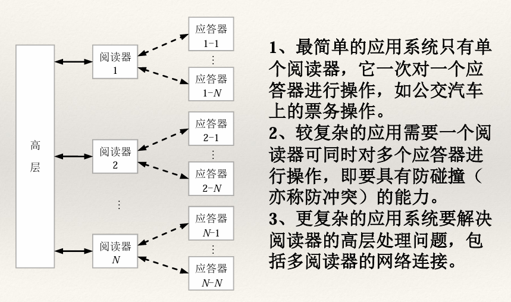

# 自动采集与射频技术

> 参考资料：北京信息科技大学大三上数据采集技术PPT。
>
> 由于参考资料内容过多过杂，不再进行后续笔记编写，转而在原PPT添加书签。

本章主要介绍自动采集和射频识别技术。

## 自动识别技术

### 基本介绍

**定义** : 英文全称(Automatic Identification)，简称为 Auto-ID，是指通过非人工手段获取被识别对象所包含的标识信息或特征信息，并且不使用键盘即可将数据实时输入计算机或其它微处理器控制设备的技术。

自动识别技术的特点：

1. 准确性：自动数据采集，彻底消除人为错误。

2. 高效性：信息交换实时进行。

3. 兼容性：自动识别技术以计算机技术为基础，可与信息管理系统无缝联结。

自动识别技术根据识别对象的特征、识别原理和方式可以分为两大类：

- 数据采集技术（定义识别）：将被识别对象赋予一个ID代码，并将ID代码载体(条码、射频标签、磁卡、IC卡等)放在要被识别的对象上进行标识，通过对载体的自动识读获得原ID代码，然后通过计算机实现对对象的自动识别。

- 特征提取技术（模式识别）：模式识别(Pattern Recognition)是指对表征事物或现象的各种形式(数值的、文字的和逻辑关系的)信息进行处理和分析，以对事物或现象进行描述、辨认、分类和解释的过程，即通过采集被识别对象的特征数据，并通过与计算机存储的原特征数据进行特征比对，实现对对象的自动识别，是信息科学和人工智能的重要组成部分。

自动识别技术的一般性原理：如下是 **一般自动识别技术信息处理系统模型** 和 **图像形式格式信息的自动识别系统模型** 。

自动识别技术可以分为如下七种：

- 条码识别技术
- 生物识别技术
- 图像识别技术
- 磁卡识别技术
- IC卡识别技术
- 光学字符识别技术（OCR）
- 射频识别技术（RFID）

### 引申-物联网

英文名称为“The Internet of Things”，简称：IOT。物联网就是“物物相连的互联网”。

**含义** : 第一，物联网的核心和基础仍然是互联网，是在互联网基础之上的延伸和扩展的一种网络；第二，其用户端延伸和扩展到了任何物品与物品之间，进行信息交换和通信。

**定义** : 是通过射频识别(RFID)装置、红外感应器、全球定位系统、激光扫描器等信息传感设备，按约定的协议，把任何物品与互联网相连接，进行信息交换和通信，以实现智能化识别、定位、跟踪、监控和管理的一种网络。

## 射频识别技术

### 基本介绍

**定义** :  RFID(Radio Frequency IDentification)全称无线射频识别技术，是一种无线通信技术，可以通过无线电讯号识别特定目标并读写相关数据，而 **无需识别系统与特定目标之间建立机械或者光学接触（即非接触）**。

**基本工作原理** : 标签进入磁场后，接收阅读器发出的射频信号，凭借感应电流所获得的能量发送出存储在芯片中的产品信息（Passive Tag，无源标签或被动标签），或者由标签主动发送某一频率的信号（Active Tag，有源标签或主动标签），阅读器读取信息并解码后，送至中央信息系统进行有关数据处理。

电子标签与阅读器之间通过耦合元件实现射频信号的空间(无接触)耦合、在耦合通道内，根据时序关系，实现能量的传递、数据的交换。发生在读写器和电子标签之间的射频信号的耦合类型有两种：

1. 电感耦合。变压器模型，通过空间高频交变磁场实现
耦合，依据的是电磁感应定律

2. 电磁反向散射耦合：雷达原理模型，发射出去的电磁波，碰到目标后反射，同时携带回目标信息，依据的是电磁波的空间传播规律

### 系统组成

一套完整的RFID系统通常由三部分组成：**即电子标签**（tag）、**读写器**（reader）、**数据库** 以及 **软件** 组成。

- 电子标签也称应答器(transponder)，或称数据载体(data carrier)。

* 读写器也称阅读器，通过前端的射频通信技术和后端的网络系统与数据中心的数据库系统相连接。

- 数据库系统主要完成数据信息的储存及管理，可以是简单的小型数据库，也可能是通过网络联结的，分布在全球各地的，多级分层次的大型集中的数据库。

* 软件主要实现数据处理，可以是大型复杂的ERP系统，也可以是简单实现账目管理、库存管理、物流管理等的中小型软件。

###### 1. 阅读器（Reader）

由天线，耦合元件，芯片组成，读取（有时还可以写入）标签信息的设备，可设计为手持式rfid读写器（如：C5000W）或固定式读写器。

###### 2. 电子标签（TAG）

由天线，耦合元件及芯片组成，每个标签具有唯一的电子编码，附着在物体上标识目标对象。

###### 3. 应用软件系统

是应用层软件，主要是把收集的数据进一步处理，并为人们所使用。可以是大型复杂的ERP系统，也可以是简单实现账目管理、库存管理、物流管理等的中小型软件。

### 标签分类

RFID 根据标签自身是否含有电源能否主动发射信号我们又把它分为一下三种：

- 无源 RFID 产品

- 有源 RFID 产品

- 半无源 RFID 产品

**无源系统** ：无源标签，又称被动标签（Passive Tag）:电子标签没有内装电池，在阅读器的阅读范围外，电子标签处于无源状态，在阅读器的阅读范围之内时，电子标签从阅读器发出的射频能量中提取其工作所需的电能。无源标签读写距离近、价格低，它的使用寿命无限制，但需要大功率的读写装置。

