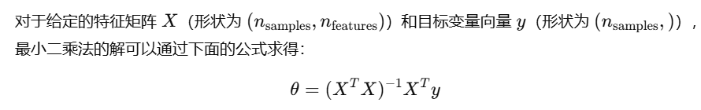
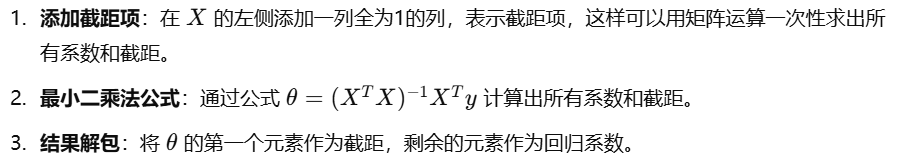
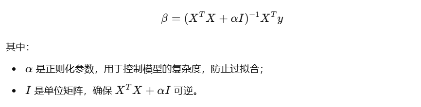

# 机器学习中使用numpy

## numpy常用操作

#### 数组拼接 `np.c_`

在最小二乘回归中，我们用np.c_将一列全为1的列和特征矩阵 `X` 拼接在一起，方便同时计算截距和回归系数：

```python
X = np.array([[1, 2], [3, 4]])
X_with_ones = np.c_[np.ones(X.shape[0]), X]  # 在X左侧添加一列1
print(X_with_ones)
# 输出:
# [[1. 1. 2.]
#  [1. 3. 4.]]
```

#### 转置矩阵 `X.T`

矩阵转置将行和列对换。`X.T`表示矩阵X的转置。

```python
X = np.array([[1, 2], [3, 4]])
print(X.T)  # 输出 [[1, 3], [2, 4]]
```

#### 矩阵相乘 `@`

在最小二乘公式中，我们使用矩阵乘法。`X.T @ X`表示`X.T`与`X`的乘积。

```python
X = np.array([[1, 2], [3, 4]])
result = X.T @ X
print(result)
# 输出 [[10 14]
#      [14 20]]
```

#### 矩阵求逆 `np.linalg.inv`

```python
matrix = np.array([[4, 7], [2, 6]])
inverse_matrix = np.linalg.inv(matrix)
print(inverse_matrix)
# 输出 [[ 0.6 -0.7]
#      [-0.2  0.4]]
```

#### 生成单位阵 `np.eye`

np.eye 是 NumPy 的一个函数，用于生成单位矩阵（Identity Matrix）。单位矩阵是一个方阵，主要特征是对角线上元素为 1，其他元素为 0。例如，np.eye(3) 会生成一个3×3的单位矩阵：

```python
np.eye(3)
# 输出：
# array([[1., 0., 0.],
#        [0., 1., 0.],
#        [0., 0., 1.]])
```


## 回归

### 最小二乘回归

对于多自变量（特征）和一个因变量的情况，可以使用相同的最小二乘法公式。假设有 m 个自变量和一个因变量，目标是找到每个自变量的系数以及截距，使得预测值最接近实际值。



#### 实现最小二乘回归

```python
import numpy as np

def least_squares_multiple(X, y):
    """
    使用最小二乘法计算多自变量线性回归模型的参数。
    :param X: 特征矩阵，形状为 (n_samples, n_features)
    :param y: 目标向量，形状为 (n_samples,)
    :return: 截距和回归系数
    """
    # 添加一列1，以便计算截距项
    X = np.c_[np.ones(X.shape[0]), X]  # (n_samples, n_features + 1)
    
    # 计算最小二乘解：theta = (X^T * X)^(-1) * X^T * y
    theta = np.linalg.inv(X.T @ X) @ X.T @ y  # (n_features + 1,)
    
    # 提取截距和系数
    intercept = theta[0]            # 截距
    coefficients = theta[1:]         # 回归系数
    
    return intercept, coefficients

# 示例数据
X = np.array([
    [1, 2],
    [2, 3],
    [3, 4],
    [4, 5],
    [5, 6]
])  # 特征矩阵 (5, 2)，表示5个样本和2个自变量
y = np.array([1, 2, 1.5, 3.5, 2.5])  # 目标变量 (5,)

# 调用最小二乘回归函数
intercept, coefficients = least_squares_multiple(X, y)

print(f"截距 (Intercept): {intercept}")
print(f"回归系数 (Coefficients): {coefficients}")
```



以下是一个封装了最小二乘回归的 `Python` 类：

```python
import numpy as np

class LeastSquaresRegression:
    def __init__(self):
        self.coefficients = None  # 存储回归系数
        self.intercept = None     # 存储截距
    
    def fit(self, X, y):
        # 添加常数项，以包含截距
        X = np.c_[np.ones(X.shape[0]), X]
        
        # 计算回归系数
        beta = np.linalg.inv(X.T @ X) @ X.T @ y
        self.intercept = beta[0]          # 截距
        self.coefficients = beta[1:]      # 系数（除去截距）
    
    
    def predict(self, X):
        # 检查是否已训练模型
        if self.coefficients is None or self.intercept is None:
            raise ValueError("模型未训练。请先调用 fit() 方法进行训练。")
        
        # 添加常数项，以包含截距
        X = np.c_[np.ones(X.shape[0]), X]
        
        # 预测
        return X @ np.r_[self.intercept, self.coefficients]

# 测试
X = np.array([[1], [2], [3], [4], [5]])
y = np.array([1, 2, 3, 4, 5])

# 创建模型实例
model = LeastSquaresRegression()

# 训练模型
model.fit(X, y)

# 获取系数和截距
print("截距:", model.intercept)
print("系数:", model.coefficients)

# 进行预测
predictions = model.predict(X)
print("预测值:", predictions)
```


### 岭回归

岭回归的公式如下：



#### 实现岭回归

```python
import numpy as np


class RidgeRegression:
    def __init__(self, alpha=1.0):
        self.alpha = alpha  # 正则化参数
        self.coefficients = None  # 存储回归系数
        self.intercept = None  # 存储截距

    def fit(self, X, y):
        # 添加常数项，以包含截距
        X = np.c_[np.ones(X.shape[0]), X]

        # 构造正则化矩阵，将第一个元素设置为 0 以避免惩罚截距
        n_features = X.shape[1]
        regularization_matrix = self.alpha * np.eye(n_features)
        regularization_matrix[0, 0] = 0

        # 计算回归系数
        beta = np.linalg.inv(X.T @ X + regularization_matrix) @ X.T @ y
        self.intercept = beta[0]  # 截距
        self.coefficients = beta[1:]  # 系数（除去截距）

    def predict(self, X):
        # 检查是否已训练模型
        if self.coefficients is None or self.intercept is None:
            raise ValueError("模型未训练。请先调用 fit() 方法进行训练。")

        # 添加常数项，以包含截距
        X = np.c_[np.ones(X.shape[0]), X]

        # 预测
        return X @ np.r_[self.intercept, self.coefficients]
```

在岭回归中，一般不对截距（偏置项）进行正则化。因此，我们将正则化矩阵的第一个对角线元素设为 0，以避免对截距项施加惩罚：

```python
regularization_matrix[0, 0] = 0
# 输出：
# array([[0. , 0. , 0. ],
#        [0. , 0.5, 0. ],
#        [0. , 0. , 0.5]])
```

## 分类

### K近邻分类

```python
import numpy as np
from collections import Counter

class KNearestNeighbors:
    def __init__(self, k=3):
        """
        初始化 K 近邻分类器
        :param k: 邻居数量
        """
        self.k = k
    
    def fit(self, X, y):
        """
        训练 K 近邻模型
        :param X: 训练数据特征，二维数组 [样本数量, 特征数量]
        :param y: 训练数据标签，一维数组 [样本数量]
        """
        self.X_train = X
        self.y_train = y
    
    def predict(self, X):
        """
        预测新样本的类别
        :param X: 测试数据特征，二维数组 [样本数量, 特征数量]
        :return: 预测标签，一维数组
        """
        predictions = [self._predict(x) for x in X]
        return np.array(predictions)
    
    def _predict(self, x):
        """
        预测单个样本的类别
        :param x: 单个样本的特征，一维数组 [特征数量]
        :return: 预测标签
        """
        # 计算所有训练样本到测试样本的欧氏距离
        distances = [np.sqrt(np.sum((x_train - x) ** 2)) for x_train in self.X_train]
        # 找到距离最近的 k 个样本的标签
        k_indices = np.argsort(distances)[:self.k]
        k_nearest_labels = [self.y_train[i] for i in k_indices]
        # 返回出现次数最多的标签
        most_common = Counter(k_nearest_labels).most_common(1)
        return most_common[0][0]

```


## 聚类

### KMeans

#### 基础k-means

```python
import numpy as np

class MyKMeans:
    def __init__(self, n_clusters=3, max_iter=300, tol=1e-4, random_state=None):
        self.n_clusters = n_clusters  # 聚类数
        self.max_iter = max_iter  # 最大迭代次数
        self.tol = tol  # 收敛阈值
        self.random_state = random_state  # 随机种子

    def fit(self, X):
        np.random.seed(self.random_state)
        # 初始化簇中心，随机选择样本点作为初始中心
        self.cluster_centers_ = X[np.random.choice(X.shape[0], self.n_clusters, replace=False)]
        
        for i in range(self.max_iter):
            # 1. 分配每个样本点到最近的簇
            self.labels_ = self._assign_labels(X)
            
            # 2. 计算新的簇中心
            new_centers = self._compute_centers(X)
            
            # 3. 检查簇中心是否收敛
            if np.linalg.norm(new_centers - self.cluster_centers_) < self.tol:
                print(f"Converged after {i+1} iterations.")
                break
            
            self.cluster_centers_ = new_centers
        
        return self

    def _assign_labels(self, X):
        # 计算每个点与所有簇中心的距离，分配给最近的簇
        distances = np.linalg.norm(X[:, np.newaxis] - self.cluster_centers_, axis=2)
        return np.argmin(distances, axis=1)

    def _compute_centers(self, X):
        # 计算每个簇的新中心
        new_centers = np.zeros((self.n_clusters, X.shape[1]))
        for i in range(self.n_clusters):
            points_in_cluster = X[self.labels_ == i]
            if len(points_in_cluster) > 0:
                new_centers[i] = points_in_cluster.mean(axis=0)
        return new_centers

# 测试代码
if __name__ == "__main__":
    # 创建示例数据
    X = np.array([[1.0, 2.0], [1.5, 1.8], [5.0, 8.0], [8.0, 8.0], [1.0, 0.6], [9.0, 11.0]])

    # 使用我们自定义的KMeans类进行聚类
    kmeans = MyKMeans(n_clusters=2, random_state=42)
    kmeans.fit(X)

    # 输出聚类结果
    print("Cluster Centers:")
    print(kmeans.cluster_centers_)
    
    print("Labels:")
    print(kmeans.labels_)

```

#### k-means++

```python
import numpy as np

class MyKMeans:
    def __init__(self, n_clusters=3, max_iter=300, tol=1e-4, random_state=None):
        self.n_clusters = n_clusters  # 聚类数
        self.max_iter = max_iter  # 最大迭代次数
        self.tol = tol  # 收敛阈值
        self.random_state = random_state  # 随机种子

    def fit(self, X):
        np.random.seed(self.random_state)

        # 使用 k-means++ 初始化簇中心
        self.cluster_centers_ = self._initialize_centroids(X)

        for i in range(self.max_iter):
            # 1. 分配每个样本点到最近的簇
            self.labels_ = self._assign_labels(X)

            # 2. 计算新的簇中心
            new_centers = self._compute_centers(X)

            # 3. 检查簇中心是否收敛
            if np.linalg.norm(new_centers - self.cluster_centers_) < self.tol:
                print(f"Converged after {i + 1} iterations.")
                break

            self.cluster_centers_ = new_centers

        return self

    def _initialize_centroids(self, X):
        # k-means++ 初始化
        centroids = []
        # 第一个簇中心随机选择
        centroids.append(X[np.random.choice(X.shape[0])])

        for _ in range(1, self.n_clusters):
            # 计算每个点到已选簇中心的最小距离
            distances = np.min(np.linalg.norm(X[:, np.newaxis] - np.array(centroids), axis=2), axis=1)
            # 根据距离加权选择下一个簇中心
            probs = distances ** 2
            probs = probs / np.sum(probs)  # 归一化概率
            next_centroid = X[np.random.choice(X.shape[0], p=probs)]
            centroids.append(next_centroid)

        return np.array(centroids)

    def _assign_labels(self, X):
        # 计算每个点与所有簇中心的距离，分配给最近的簇
        distances = np.linalg.norm(X[:, np.newaxis] - self.cluster_centers_, axis=2)
        return np.argmin(distances, axis=1)

    def _compute_centers(self, X):
        # 计算每个簇的新中心
        new_centers = np.zeros((self.n_clusters, X.shape[1]))
        for i in range(self.n_clusters):
            points_in_cluster = X[self.labels_ == i]
            if len(points_in_cluster) > 0:
                new_centers[i] = points_in_cluster.mean(axis=0)
        return new_centers

```