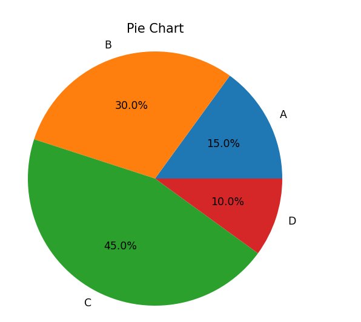
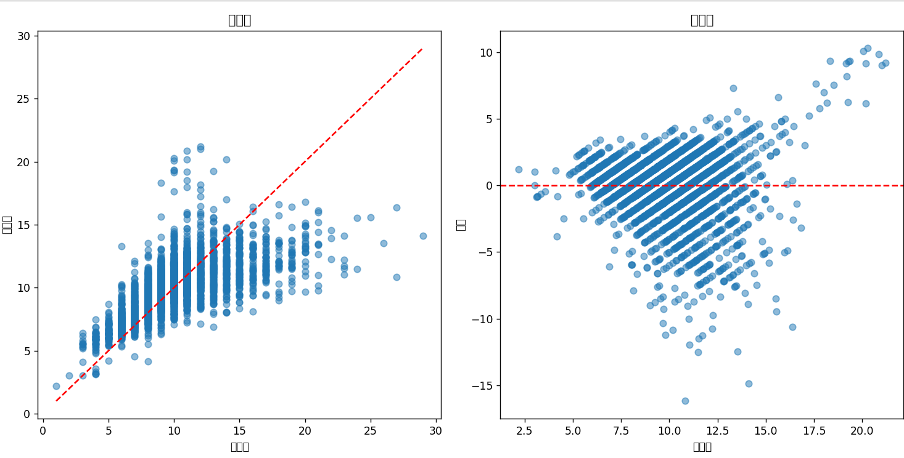

# 数据可视化基础

## 基本图形绘制

### 折线图（Line Plot）

```python
import matplotlib.pyplot as plt

# 示例数据
x = [1, 2, 3, 4, 5]  # X轴数据
y = [2, 3, 5, 7, 11]  # Y轴数据

# 绘制折线图
plt.plot(x, y, marker='o')  # 使用点标记每个数据点
plt.title('Line Plot')  # 图表标题
plt.xlabel('X Axis')  # X轴标签
plt.ylabel('Y Axis')  # Y轴标签
plt.grid()  # 显示网格
plt.show()  # 显示图形
```


在 matplotlib 中，marker='o' 是一个参数，用于指定绘制图形时的数据点标记的样式。

具体来说，'o' 表示使用 圆形 作为数据点的标记。

常见标记类型：

- 'o'：圆形
- '.'：点
- 'x'：叉形
- '+'：加号
- '^'：三角形 (向上)
- 'v'：倒三角形
- 's'：正方形
- 'd'：菱形
- '*'：星形

你可以在 plot() 函数中使用这些标记样式来更改数据点的形状。

### 散点图（Scatter Plot）

```python
import matplotlib.pyplot as plt

# 示例数据
x = [1, 2, 3, 4, 5]
y = [2, 3, 5, 7, 11]

# 绘制散点图
plt.scatter(x, y, color='red')  # 使用红色标记数据点
plt.title('Scatter Plot')  # 图表标题
plt.xlabel('X Axis')  # X轴标签
plt.ylabel('Y Axis')  # Y轴标签
plt.grid()  # 显示网格
plt.show()  # 显示图形
```


### 柱状图（Bar Chart）

```python
import matplotlib.pyplot as plt

# 示例数据
categories = ['A', 'B', 'C', 'D']
values = [3, 7, 2, 5]

# 绘制柱状图
plt.bar(categories, values, color='blue')  # 使用蓝色填充柱子
plt.title('Bar Chart')  # 图表标题
plt.xlabel('Categories')  # X轴标签
plt.ylabel('Values')  # Y轴标签
plt.show()  # 显示图形
```


### 直方图（Histogram）

```python
import matplotlib.pyplot as plt
import numpy as np

# 示例数据（随机生成）
data = np.random.randn(1000)  # 生成1000个随机数

# 绘制直方图
plt.hist(data, bins=30, color='green', alpha=0.7)  # 使用绿色填充，设置透明度
plt.title('Histogram')  # 图表标题
plt.xlabel('Value')  # X轴标签
plt.ylabel('Frequency')  # Y轴标签
plt.grid()  # 显示网格
plt.show()  # 显示图形
```


### 饼图（Pie Chart）

```python
import matplotlib.pyplot as plt

# 示例数据
sizes = [15, 30, 45, 10]  # 各部分的大小
labels = ['A', 'B', 'C', 'D']  # 各部分的标签

# 绘制饼图
plt.pie(sizes, labels=labels, autopct='%1.1f%%')  # 自动显示百分比
plt.title('Pie Chart')  # 图表标题
plt.axis('equal')  # 确保饼图是圆形
plt.show()  # 显示图形
```




## 绘图技巧

### 多图绘制

#### 绘制多个子图（Subplots）

使用 `plt.subplot()` 或 `plt.subplots()` 可以在同一个大图上绘制多个子图。

```python
import matplotlib.pyplot as plt
import numpy as np

# 示例数据
x = np.linspace(0, 10, 100)
y1 = np.sin(x)
y2 = np.cos(x)

# 创建一个 2 行 1 列的子图
plt.subplot(2, 1, 1)  # 2 行 1 列，选择第 1 个
plt.plot(x, y1, color='blue')
plt.title('Sine Wave')
plt.xlabel('X Axis')
plt.ylabel('Y Axis')

plt.subplot(2, 1, 2)  # 2 行 1 列，选择第 2 个
plt.plot(x, y2, color='orange')
plt.title('Cosine Wave')
plt.xlabel('X Axis')
plt.ylabel('Y Axis')

plt.tight_layout()  # 自动调整子图间距
plt.show()  # 显示图形
```


```python
import matplotlib.pyplot as plt
import numpy as np

# 示例数据
x = np.linspace(0, 10, 100)
y1 = np.sin(x)
y2 = np.cos(x)

# 创建 2 行 1 列的子图
fig, axs = plt.subplots(2, 1, figsize=(8, 6))  # figsize 设置图形大小

# 绘制第一个子图
axs[0].plot(x, y1, color='blue')
axs[0].set_title('Sine Wave')
axs[0].set_xlabel('X Axis')
axs[0].set_ylabel('Y Axis')

# 绘制第二个子图
axs[1].plot(x, y2, color='orange')
axs[1].set_title('Cosine Wave')
axs[1].set_xlabel('X Axis')
axs[1].set_ylabel('Y Axis')

plt.tight_layout()  # 自动调整子图间距
plt.show()  # 显示图形
```


#### 绘制单独的图

如果你想分别绘制多张图，可以直接在不同的 plt.figure() 中进行绘制：

```python
import matplotlib.pyplot as plt
import numpy as np

# 示例数据
x = np.linspace(0, 10, 100)
y1 = np.sin(x)
y2 = np.cos(x)

# 绘制第一个图
plt.figure(figsize=(8, 4))  # 设置图形大小
plt.plot(x, y1, color='blue')
plt.title('Sine Wave')
plt.xlabel('X Axis')
plt.ylabel('Y Axis')
plt.show()  # 显示第一个图

# 绘制第二个图
plt.figure(figsize=(8, 4))  # 设置图形大小
plt.plot(x, y2, color='orange')
plt.title('Cosine Wave')
plt.xlabel('X Axis')
plt.ylabel('Y Axis')
plt.show()  # 显示第二个图
```


## bug修正

### 常见bug

#### 中文字体不显示

在plt里使用中文作为文本显示不出来，如下所示：



matplotlib有内置的中文字体，调用一下就可以。

```python
import matplotlib
matplotlib.rc("font",family='YouYuan')
```

如果引入了pyplot库，可以直接使用`plt.rc("font",family='YouYuan')`。


#### 警告：当前字体中缺少Glyph 8722（\N｛MINUS SIGN｝）

警告全文一般如下所示：

```bash
UserWarning: Glyph 8722 (\N{MINUS SIGN}) missing from current font.
    plt.tight_layout()

UserWarning: Glyph 8722 (\N{MINUS SIGN}) missing from current font.
    plt.show()
```

这个报错是因为当前的字体缺少 Unicode 字符 8722，即“−”（数学中的负号符号）。这个符号在一些字体中并不包含，因此会导致 UserWarning 提示。


可以设置允许负号的字体。

```python
# 设置中文字体为 '幼圆'
plt.rc("font", family='YouYuan')

# 单独设置负号使用的字体，确保负号可以正确显示
plt.rcParams['axes.unicode_minus'] = False
```


