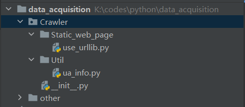

# 爬取静态网页

爬取示例：

```python
import requests
from bs4 import BeautifulSoup

# 获取网页内容
url = 'https://example.com'
response = requests.get(url)
content = response.text

# 解析网页内容
soup = BeautifulSoup(content, 'html.parser')
title = soup.title.string

print("网页标题:", title)
```

---

这里介绍一种爬虫爬取的基本流程：
- 先由 urllib 模块的 request 方法打开 URL 得到网页 HTML 对象。
- 使用浏览器打开网页源代码分析网页结构以及元素节点。
- 通过 Beautiful Soup 或则正则表达式提取数据。
- 存储数据到本地磁盘或数据库。

---

## 前置知识

### robots协议

又可以称为君子协议，由待爬取网站提供，是网络爬取信息时一种契约精神的体现，道德良好的爬虫工程师会自觉地让自己的爬虫遵守这些规范，下面是淘宝网页的robots示例：

```
User-agent: Baiduspider 
Disallow: /baidu Disallow: /s? 
Disallow: /ulink? 
Disallow: /link? 
Disallow: /home/news/data/ 
Disallow: /bh
.....
User-agent: * 
Disallow: /
```

### html

HTML 是网页的基本结构，它相当于人体的骨骼结构。网页中同时带有“＜”、“＞”符号的都属于 HTML 标签。常见的 HTML 标签如下所示：

```html
<!DOCTYPE html> 声明为 HTML5 文档
<html>..</html> 是网页的根元素
<head>..</head> 元素包含了文档的元（meta）数据，如 <meta charset="utf-8"> 定义网页编码格式为 utf-8。
<title>..<title> 元素描述了文档的标题
<body>..</body> 表示用户可见的内容
<div>..</div> 表示框架
<p>..</p> 表示段落
<ul>..</ul> 定义无序列表
<ol>..</ol>定义有序列表
<li>..</li>表示列表项
表示图片
<h1>..</h1>表示标题
<a href="">..</a>表示超链接
```
示例：

```html
<!DOCTYPE html>
<html>
<head>
<meta charset="utf-8">
<title>编程帮</title>
</head>
<body>
<a href="www.biancheng.net">点击访问</a>
<h1>编程帮www.biancheng.net</h1>
<h2>Python爬虫</h2>
<div>
<p>认识网页结构</p>
<ul>
<li>HTML</li>
<li>CSS</li>
</ul>
</div>
</body>
</html>
```

### css

CSS 表示层叠样式表，其编写方法有三种，分别是行内样式、内嵌样式和外联样式。CSS 代码演示如下：

```html
<!DOCTYPE html>
<html>
<head>
   <!-- 内嵌样式 -->
    <style type="text/css">
    
    body{
        background-color:yellow;
    }
    p{
        font-size: 30px;
        color: springgreen;
    }
    </style>
<meta charset="utf-8">
<title>编程帮</title>
</head>
<body>
<!-- h1标签使用了行内样式 -->
<h1 style="color: blue;">编程帮www.biancheng.net</h1>
<a href="www.biancheng.net">点击访问</a>
<h2>Python爬虫</h2>
<div>
<p>认识网页结构</p>
<ul>
<li>HTML</li>
<li>CSS</li>
</ul>
</div>
</body>
</html>
```

如上内嵌样式通过 style 标签书写样式表：

```html
<style type="text/css"></style>
```

外联样式表指的是将 CSS 代码单独保存为以 .css 结尾的文件，并使用 <link> 引入到所需页面：

```css
<head>
<link rel="stylesheet" type="text/css" href="mystyle.css">
</head>
```

### JavaScript

JavaScript 负责描述网页的行为，比如，交互的内容和各种特效都可以使用 JavaScript 来实现。当然可以通过其他方式实现，比如 jQuery、还有一些前端框架( vue、React 等)，不过它们都是在“JS”的基础上实现的。

简单示例：

```html
<!DOCTYPE html>
<html>
<head>
    <style type="text/css">
        body{
            background-color: rgb(220, 226, 226);
        }
    </style>
<meta charset="utf-8">
<title>编程帮</title>
</head>
<body>
<h1 style="color: blue;">编程帮www.biancheng.net</h1>
<h2>Python爬虫</h2>
<p>点击下方按钮获取当前时间</p>
<button onclick="DisplayDate()">点击这里</button>
<p id="time" style="color: red;"></p>
<!-- script标签内部编写js代码 -->
<script>
    function DisplayDate(){
        document.getElementById("time").innerHTML=Date()

    }
</script>
</div>
</body>
</html>
```

### 静态网页

静态网页就是html文件，其中包含文本，图片，声音，插件程序等固定内容，因此不需要连接数据库，响应速度快。

静态网页的数据全部包含在 HTML 中，因此爬虫程序可以直接在 HTML 中提取数据。通过分析静态网页的 URL，并找到 URL 查询参数的变化规律，就可以实现页面抓取。与动态网页相比，并且静态网页对搜索引擎更加友好，有利于搜索引擎收录。

### 动态网页

动态网页指的是采用了动态网页技术的页面，比如 AJAX（是指一种创建交互式、快速动态网页应用的网页开发技术）、ASP(是一种创建动态交互式网页并建立强大的 web 应用程序)、JSP(是 Java 语言创建动态网页的技术标准) 等技术，它不需要重新加载整个页面内容，就可以实现网页的局部更新。

动态网页与服务器实时通信，使得用户在点击时可以即时加载。

抓取动态网页的过程较为复杂，需要通过动态抓包来获取客户端与服务器交互的 JSON 数据。抓包时，可以使用谷歌浏览器开发者模式（快捷键：F12）Network选项，然后点击 XHR，找到获取 JSON 数据的 URL，如下所示：


或者您也可以使用专业的抓包工具 Fiddler。

### User-Agent（用户代理）
User-Agent 即用户代理，简称“UA”，它是一个特殊字符串头。网站服务器通过识别 “UA”来确定用户所使用的操作系统版本、CPU 类型、浏览器版本等信息。而网站服务器则通过判断 UA 来给客户端发送不同的页面。

网站通过识别请求头中 User-Agent 信息来判断是否是爬虫访问网站。如果是，网站首先对该 IP 进行预警，对其进行重点监控，当发现该 IP 超过规定时间内的访问次数， 将在一段时间内禁止其再次访问网站。

常见的 User-Agent 请求头，如下所示：


### Web测试

`httpbin.org` 这个网站能测试 HTTP 请求和响应的各种信息，比如 cookie、IP、headers 和登录验证等，且支持 GET、POST 等多种方法，对 Web 开发和测试很有帮助。

示例：

```python
# 导入模块
from urllib import request

# 获得网页对象
def get_page(url):

    # urlopen 打开url指向的网页，并获取返回的响应对象（url必须标注http协议）
    response = request.urlopen(url)

    # 提取响应内容，返回值为字节串 (bytes)，使用decode转换为字符串
    html = response.read().decode('utf-8')

    return html


def main():
    url = 'http://httpbin.org/get'
    html = get_page(url)
    print(html)

```

输出结果如下：


可以看出，我们的用户代理是python的urllib程序，很容易就被识别出来。


### URL编码/解码

URL 是由一些简单的组件构成，比如协议、域名、端口号、路径和查询字符串等，比如：`http://www.biancheng.net/index?param=10`。

路径和查询字符串之间使用问号?隔开。上述示例的域名为 www.biancheng.net，路径为 index，查询字符串为 param=1。

URL 中规定了一些具有特殊意义的字符，常被用来分隔两个不同的 URL 组件，这些字符被称为保留字符。例如：
> 冒号：用于分隔协议和主机组件，斜杠用于分隔主机和路径
>
> ?：用于分隔路径和查询参数等。
>
> =用于表示查询参数中的键值对。
>
> &符号用于分隔查询多个键值对。
>
> 其余常用的保留字符有：/ . ... # @ $ + ; %

URL 中只允许使用 ASCII 字符集可以显示的字符，比如英文字母、数字、和- _ . ~ ! *这 6 个特殊字符。当在 URL 中使用不属于 ASCII 字符集的字符时，就要使用特殊的符号对该字符进行编码，比如空格需要用%20来表示。编码采用16进制编码格式。


**编码报错**

报错`UnicodeEncodeError: 'gbk' codec can't encode character '\xa0' in position 0: illegal multibyte sequence`是由于python和cmd本身有局限性，不能编码所有的`utf-8`字符。

参考网址：`https://blog.csdn.net/jim7424994/article/details/22675759`；`https://blog.csdn.net/lj606/article/details/121752437`

尝试解决方法：加一句`response.encoding = 'utf-8'`。

Windows系统下python的print()打印输出默认按照gbk，只能打印有限的Unicode字符，有的字符打印就会报错。使用如下代码更换默认打印方式：

```python
sys.stdout = io.TextIOWrapper(sys.stdout.buffer,encoding='utf8') #改变标准输出的默认编码
```

这个方法可以保证顺利打印英文字符，但中文字符会变成乱码。遇到这种情况可以再更改默认打印方式：

```python
sys.stdout = io.TextIOWrapper(sys.stdout.buffer,encoding='gb18030')         #改变标准输出的默认编码
```

如果遇到无论如何也解决不了的编码问题，那就跳过吧。


### 正则表达式

下面列出常见的正则表达式元字符

**1. 元字符**


**2. 量词**


**3. 字符组**
有时也会出现各种字符组成的字符组，这在正则表达式中使用[]表示，如下所示：


**4. 贪婪模式非贪婪模式**
正则表达式默认为贪婪匹配，也就是尽可能多的向后匹配字符，比如 {n,m} 表示匹配前面的内容出现 n 到 m 次（n 小于 m），在贪婪模式下，首先以匹配 m 次为目标，而在非贪婪模式是尽可能少的向后匹配内容，也就是说匹配 n 次即可。
贪婪模式转换为非贪婪模式的方法很简单，在元字符后添加“?”即可实现，如下所示：


**5. 转义**
匹配特殊字符时需要加`\`转义，常见特殊字符如下：
` \ * + ? ^ $ [] () {} | `

### python re模块

#### re模块常用方法

**(1) re.compile()**

该方法用来生成正则表达式对象，语法格式如下：
```python
regex=re.compile(pattern,flags=0)
```
- pattern：正则表达式对象。
- flags：代表功能标志位，扩展正则表达式的匹配。

**(2) re.findall**

根据正则表达式匹配字符串内容

```python
re.findall(pattern,string,flags=0)
```

该函数的返回值是匹配到的内容列表，如果正则表达式有子组，则只能获取到子组对应的内容。参数说明如下：
- pattern：正则表达式对象。
- string：目标字符串
- flags：代表功能标志位，扩展正则表达式的匹配。

**(3) regex.findall()**

根据正则表达式对象匹配目标字符串的内容

```python
regex.findall(string,pos,endpos)
```

- string 目标字符串。
- pos 截取目标字符串的开始匹配位置。
- endpos 截取目标字符串的结束匹配位置。

**(4) re.split()**

该函数使用正则表达式匹配内容，切割目标字符串。返回值是切割后的内容列表

```python
re.split(pattern,string,flags = 0)
```

- pattern：正则表达式。
- string：目标字符串。
- flags：功能标志位,扩展正则表达式的匹配。

**(5) re.sub()**

该函数使用一个字符串替换正则表达式匹配到的内容。返回值是替换后的字符串

```python
re.sub(pattern,replace,string,max,flags = 0)
```

- pattern：正则表达式。
- replace：替换的字符串。
- string：目标字符串。
- max：最多替换几处，默认替换全部，
- flags：功能标志位,扩展正则表达式的匹配。

**(6) re.search()**

匹配目标字符串第一个符合的内容，返回值为匹配的对象

```python
re.search(pattern,string,flags=0)
```

- pattern：正则表达式
- string：目标字符串

#### flags功能标志位

功能标志位的作用是扩展正则表达的匹配功能。


注意：可以同时使用福多个功能标志位，比如`flags=re.I|re.S`。

#### 匹配示例

```python
import re

html = """
<div><p>www.biancheng.net</p></div>
<div><p>编程帮</p></div>
"""

# 贪婪模式
def greed(pattern):
    # 创建对象
    regex = re.compile(pattern, re.S)
    # 匹配字符串，提取信息
    re_list = regex.findall(html)
    print("贪婪模式匹配结果：\n", re_list)

# 非贪婪模式
def no_greed(pattern):
    regex = re.compile(pattern, re.S)
    # 匹配字符串，提取信息
    re_list = regex.findall(html)
    print("非贪婪模式匹配结果：\n", re_list)

def main():
    greed('<div><p>.*</p></div>')
    no_greed('<div><p>.*?</p></div>')
```

结果如下：

```bash
贪婪模式匹配结果：
 ['<div><p>www.biancheng.net</p></div>\n<div><p>编程帮</p></div>']
非贪婪模式匹配结果：
 ['<div><p>www.biancheng.net</p></div>', '<div><p>编程帮</p></div>']
```

根据结果可以看出：**非贪婪匹配更适合解析html。**

#### 正则表达式分组

```python
import re

#正则表达式分组
website="编程帮 www.biancheng.net"

# 提取全部信息
regex = re.compile('\w+\s+\w+\.\w+\.\w+')
print(regex.findall(website))

# 括号内是分组
# 提取网站名称
regex_1 = re.compile('(\w+)\s+\w+\.\w+\.\w+')
print(regex_1.findall(website))

# 提取网站url
regex_2 = re.compile('\w+\s+(\w+\.\w+\.\w)+')
print(regex_2.findall(website))
```

结果：

```bash
['编程帮 www.biancheng.net']
['编程帮']
['www.biancheng.n']
```

#### 网页提取实战

```python
html="""
<div class="movie-item-info">
<p class="name">
<a title="你好，李焕英">你好，李焕英</a>
</p>
<p class="star">
主演：贾玲,张小斐,沈腾
</p>    
</div>

<div class="movie-item-info">
<p class="name">
<a title="刺杀，小说家">刺杀，小说家</a>
</p>
<p class="star">
主演：雷佳音,杨幂,董子健,于和伟
</p>    
</div> 
"""
# 寻找HTML规律，书写正则表达式，使用正则表达式分组提取信息
pattern=re.compile(r'<div.*?<a title="(.*?)".*?star">(.*?)</p.*?div>',re.S)
r_list=pattern.findall(html)
print(r_list)
# 整理数据格式并输出
if  r_list:
    for r_info in  r_list:
        print("影片名称：",r_info[0])
        print("影片主演：",r_info[1].strip())
        print(20*"*")
```

结果：

```bash
[('你好，李焕英', '\n主演：贾玲,张小斐,沈腾\n'), ('刺杀，小说家', '\n主演：雷佳音,杨幂,董子健,于和伟\n')]

影片名称： 你好，李焕英
影片主演： 主演：贾玲,张小斐,沈腾
********************
影片名称： 刺杀，小说家
影片主演： 主演：雷佳音,杨幂,董子健,于和伟
********************
```
### python csv模块

CSV 文件又称为逗号分隔值文件，是一种通用的、相对简单的文件格式，用以存储表格数据，包括数字或者字符。CSV 是电子表格和数据库中最常见的输入、输出文件格式.

通过爬虫将数据抓取的下来，然后把数据保存在文件，或者数据库中，这个过程称为数据的持久化存储。

#### CSV文件写入

**(1) csv.writer()**

csv 模块中的 writer 类可用于读写序列化的数据

```python
writer(csvfile, dialect='excel', **fmtparams)
```

- csvfile：必须是支持迭代(Iterator)的对象，可以是文件(file)对象或者列表(list)对象。
- dialect：编码风格，默认为 excel 的风格，也就是使用逗号,分隔。
- fmtparam：格式化参数，用来覆盖之前 dialect 对象指定的编码风格。

示例：

```python
import csv
# 操作文件对象时，需要添加newline参数逐行写入，否则会出现空行现象
with open('eggs.csv', 'w', newline='') as csvfile:
    # delimiter 指定分隔符，默认为逗号，这里指定为空格
    # quotechar 表示引用符，当一段话中出现分隔符的时候，用引用符将这句话括起来，以能排除歧义
    # writerow 单行写入，列表格式传入数据
    spamwriter = csv.writer(csvfile, delimiter=' ',quotechar='|')
    spamwriter.writerow(['www.biancheng.net'] * 5 + ['how are you'])
    spamwriter.writerow(['hello world', 'web site', 'www.biancheng.net'])
```

```bash
www.biancheng.net www.biancheng.net www.biancheng.net www.biancheng.net www.biancheng.net |how are you|
|hello world| |web site| www.biancheng.net
```

同时写入多行数据，需要使用 writerrows() 方法

```python
import csv
with open('aggs.csv', 'w', newline='') as f:
    writer = csv.writer(f)
    # 注意传入数据的格式为列表元组格式
    writer.writerows([('hello','world'), ('I','love','you')])
```

**(2) csv.DictWriter()**

可使用 DictWriter 类以字典的形式读写数据

```python
import csv
with open('names.csv', 'w', newline='') as csvfile:
    #构建字段名称，也就是key
    fieldnames = ['first_name', 'last_name']
    writer = csv.DictWriter(csvfile, fieldnames=fieldnames)
    # 写入字段名，当做表头
    writer.writeheader()
    # 多行写入
    writer.writerows([{'first_name': 'Baked', 'last_name': 'Beans'},{'first_name': 'Lovely', 'last_name': 'Spam'}])
    # 单行写入
    writer.writerow({'first_name': 'Wonderful', 'last_name': 'Spam'})
```

```bash
first_name,last_name
Baked,Beans
Lovely,Spam
Wonderful,Spam
```

#### CSV文件读取

**(1) csv,reader()**

```python
csv.reader(csvfile, dialect='excel', **fmtparams)
```

示例：

```python
import csv
with open('eggs.csv', 'r', newline='') as csvfile:
    spamreader = csv.reader(csvfile, delimiter=' ', quotechar='|')
    for row in spamreader:
        print(', '.join(row))
```

```bash
www.biancheng.net, www.biancheng.net, www.biancheng.net, www.biancheng.net, www.biancheng.net, how are you
hello world, web site, www.biancheng.net
```

**(2) csv.DictReader()**

示例：

```python
import csv
with open('names.csv', newline='') as csvfile:
    reader = csv.DictReader(csvfile)
    for row in reader:
        print(row['first_name'], row['last_name'])
```

```bash
Baked Beans
Lovely Spam
Wonderful Spam
```

### pyMySQL

Python 连接并操作 MySQL 数据库，主要通过 Pymysql 模块实现。

首先在mysql中完成建库建表操作

示例：

```bash
# 1. 连接到mysql数据库
mysql -h127.0.0.1 -uroot -p123456
# 2. 建库
create database maoyandb charset utf8;
# 3. 切换数据库
use maoyandb;
# 4. 创建数据表
create table filmtab(
name varchar(100),
star varchar(400),
time varchar(30)
);
```

#### Pymysql基本使用

**(1) 连接数据库**

```python
# 注意一定要加上属性名，否则会报错
db = pymysql.connect(host='localhost',user='root',password='123456',database='maoyandb')
```

- localhost：本地 MySQL 服务端地址，也可以是远程数据库的 IP 地址。
- root：连接数据所使用的用户名。
- password：连接数据库使用的密码，本机 MySQL 服务端密码“123456”。
- db：连接的数据库名称。

**(2) 创建cursor对象**

```python
cursor = db.cursor()
```

**(3) 执行sql命令**

execute() 方法用来执行 SQL 语句

```python
#第一种方法：编写sql语句，使用占位符传入相应数据
sql = "insert into filmtab values('%s','%s','%s')" % ('刺杀,小说家','雷佳音','2021')
cursor.excute(sql)
第二种方法：编写sql语句，使用列表传参方式
sql = 'insert into filmtab values(%s,%s,%s)'
cursor.execute(sql,['刺杀,小说家','雷佳音','2021'])
```

**(4) 提交数据**

```python
db.commit()
```

**(5) 关闭数据库**

```python
cursor.close()
db.close()
```

完整代码：

```python
# -*-coding:utf-8-*-
import pymysql

#创建对象
db = pymysql.connect('localhost','root','123456','maoyandb')
cursor = db.cursor()
# sql语句执性，单行插入
info_list = ['刺杀,小说家','雷佳音,杨幂','2021-2-12']
sql = 'insert into movieinfo values(%s,%s,%s)'
#列表传参
cursor.execute(sql,info_list)
db.commit()
# 关闭
cursor.close()
db.close()
```

还有一种效率较高的方法，使用 executemany() 可以同时插入多条数据

```python
db = pymysql.connect('localhost','root','123456','maoyandb',charset='utf8')
cursor = db.cursor()
# sql语句执性，列表元组
info_list = [('我不是药神','徐峥','2018-07-05'),('你好,李焕英','贾玲','2021-02-12')]
sql = 'insert into movieinfo values(%s,%s,%s)'
cursor.executemany(sql,info_list)
db.commit()
# 关闭
cursor.close()
db.close()
```
---

### Proxy SwitchyOmega安装和使用

参考网址：`https://c.biancheng.net/python_spider/switchyomega.html`

---

### Xpath简明教程

当正则表达式难以查找需要信息或者书写太过麻烦时，就可以使用Xpath表达式。

#### Xpath表达式

XPath（全称：XML Path Language）即 XML 路径语言，它是一门在 XML 文档中查找信息的语言，最初被用来搜寻 XML 文档，同时它也适用于搜索 HTML 文档。因此，在爬虫过程中可以使用 XPath 来提取相应的数据。

Xpath 使用路径表达式来选取XML/HTML文档中的节点或者节点集。Xpath 的功能十分强大，它除了提供了简洁的路径表达式外，还提供了100 多个内建函数，包括了处理字符串、数值、日期以及时间的函数。因此 Xpath 路径表达式几乎可以匹配所有的元素节点。

#### Xpath节点

XPath 提供了多种类型的节点，常用的节点有：元素、属性、文本、注释以及文档节点。如下所示：

```html
<?xml version="1.0" encoding="utf-8"?>
<website>

<site>
  <title lang="zh-CN">website name</title>
  <name>编程帮</name>
  <year>2010</year>
  <address>www.biancheng.net</address>
</site>

</website>
```

上面的 XML 文档中的节点例子：

```html
<website></website> （文档节点）
<name></name> （元素节点）
lang="zh-CN" （属性节点） 
```

#### 节点关系

XML 文档的节点关系和 HTML 文档相似，同样有父、子、同代、先辈、后代节点。如下所示：

```html
<?xml version="1.0" encoding="utf-8"?>
<website>

<site>
  <title lang="zh-CN">website name</title>
  <name>编程帮</name>
  <year>2010</year>
  <address>www.biancheng.net</address>
</site>

</website>
```

上述示例分析后，会得到如下结果：

```html
title name year address 都是 site 的子节点
site 是 title name year address  父节点
title name year address  属于同代节点
title 元素的先辈节点是 site website
website 的后代节点是 site title name year address
```

#### Xpath基本语法

**(1) 基本语法使用**

Xpath 使用路径表达式在文档中选取节点，下表列出了常用的表达式规则：


下面以下述代码为例讲解 Xpath 表达式的基本应用，代码如下所示：

```html
<ul class="BookList">
  <li class="book1" id="book_01" href="http://www.biancheng.net/">
        <p class="name">c语言小白变怪兽</p>
        <p class="model">纸质书</p>
        <p class="price">80元</p>
        <p class="color">红蓝色封装</p>
    </li>
  
    <li class="book2" id="book_02" href="http://www.biancheng.net/">
        <p class="name">Python入门到精通</p>
        <p class="model">电子书</p>
        <p class="price">45元</p>
        <p class="color">蓝绿色封装</p>
    </li>
</ul>
```

路径表达式以及相应的匹配内容如下：

```html
xpath表达式：//li

匹配内容：
c语言小白变怪兽
纸质书
80元
红蓝色封装
   

Python入门到精通
电子书
45元
蓝绿色封装

xpath表达式：//li/p[@class="name"]
匹配内容：
c语言小白变怪兽
Python入门到精通


xpath表达式：//li/p[@class="model"]
匹配内容：
纸质书
电子书

xpath表达式：//ul/li/@href
匹配内容：
http://www.biancheng.net/
http://www.biancheng.net/

xpath表达式：//ul/li
匹配内容：
c语言小白变怪兽
纸质书
80元
红蓝色封装
  
Python入门到精通
电子书
45元
蓝绿色封装
```

注意：当需要查找某个特定的节点或者选取节点中包含的指定值时需要使用[]方括号。如下所示：

```html
xpath表达式：//ul/li[@class="book2"]/p[@class="price"]
匹配结果：45元
```

**(2) xpath通配符**

Xpath 表达式的通配符可以用来选取未知的节点元素，基本语法如下：


示例如下：

```html
xpath表达式：//li/*

匹配内容：
c语言小白变怪兽
纸质书
80元
红蓝色封装
Python入门到精通
电子书
45元
蓝绿色封装
```

**(3) 多路径匹配**

多个 Xpath 路径表达式可以同时使用，其语法如下：

```html
xpath表达式1 | xpath表达式2 | xpath表达式3
```

示例应用：

```html
表达式：//ul/li[@class="book2"]/p[@class="price"]|//ul/li/@href

匹配内容：
45元
http://www.biancheng.net/
http://www.biancheng.net/
```

#### Xpath内建函数


想要了解更多关于 Xpath 的知识可访问官方网站：`https://www.w3.org/TR/xpath/`

### Xpath Helper的安装和使用

参考网址：`https://c.biancheng.net/python_spider/xpath-helper.html`


### Python json模块常用方法

JSON（JavaScript Object Notation）是一种轻量级的数据交换格式，常被作为网络、程序之间传递信息的标准语言，比如客户端与服务器之间信息交互就是以 JSON 格式传递的。

Python 语言内置了专门处理 JOSN 数据的模块 —— jons 模块，通过该模块就可以完成 JSON 与 Python 两种数据格式的相互转换。

**(1) jons.loads()**

该方法可以将 json 格式的字符串转换成 Python 对象（比如列表、字典、元组、整型以及浮点型），其中最常用的是转换为字典类型。示例如下：

```python
# coding:utf8
import json
#JOSN字符串
website_info='{"name" : "c语言中文网","PV" : "50万","UV" : "20万","create_time" : "2010年"}'
py_dict=json.loads(website_info)
print("python字典数据格式：%s；数据类型：%s"% (py_dict,type(py_dict)))
```

```bash
python字典数据格式：{'name': 'c语言中文网', 'PV': '50万', 'UV': '20万', 'create_time': '2010年'}；数据类型：<class 'dict'>
```

> 注意：上述示例中 JSON 字符串看上去和 Python 字典非常相似，但是其本质不同，JOSN 是字符串类型，而 Python 字典是 dict 类型。

**(2) json.dump()**

它可以将 Python 对象（字典、列表等）转换为 json 字符串，并将转换后的数据写入到 json 格式的文件中 ，因此该方法必须操作文件流对象。

```python
json.dump(object,f,inden=0，ensure_ascii=False)
```

- object：Python 数据对象，比如字典，列表等
- f：文件流对象，即文件句柄。
- indent：格式化存储数据，使 JSON 字符串更易阅读。
- ensure_ascii：是否使用 ascii 编码，当数据中出现中文的时候，需要将其设置为 False。

```python
import json

ditc_info={"name" : "c语言中文网","PV" : "50万","UV" : "20万","create_time" : "2010年"}
#  "a" 表示以 追加模式（append mode）打开文件
with open("web.josn","a") as f:
    # indent=4 设置了每级缩进为 4 个空格
    json.dump(ditc_info,f,indent=4,ensure_ascii=False)
```

```json
{
"name": "c语言中文网",
"PV": "50万",
"UV": "20万",
"create_time": "2010年"
}
```

也可以将 Python 列表转换成 JSON 字符串，并保存至 json 文件中.

```python
import json

item_list = []
item = {'website': 'C语言中文网', 'url': "c.biancheng.net"}
for k,v in item.items():
    item_list.append(v)

with open('info_web.json', 'a') as f:
    json.dump(item_list, f, ensure_ascii=False)
```

```json
["C语言中文网", "c.biancheng.net"]
```

**(3) json.load()**

该方法用于操作文件流对象，不过它与 dump() 恰好相反，它表示从  json 文件中读取 JSON 字符串，并将读取内容转换为 Python 对象。

```python
import json

site = {'name':'c语言中文网',"url":"c.biancheng.net"}
filename = 'website.json'
with open (filename,'w') as f:
    json.dump(site,f,ensure_ascii=False)
with open (filename,'r') as f:
    print(json.load(f))
```

```bash
{'name': 'c语言中文网', 'url': 'c.biancheng.net'}
```

**(4) json.dumps()**

该方法可以将 Python 对象转换成 JSON 字符串。

```python
import json
#python字典
item = {'website': 'C语言中文网', 'rank': 1}
# json.dumps之后
item = json.dumps(item,ensure_ascii=False)
print('转换之后的数据类型为：',type(item))
print(item)
```

```bash
转换之后的数据类型为： <class 'str'>
{"website": "C语言中文网", "url": "c.biancheng.net"}
```

**总结**


---

## 获取网页内容的库

### Requests

简单易用的HTTP库，适合发送GET和POST请求。

安装：`pip install requests`

示例代码：

```python
import requests

url = 'https://example.com'
response = requests.get(url)
content = response.text  # 获取网页内容
```

Requests 库是在 urllib 的基础上开发而来，它使用 Python 语言编写，并且采用了 Apache2 Licensed（一种开源协议）的 HTTP 库。与 urllib 相比，Requests 更加方便、快捷，因此在编写爬虫程序时 Requests 库使用较多。

#### 常用请求方法

**(1) requests.get()**

该方法用于 GET 请求，表示向网站发起请求，获取页面响应对象

```python
res = requests.get(url,headers=headers,params,timeout)
```

- url：要抓取的 url 地址。
- headers：用于包装请求头信息。
- params：请求时携带的查询字符串参数。
- timeout：超时时间，超过时间会抛出异常。

示例：

```python
import requests
url = 'http://baidu.com'
response = requests.get(url)
print(response)
```

```bash
<Response [200]>
```

获取带查询字符串参数的响应对象，如下所示：

```python
import requests

data = {
    'name': '编程帮',
    'url': "www.biancheng.net"
}

response = requests.get('http://httpbin.org/get', params=data)
#直接拼接参数也可以
#response = requests.get(http://httpbin.org/get?name=gemey&age=22)
#调用响应对象text属性，获取文本信息
print(response.text)
```

```bash
{
  "args": {
    "name": "\u7f16\u7a0b\u5e2e",
    "url": "www.biancheng.net"
  },
  "headers": {
    "Accept": "*/*",
    "Accept-Encoding": "gzip, deflate",
    "Host": "httpbin.org",
    "User-Agent": "python-requests/2.23.0",
    "X-Amzn-Trace-Id": "Root=1-60420026-236f9205646b68706d0fafa7"
  },
  "origin": "121.17.25.194",
  "url": "http://httpbin.org/get?name=\u7f16\u7a0b\u5e2e&url=www.biancheng.net"
}
```

**(2) requests.post()**

该方法用于 POST 请求，先由用户向目标 url 提交数据，然后服务器返回一个 HttpResponse 响应对象

```python
response=requests.post(url,data={请求体的字典})
```

示例：

```python
import requests
#百度翻译
url = 'https://fanyi.baidu.com'
#post请求体携带的参数，可通过开发者调试工具查看
#查看步骤：NetWork选项->Headers选项->Form Data
data = {'from': 'zh',
        'to': 'en',
        'query': '编程帮www.biancheng.net你好'
        }
response = requests.post(url, data=data)
print(response)
```

如果找不到Form Data也不要慌（多半找不到），在旁边的负载里看看。如果没有负载就说明该请求不需要参数。
更多内容参考`https://developer.chrome.google.cn/docs/devtools/network/overview?hl=zh-cn`

```bash
<Response [200]>
```


#### 对象属性

当我们使用 Requests 模块向一个 URL 发起请求后会返回一个 HttpResponse 响应对象，该对象具有以下常用属性：


示例：

```python
import requests

response = requests.get('http://www.baidu.com')

print(response.encoding)
response.encoding="utf-8"    #更改为utf-8编码
print(response.status_code)  # 打印状态码
print(response.url)          # 打印请求url
print(response.headers)      # 打印头信息
print(response.cookies)      # 打印cookie信息
print(response.text)  #以字符串形式打印网页源码
print(response.content) #以字节流形式打印
```

```bash
#编码格式
ISO-8859-1
#响应码
200
#url地址
http://www.baidu.com/
#请求头信息
{'Cache-Control': 'private, no-cache, no-store, proxy-revalidate, no-transform', 'Connection': 'keep-alive', 'Content-Encoding': 'gzip', 'Content-Type': 'text/html', 'Date': 'Mon, 08 Mar 2021 05:19:33 GMT', 'Last-Modified': 'Mon, 23 Jan 2017 13:27:29 GMT', 'Pragma': 'no-cache', 'Server': 'bfe/1.0.8.18', 'Set-Cookie': 'BDORZ=27315; max-age=86400; domain=.baidu.com; path=/', 'Transfer-Encoding': 'chunked'}
#查看cookies信息
<RequestsCookieJar[<Cookie BDORZ=27315 for .baidu.com/>]>
...内容过长，此处省略后两项输出
```

#### 示例

爬取一张百度图片

```python
import requests
from fake_useragent import UserAgent

class imgSpider():
    def __init__(self):
        self.url = 'https://img2.baidu.com/it/u=884253213,2656112130&fm=253&fmt=auto&app=120&f=JPEG?w=644&h=362'
        ua = UserAgent()
        self.headers = {'User-Agent': ua.chrome}

    def get_data(self):
        response = requests.get(url=self.url, headers=self.headers)
        img = response.content
        return img

    def save_data(self, filename, img):
        # 对于图片、音频、视频，使用'wb'二进制写入模式
        with open(filename, 'wb') as f:
            f.write(img)

    def run(self):
        img = self.get_data()
        filename = 'img/python_logo.jpg'
        self.save_data(filename, img)

def main():
    spider = imgSpider()
    spider.run()
```

爬取百度图片翻页版案例（百度图片翻页版已无法使用，以下代码仅供参考）

```python
# -*- coding:utf8 -*-
import requests
import re
from urllib import parse
import os

class BaiduImageSpider(object):
    def __init__(self):
        self.url = 'https://image.baidu.com/search/flip?tn=baiduimage&word={}'
        self.headers = {'User-Agent':'Mozilla/4.0'}

    # 获取图片
    def get_image(self,url,word):
        #使用 requests模块得到响应对象
        res= requests.get(url,headers=self.headers)
        # 更改编码格式
        res.encoding="utf-8"
        # 得到html网页
        html=res.text
        print(html)
        #正则解析
        pattern = re.compile('"hoverURL":"(.*?)"',re.S)
        img_link_list = pattern.findall(html)
        #存储图片的url链接 
        print(img_link_list)

        # 创建目录，用于保存图片
        directory = 'C:/Users/Administrator/Desktop/image/{}/'.format(word)
        # 如果目录不存在则创建，此方法常用
        if not os.path.exists(directory):
            os.makedirs(directory)
        
        #添加计数 
        i = 1
        for img_link in img_link_list:
            filename = '{}{}_{}.jpg'.format(directory, word, i)
            self.save_image(img_link,filename)
            i += 1
    #下载图片
    def save_image(self,img_link,filename):
        html = requests.get(url=img_link,headers=self.headers).content
        with open(filename,'wb') as f:
            f.write(html)
        print(filename,'下载成功')

    # 入口函数 
    def run(self):
        word = input("您想要谁的照片？")
        word_parse = parse.quote(word)
        url = self.url.format(word_parse)
        self.get_image(url,word)

if __name__ == '__main__':
    spider = BaiduImageSpider()
    spider.run()
```
#### 更多常用方法和参数介绍

下面的方法都使用相同的参数。本节对其他常用参数做重点介绍。


##### SSL认证-verify参数

SSL 证书是数字证书的一种，类似于驾驶证、护照和营业执照。因为配置在服务器上，也称为 SSL 服务器证书。SSL 证书遵守 SSL 协议，由受信任的数字证书颁发机构 CA（电子认证服务）颁发。 SSL 具有服务器身份验证和数据传输加密功能。

`verify` 参数的作用是检查 SSL 证书认证，参数的默认值为 True，如果设置为 False 则表示不检查 SSL证书，此参数适用于没有经过 CA 机构认证的 HTTPS 类型的网站。其使用格式如下：

```python
response = requests.get(
  url=url,
  params=params,
  headers=headers,
  verify=False
)
```

##### 代理IP-proxies参数

一些网站为了限制爬虫从而设置了很多反爬策略，其中一项就是针对 IP 地址设置的。比如，访问网站超过规定次数导致流量异常，或者某个时间段内频繁地更换浏览器访问，存在上述行为的 IP 极有可能被网站封杀掉。

代理 IP 就是解决上述问题的，它突破了 IP 地址的访问限制，隐藏了本地网络的真实 IP，而使用第三方 IP 代替自己去访问网站。

**(1) 代理IP池**

通过构建代理 IP 池可以让你编写的爬虫程序更加稳定，从 IP 池中随机选择一个 IP 去访问网站，而不使用固定的真实 IP。总之将爬虫程序伪装的越像人，它就越不容易被网站封杀。当然代理 IP 也不是完全不能被察觉，通过端口探测技等术识仍然可以辨别。

**(2) proxies参数**

Requests 提供了一个代理 IP 参数 `proxies`，该参数的语法结构如下：

```python
proxies = {
      '协议类型(http/https)':'协议类型://IP地址:端口号'
    }
```

下面构建了两个协议版本的代理 IP，示例如下：

```python
proxies = {
   'http':'http://IP:端口号',
   'https':'https://IP:端口号'
}
```

**(3) 代理IP使用**

下面通过简单演示如何使用 `proxies` 参数，示例如下：

```python
import requests
​
url = 'http://httpbin.org/get'
headers = {
    'User-Agent':'Mozilla/5.0'
}
# 网上找的免费代理ip
proxies = {
    'http':'http://191.231.62.142:8000',
    'https':'https://191.231.62.142:8000'
}
html = requests.get(url,proxies=proxies,headers=headers,timeout=5).text
print(html)
```

输出结果：

```bash
{
  "args": {},
  "headers": {
    "Accept": "*/*",
    "Accept-Encoding": "gzip, deflate",
    "Cache-Control": "max-age=259200",
    "Host": "httpbin.org",
    "User-Agent": "Mozilla/5.0",
    "X-Amzn-Trace-Id": "Root=1-605073b0-4f54db1b2d2cfc0c074a1193"
  },

  # 注意此处显示两个IP，第一个是你自己的真实IP，另外一个是对外展示的IP
  "origin": "121.17.25.194, 191.235.72.144", 
  "url": "http://httpbin.org/get"
}
```

由于上述示例使用的是免费代理 IP，因此其质量、稳定性较差，可能会随时失效。如果想构建一个稳定的代理 IP 池，就需要花费成本。

**(4) 付费代理IP**

网上有许多提供代理 IP 服务的网 站，比如快代理、代理精灵、齐云代理等。这些网站也提供了相关文档说明，以及 API 接口，爬虫程序通过访问 API 接口，就可以构建自己的代理 IP 池。

付费代理 IP 按照资源类型可划分为：开发代理、私密代理、隧道代理、独享代理，其中最常使用的是开放代理与私密代理。

开放代理：开放代理是从公网收集的代理服务器，具有 IP 数量大，使用成本低的特点，全年超过 80% 的时间都能有 3000 个以上的代理 IP 可供提取使用。

私密代理：私密代理是基于云主机构建的高品质代理服务器，为您提供高速、可信赖的网络代理服务。私密代理每天可用 IP 数量超过 20 万个，可用率在 95 %以上，1 次可提取 IP 数量超过 700 个，可以为爬虫业务提供强大的助力。

付费代理的收费标准根据 IP 使用的时间长短，以及 IP 的质量高低，从几元到几百元不等。89 免费代理（ `http://www.89ip.cn/` ）是一个专门提供免费代理 IP 的网站，不过想找到一个质量较高的免费代理好比大海捞针。


##### 用户认证-auth参数

Requests 提供了一个 `auth` 参数，该参数的支持用户认证功能，也就是适合那些需要验证用户名、密码的网站。auth 的参数形式是一个元组，其格式如下：

```python
auth = ('username','password')
```

```python
class xxxSpider(object):
  def __init__(self):
    self.url = 'http://code.tarena.com.cn/AIDCode/aid1906/13Redis/'
    # 网站使用的用户名，密码
    self.auth = ('c语言中文网','c.biancheng.net')
​
  def get_headers(self):
      headers = {'User-Agent':"Mozilla/5.0"}
      return headers
​
  def get_html(self,url):
      res = requests.get(url,headers=self.get_headers(),auth=self.auth)
      html = res.content
      return html
```

如果想更多地了解关于 Requests 库的参数，可以参考官方文档：`https://requests.readthedocs.io/zh_CN/latest/`。

也可以参考一下w3的中文文档：`https://www.w3cschool.cn/requests2/requests2-gzsd3fj9.html`。

其它文档：`https://requests.readthedocs.io/projects/cn/zh-cn/latest/user/quickstart.html`。

---

### urllib

Python内置库，功能较为全面，但使用相对复杂。

示例代码：

```python
from urllib import request

url = 'https://example.com'
response = request.urlopen(url)
content = response.read().decode('utf-8')
```

使用urllib库尝试第一个爬虫

```python
# 导入模块
from urllib import request

# 获得网页对象
def get_page(url):

    # urlopen 打开url指向的网页，并获取返回的响应对象（url必须标注http协议）
    response = request.urlopen(url)

    # 提取响应内容，返回值为字节串 (bytes)，使用decode转换为字符串
    html = response.read().decode('utf-8')

    return html


def main():
    url = 'http://www.baidu.com/'
    html = get_page(url)
    print(html)

```

为了防止我们被网站轻易识别出是爬虫，需要对用户代理进行伪装：

```python
# 导入模块
from urllib import request

# 获得网页对象
def get_page(url):

    # 请求头可以使用任意浏览器的UA
    headers = {'User-Agent': 'Mozilla/5.0 (Macintosh; Intel Mac OS X 10.12; rv:65.0) Gecko/20100101 Firefox/65.0'}

    # 创建请求对象，重构UA
    req = request.Request(url=url, headers=headers)

    # urlopen 打开url指向的网页，并获取返回的响应对象（url必须标注http协议）
    response = request.urlopen(req)

    # 提取响应内容，返回值为字节串 (bytes)，使用decode转换为字符串
    html = response.read().decode('utf-8')

    return html


def main():
    url = 'http://httpbin.org/get'
    html = get_page(url)
    print(html)

```

单一UA的高频次访问仍然有被封杀的风险，我们可以自建UA池随机选择使用，也可以导入相应的包，如下：

```python
from fake_useragent import UserAgent
#实例化一个对象
ua=UserAgent()
#随机获取一个ie浏览器ua
print(ua.ie)
print(ua.ie)
#随机获取一个火狐浏览器ua
print(ua.firefox)
print(ua.firefox)

headers = {'User-Agent': ua.chrome}
```

```python
# 自定义用户代理池，随机使用
ua_list = [
    'Mozilla/4.0 (compatible; MSIE 7.0; Windows NT 5.1; Maxthon 2.0',
    'Mozilla/5.0 (Macintosh; Intel Mac OS X 10_7_0) AppleWebKit/535.11 (KHTML, like Gecko) Chrome/17.0.963.56 Safari/535.11',
    'User-Agent:Opera/9.80 (Windows NT 6.1; U; en) Presto/2.8.131 Version/11.11',
    'Mozilla/5.0 (Windows NT 6.1; rv:2.0.1) Gecko/20100101 Firefox/4.0.1',
    'Mozilla/4.0 (compatible; MSIE 7.0; Windows NT 6.0)',
    'Mozilla/5.0 (Windows; U; Windows NT 6.1; en-us) AppleWebKit/534.50 (KHTML, like Gecko) Version/5.1 Safari/534.50',
    'Mozilla/5.0 (compatible; MSIE 9.0; Windows NT 6.1; Trident/5.0',
    ' Mozilla/4.0 (compatible; MSIE 7.0; Windows NT 5.1',
    'Mozilla/4.0 (compatible; MSIE 6.0; Windows NT 5.1',
    ' Mozilla/5.0 (Macintosh; Intel Mac OS X 10.6; rv:2.0.1) Gecko/20100101 Firefox/4.0.1',
]
```

#### 对URL进行编码和解码

urllib库的parse提供了编码方式。

使用urlencode对字符串字典进行编码。

```python
#导入parse模块
from urllib import parse

#构建查询字符串字典
query_string = {
'wd' : '爬虫'
}
#调用parse模块的urlencode()进行编码
result = parse.urlencode(query_string)
#使用format函数格式化字符串，拼接url地址
url = 'http://www.baidu.com/s?{}'.format(result)
print(url)
```

使用quote对字符串进行编码。

```python
from urllib import parse

#注意url的书写格式，和 urlencode存在不同
url = 'http://www.baidu.com/s?wd={}'
word = input('请输入要搜索的内容:')
#quote()只能对字符串进行编码
query_string = parse.quote(word)
print(url.format(query_string))
```

还可以进行解码。

```python
from urllib import parse

string = '%E7%88%AC%E8%99%AB'
result = parse.unquote(string)
print(result)
```

有时候需要进行url地址拼接。

```python
# 1、字符串相加
  baseurl = 'http://www.baidu.com/s?'
  params='wd=%E7%88%AC%E8%99%AB'
  url = baseurl + params

# 2、字符串格式化（占位符）
  params='wd=%E7%88%AC%E8%99%AB'
  url = 'http://www.baidu.com/s?%s'% params

# 3、format()方法
  url = 'http://www.baidu.com/s?{}'
  params='wd=%E7%88%AC%E8%99%AB'
  url = url.format(params)
```

#### 爬取网站内容实例

##### 爬取一个网页

使用python爬取网站一般包含三个步骤：

1. 拼接url
2. 发起请求
3. 将响应内容保存到本地

```python
from urllib import parse
from urllib import request
from fake_useragent import UserAgent

# 拼接url
def get_url(word):
    string = {'wd': word}
    params = parse.urlencode(string)
    url = 'http://www.baidu.com/s?{}'.format(params)
    return url

# 发起请求并保存响应
def request_get(url, filename):
    ua = UserAgent()
    headers = {'User-Agent': ua.chrome}
    req = request.Request(url=url, headers=headers)
    response = request.urlopen(req)
    html = response.read().decode('utf-8')
    with open(filename, 'w', encoding='utf-8') as f:
        f.write(html)


def main():
    word = input('请输入搜索信息: ')
    url = get_url(word)
    filename = word + '.html'
    request_get(url, filename)

```
##### 爬取网页前五个页面

> 注意目录结构：
> 

```python
from urllib import request, parse
import time
import random
from Util.ua_info import ua_list

# 定义一个爬虫类
class BiQuSpider(object):
    # 初始化url
    def __init__(self):
        self.url = 'https://www.bqgie.cc/book/30221/{}.html'

    # 发起请求
    def get_html(self, url):
        req = request.Request(url=url, headers={'User-Agent': random.choice(ua_list)})
        response = request.urlopen(req)

        # windows提取字符串会出现乱码，需要使用gbk解码，并用ignore忽略不能编码的字节
        # linux没有乱码问题，可以直接使用utf-8
        html = response.read().decode('gbk', 'ignore')
        return html

    # 解析函数，此处暂时略过
    def parse_html(self, html):
        pass

    # 保存文件
    def save_html(self, filename, html):
        with open(filename, 'w') as f:
            f.write(html)

    # 入口函数
    def run(self):
        begin = int(input('输入要爬取的开始页：'))
        end = int(input('输入要爬取的结束页：'))
        for page in range(begin, end + 1):
            # 拼接url
            params = str(page)
            params = parse.quote(params)
            url = self.url.format(params)

            # 发起请求
            html = self.get_html(url)

            # 将获取文件写入磁盘
            filename = '第{}页.html'.format(page)
            self.save_html(filename, html)

            # 提示
            print('爬取第{}页成功'.format(page))

            # 每爬取一个页面随机休眠1~2秒
            time.sleep(random.randint(1, 2))

# 启动爬虫
def main():
    start = time.time()
    biquspider = BiQuSpider()
    biquspider.run()
    end = time.time()
    print('执行时间：%.2f'%(end - start))

```
---

##### Python爬虫抓取猫眼电影排行榜

```python
from urllib import request
import re
import time
import random
import csv
from ua_info import ua_list

# 定义一个爬虫类
class MaoyanSpider(object): 
    # 初始化
    # 定义初始页面url
    def __init__(self):
        self.url = 'https://maoyan.com/board/4?offset={}'
    
    # 请求函数
    def get_html(self,url):
        headers = {'User-Agent':random.choice(ua_list)}
        req = request.Request(url=url,headers=headers)
        res = request.urlopen(req)
        html = res.read().decode()
        # 直接调用解析函数
        self.parse_html(html)
    
    # 解析函数
    def parse_html(self,html):
        # 正则表达式
        re_bds = '<div class="movie-item-info">.*?title="(.*?)".*?<p class="star">(.*?)</p>.*?class="releasetime">(.*?)</p>'
        # 生成正则表达式对象
        pattern = re.compile(re_bds,re.S)
        # r_list: [('我不是药神','徐峥,周一围,王传君','2018-07-05'),...] 列表元组
        r_list = pattern.findall(html)
        self.save_html(r_list)

    # 保存数据函数，使用python内置csv模块
    def save_html(self,r_list):
        #生成文件对象  
        with open('maoyan.csv','a',newline='',encoding="utf-8") as f:
            #生成csv操作对象
            writer = csv.writer(f)
            #整理数据
            for r in r_list:
                name = r[0].strip()
                star = r[1].strip()[3:]
                # 上映时间：2018-07-05
                # 切片截取时间
                time = r[2].strip()[5:15]
                L = [name,star,time]
                # 写入csv文件
                writer.writerow(L)
                print(name,time,star)

    # 主函数
    def run(self):
        #抓取第一页数据
        for offset in range(0,11,10):
            url = self.url.format(offset)
            self.get_html(url)
            #生成1-2之间的浮点数
            time.sleep(random.uniform(1,2))

# 以脚本方式启动
if __name__ == '__main__':
    #捕捉异常错误
    try:
        spider = MaoyanSpider()
        spider.run()
    except Exception as e:
        print("错误:",e)
```

```bash
我不是药神 2018-07-05 徐峥,周一围,王传君
肖申克的救赎 1994-09-10 蒂姆·罗宾斯,摩根·弗里曼,鲍勃·冈顿
绿皮书 2019-03-01 维果·莫腾森,马赫沙拉·阿里,琳达·卡德里尼
海上钢琴师 2019-11-15 蒂姆·罗斯,比尔·努恩,克兰伦斯·威廉姆斯三世
小偷家族 2018-08-03 中川雅也,安藤樱,松冈茉优
霸王别姬 1993-07-26 张国荣,张丰毅,巩俐
哪吒之魔童降世 2019-07-26 吕艳婷,囧森瑟夫,瀚墨
美丽人生 2020-01-03 罗伯托·贝尼尼,朱斯蒂诺·杜拉诺,赛尔乔·比尼·布斯特里克
这个杀手不太冷 1994-09-14 让·雷诺,加里·奥德曼,娜塔莉·波特曼
盗梦空间 2010-09-01 莱昂纳多·迪卡普里奥,渡边谦,约瑟夫·高登-莱维特
```

##### 抓取多级页面

**(1) 建立数据库**

```sql
create database movieskydb charset utf8;

use movieskydb;

create table request_finger (
    finger char(60)
) charset utf8;

create table movieinfo (
    moviename varchar(300),
    downloadaddr varchar(600)
) charset utf8;
```

**(2) url指纹生成**

使用指纹标注哪些页面已经被获取到，这样爬取时只爬取最新更新的那些。

```python
#导入模块
from hashlib import md5
#待加密的url
url="https://www.dytt8.net/html/gndy/dyzz/20210226/61131.html"
# 生成MD5对象
secret = md5()
# 加密url
secret.update(url.encode())
# 提取十六进制的加密串
finger = secret.hexdigest()
print(finger)
```

结果：

```bash
2d5e46ee52756e8ae59c9ba42230b883
```

**(3) 程序完整代码**

只抓取前五个电影的信息，全都要抓的话太慢了

```python
from urllib import request
import re
import random
import pymysql
from hashlib import md5
from Util.ua_info import ua_list

class MovieskySpider(object):
    def __init__(self):
        self.url = 'https://www.dytt8.net{}'
        self.db = pymysql.connect(
            host='localhost', user='root', password='123456', database='movieskydb',
            charset='utf8'
        )
        self.cursor = self.db.cursor()

    # 发起请求
    def get_html(self, url):
        headers = {'User-Agent': random.choice(ua_list)}
        req = request.Request(url=url, headers=headers)
        response = request.urlopen(req)
        html = response.read().decode('gb2312', 'ignore')
        return html

    # 提取数据
    def get_data(self, re_bds, html):
        pattern = re.compile(re_bds, re.S)
        r_list = pattern.findall(html)
        return r_list

    # 获取二级页数据
    def get_two_data(self):
        # 获取二级页面链接
        url = self.url.format('/index.htm')
        html = self.get_html(url)

        re_bds11 = '<div class="bd3">.*?IMDB评分8分左右影片500余部</a><br/>(.*?)</ul>'
        re_data = self.get_data(re_bds11, html)
        re_bds12 = '<a href=\'(.*?)\'>'
        link_list = self.get_data(re_bds12, str(re_data))

        # 电影列表，只要前五个
        movie_list = []
        i = 0

        for link in link_list:
            # 判断是否需要爬取此链接
            # 1. 获取指纹
            # 拼接二级页面链接
            url = self.url.format(link)
            s = md5()
            # 加密url，需要是字节串
            s.update(url.encode())
            # 生成指纹，获取十六进制加密字符串
            finger = s.hexdigest()


            # 2.通过函数判断指纹在数据库中是否存在
            if self.is_hold_on(finger) and i < 5:
                i += 1

                html = self.get_html(url)
                re_bds2 = '<div class="title_all"><h1>.*?>(.*?)</font>.*?<font color=red>磁力链下载器：<a href="(.*?)"'

                r_list = self.get_data(re_bds2, html)

                # movie_list: [('name','downloadlink'),(),(),()]
                movie_list.extend(r_list)
            elif i < 5:
                pass
            else:
                return movie_list

    # 检查是否已经保存过
    def is_hold_on(self, finger):
        # 查询数据库
        sql = 'select finger from request_finger where finger=%s'
        # execute()函数返回值为受影响的行数（即0或者非0）
        result = self.cursor.execute(sql, [finger])
        # 如果为0表示没有抓取过
        if not result:
            # 插入指纹
            sql = 'insert into request_finger values(%s)'
            self.save_data(sql, [finger])
            return True

    # 保存数据
    def save_data(self, sql, r_list):
        # 插入数据库
        self.cursor.executemany(sql, r_list)
        self.db.commit()


    # 启动
    def run(self):
        movie_list = self.get_two_data()

        sql = 'insert into movieinfo values(%s, %s)'
        self.save_data(sql, movie_list)

def main():
    spider = MovieskySpider()
    spider.run()

```

运行结果：


## 解析网页内容的库

### Beautiful Soup

适用于解析HTML和XML文档，提供简洁的API。

安装：`pip install beautifulsoup4`

示例代码：
```python
from bs4 import BeautifulSoup

soup = BeautifulSoup(content, 'html.parser')
title = soup.title.string  # 获取网页标题
```

### lxml

一个强大的XML和HTML解析库，速度快，功能强大。

安装：`pip install lxml`

示例代码：

```python
from lxml import html

tree = html.fromstring(content)
title = tree.xpath('//title/text()')  # 使用XPath提取标题
```

lxml 是 Python 的第三方解析库，完全使用 Python 语言编写，它对 Xpath 表达式提供了良好的支持，因此能够了高效地解析 HTML/XML 文档。


#### lxml使用流程

**(1) 导入模块**

```python
from lxml import etree
```

**(2) 创建解析对象**

调用 etree 模块的 HTML() 方法来创建 HTML 解析对象。如下所示：

```python
parse_html = etree.HTML(html)
```

HTML() 方法能够将 HTML 标签字符串解析为 HTML 文件，该方法可以自动修正 HTML 文本。示例如下：

```python
from lxml import etree
html_str = '''
<div>
    <ul>
         <li class="item1"><a href="link1.html">Python</a></li>
         <li class="item2"><a href="link2.html">Java</a></li>
         <li class="site1"><a href="c.biancheng.net">C语言中文网</a>
         <li class="site2"><a href="www.baidu.com">百度</a></li>
         <li class="site3"><a href="www.jd.com">京东</a></li>
     </ul>
</div>
'''
html = etree.HTML(html_str)

# tostring()将标签元素转换为字符串输出，注意：result为字节类型
result = etree.tostring(html)

print(result.decode('utf-8'))
```

输出结果如下：

```bash
<html><body><div>
    <ul>
         <li class="item1"><a href="link1.html">Python</a></li>
         <li class="item2"><a href="link2.html">Java</a></li>
         <li class="site1"><a href="c.biancheng.net">C&#35821;&#35328;&#20013;&#25991;&#32593;</a></li>
         <li class="site2"><a href="www.baidu.com">&#30334;&#24230;</a></li>
         <li class="site3"><a href="www.jd.com">&#20140;&#19996;</a>
     </li></ul>
</div>
</body></html>
```

上述 HTML 字符串存在缺少标签的情况，比如“C语言中文网”缺少一个 </li> 闭合标签，当使用了 HTML() 方法后，会将其自动转换为符合规范的 HTML 文档格式。


**(3) 调用xpath表达式**

最后使用第二步创建的解析对象调用 xpath() 方法，完成数据的提取，如下所示：

```python
r_list = parse_html.xpath('xpath表达式')
```

#### lxml库数据提取

下面通过一段 HTML 代码实例演示如何使用 lxml 库提取想要的数据。HTML 代码如下所示：

```html
<div class="wrapper">
    <a href="www.biancheng.net/product/" id="site">website product</a>
    <ul id="sitename">
    <li><a href="http://www.biancheng.net/" title="编程帮">编程</a></li>
    <li><a href="http://world.sina.com/" title="新浪娱乐">微博</a></li>
    <li><a href="http://www.baidu.com" title="百度">百度贴吧</a></li>
    <li><a href="http://www.taobao.com" title="淘宝">天猫淘宝</a></li>
    <li><a href="http://www.jd.com/" title="京东">京东购物</a></li>
    <li><a href="http://c.bianchneg.net/" title="C语言中文网">编程</a></li>
    <li><a href="http://www.360.com" title="360科技">安全卫士</a></li>
    <li><a href="http://www.bytesjump.com/" title=字节">视频娱乐</a></li>
    <li><a href="http://bzhan.com/" title="b站">年轻娱乐</a></li>
    <li><a href="http://hao123.com/" title="浏览器">搜索引擎</a></li>
    </ul>
</div>
```

**(1) 提取所有a标签内的文本信息**

```python
from lxml import etree
# 创建解析对象
parse_html=etree.HTML(html)
# 书写xpath表达式,提取文本最终使用text()
xpath_bds='//a/text()'
# 提取文本数据，以列表形式输出
r_list=parse_html.xpath(xpath_bds)
# 打印数据列表
print(r_list)
```

输出结果：

```bash
['website product', '编程', '微博', '百度贴吧', '天猫淘宝', '京东购物', '编程', '安全卫士', '视频娱乐', '年轻娱乐', '搜索引擎']
```

**(2) 获取所有href的属性值**

```python
from lxml import etree
# 创建解析对象
parse_html=etree.HTML(html)
# 书写xpath表达式,提取文本最终使用text()
xpath_bds='//a/@href'
# 提取文本数据，以列表形式输出
r_list=parse_html.xpath(xpath_bds)
# 打印数据列表
print(r_list)
```

```bash
['http://www.biancheng.net/product/', 'http://www.biancheng.net/', 'http://world.sina.com/', 'http://www.baidu.com', 'http://www.taobao.com', 'http://www.jd.com/', 'http://c.bianchneg.net/', 'http://www.360.com', 'http://www.bytesjump.com/', 'http://bzhan.com/', 'http://hao123.com/']
```

**(3) 不匹配href=" www.biancheng.net/priduct"**

```python
from lxml import etree
# 创建解析对象
parse_html=etree.HTML(html)
# 书写xpath表达式,提取文本最终使用text()
xpath_bds='//a/@href'
# 提取文本数据，以列表形式输出
xpath_bds='//ul[@id="sitename"]/li/a/@href'
# 打印数据列表
print(r_list)
```

```bash
['http://www.biancheng.net/', 'http://world.sina.com/', 'http://www.baidu.com', 'http://www.taobao.com', 'http://www.jd.com/', 'http://c.bianchneg.net/', 'http://www.360.com', 'http://www.bytesjump.com/', 'http://bzhan.com/', 'http://hao123.com/']
```

#### 实战应用

**爬取猫眼电影信息**

```python
import requests
from Util.ua_info import ua_list
import random
from lxml import etree

class MaoyanSpider(object):
    def __init__(self):
        self.url = 'https://www.maoyan.com/board/4'

    def get_html(self, url):
        headers = {'User-Agent': random.choice(ua_list)}
        params = {
            'offset': 0,
            'requestCode': 'a5dd7c316bf2bddc8bb5223a49006add12alo'
        }
        response = requests.get(url=url, headers=headers, params=params)
        response.encoding = 'utf-8'
        return response.text

    def get_data(self, html):
        parse_html = etree.HTML(html)
        base_expr = '//dl[@class="board-wrapper"]/dd'
        movieinfo_list = parse_html.xpath(base_expr)
        print(movieinfo_list)

        # 使用字典存储数据
        data = {}
        for movieinfo in movieinfo_list:
            # 使用 .// 从当前节点搜索
            # text()并不是标签下的所有文本，如果p下的文本包含在其子标签中，应该在表达式中使用子标签
            data['title'] = movieinfo.xpath('.//p[@class="name"]/a/text()')[0].strip()
            data['star'] = movieinfo.xpath('.//p[@class="star"]/text()')[0].strip()
            data['time'] = movieinfo.xpath('.//p[@class="releasetime"]/text()')[0].strip()
            print(data)

        return data

    def run(self):
        html = self.get_html(self.url)
        print(html)
        data = self.get_data(html)
        # print(data)

def main():
    spider = MaoyanSpider()
    spider.run()


```

```bash
[<Element dd at 0x217091404c0>, <Element dd at 0x21707367d00>, <Element dd at 0x2170967a340>, <Element dd at 0x2170967a240>, <Element dd at 0x2170967a180>, <Element dd at 0x217070ed180>, <Element dd at 0x217070ed0c0>, <Element dd at 0x217096ac080>, <Element dd at 0x217096afd00>, <Element dd at 0x21707117200>]
{'title': '我不是药神', 'star': '主演：徐峥,王传君,周一围', 'time': '上映时间：2018-07-05'}
{'title': '肖申克的救赎', 'star': '主演：蒂姆·罗宾斯,摩根·弗里曼,鲍勃·冈顿', 'time': '上映时间：1994-09-10(加拿大)'}
{'title': '海上钢琴师', 'star': '主演：蒂姆·罗斯,比尔·努恩 ,克兰伦斯·威廉姆斯三世', 'time': '上映时间：2019-11-15'}
{'title': '绿皮书', 'star': '主演：维果·莫腾森,马赫沙拉·阿里,琳达·卡德里尼', 'time': '上映时间：2019-03-01'}
{'title': '霸王别姬', 'star': '主演：张国荣,张丰毅,巩俐', 'time': '上映时间：1993-07-26'}
{'title': '美丽人生', 'star': '主演：罗伯托·贝尼尼,朱斯蒂诺·杜拉诺,赛尔乔·比尼·布斯特里克', 'time': '上映时间：2020-01-03'}
{'title': '星际穿越', 'star': '主演：马修·麦康纳,安妮·海瑟薇,杰西卡·查斯坦', 'time': '上映时间：2014-11-12'}
{'title': '盗梦空间', 'star': '主演：莱昂纳多·迪卡普里奥,渡边谦,约瑟夫·高登-莱维特', 'time': '上映时间：2010-09-01'}
{'title': '怦然心动', 'star': '主演：玛德琳·卡罗尔,卡兰·麦克奥利菲,艾丹·奎因', 'time': '上映时间：2010-07-26(美国)'}
{'title': '泰坦尼克号', 'star': '主演：莱昂纳多·迪卡普里奥,凯特·温丝莱特,比利·赞恩', 'time': '上映时间：1998-04-03'}
```

**爬取链家二手房**


---

### html.parser

Python内置的HTML解析器，可以直接使用。

示例代码：

```python
from html.parser import HTMLParser

class MyHTMLParser(HTMLParser):
    def handle_title(self, data):
        print("Title:", data)

parser = MyHTMLParser()
parser.feed(content)
```


## 静态网页爬取实战

### 人民网滚动新闻爬取

网址：`http://news.people.com.cn/`

使用API：requests库，lxml库，自建代理池，random库，json库，pandas库，re库，lxml库，pymysql库

目标：爬取前一百个新闻的内容

> 在本次实验中，由于人民网滚动的新闻会随着时间刷新，所有不同测试步骤可能结果不同，但操作过程是一样的。

#### 1. 找到一级网页数据源


通过开发者模式查询到，一级页面的主要新闻来自于index.js文件中。

#### 2. 爬取一级页面新闻数据

```python
class RenminSpider(object):
    def __init__(self):
        self.url = 'http://news.people.com.cn/210801/211150/index.js?_=1729862944382'
        self.headers = {'User-Agent': random.choice(ua_list)}

    def get_html(self):
        response = requests.get(url=self.url, headers=self.headers)
        html_text = response.content.decode('utf-8')
        return html_text

    def run(self):
        html_text = self.get_html()
        print(html_text)

```

```bash
{"items":[{"id":"40347501","title":"【央视快评】努力培养更多胸怀蓝色梦想堪当时代重任的优秀海洋人才","url":"http://politics.people.com.cn/n1/2024/1025/c1001-40347501.html","date":"2024-10-25 21:45:58","nodeId":"1001","imgCount":"3"},{"id":"40347500","title":"粮食生产总体顺利 乡村振兴加快推进——农业农村部有关负责人解读前三季度“三农”发展情况","url":"http://finance.people.com.cn/n1/2024/1025/c1004-40347500.html","date":"2024-10-25 21:32:35","nodeId":"1004","imgCount":"0"},{"id":"40347498","title":"“核心价值观百场讲坛”第152场在浙江宁波举办 宣讲天一阁与中华民间藏书文化","url":"http://politics.people.com.cn/n1/2024/1025/c1001-40347498.html","date":"2024-10-25 21:09:01","nodeId":"1001","imgCount":"0"}, ...
```

#### 3. 解析一级页面数据

观察爬取到的数据，发现对我们有用的数据有 `title`，`url`，`data`，`imgCount`。截取这三个数据。

在爬取到的数据中包含各种类型的新闻，我们主要爬取人民网主页的时政、经济、社会、国际新闻。

```python
def parse_html1(self, html_text):
    html_dict = json.loads(html_text)
    news_data1 = pd.DataFrame(html_dict['items'])

    # 去除重复行
    news_data1_unique = news_data1.drop_duplicates(subset='id').reset_index(drop=True)

    # 去除多余列
    news_data1_droped = news_data1_unique.drop(columns=['id', 'nodeId'])

    # 确定网页类型
    news_data1_typed = news_data1_droped.apply(self.add_type, axis=1)

    # 保留时政、社会、经济、国际类新闻
    news_data1_has = news_data1_typed.loc[news_data1_typed['type'].isin(['politics', 'finance', 'world', 'society'])]

    # 保留前一百条
    news_data1_filtra = news_data1_has[:100]
    news_data1_filtra.to_excel('news_data.xlsx', sheet_name='Sheet1', index=False)

def add_type(self, row):
    regex = re.compile('http://(.*?)\.people', re.S)
    news_type = regex.findall(row['url'])[0]
    row['type'] = news_type
    return row
```

结果如下：


#### 4. 获取二级页面

二级页面为静态页面，可以直接访问url获取。有的二级页面存在编码问题，对于源页面表明时gbk，但使用gbk解码时仍然出错的数据，我们选择跳过。

```python
def get_html2(self, url):
    response = requests.get(url=url, headers=self.headers)
    # 部分网页有编码问题，跳过这些网页
    try:
        html_text = response.content.decode('gbk')
    except UnicodeDecodeError as e:
        html_text = None
    return html_text
```

#### 5. 解析二级页面

使用Xpath表达式解析二级页面，由于二级页面的不同类型导致不同的结构，因此写表达式时要进行区分。

以第一个新闻为例。

```python
def parse_html2(self, html_text, type):
    html_parsed = etree.HTML(html_text)

    edit_expr = '//div[@class="edit cf"]/text()'
    if type == 'politics':
        source_expr = '//div[@class="col-1-1"]/a/text()'
    else:
        source_expr = '//div[@class="col-1-1 fl"]/a/text()'

    if type in ['politics', 'finance']:
        artical1_expr = '//p[@style="text-indent: 2em;"]/text()'
    else:
        artical1_expr = '//div[@class="rm_txt_con cf"]/p/text()'


    source_list = html_parsed.xpath(source_expr)
    edit_list = html_parsed.xpath(edit_expr)
    artical_list = html_parsed.xpath(artical1_expr)

    # 找到第一个不为空的值
    for source_el in source_list:
        if source_el:
            source = source_el
            break

    for edit_el in edit_list:
        if edit_el:
            # 去除多余字符
            edit = re.findall('\(责编：(.*?)\)',edit_el , re.S)[0]
            break

    for artical_el in artical_list:
        if artical_el:
            artical1 = artical_el
            break

    print('来源：', source)
    print('责编：', edit)
    print('正文第一段：', artical1)
```

```bash
来源： 新华社
责编： 岳弘彬、牛镛
正文第一段： 　　记者10月26日从海南省气象局获悉，今年第20号台风“潭美”风力已增强至11级（约108公里/小时），预计将以每小时20公里左右的速度向西移动，并在海南岛南部近海至西沙群岛一带海面回旋，强度还将有所加强。台风带来强风雨天气，海南各地积极开展防台工作。
```

在测试过程中发现并不是所有的页面都会遵守规则，放弃根据类型选提取数据方式，代码如下：

```python
def parse_html2(self, html_text):
    html_parsed = etree.HTML(html_text)

    edit_expr1 = '//div[@class="edit cf"]/text()'
    edit_expr2 = '//div[@class="rm_txt_con cf"]/p[@class="paper_num"]/span/text()'


    source_expr1 = '//div[@class="col-1-1"]/a/text()'
    source_expr2 = '//div[@class="col-1-1 fl"]/a/text()'

    artical1_expr1 = '//p[@style="text-indent: 2em;"]/text()'
    artical1_expr2 = '//div[@class="rm_txt_con cf"]/p/text()'
    artical1_expr3 = '//div[@class="rm_txt_con cf"]/p[@style="text-align: center;"]/img/@src'

    # 少数页面来源不在固定位置
    source_list = html_parsed.xpath(source_expr1)
    if not source_list:
        source_list = html_parsed.xpath(source_expr2)
    if not source_list:
        source_list = re.findall('<p style="text-indent: 2em;">来源：(.*?)</p>', html_text, re.S)
    if not source_list:
        source_list = re.findall('（来源：(.*?)）', html_text, re.S)


    # 有的网页责编不在对应的标签下
    edit_list = html_parsed.xpath(edit_expr1)
    if not edit_list:
        edit_list = html_parsed.xpath(edit_expr2)

    # 关于正文部分的页面设计比较混乱，和类型没有对应关系
    artical_list = html_parsed.xpath(artical1_expr1)
    if not artical_list:
        artical_list = html_parsed.xpath(artical1_expr2)

    # 有的新闻没有正文，只有一张图片
    if not artical_list:
        artical_list = html_parsed.xpath(artical1_expr3)

    # 找到第一个不为空的值，如果本身为空则返回空值
    for source_el in source_list:
        if source_el:
            source = source_el.strip()
            break

    for edit_el in edit_list:
        if edit_el:
            # 去除多余字符
            edit = re.findall('\(责编：(.*?)\)',edit_el , re.S)[0].strip()
            break

    for artical_el in artical_list:
        # 确保正文部分在10个字符以上，否则有可能匹配到很多空格
        if len(artical_el.strip()) > 10:
            artical1 = artical_el.strip()
            break

    return source, edit, artical1


def update_data(self, row):
    html_text = self.get_html2(row['url'])
    if html_text:
        print(row['url'])
        source, edit, artical1 = self.parse_html2(html_text)
        # 存在部分内容在全文中编码正常，但截取单独片段时编码异常
        try:
            print('来源：', source)
            print('责编：', edit)
            print('正文第一段：', artical1)
            print('标题：', row['title'])
            row['source'] = source
            row['edit'] = edit
            row['artical_one'] = artical1
        except UnicodeEncodeError as e:
            print('编码错误')
            row['source'] = None
            row['edit'] = None
            row['artical_one'] = None
    return row
```

#### 6. 保存数据到mysql数据库

```sql
create schema if not exists RenMinWeb;

use RenMinWeb;

create table news (
    id int auto_increment primary key,
    title varchar(100),
    url varchar(255),
    date datetime,
    imgCount int,
    type varchar(50),
    source varchar(50),
    edit varchar(50),
    artical_one text
)
```

```python
def save_data(self, news_data):
    # 插入数据
    insert_sql = ('insert into news (title, url, date, imgCount, type, source, edit, artical_one) '
                    'values (%s, %s, %s, %s, %s, %s, %s, %s)')
    self.cursor.executemany(insert_sql, news_data.values.tolist())
    self.connection.commit()
    print('数据写入完成')
    self.cursor.close()
    self.connection.close()
```


#### 总结

本次实验爬取了人民网滚动网页提供的前一百条新闻，包含一级页面提供的标题和url等，二级页面提供的责编和正文等。

在实验中，有几个地方需要注意：

1. 一级网页的数据是使用js代码将服务器返回的json数据加载上去的，数据不在源网页中，因此爬取数据时需要从json包中获取url；

2. 二级网页的编码方式为`gbk`，网页为静态网页。

3. 二级网页中大部分网页结构都与网页的类型如“时政”，“经济”等紧密关联，但始终存在部分网页没有按照这种规格编写，因此在使用解析方式时不能根据网页类型判断。通过不断试错以及使用xpath表达式和正则表达式结合的方式解决。

4. 少量二级网页无正文，只有一张图片，截取图片url作为正文。

5. 少量二级网页在进行字符串截取时，截取的字符串无法编码。原因是Unicode字符串是按可变字节长度对字符编码，如果截取到的字节长度不对，这部分字符串就会编码错误。这部分网页直接跳过。

6. 少量二级网页截取的正文为多个空格，这部分在筛选时注意去除字符串两边的空格，同时选择字符串长度为10以上。

以下是全部代码。

```python
import json
import requests
from Util.ua_info import ua_list
import random
import pandas as pd
import re
from lxml import etree
import pymysql

class RenminSpider(object):
    def __init__(self):
        self.url = 'http://news.people.com.cn/210801/211150/index.js?_=1729862944382'
        self.headers = {'User-Agent': random.choice(ua_list)}
        self.connection = pymysql.connect(
            host='localhost',
            user='root',
            password='123456',
            database='renminweb'
        )
        self.cursor = self.connection.cursor()

    def get_html1(self):
        response = requests.get(url=self.url, headers=self.headers)
        html_text = response.content.decode('utf-8')
        return html_text

    def parse_html1(self, html_text):
        html_dict = json.loads(html_text)
        news_data1 = pd.DataFrame(html_dict['items'])

        # 去除重复行
        news_data1_unique = news_data1.drop_duplicates(subset='id').reset_index(drop=True)

        # 去除多余列
        news_data1_droped = news_data1_unique.drop(columns=['id', 'nodeId'])

        # 确定网页类型
        news_data1_typed = news_data1_droped.apply(self.add_type, axis=1)

        # 保留时政、社会、经济、国际类新闻
        news_data1_filtra = news_data1_typed.loc[news_data1_typed['type'].isin(['politics', 'finance', 'world', 'society'])]

        return news_data1_filtra

    def get_html2(self, url):
        response = requests.get(url=url, headers=self.headers)
        # 部分网页有编码问题，跳过这些网页
        try:
            html_text = response.content.decode('gbk')
        except UnicodeDecodeError as e:
            html_text = None
        return html_text

    def parse_html2(self, html_text):
        html_parsed = etree.HTML(html_text)

        edit_expr1 = '//div[@class="edit cf"]/text()'
        edit_expr2 = '//div[@class="rm_txt_con cf"]/p[@class="paper_num"]/span/text()'


        source_expr1 = '//div[@class="col-1-1"]/a/text()'
        source_expr2 = '//div[@class="col-1-1 fl"]/a/text()'

        artical1_expr1 = '//p[@style="text-indent: 2em;"]/text()'
        artical1_expr2 = '//div[@class="rm_txt_con cf"]/p/text()'
        artical1_expr3 = '//div[@class="rm_txt_con cf"]/p[@style="text-align: center;"]/img/@src'

        # 少数页面来源不在固定位置
        source_list = html_parsed.xpath(source_expr1)
        if not source_list:
            source_list = html_parsed.xpath(source_expr2)
        if not source_list:
            source_list = re.findall('<p style="text-indent: 2em;">来源：(.*?)</p>', html_text, re.S)
        if not source_list:
            source_list = re.findall('（来源：(.*?)）', html_text, re.S)


        # 有的网页责编不在对应的标签下
        edit_list = html_parsed.xpath(edit_expr1)
        if not edit_list:
            edit_list = html_parsed.xpath(edit_expr2)

        # 关于正文部分的页面设计比较混乱，和类型没有对应关系
        artical_list = html_parsed.xpath(artical1_expr1)
        if not artical_list:
            artical_list = html_parsed.xpath(artical1_expr2)

        # 有的新闻没有正文，只有一张图片
        if not artical_list:
            artical_list = html_parsed.xpath(artical1_expr3)

        # 找到第一个不为空的值，如果本身为空则返回空值
        for source_el in source_list:
            if source_el:
                source = source_el.strip()
                break

        for edit_el in edit_list:
            if edit_el:
                # 去除多余字符
                edit = re.findall('\(责编：(.*?)\)',edit_el , re.S)[0].strip()
                break

        for artical_el in artical_list:
            # 确保正文部分在10个字符以上，否则有可能匹配到很多空格
            if len(artical_el.strip()) > 10:
                artical1 = artical_el.strip()
                break

        return source, edit, artical1

    def save_data(self, news_data):
        # 插入数据
        insert_sql = ('insert into news (title, url, date, imgCount, type, source, edit, artical_one) '
                      'values (%s, %s, %s, %s, %s, %s, %s, %s)')
        self.cursor.executemany(insert_sql, news_data.values.tolist())
        self.connection.commit()
        print('数据写入完成')
        self.cursor.close()
        self.connection.close()


    def run(self):
        # 获取一级页面
        html1_text = self.get_html1()

        # 解析一级页面得到数据
        news_data1 = self.parse_html1(html1_text)
        news_data1.to_excel('news_data1.xlsx', index=False)

        # 根据url解析并得到二级页面数据，删除空行
        news_data2 = news_data1.apply(self.update_data, axis=1).dropna()
        has_null = news_data2.isnull().any().any()
        print(has_null)
        news_data2.to_excel('news_data2.xlsx', sheet_name='Sheet1', index=False)

        # 保存数据到数据库
        self.save_data(news_data2[:100])

    def add_type(self, row):
        regex = re.compile('http://(.*?)\.people', re.S)
        news_type = regex.findall(row['url'])[0]
        row['type'] = news_type
        return row

    def update_data(self, row):
        html_text = self.get_html2(row['url'])
        if html_text:
            print(row['url'])
            source, edit, artical1 = self.parse_html2(html_text)
            # 存在部分内容在全文中编码正常，但截取单独片段时编码异常
            try:
                print('来源：', source)
                print('责编：', edit)
                print('正文第一段：', artical1)
                print('标题：', row['title'])
                row['source'] = source
                row['edit'] = edit
                row['artical_one'] = artical1
            except UnicodeEncodeError as e:
                print('编码错误')
                row['source'] = None
                row['edit'] = None
                row['artical_one'] = None
        return row


def main():
    spider = RenminSpider()
    spider.run()
```