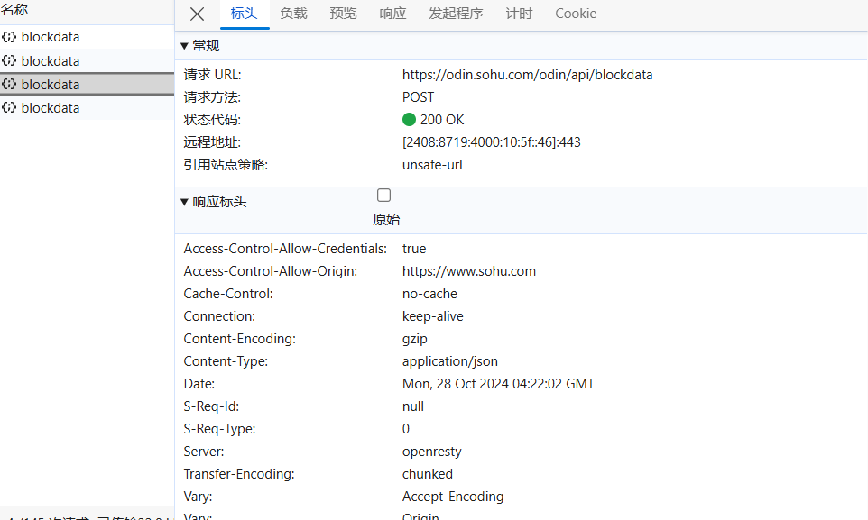

# 爬取动态网页

## 前置知识

### 抓包

参考网址：`https://c.biancheng.net/python_spider/capture-package.html`; `https://blog.csdn.net/cxyxx12/article/details/134945395`


## 实战案例

### 搜狐时政新闻爬取

搜狐时政新闻的新闻列表为动态渲染列表，下拉列表时新的新闻内容会即时请求得到并进行渲染。

url: `https://www.sohu.com/xchannel/tag?key=%E6%96%B0%E9%97%BB-%E6%97%B6%E6%94%BF&scm=10001.581_14-201000.0.10005.0&spm=smpc.channel_114.block3_77_a6GaGx_1_nav.2.1730088963335f8d7Iyb_1523`

本次实验爬取搜狐时政新闻列表中的前一百条。

应用API：
```python
import pandas as pd
from Util.my_params import params
from fake_useragent import UserAgent
import requests
import json
import sys
import io
import re
import time
import pymysql
```

#### 找到数据源

打开开发者模式，点击网络，刷新页面，搜索页面内容，查找到页面数据在第三个`blockdata`数据包中。


下拉列表，发现数据会同步更新。新的数据出现在下一个数据包中。


查看数据包的请求头。



请求头显示，对数据的请求为POST请求，**请求体格式`Content-Type`为json**。POST数据需要请求体，接下来查看负载。


经过整理后如下：

```json
{
  "pvId": "1730089320994_lkOOkCU",
  "pageId": "1730089324188_1666494726322v_YQ8",
  "mainContent": {
    "productType": "13",
    "productId": "1523",
    "secureScore": "50",
    "categoryId": "47",
    "adTags": "20000111",
    "authorId": 121135924
  },
  "resourceList": [
    {
      "tplCompKey": "TPLFeedMul_2_9_feedData",
      "isServerRender": false,
      "isSingleAd": false,
      "configSource": "mp",
      "content": {
        "productId": "438647",
        "productType": "15",
        "size": 20,
        "pro": "0,1",
        "feedType": "XTOPIC_SYNTHETICAL",
        "view": "feedMode",
        "innerTag": "news-slice",
        "spm": "smpc.channel_114.block3_77_O0F7zf_1_fd",
        "page": 1,
        "requestId": "1730089323638AkJOjpr_1523"
      },
      "adInfo": {
        "posCode": 10076,
        "rule": 2,
        "turn": 5,
        "number": 1,
        "begin": 5,
        "mergeType": 0
      },
      "context": {
        "mkey": ""
      }
    }
  ]
}
```

这份请求体中有两个参数`page`和`size`，`size = 20`代表该数据包下有20条新闻数据，这些新闻数据除了网页渲染的数据外还有一些额外数据并不参与网页新闻列表的渲染中，我们只取渲染在列表中的数据。`page = 1`代表该网络包为网页列表请求得到的第一份数据，也就是列表上渲染的前16个新闻。

确定好数据源和请求方式后，接下来的操作和静态网页获取并没有太大区别。

#### 发送请求获取一级页数据

先尝试获取第一页的数据。

```python
class SouHuSpider(object):
    def __init__(self):
        self.url = 'https://odin.sohu.com/odin/api/blockdata'
        self.ua = UserAgent()
        self.json = params

    def get_html(self):
        headers = {'User-Agent': self.ua.random}
        response = requests.post(url=self.url, headers=headers, json=self.json)
        return response.text

    def run(self):
        html_text = self.get_html()
        print(html_text)
```

```bash
{"code":0,"message":"success","data":{"TPLFeedMul_2_9_feedData":{"meta":{"id":"438647","title":"要闻资讯","tags":null,"description":"","cover":"","categoryId":"47",...
```

尝试获取前十页的数据。

```python
def get_html1(self):
    url = self.url + '/odin/api/blockdata'
    request_body = self.json
    html_list = []
    for page in range(1, 11):
        headers = {'User-Agent': self.ua.random}
        request_body['resourceList'][0]['content']['page'] = page
        response = requests.post(url=url, headers=headers, json=request_body)
        html_list.append(response.text)
    return html_list
```


#### 解析一级页数据

接下来尝试解析数据，从源数据中获取标题、封面url、正文介绍、网页url四个数据项。

```python
    def parse_html1(self, html1_list):
        # 将数据存在dataframe中
        news_data1 = pd.DataFrame(columns=['brief', 'img_url', 'title', 'news_url'])

        # 记录获取的新闻数量
        news_num = 0

        # 遍历新闻页列表，从每一页中获取新闻
        for html1_text in html1_list:
            # 将json字符串转换为字典对象
            html1_dict = json.loads(html1_text)

            # 获取新闻列表数据
            html1_list = html1_dict['data']['TPLFeedMul_2_9_feedData']['list']

            for html1 in html1_list:
                try:
                    brief = html1['brief']
                    # 有一些图片url没有 https: 开头
                    if not html1['cover'][0].startswith('https:'):
                        img_url = 'https:' + html1['cover'][0]
                    else:
                        img_url = html1['cover'][0]
                    title = html1['title']
                    news_url = html1['url']
                    news_data1.loc[len(news_data1)] = [brief, img_url, title, news_url]
                    news_num += 1
                    print(f'已得到新闻数据{news_num}条')
                except KeyError:
                    print('非新闻数据')
        news_data1.to_excel('news_data1.xlsx', sheet_name='Sheet', index=False)
```

#### 获取二级页数据

由于二级页本身是静态的，所以可以直接使用一级页得到的url获得二级页数据。

在打印二级页面数据时有一个问题，那就是在Windows平台下，pycharm打印方法print()默认按照gbk编码。参考静态数据爬取-编码/解码一节解决该问题。

```python
sys.stdout = io.TextIOWrapper(sys.stdout.buffer, encoding='gb18030')  # 改变标准输出的默认编码

def get_html2(self, url):
    headers = {'User-Agent': self.ua.random}
    response = requests.get(url=url, headers=headers)
    return response.text
```

#### 解析二级页数据

除了二级页面的静态数据外，还要获取一个动态数据，动态数据的url例如：`https://v2.sohu.com/public-api/articles/820605819/pv?callback=_fn_1730114418391&`

通过在开发模式查询`public-api/articles/`、`820605819`、`fn_`可知，这串url中，只有`820605819`和`1730114418391`，其中`820605819`来自源网页静态页面的`news_id: "820605819"`，通过正则表达式可直接得到，而`1730114418391`来自如下代码：

```javascript
var o = "_fn_".concat((new Date).getTime());
```

这行代码返回自 1970 年 1 月 1 日 00:00:00 UTC（也称为 Unix 时间戳）以来的毫秒数。

在python中可以通过以下代码获得：

```python
import time

# 获取毫秒级的 Unix 时间戳
unix_timestamp_ms = int(time.time() * 1000)
print(unix_timestamp_ms)  # 输出类似于 1634238378123
```

> 其实这些内容在一级页面的数据包里已经给出来了，但是为了强化我们的爬虫能力，这里还是建议多做一些工作，毕竟不是每个一级页都这么友好。

在二级页面的解析中有三个问题值得注意。

第一个是在网页源代码中地区的正则表达式为`'发布于：</span><span>(.*?)</span>'`，但是在爬下来的代码中，地区的正则表达式为`'<div class=\"ip\">发布于：(.*?)</div>'`。
`<div class="area"><span>发布于：</span><span>北京市</span></div>`这是源代码中的地区。
`'<div class=\"ip\">发布于：北京市</div>'`这是爬取下来的地区。
并不是所有页面都是如此，这种情况比较随机，也就是爬下来的网页代码既有可能是第一种，也有可能是第二种。

第二个问题是根据源代码得到的正则表达式对时间和ID号不起作用，这个可能是不同网页的结构设计问题，好在所有网页在开头都有统一的`meta`标签表明了时间和ID号。

第三个问题是SSL认证的问题，在爬取过程中有时会报错SSLError，据GPT说这是因为目标服务器的SSL认证没有通过，跟我无关，但浏览器访问时没有这个错误，原因不明。

```python
  def parse_html2(self, html2_text):
      news_time, area, news_id, read_num = None, None, None, None

      # 首先提取日期和发布地点两个静态数据
      time_pattern = '<meta property="og:release_date" content="(.*?)"/>'
      try:
          news_time = re.findall(time_pattern, html2_text, re.S)[0]
          print(news_time)
      except IndexError as e:
          print('时间出错：', e)
          print(news_time)
          print(html2_text)
          sys.exit(1)


      area_list = re.findall('发布于：</span><span>(.*?)</span>', html2_text, re.S)
      if not area_list:
          area_list = re.findall('<div class=\"ip\">发布于：(.*?)</div>', html2_text, re.S)
      if area_list:
          area = area_list[0]
      else:
          area = '该新闻未声明发布地点'
          print('#' * 80)
      print(area)

      # 然后提取动态数据阅读量
      # 动态阅读量需要news_id和当前的Unix时间戳(ms)作为参数
      try:
          news_id = re.findall('<meta property="og:url" content=".*?.sohu.com/a/(.*?)_', html2_text, re.S)[0]
          print(news_id)
      except IndexError as e:
          print('ID出错：', e)
          print(news_id)
          print(html2_text)
          sys.exit(1)
      # 获取毫秒级的 Unix 时间戳
      unix_timestamp_ms = int(time.time() * 1000)
      # 拼接阅读量url
      read_num_url = f'https://v2.sohu.com/public-api/articles/{news_id}/pv?callback=_fn_{unix_timestamp_ms}&'
      # 获取阅读量
      headers = {'User-Agent': self.ua.random}
      read_text = requests.get(url=read_num_url, headers=headers)
      pattern = f'_fn_{unix_timestamp_ms}\((.*?)\)'
      try:
          read_num = re.findall(pattern, read_text.text, re.S)[0]
          print(read_num)
      except IndexError as e:
          print('阅读量出错：', e)
          print(read_num)
          print(html2_text)
          sys.exit(1)
      return news_time, area, read_num


def update_data(self, row):
    print('=' * 20)
    print(row['news_url'])
    news_time, area, read_num = None, None, None
    try:
        html_text = self.get_html2(row['news_url'])
        news_time, area, read_num = self.parse_html2(html_text)
    except requests.exceptions.SSLError as e:
        print('SSL认证出错：', e)

    row['news_time'] = news_time
    row['area'] = area
    row['read_num'] = read_num
    return row
```

#### 保存数据到mysql

```python
def save_data(self, news_data):
    # 插入数据
    insert_sql = ('insert into news (brief, img_url, title, news_url, news_time, area, read_num)'
                    ' values (%s, %s, %s, %s, %s, %s, %s)')
    self.cursor.executemany(insert_sql, news_data.values.tolist())
    self.connection.commit()
    print('数据写入完成')
    self.cursor.close()
    self.connection.close()
```


#### 总结

在一级页面爬取到标题、封面、简介、新闻url，二级页面爬取到发表地、时间、阅读量。

全部代码如下：

```python
import pandas as pd
from Util.my_params import params
from fake_useragent import UserAgent
import requests
import json
import sys
import io
import re
import time
import pymysql


class SouHuSpider(object):
    def __init__(self):
        self.url = 'https://odin.sohu.com'
        self.ua = UserAgent()
        self.json = params
        self.connection = pymysql.connect(
            host='localhost',
            user='root',
            password='123456',
            database='souhuweb'
        )
        self.cursor = self.connection.cursor()

    def get_html1(self):
        url = self.url + '/odin/api/blockdata'
        request_body = self.json
        html_list = []
        for page in range(1, 11):
            headers = {'User-Agent': self.ua.random}
            request_body['resourceList'][0]['content']['page'] = page
            response = requests.post(url=url, headers=headers, json=request_body)
            html_list.append(response.text)
        return html_list

    def parse_html1(self, html1_list):
        # 将数据存在dataframe中
        news_data1 = pd.DataFrame(columns=['brief', 'img_url', 'title', 'news_url'])

        # 记录获取的新闻数量
        news_num = 0

        # 遍历新闻页列表，从每一页中获取新闻
        for html1_text in html1_list:
            # 将json字符串转换为字典对象
            html1_dict = json.loads(html1_text)

            # 获取新闻列表数据
            html1_list = html1_dict['data']['TPLFeedMul_2_9_feedData']['list']

            for html1 in html1_list:
                try:
                    brief = html1['brief']
                    # 有一些图片url没有 https: 开头
                    if not html1['cover'][0].startswith('https:'):
                        img_url = 'https:' + html1['cover'][0]
                    else:
                        img_url = html1['cover'][0]
                    title = html1['title']
                    news_url = 'https://www.sohu.com' + html1['url']
                    news_data1.loc[len(news_data1)] = [brief, img_url, title, news_url]
                    news_num += 1
                    print(f'已得到新闻数据{news_num}条')
                except KeyError:
                    print('非新闻数据')
        return news_data1

    def get_html2(self, url):
        headers = {'User-Agent': self.ua.random}
        response = requests.get(url=url, headers=headers)
        return response.text

    def parse_html2(self, html2_text):
        news_time, area, news_id, read_num = None, None, None, None

        # 首先提取日期和发布地点两个静态数据
        time_pattern = '<meta property="og:release_date" content="(.*?)"/>'
        try:
            news_time = re.findall(time_pattern, html2_text, re.S)[0]
            print(news_time)
        except IndexError as e:
            print('时间出错：', e)
            print(news_time)
            print(html2_text)
            sys.exit(1)


        area_list = re.findall('发布于：</span><span>(.*?)</span>', html2_text, re.S)
        if not area_list:
            area_list = re.findall('<div class=\"ip\">发布于：(.*?)</div>', html2_text, re.S)
        if area_list:
            area = area_list[0]
        else:
            area = '该新闻未声明发布地点'
            print('#' * 80)
        print(area)

        # 然后提取动态数据阅读量
        # 动态阅读量需要news_id和当前的Unix时间戳(ms)作为参数
        try:
            news_id = re.findall('<meta property="og:url" content=".*?.sohu.com/a/(.*?)_', html2_text, re.S)[0]
            print(news_id)
        except IndexError as e:
            print('ID出错：', e)
            print(news_id)
            print(html2_text)
            sys.exit(1)
        # 获取毫秒级的 Unix 时间戳
        unix_timestamp_ms = int(time.time() * 1000)
        # 拼接阅读量url
        read_num_url = f'https://v2.sohu.com/public-api/articles/{news_id}/pv?callback=_fn_{unix_timestamp_ms}&'
        # 获取阅读量
        headers = {'User-Agent': self.ua.random}
        read_text = requests.get(url=read_num_url, headers=headers)
        pattern = f'_fn_{unix_timestamp_ms}\((.*?)\)'
        try:
            read_num = re.findall(pattern, read_text.text, re.S)[0]
            print(read_num)
        except IndexError as e:
            print('阅读量出错：', e)
            print(read_num)
            print(html2_text)
            sys.exit(1)
        return news_time, area, read_num

    def save_data(self, news_data):
        # 插入数据
        insert_sql = ('insert into news (brief, img_url, title, news_url, news_time, area, read_num)'
                      ' values (%s, %s, %s, %s, %s, %s, %s)')
        self.cursor.executemany(insert_sql, news_data.values.tolist())
        self.connection.commit()
        print('数据写入完成')
        self.cursor.close()
        self.connection.close()


    def run(self):
        html1_list = self.get_html1()
        news_data1 = self.parse_html1(html1_list)
        news_data1.to_excel('news_data1.xlsx', index=False)
        sys.stdout = io.TextIOWrapper(sys.stdout.buffer, encoding='gb18030')  # 改变标准输出的默认编码
        news_data2 = news_data1.apply(self.update_data, axis=1).dropna()
        news_data2.to_excel('news_data2.xlsx', index=False)

        self.save_data(news_data2)


    def update_data(self, row):
        print('=' * 20)
        print(row['news_url'])
        news_time, area, read_num = None, None, None
        try:
            html_text = self.get_html2(row['news_url'])
            news_time, area, read_num = self.parse_html2(html_text)
        except requests.exceptions.SSLError as e:
            print('SSL认证出错：', e)

        row['news_time'] = news_time
        row['area'] = area
        row['read_num'] = read_num
        return row


def main():
    spider = SouHuSpider()
    spider.run()
```
