# 一般分类方法

> 参考资料：`https://scikit-learn.org.cn/view/4.html`; `https://chatgpt.com/`; `https://chatglm.cn/main/alltoolsdetail?lang=zh`。

## 最近邻分类

### 介绍

sklearn.neighbors提供了基于近邻的无监督和有监督的学习方法的功能。无监督最近邻是许多其他学习方法的基础。有监督的 neighbors-based (基于邻居的) 学习有两种方式：离散标签数据的分类和连续标签数据的回归。

最近邻方法背后的原理是**找到在距离上离新样本最近的一些样本， 并且从这些样本中预测标签。** 最近邻的样本数可以是用户定义的常数( **k-最近邻** )，也可以根据不同的点的局部密度( **基于半径的近邻学习** )确定。一般来说，距离可以用任意来度量：**标准的欧氏距离是最常见的选择**。基于邻居的方法被称为非泛化机器学习方法，因为它们只是“记住”它的所有训练数据(可能转换成一个快速的索引结构，比如Ball树或KD树)。

尽管它很简单，但最近邻已经成功地解决了大量的分类和回归问题，包括手写数字和卫星图像等场景。作为一种非参数方法，在决策边界非常不规则的情况下通常是成功的。

sklearn.neighbors 中的类输入不管是numpy中的array数组， 还是scipy.sparse矩阵都可以处理。对于密集矩阵，可以支持大量的距离度量。于稀疏矩阵，支持任意的Minkowski度量进行搜索。

---

基于近邻的分类是一种基于实例的学习或非泛化学习： **它不是试图构造一个通用的内部模型，而是简单地存储训练数据的实例。** 分类是由每个点的最近邻的简单多数投票中计算得到的： **一个查询点被标记的数据标签是由它最近邻点中最具代表性的数据标签来决定的。** 

`scikit-learn`实现了两个不同的最近邻分类器： `KNeighborsClassifier` 分类器根据每个查询点的k个最近邻实现学习，其中k是用户指定的整数值。 `RadiusNeighborsClassifier`分类器根据每个训练点的固定半径r内的邻居数实现学习，其中r是用户指定的浮点值。

基本的最近邻分类使用一样的权重：也就是说，**分配给查询点的值是根据最近邻居的简单多数投票计算的** 。在某些情况下，最好是对邻居进行加权，这样更靠近的邻居对拟合来说贡献更大。这可以通过 **weights关键字** 来实现。默认值是weights=“uniform”，为每个邻居分配同样的权重。weights = 'distance'分配的权重与到查询点的距离成反比。或者，可以提供用户定义的距离函数来计算权重.

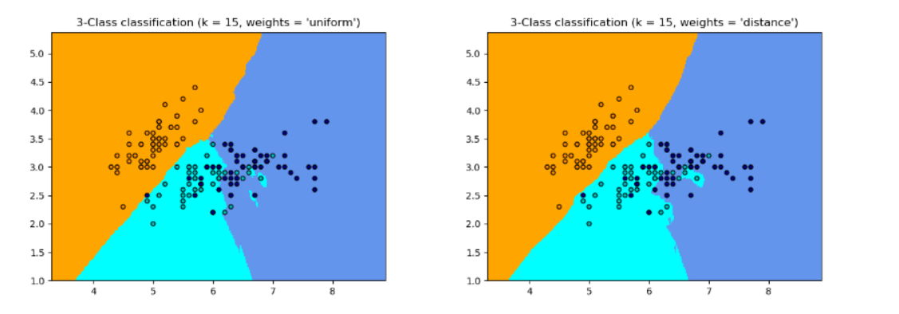

### K最近邻分类

`KNeighborsClassifier` 中的K近邻分类是最常用的分类方法。k值的最佳选择是高度依赖于数据的：一般来说，较大的k会抑制噪声的影响，但使分类边界不那么清晰。

#### 代码

##### 一般过程

1. 导入所需库

```python
from sklearn.neighbors import KNeighborsClassifier
from sklearn.model_selection import train_test_split
from sklearn.datasets import load_iris
from sklearn.metrics import accuracy_score
```

- KNeighborsClassifier：这是Scikit-Learn中的KNN分类器实现，可以直接用于训练和预测。
- train_test_split：用于将数据集划分为训练集和测试集。
- load_iris：加载Iris数据集，适合用于分类模型的学习和测试。
- accuracy_score：用于评估模型的分类准确率。

2. 加载数据集

```python
iris = load_iris()
X, y = iris.data, iris.target
```

- oad_iris：加载Iris数据集，其中包含150个花卉样本，每个样本有4个特征。
- X, y：X是特征数据，y是类别标签。

3. 划分训练集和测试集

```python
X_train, X_test, y_train, y_test = train_test_split(X, y, test_size=0.2, random_state=42)
```

- train_test_split：将数据集划分为训练集和测试集。test_size=0.2表示20%数据作为测试集，80%作为训练集。
- random_state：设置随机种子，以确保结果的可重复性。

4. 初始化KNN分类器

```python
knn = KNeighborsClassifier(n_neighbors=3)
```

- KNeighborsClassifier：创建KNN分类器实例。
- n_neighbors=3：设置K值，即每次分类时选择3个最近的邻居来决定类别。

5. 训练模型

```python
knn.fit(X_train, y_train)
```

6. 进行预测

```python
predictions = knn.predict(X_test)
```

7. 评估模型性能

```python
# 计算预测结果的准确率，即预测类别与真实类别的匹配比例。
accuracy = accuracy_score(y_test, predictions)
print("模型准确率:", accuracy)
```

## 决策树分类


决策树(DTs)是一种用于分类和回归的非参数有监督学习方法。其目标是创建一个模型，通过学习从数据特性中推断出的简单决策规则来预测目标变量的值。

---

决策树（Decision Tree）是一种基于树形结构的分类（或回归）算法，通过不断将数据集分割成不同的子集，最终在树的叶子节点上形成类别标签。在分类问题中，决策树根据特征值的不同，逐步将数据划分为不同的类别。

主要特点：
- **易于理解：** 决策树模型简单直观，类似于“如果-那么”的规则，非常容易解释和可视化。
- **非线性关系：** 可以捕捉到特征之间的非线性关系。
- **可以处理多类别问题：** 不仅支持二分类，也支持多分类问题。
- **无需特征缩放：** 不像支持向量机（SVM）和K近邻（KNN）等算法，决策树不需要对特征进行标准化或归一化。


### 决策树的工作原理

分裂过程：决策树通过 **选择一个特征** ，并 **找到一个最优的分割点** ，来将数据 **分割成两个或多个子集** 。这个过程是 **递归进行** 的，直到满足停止条件（如叶子节点的样本数过少或分类纯度足够高）。

节点选择标准：

- 信息增益（ID3）：基于每个特征对数据集分割后的信息增益来选择最优的分割特征。信息增益越大，选择该特征作为节点的优先级越高。
- 基尼不纯度（CART）：基尼不纯度越小，表示该节点的分类越纯，因此选择基尼不纯度最小的特征进行分裂。
> 基尼不纯度：
> 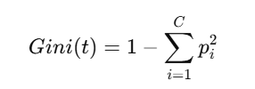
> t是当前节点，C是类别数量，pi表示类别i在当前节点的概率（占比）。
- 均方误差（MSE）：在回归问题中，通常使用均方误差来选择最优分割点。

树的构建：每个节点会基于某个特征进行分裂，直到满足停止条件，如树的深度限制或分裂后子集的纯度足够高。

剪枝（Pruning）：在树构建完成后，可能会出现过拟合的现象。为了解决这个问题，可以进行剪枝，通过 **删除一些冗余的分支** 来提升模型的泛化能力。

决策树分类的优缺点
- 优点
    - 易于解释和可视化：决策树是非常直观的，容易理解每个决策过程。
    - 无需特征预处理：不需要对数据进行标准化或归一化。
    - 能够处理缺失值：决策树能够处理含有缺失值的数据。
- 缺点
    - 容易过拟合：决策树容易在训练数据上过拟合，尤其是在数据较少或者噪声较多时。
    - 不稳定：对数据的小变化非常敏感，可能导致树的结构发生很大的变化。
    - 无法处理复杂的关系：对于某些高度复杂的非线性关系，决策树可能表现不好。

### 代码

DecisionTreeClassifier 默认采用的是 CART 算法，它用于分类和回归问题，选择基尼不纯度（Gini Impurity）作为分裂标准。

```python
# 导入所需的库
from sklearn.tree import DecisionTreeClassifier
from sklearn.model_selection import train_test_split
from sklearn.metrics import classification_report

# 假设 X 和 y 已经定义，X 是特征数据，y 是标签数据
X_train, X_val, y_train, y_val = train_test_split(X, y, test_size=0.3, random_state=42)

# 创建决策树分类器模型
dt_classifier = DecisionTreeClassifier(random_state=42)

# 训练模型
dt_classifier.fit(X_train, y_train)

# 进行预测
y_predict = dt_classifier.predict(X_val)

# 输出分类报告
print(classification_report(y_val, y_predict))
```

也可以使用其它分裂标准：

```python
# 使用信息增益（熵）作为分裂标准
dt_classifier = DecisionTreeClassifier(criterion='entropy', random_state=42)
```


## 支持向量机分类

支持向量机(SVMs)是一种用于分类、回归和异常检测的有监督学习方法。

---

支持向量机（Support Vector Machine, SVM）是一种监督学习算法，广泛用于分类任务，尤其是在高维空间和非线性问题上表现优异。SVM 的基本思想是通过寻找一个超平面来将不同类别的数据点分开，同时最大化分类间的间隔（margin），从而达到较好的分类效果。

### 介绍

#### 支持向量机分类的基本概念

超平面 (Hyperplane)：

- 在 SVM 中，超平面是 **将数据分开的一条边界线** （在二维空间中就是直线，在三维空间中是平面）。其目的是将数据点分为不同的类别。

- 对于二分类问题，SVM 寻找一个线性超平面，尽量使得两类数据点之间的间隔（margin）最大化。

支持向量 (Support Vectors)：

- 支持向量是 **距离超平面最近的那些数据点** 。它们是决定超平面位置的关键点，因此 SVM 仅依赖于支持向量进行训练。

- 支持向量决定了分类的边界，其他的训练样本对模型的影响较小。

间隔 (Margin)：

- 间隔是指 **从超平面到最近的支持向量的距离** 。SVM 的目标是最大化这个间隔，因为较大的间隔通常能带来更好的泛化能力。

核函数 (Kernel Function)：

- 在实际问题中，数据点往往不是线性可分的。为了处理这种情况，SVM 引入了核函数，通过 **将数据映射到高维空间** 来实现非线性分类。
常用的核函数有 **线性核、多项式核、高斯径向基核（RBF核）** 等。

#### SVM 分类的流程

SVM 的工作流程大致分为以下几个步骤：

- 步骤 1：数据预处理：将数据集中的 **特征标准化** ，使得每个特征的尺度相近，这有助于提高 SVM 的训练效果。
- 步骤 2：选择核函数：选择合适的核函数，如果数据是线性可分的，可以使用 **线性核** ；如果数据是非线性可分的，可以选择  **RBF核** 等。
- 步骤 3：训练模型：训练 SVM 模型，SVM 会 **自动寻找最佳的超平面** 来分类数据。
步骤 4：评估模型：通过 **交叉验证** 等方式评估模型的泛化能力。

#### SVM 分类的数学原理

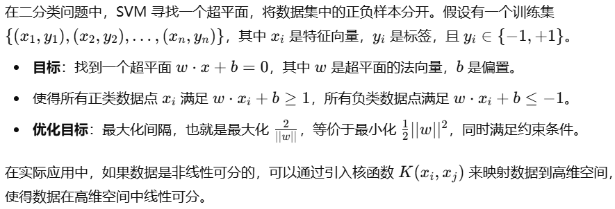

SVM 的优点：
- 高维空间表现优秀：SVM 在高维空间中表现较好，尤其适用于文本分类、图像分类等领域。
- 有效性：当数据量较小且维度较高时，SVM 依然能保持较好的性能。
- 使用核函数处理非线性问题：SVM 通过核技巧（Kernel Trick）可以高效处理非线性可分问题。

SVM 的缺点
- 计算开销大：当训练数据量非常大时，SVM 的训练时间和计算开销会增加。
- 对参数敏感：SVM 的性能对核函数和正则化参数的选择较为敏感，需要进行一定的调参。

#### SVM 分类的超参数

C（正则化参数）：C 是 SVM 中的一个重要超参数，控制着模型对误分类的容忍度。较大的 C 值会导致模型更关注训练集的准确性，可能会导致过拟合；较小的 C 值则会使模型更关注间隔的最大化，可能会导致欠拟合。

核函数：核函数的选择对模型性能影响较大，常见的核函数包括：

**线性核（kernel='linear'）：**

应用场景：适用于线性可分的数据集。

特点：线性核函数假设数据可以通过一个简单的线性超平面进行分割。即，数据本身在输入空间中已经是线性可分的。

适用情况：
- 当数据点在输入空间中能够通过一个简单的线性决策边界分开时使用。
- 适用于高维稀疏数据（例如文本分类、基因数据分类），其中每个特征的权重比较小，很多特征为零。
- 计算速度较快，不需要进行复杂的映射。

示例应用：

- 文本分类：如垃圾邮件分类，文本特征通常是稀疏的（例如词频向量化后，每个文档只有少数的特征非零），且文本数据有时是线性可分的。
- 图像分类：在某些情况下，简单的线性分类就能取得不错的效果。


**高斯径向基核（RBF核，kernel='rbf'）：**

应用场景：适用于非线性可分的数据集，尤其是当数据在原始空间中无法通过简单的直线分割时。

特点：RBF 核是最常用的核函数，适用于大多数实际问题。它通过将数据映射到一个高维空间，使得数据在这个空间中线性可分。

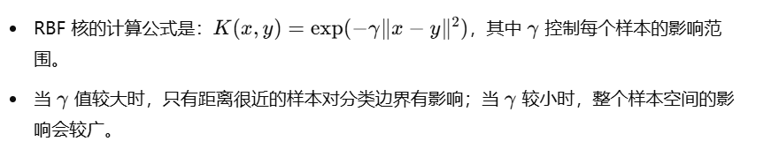

适用情况：

- 数据的决策边界是非线性的，且数据不能通过简单的线性超平面分割时使用。
- 适用于特征空间高且复杂的非线性问题。
- 适用于一般的分类任务，特别是那些具有复杂、非线性决策边界的任务。

示例应用：

- 图像分类：如手写数字识别，图像数据通常具有非线性特征，需要通过高维映射来实现良好的分类。
- 生物信息学：例如基因表达数据分析，许多生物学数据集具有非线性分布。

**多项式核（kernel='poly'）：**

应用场景：适用于数据之间的关系可以通过多项式关系来建模的情况。

特点：多项式核通过将数据映射到一个高维空间，适用于特征之间具有某种多项式关系的情况。其计算公式为：

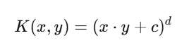

其中，d是多项式的度数，c是常数，控制模型的复杂度。

适用情况：

- 当数据之间的关系可以通过多项式拟合时使用。
- 适用于一些特征间存在交互效应的情形，例如，在某些情况下，特征之间的关系可能是二次的或三次的。
- 适用于一些具有复杂决策边界的场景，但不如 RBF 核那么普遍。

示例应用：

- 面部识别：面部图像分类中，数据的特征可能通过多项式关系得到更好的拟合。
- 时序预测：一些时间序列数据可能通过多项式模型来描述趋势或模式。


**Sigmoid 核（kernel='sigmoid'）：**

应用场景：适用于具有某种S形决策边界的数据，类似于神经网络的激活函数。

特点：Sigmoid 核的计算公式为：

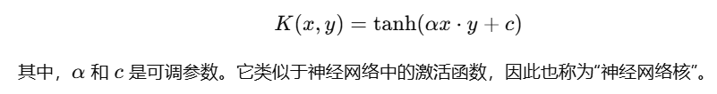

该核函数将数据映射到一个非线性空间，类似于神经网络中的非线性层。

适用情况：

- 当数据之间存在某种S形的关系时，可以使用Sigmoid核。
- 适用于某些需要神经网络风格的决策边界的任务。
- 一般来说，Sigmoid 核的使用不如其他核函数（如 RBF 和线性核）普遍，且在 SVM 中使用时较为罕见。

示例应用：

- 神经网络模拟：在某些任务中，SVM 可能与神经网络类似，用于模拟神经网络的行为。
- 二值分类问题：对于一些需要类似于神经网络的模型结构的应用场景，Sigmoid 核可以提供类似的效果。


### 代码

```python
from sklearn.svm import SVC
from sklearn.datasets import load_iris
from sklearn.model_selection import train_test_split
from sklearn.metrics import classification_report

# 加载数据集
data = load_iris()
X = data.data
y = data.target

# 将数据集分为训练集和测试集
X_train, X_val, y_train, y_val = train_test_split(X, y, test_size=0.3, random_state=42)

# 创建 SVM 模型，使用 RBF 核
svm_model = SVC(kernel='rbf', C=1, gamma='scale')

# 训练模型
svm_model.fit(X_train, y_train)

# 进行预测
y_predict = svm_model.predict(X_val)

# 输出分类报告
print(classification_report(y_val, y_predict))
```

- SVC(kernel='rbf')：创建一个支持向量机分类器，选择 RBF 核函数进行非线性分类。
- C=1：设置正则化参数 C，控制间隔的宽度和对误分类的容忍度。
- gamma='scale'：设置核函数的参数（对于 RBF 核，gamma 控制每个样本对分类边界的影响）。

## 朴素贝叶斯分类

### 介绍

朴素贝叶斯方法是一组基于贝叶斯定理的有监督学习算法，在给定类变量值的情况下，假设每一对特征之间的条件独立性为“朴素”假设。

---

朴素贝叶斯（Naive Bayes）是一种基于贝叶斯定理的简单概率分类算法，广泛应用于文本分类、垃圾邮件过滤、情感分析等任务。它是通过计算每个类别在给定特征的条件下出现的概率，然后选择概率最大的一类作为预测结果。

朴素贝叶斯算法的核心是 **贝叶斯定理** ，贝叶斯定理描述了条件概率的计算公式：

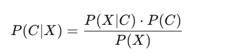

其中：

- P(C∣X) 是在给定特征 X 的情况下，类别 C 的后验概率（我们要计算的目标）。
- P(X∣C) 是在类别 C 下，给定特征 X 的似然概率。
- P(C) 是类别 C 的先验概率，即数据集中每个类别的概率。
- P(X) 是特征 X 的概率，通常是一个常数，在分类时可以忽略。

朴素贝叶斯算法的一个关键假设是特征条件独立性假设（Naive Assumption）。即假设每个特征在给定类别的条件下相互独立。尽管现实中数据的特征通常是相关的，这一假设使得朴素贝叶斯分类器非常简单，并且在许多实际应用中表现良好。

根据这一假设，贝叶斯定理可以被简化为：


即在给定类别的情况下，特征X是条件独立的。因此，我们只需要计算每个特征Xi在类别C下的条件概率 ，并将这些概率相乘。


根据特征数据的类型，朴素贝叶斯分类器有几个不同的变种：

- 高斯朴素贝叶斯（Gaussian Naive Bayes）：适用于特征是 **连续值** 且 **服从高斯分布** （正态分布）的情况。它假设每个特征在每个类别下都遵循正态分布。
- 多项式朴素贝叶斯（Multinomial Naive Bayes）：适用于特征是 **离散计数数据** 的情况，通常用于文本分类任务中，特征表示为单词的出现次数。
- 伯努利朴素贝叶斯（Bernoulli Naive Bayes）：适用于 **二元特征** （0或1）的情况，也常用于文本分类任务中。

---

朴素贝叶斯的优缺点：

优点：

- 简单且高效：算法非常简单，计算速度快，适用于大规模数据集。
- 适应性强：即使特征之间存在某些依赖关系，朴素贝叶斯在很多情况下仍然能够给出较好的分类结果。
- 适用于高维数据：朴素贝叶斯在特征维度非常高的情况下（如文本数据）表现良好，特别是当特征数目远大于样本数时。

缺点：

- 强烈的独立性假设：朴素贝叶斯的独立性假设在实际数据中通常并不成立，因此有时可能导致性能不佳。
- 对稀有事件敏感：如果训练数据中某个类别的某个特征在测试集中未出现，朴素贝叶斯会把该类别的概率降为零。为了解决这个问题，通常采用平滑技术（如拉普拉斯平滑）。

朴素贝叶斯算法非常适合处理文本数据，尤其是文本分类任务（例如垃圾邮件分类、情感分析、新闻分类等）。它还可以应用于其他具有高维特征的分类问题，如医学诊断、用户行为分析等。

### 代码

```python
from sklearn.naive_bayes import GaussianNB
from sklearn.datasets import load_iris
from sklearn.model_selection import train_test_split
from sklearn.metrics import accuracy_score

# 加载数据集
data = load_iris()
X = data.data
y = data.target

# 将数据集分为训练集和测试集
X_train, X_val, y_train, y_val = train_test_split(X, y, test_size=0.3, random_state=42)

# 创建高斯朴素贝叶斯模型
nb_model = GaussianNB()

# 训练模型
nb_model.fit(X_train, y_train)

# 进行预测
y_predict = nb_model.predict(X_val)

# 计算准确率
accuracy = accuracy_score(y_val, y_predict)
print(f"Accuracy: {accuracy:.2f}")
```


## 常用函数

### 性能评估

#### 准确率 (Accuracy)

正确分类的样本数占总样本数的比例，即：

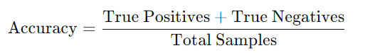

适合类别分布均衡的数据集。对于类别不均衡的数据（如正负样本数量差距较大），准确率可能不够全面。

```python
# 导入用于计算准确率的库
from sklearn.metrics import accuracy_score

# 计算准确率
accuracy = accuracy_score(y_val, y_predict)
print("准确率:", accuracy)
```

#### 精确率 (Precision)

在模型预测为正类的样本中，实际为正类的比例，即：

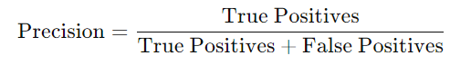

适合关注正类样本的情况，特别是对假阳性样本（误将负类预测为正类）敏感的场景，如垃圾邮件检测。

```python
# 导入用于计算精确率的库
from sklearn.metrics import precision_score

# 计算精确率
precision = precision_score(y_val, y_predict, average='macro')  # 对多分类问题使用'macro'平均
print("精确率:", precision)
```

> average='macro'表示对多分类问题计算各类别召回率的平均值。

#### 召回率 (Recall)

在所有实际为正类的样本中，模型正确识别出的比例，即：

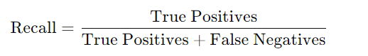

适合关注正类的漏检情况，尤其在需要确保识别尽可能多的正类样本的场景，如疾病检测。

```python
# 导入用于计算召回率的库
from sklearn.metrics import recall_score

# 计算召回率
recall = recall_score(y_val, y_predict, average='macro')
print("召回率:", recall)
```


#### F1分数 (F1 Score)

精确率和召回率的调和平均值，用来平衡两者，即：

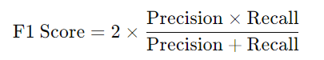

适合类别不平衡的数据，特别在精确率和召回率都很重要时使用。F1分数可以帮助权衡这两者。

```python
# 导入用于计算 F1 分数的库
from sklearn.metrics import f1_score

# 计算 F1 分数
f1 = f1_score(y_val, y_predict, average='macro')
print("F1 分数:", f1)
```


#### AUC-ROC 曲线

ROC曲线：表示真阳性率（召回率）和假阳性率的关系。

AUC (Area Under Curve)：ROC曲线下的面积。AUC越接近1，模型的区分能力越好。

适合评估分类器的整体表现，尤其在类别不平衡时是较常用的评估标准。

```python
# 导入用于计算 AUC 和绘制 ROC 曲线的库
from sklearn.metrics import roc_auc_score, roc_curve
import matplotlib.pyplot as plt

# 计算 AUC 并绘制 ROC 曲线（仅适用于二分类）
if len(set(y_val)) == 2:  # 确保是二分类问题
    y_prob = knn.predict_proba(X_val)[:, 1]  # 得到预测为正类的概率
    auc_score = roc_auc_score(y_val, y_prob)
    print("AUC 得分:", auc_score)
    
    # 计算并绘制 ROC 曲线
    fpr, tpr, _ = roc_curve(y_val, y_prob)
    plt.plot(fpr, tpr, label=f"AUC = {auc_score:.2f}")
    plt.xlabel("False Positive Rate")
    plt.ylabel("True Positive Rate")
    plt.title("ROC Curve")
    plt.legend()
    plt.show()
```

#### 混淆矩阵 (Confusion Matrix)

展示分类模型的预测结果，其中每个元素表示真实类别和预测类别的组合，如下所示：

- True Positive (TP)：正类预测为正类
- True Negative (TN)：负类预测为负类
- False Positive (FP)：负类预测为正类
- False Negative (FN)：正类预测为负类

可直观地看到模型对不同类别的预测效果，尤其适合多分类问题。

```python
# 导入用于生成混淆矩阵的库
from sklearn.metrics import confusion_matrix

# 生成并打印混淆矩阵
conf_matrix = confusion_matrix(y_val, y_predict)
print("混淆矩阵:\n", conf_matrix)
```

#### 分类报告 (Classification Report)

Scikit-Learn提供的分类报告，会展示各类别的精确率、召回率、F1分数和支持数量（样本数）。

适合多分类任务，可以帮助综合评估模型对各类的分类效果。

```python
# 导入用于生成分类报告的库
from sklearn.metrics import classification_report

# 生成并打印分类报告
class_report = classification_report(y_val, y_predict)
print("分类报告:\n", class_report)
```

```
              precision    recall  f1-score   support

           0       0.89      0.85      0.87       100
           1       0.83      0.88      0.85       120

    accuracy                           0.86       220
   macro avg       0.86      0.86      0.86       220
weighted avg       0.86      0.86      0.86       220
```

- 精确率（Precision）：对于类别 0，精确率为 0.89，表示模型预测为类别 0 的样本中有 89% 是正确的。对于类别 1，精确率为 0.83。
- 召回率（Recall）：对于类别 0，召回率为 0.85，表示实际为类别 0 的样本中有 85% 被正确分类为类别 0。对于类别 1，召回率为 0.88。
- F1 分数（F1-score）：对于类别 0，F1 分数为 0.87，表示精确率和召回率的综合表现。对于类别 1，F1 分数为 0.85。
- 支持数量（Support）：类别 0 和类别 1 分别有 100 和 120 个样本。

- 宏观平均（macro avg）：表示精确率、召回率和F1分数的算术平均：
    - 精确率：(0.89 + 0.83) / 2 = 0.86
    - 召回率：(0.85 + 0.88) / 2 = 0.86
    - F1分数：(0.87 + 0.85) / 2 = 0.86

- 加权平均（weighted avg）：根据每个类别的样本数对每个类别的精确率、召回率和F1分数进行加权平均：
    - 精确率：(0.89 * 100 + 0.83 * 120) / 220 = 0.86
    - 召回率：(0.85 * 100 + 0.88 * 120) / 220 = 0.86
    - F1分数：(0.87 * 100 + 0.85 * 120) / 220 = 0.86


