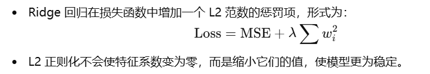

# 线性模型

> 参考资料：`https://scikit-learn.org.cn/view/4.html`; `https://chatgpt.com/`; `https://chatglm.cn/main/alltoolsdetail?lang=zh`。

关于线性模型的解释：


## 普通最小二乘法

### 介绍


```python
from sklearn import linear_model  # 导入sklearn的线性模型模块

# 创建一个线性回归模型实例
reg = linear_model.LinearRegression()

# 使用fit方法训练模型，输入三个特征向量和一个目标向量
# 特征向量是[[0, 0], [1, 1], [2, 2]]，目标向量是[0, 1, 2]
reg.fit([[0, 0], [1, 1], [2, 2]], [0, 1, 2])

# 打印模型信息，这里没有实际输出，只是调用LinearRegression类
LinearRegression()

# 输出模型的系数，即线性回归方程的斜率
# 输出结果为array([0.5, 0.5])，表示模型的方程为 y = 0.5 * x1 + 0.5 * x2
reg.coef_
```

> 普通最小二乘的系数估计依赖于特征的独立性。当特征相关且设计矩阵`X`的列之间具有近似线性相关性时， 设计矩阵趋于奇异矩阵，最小二乘估计对观测目标的随机误差高度敏感，可能产生很大的方差。例如，在没有实验设计的情况下收集数据时，就可能会出现这种多重共线性的情况。

### 示例

该示例计算了系数、残差平方和及确定系数。

```python
# 打印当前模块的文档字符串
print(__doc__)

# 代码来源：Jaques Grobler
# 许可证：BSD 3条款

import matplotlib.pyplot as plt  # 导入matplotlib的pyplot模块，用于绘图
import numpy as np  # 导入numpy库，用于数值计算
from sklearn import datasets  # 导入sklearn的datasets模块，用于加载数据集
from sklearn.linear_model import LinearRegression  # 导入线性回归模型
from sklearn.metrics import mean_squared_error, r2_score  # 导入用于评估模型的指标

# 加载糖尿病数据集
diabetes_X, diabetes_y = datasets.load_diabetes(return_X_y=True)

# 仅使用一个特征
diabetes_X = diabetes_X[:, np.newaxis, 2]

# 将数据分为训练集和测试集
diabetes_X_train = diabetes_X[:-20]  # 训练集特征
diabetes_X_test = diabetes_X[-20:]  # 测试集特征

# 将目标分为训练集和测试集
diabetes_y_train = diabetes_y[:-20]  # 训练集目标
diabetes_y_test = diabetes_y[-20:]  # 测试集目标

# 创建线性回归模型对象
regr = LinearRegression()

# 使用训练集数据训练模型
regr.fit(diabetes_X_train, diabetes_y_train)

# 使用测试集数据进行预测
diabetes_y_pred = regr.predict(diabetes_X_test)

# 打印模型的系数
print('Coefficients: \n', regr.coef_)

# 打印均方误差，用于评估模型性能
print('Mean squared error: %.2f'
      % mean_squared_error(diabetes_y_test, diabetes_y_pred))

# 打印决定系数，用于评估模型拟合程度，1表示完美预测
print('Coefficient of determination: %.2f'
      % r2_score(diabetes_y_test, diabetes_y_pred))

# 绘制结果
plt.scatter(diabetes_X_test, diabetes_y_test, color='black')  # 绘制测试数据点
plt.plot(diabetes_X_test, diabetes_y_pred, color='blue', linewidth=3)  # 绘制预测线

# 隐藏x和y轴的刻度
plt.xticks(())
plt.yticks(())

# 显示图形
plt.show()
```

```bash
Coefficients:
 [938.23786125]
Mean squared error: 2548.07
Coefficient of determination: 0.47
```

### 复杂度


## 岭回归

### 介绍


与其他线性模型一样， `Ridge` 用 `fit` 方法完成拟合，并将模型系数`w`存储在其 `coef_` 成员中:

```python
from sklearn import linear_model  # 导入sklearn的线性模型模块

# 创建一个岭回归模型实例，alpha参数用于控制正则化的强度
reg = linear_model.Ridge(alpha=0.5)

# 使用fit方法训练模型，输入三个特征向量和一个目标向量
# 特征向量是[[0, 0], [0, 0], [1, 1]]，目标向量是[0, 0.1, 1]
reg.fit([[0, 0], [0, 0], [1, 1]], [0, 0.1, 1])

# 输出模型的系数，即岭回归方程的斜率
# 输出结果为array([0.34545455, 0.34545455])，表示模型的方程为 y = 0.34545455 * x1 + 0.34545455 * x2
print(reg.coef_)

# 输出模型的截距，即岭回归方程的常数项
# 输出结果为0.13636...，表示模型的方程为 y = 0.34545455 * x1 + 0.34545455 * x2 + 0.13636...
print(reg.intercept_)
```

### 分类

`Ridge` 有一个分类器变体：`RidgeClassifier`。该分类器首先将二分类目标转换为`{-1，1}`，然后将问题作为一个回归任务处理， 以优化上述目标。预测类对应于回归预测的符号。对于多分类，该问题被视为多输出回归，预测的类对应于具有最高值的输出。


### 复杂度

岭回归的复杂度与最小二乘法相同。


## Lasso

### 介绍

`Lasso`是一个估计稀疏系数的线性模型。它在某些情况下是有用的，因为它倾向于给出非零系数较少的解，从而有效地减少了给定解所依赖的特征数。


在`Lasso`类中的实现采用坐标下降法作为拟合系数的算法。

```python
from sklearn import linear_model  # 导入sklearn的线性模型模块

# 创建一个Lasso回归模型实例，alpha参数用于控制正则化的强度
reg = linear_model.Lasso(alpha=0.1)

# 使用fit方法训练模型，输入两个特征向量和一个目标向量
# 特征向量是[[0, 0], [1, 1]]，目标向量是[0, 1]
reg.fit([[0, 0], [1, 1]], [0, 1])

# 使用predict方法预测一个新的特征向量[1, 1]的目标值
# 输出结果为array([0.8])，表示模型预测的特征向量[1, 1]的目标值为0.8
print(reg.predict([[1, 1]]))
```


## 常用函数

### 划分训练集和测试集

```python
from sklearn.model_selection import train_test_split

# 假设df是已经加载的DataFrame，X是特征变量，y是目标变量
X = df[['X1', 'X2']]
y = df['Y']

# 按照指定的比例3:1划分数据
X_train, X_val, y_train, y_val = train_test_split(X, y, test_size=0.25, random_state=42)

# 现在X_train和y_train是训练集，X_val和y_val是验证集
```

### 训练、验证

```python
# 创建线性回归模型
model = LinearRegression()

# 使用训练集拟合模型
model.fit(X_train, y_train)

# 使用验证集进行预测
y_pred = model.predict(X_val)

# 打印模型的系数和截距
print(f"模型的系数: {model.coef_}")
print(f"模型的截距: {model.intercept_}")
```

### 性能评估

#### 均方误差

均方误差MSE 的值越小，模型的预测精度越高。理想情况下，MSE 应该接近 0。

```python
from sklearn.metrics import mean_squared_error, r2_score

# 计算均方误差 (MSE)
mse = mean_squared_error(y_val, y_pred)  # 计算均方误差
print(f'Mean Squared Error (MSE): {mse}')  # 输出 MSE
```

#### 残差平方和

残差平方和越小，表示模型的预测值与真实值的偏差越小，模型性能越好。

```python
import numpy as np
from sklearn.metrics import mean_squared_error

# 假设你已经有了真实值和预测值
y_true = y_val  # 真实值
y_pred = model.predict(X_val)  # 预测值

# 计算残差
residuals = y_true - y_pred  # 残差是预测值与真实值的差

# 计算残差平方和（RSS）
rss = np.sum(residuals ** 2)  # 将每个残差的平方求和

# 打印输出
print(f'Residual Sum of Squares (RSS): {rss}')  # 输出残差平方和
```

> 

#### 决定系数

R² 的值在 0 到 1 之间，越接近 1，表示模型对数据的解释能力越强。R² = 1 表示完美预测，R² = 0 表示模型没有比简单平均值好。


```python
from sklearn.metrics import r2_score

# 计算 R² 决定系数
r2 = r2_score(y_val, y_pred)  # 计算 R²
print(f'R-squared: {r2}')  # 输出 R²
```

#### 交叉验证

交叉验证 (Cross-Validation)：通过将数据分成多个子集，反复训练和验证模型，评估模型的泛化能力。常用的方法有 k-fold 交叉验证。

交叉验证的均方误差（CV MSE）也应尽可能小，表示模型在不同数据子集上的表现稳定。

```python
from sklearn.model_selection import cross_val_score

# 进行交叉验证
# 这里使用 5-fold 交叉验证
cv_scores = cross_val_score(model, X_train, y_train, cv=5, scoring='neg_mean_squared_error')  # 计算每次交叉验证的 MSE
cv_scores = -cv_scores  # 因为 sklearn 返回的是负的 MSE，因此取负值
print(f'Cross-validated MSE: {cv_scores.mean()} +/- {cv_scores.std()}')  # 输出交叉验证的均方误差及标准差
```

#### 代码

以下是全部代码：

```python
import numpy as np
import matplotlib.pyplot as plt
from sklearn.metrics import mean_squared_error, r2_score
from sklearn.model_selection import cross_val_score

# 假设你已经有了模型和验证数据
# 训练集和验证集
X_train, X_val, y_train, y_val = ...  # 请根据你的数据填充这些变量

# 使用训练集训练模型（假设使用的是线性回归模型）
from sklearn.linear_model import LinearRegression

model = LinearRegression()  # 创建线性回归模型
model.fit(X_train, y_train)  # 训练模型

# 使用模型对验证集进行预测
y_pred = model.predict(X_val)  # 得到预测值

# 计算均方误差 (MSE)
mse = mean_squared_error(y_val, y_pred)  # 计算均方误差
print(f'Mean Squared Error (MSE): {mse}')  # 输出 MSE

# 计算 R² 决定系数
r2 = r2_score(y_val, y_pred)  # 计算 R²
print(f'R-squared: {r2}')  # 输出 R²

# 进行交叉验证
# 这里使用 5-fold 交叉验证
cv_scores = cross_val_score(model, X_train, y_train, cv=5, scoring='neg_mean_squared_error')  # 计算每次交叉验证的 MSE
cv_scores = -cv_scores  # 因为 sklearn 返回的是负的 MSE，因此取负值
print(f'Cross-validated MSE: {cv_scores.mean()} +/- {cv_scores.std()}')  # 输出交叉验证的均方误差及标准差
```


### 对非数值进行编码

对于性别这样的二分类问题，通常需要将它们转换为模型可以理解的格式。

#### 标签编码（Label Encoding）

标签编码是一种常见的编码方法，其中每个唯一的字符串值都被分配一个唯一的整数。在性别的情况下，你可以将’M’映射为1，将’F’映射为0，或者相反。

使用LabelEncoder时，fit_transform方法会返回一个数组，其中包含了原始标签的整数编码。这个数组通常是一个NumPy数组。

这个整数编码的数组被赋值给 df['gender_encoded']，从而在原始DataFrame df 中创建了一个新的列，包含了性别标签的整数编码。

```python
from sklearn.preprocessing import LabelEncoder

# 创建标签编码器
label_encoder = LabelEncoder()

# 对性别列进行编码
df['gender_encoded'] = label_encoder.fit_transform(df['gender'])
```

可以使用`.map()`手动映射。

```python
import pandas as pd

# 示例数据
data = {
    'column_name': ['value1', 'value2', 'value3', 'value4'],
    'other_column': [10, 20, 30, 40]
}
df = pd.DataFrame(data)

# 手动设置映射关系
mapping = {'value1': 'new_value1', 'value2': 'new_value2', 'value3': 'new_value3', 'value4': 'new_value4'}

# 使用map方法进行映射
df['column_name'] = df['column_name'].map(mapping)

print(df)
```

更灵活的方法是是使用字典推导式。

```python
import pandas as pd

# 示例数据
data = {
    'column_name': ['value1', 'value2', 'value3', 'value4'],
    'other_column': [10, 20, 30, 40]
}
df = pd.DataFrame(data)

# 手动设置映射关系
mapping = {'value1': 'new_value1', 'value2': 'new_value2', 'value3': 'new_value3', 'value4': 'new_value4'}

# 使用字典推导式进行映射
df['column_name'] = [mapping[value] if value in mapping else value for value in df['column_name']]

print(df)
```

#### One-Hot Encoding

One-Hot Encoding是一种编码方法，其中每个类别值都被转换为一个二进制列。对于性别，你会得到两个列：一个表示’M’，另一个表示’F’。

```python
# One-Hot编码性别列
df = pd.get_dummies(df, columns=['gender'], drop_first=True)
```

如果gender有三个属性，那么要注意新的df数据中已经包含了两个列，这两个列中的数据为二进制数，表示是否属于该类，第三个列不需要，因为如果其它两列为0，第三列就为1.

#### 多重One-Hot Encoding

如果你有多个分类特征，并且想要为每个类别创建一个二进制列，你可以使用pd.get_dummies函数。

```python
# 对多个分类特征进行One-Hot编码
df = pd.get_dummies(df, columns=['gender', 'other_categorical_feature'], drop_first=True)
```

### 数据标准化

如果你使用的是正则化模型（如岭回归、Lasso 回归），标准化是非常重要的，这可以确保正则化效果的一致性。

标准化是将数据按特征的均值和标准差进行转换，使得特征具有以下特性：

- 均值为 0：数据的平均值被调整为 0。
- 标准差为 1：数据的分布被调整为单位标准差。


不同特征可能具有不同的单位和尺度，标准化可以消除这些差异，使模型训练更加稳定。

在使用梯度下降等优化算法时，标准化可以加快收敛速度，避免因为特征尺度差异过大而导致的训练不稳定。

标准化后，特征的分布更为均匀，能够帮助许多基于距离的模型（如 KNN、SVM）更好地进行训练和预测。

在 scikit-learn 中，可以使用 StandardScaler 类来进行标准化。下面是一个简单的实现示例：

```python
import numpy as np
from sklearn.preprocessing import StandardScaler

# 示例数据
data = np.array([[1, 2, 3],
                 [4, 5, 6],
                 [7, 8, 9]])

# 创建标准化对象
scaler = StandardScaler()

# 拟合并转换数据
data_scaled = scaler.fit_transform(data)

print("标准化前的数据：")
print(data)
print("标准化后的数据：")
print(data_scaled)
```

该函数的返回值是一个numpy数组，使用dataframe时要添加列名并且要进行构造。

```python
# 创建标准化对象
scaler = StandardScaler()

# 对数值列进行标准化
df_scaled = pd.DataFrame(scaler.fit_transform(df), columns=df.columns)

print("标准化前的数据：")
print(df)
print("\n标准化后的数据：")
print(df_scaled)
```

由于该函数期待一个多维数组作为参数，因此如果是Series类型可能会报错。

```python
# 对目标变量 y 进行标准化（假设 y 是一个 Series）
y_scaled = pd.Series(scaler.fit_transform(y.values.reshape(-1, 1)).flatten())  # flatten()将二维数组转换回一维
```

在标准化时，应该仅使用训练集的均值和标准差来标准化训练集和测试集，避免信息泄漏。

使用同一个 StandardScaler 对象调用 transform 方法，仅将验证集传入。这样，验证集将基于训练集的均值和标准差进行标准化。

```python
# 创建标准化对象
scaler = StandardScaler()

# 在训练集上拟合并转换
X_train_scaled = pd.DataFrame(scaler.fit_transform(X_train), columns=X_train.columns)

# 仅转换验证集
X_val_scaled = pd.DataFrame(scaler.transform(X_val), columns=X_val.columns)
```

虽然标准化对许多算法都有益，但对于一些树基模型（如决策树、随机森林），由于其对特征的尺度不敏感，标准化可能不是必要的。


### 正则化

正则化是一种技术，用于防止机器学习模型的过拟合。过拟合是指模型在训练集上表现很好，但在未见过的数据（如验证集或测试集）上表现较差。正则化通过在损失函数中增加一个惩罚项，限制模型的复杂度，从而提高模型的泛化能力。

**正则化的作用**

- 控制复杂度：通过限制模型的复杂度，正则化可以提高模型在未见过数据上的表现。
- 特征选择：Lasso 回归可以自动选择特征，去除不相关的特征，从而提高模型的解释性。
- 改善模型稳定性：通过减少模型对训练数据的敏感性，正则化可以提高模型的稳定性和可靠性。

下面是常见的正则化方法。

#### Lasso 回归 (L1 正则化)：


```python
# 使用 Lasso 回归
lasso = Lasso(alpha=0.1)  # 设置正则化参数
lasso.fit(X_train_scaled, y_train)
```

使用网格搜索找到最佳参数

```python
from sklearn.model_selection import GridSearchCV

# 使用 GridSearchCV 选择正则化参数
lasso = Lasso()
param_grid = {'alpha': np.logspace(-4, 4, 10)}  # 调整 alpha
grid = GridSearchCV(lasso, param_grid, cv=5)
grid.fit(X_train_scaled, y_train)

# 输出最佳参数
print("最佳 Lasso alpha:", grid.best_params_)
```

> cv=5 表示使用5折交叉验证，即将整个训练数据集随机划分为 5 个互不重叠的子集。

#### Ridge 回归 (L2 正则化)：



```python
from sklearn.linear_model import Ridge

# 使用 Ridge 回归
ridge = Ridge(alpha=1.0)  # 设置正则化参数
ridge.fit(X_train_scaled, y_train)

# 在验证集上评估模型
print("Ridge 模型验证集得分:", ridge.score(X_val_scaled, y_val))
```

使用网格搜索找到最佳参数

```python
# 使用 GridSearchCV 选择正则化参数
ridge = Ridge()
param_grid = {'alpha': np.logspace(-4, 4, 10)}  # 调整 alpha，范围为[0.0001, 100000.0]

grid = GridSearchCV(ridge, param_grid, cv=5)
grid.fit(X_train_scaled, y_train)

# 输出最佳参数
print("最佳 Ridge alpha:", grid.best_params_)
```

#### Elastic Net：


```python
from sklearn.linear_model import ElasticNet

# 使用 Elastic Net
elastic_net = ElasticNet(alpha=0.1, l1_ratio=0.5)  # 设置正则化参数
elastic_net.fit(X_train_scaled, y_train)

# 在验证集上评估模型
print("Elastic Net 模型验证集得分:", elastic_net.score(X_val_scaled, y_val))
```

使用网格搜索找到最佳参数

```python
# 使用 GridSearchCV 选择正则化参数
elastic_net = ElasticNet()
param_grid = {
    'alpha': np.logspace(-4, 4, 10),  # 正则化参数
    'l1_ratio': [0.1, 0.5, 0.9, 1.0]  # L1 和 L2 的比例
}
grid = GridSearchCV(elastic_net, param_grid, cv=5)
grid.fit(X_train_scaled, y_train)

# 输出最佳参数
print("最佳 Elastic Net 参数:", grid.best_params_)
```