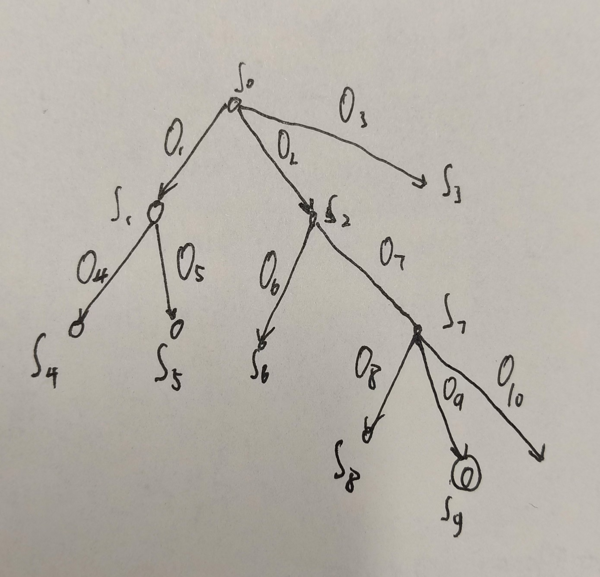

# 状态空间搜索

状态空间搜索是人工智能学习过程中要了解的必要知识，其在神经网络学习中有一定的应用。

参考内容：`https://blog.csdn.net/jiangjunshow/article/details/101100375`; chatGPT; 北信科人工智能课程状态空间一节的PPT;

> 本节内容将以北京信息科技大学大三上人工智能课程王晶老师的状态空间搜索实验项目为核心进行展开。


## 介绍

普通的搜索从一个原始问题出发，在一个大的信息集合中逐渐找到与问题相关的信息子集，最终找到能解决原始问题的最优解。状态空间搜索将这个信息集合中的所有子集作为状态，所有状态之间以转换关系作为连接条件构成一个图，这个图就是状态空间，从原始问题出发，从第一个状态开始寻找，直到能找到满足原始问题的正确状态。

搜索方法有两种，一是没有任何针对性的经验和信息，只按照最基本的搜搜规则寻找，例如广度优先搜索和深度优先搜索；二是有一定的知识和经验，可以据此进行针对性的寻找，例如使用专门的搜索函数寻找。第一种称为 **盲目搜索** ，第二种称为 **启发式搜索** 。

问题的状态空间可用有向图来表达，又常称其为 **状态树(State Tree)** 。图中，节点 $S_{k}$ 表示状态，状态之间的连接采用有向弧(Arc)，弧上标以操作数 $O_{k}$ 来表示状态之间的转换关系。



用状态空间法搜索求解问题，首先要把待求解的问题表示为状态空间图，把问题的解表示为目标节点 $S_{g}$ ，求解就是要找到从根节点 $S_{0}$ 到达目标节点 $S_{g}$ 的搜索路径。

状态空间图在计算机中有两种存储方式：一种是图的显式存储，另一种是图的隐式存储。

### 状态空间表示法

状态空间：状态，描述某一类事物在不同时刻所处于的信息状况；操作，描述状态之间的关系。

问题的状态空间可用一个三元序组来表示： $<S, F, G>$

$S$ ：问题的全部初始状态的集合

$F$ ：操作的集合

$G$ ：目标状态的集合

利用状态空间图求解的具体思路和步骤：

1. 设定状态变量及确定值域；

2. 确定状态组，分别列出初始状态集和目标状态集；

3. 定义并确定操作集；

4. 估计全部状态空间数，并尽可能列出全部状态空间或予以描述之；

5. 当状态数量不是很大时，按问题的有序元组画出状态空间图，依照状态空间图搜索求解。

### 状态空间图的一般搜索算法

首先将搜索问题转换为状态空间搜索问题，得到 **状态空间图** ：


然后在状态空间图中按搜索方法找到 **搜索路径** ：


最后按照的路径得到 **搜索树** ：


## 案例

### 八数码问题

设在3×3的⼀个⽅格模盘上，摆放着⼋个数码1、2、3、4、5、6、7、8，有⼀个⽅格是空格，其可能的初始状态如图（a）所⽰，要求对空格执⾏下列的操作/算符：

空格左移，空格上移，空格右移，空格下移

使⼋个数据最终按图（b）的格式摆放，图（b）称为⽬标状态Sg。要求寻找从初始状态到⽬标状态的路径。


#### 盲目搜索

##### 广度优先搜索

应⽤广度优先搜索，可以得到下图所⽰的搜索树。搜索树上的所有节点都标记它们所对应的状态描述，每个节点旁边的数字表⽰节点扩展的顺序（按逆时针⽅向移动空格）。

如图可以看出，其解的路径为 $S_{0}$ → 3 → 8 → 16 → 27。


广度优先搜索的盲⽬性较⼤，当⽬标节点距离初始节点较远时，将会产⽣⼤量的⽆⽤节点。 **搜索效率低** ，这是它的缺点。但是，只要问题有解，⽤广度优先搜索总可以找到它的解，⽽且是搜索树中，从初始节点到⽬标节点的路径最短的解，也就是说，广度优先搜索策略是 **完备** 的。

##### 有界深度优先搜索

对于许多问题，其状态空间搜索树的深度可能为⽆限深，或者可能⾄少要⽐某个可接受的解序列的已知深度上限还要深。为了避免搜索过程沿着⽆穷的路径搜索下去，往往对⼀个节点扩展的最⼤深度进⾏限制。任何节点如果达到了深度界限，就把它作为没有后继节点进⾏处理，即对另⼀个分⽀进⾏搜索。这就是有界深度优先搜索(Bounded Depth-First Search)。


在有界深度优先搜索算法中，深度界限的选择很重要。选择过⼤，可能会影响搜索的效率；选择的过⼩，有可能求不到解。对于某些问题，可能它的解就位于某⼀分⽀较深的位置，⽽界限值选取的没有那么⼤，就会导致找不到问题的解。所以，有界深度优先搜索策略是 **不完备** 的。

#### 启发式搜索

我们把对搜索有帮助的信息称为启发信息，根据启发信息可以设置估价函数来表示下一步搜索的成文。

我们把估价函数 $f(x)$ 定义为从初始节点经过节点 $x$ 到达⽬标节点的最⼩代价路径的代价估计值。它的⼀般形式为：

$$
f(x) = g(x) + h(x)
$$

- $g(x)$ 为初始节点 $S_{0}$ 到节点 $x$ 已实际付出的代价；
- $h(x)$ 是从节点 $x$ 到⽬标节点 $S_{g}$ 的最优路径的估计代价
- 搜索的启发信息主要由 $h(x)$ 来体现，故把 $h(x)$ 称作启发函数。


通过估价函数可以找到代价最小的路径，其中根据当前节点寻找最优路径的方法称为 **局部择优搜索** ，根据全部节点寻找最优路径的方法称为 **全局择优搜索** 。

##### 全局择优搜索

⾸先定义⼀个估价函数：

$$
f(x) = d(x) + h(x)
$$

其中，d(x)表⽰节点x在搜索树中的深度；h(x)表⽰与节点x对应的棋盘中，与⽬标节点所对应的棋盘中棋⼦位置不同的个数。

例如，节点 $S_0$ ，其在搜索树中位于0层，d(x)=0，⽽它与 $S_{g}$ 中棋⼦位置不同的个数是4，即h(x)=4。所以估价函数值 $f(S_{0})=4$ 。


其中，节点旁边的圆圈内的数字表⽰该节点的f(x)函数值，不带圆圈的数字表⽰节点扩展的顺序。

##### A*算法

A*（A-star）算法是一种常用的图搜索算法，广泛应用于路径规划和图形问题中，尤其是在游戏开发、机器人导航和解决八数码问题等领域。它的主要优点是能够在找到最优解的同时，通常比其他算法（如广度优先搜索）更高效。

A*算法结合了 **广度优先搜索和贪心算法** 的思想，通过使用一个启发式函数来估计从当前状态到目标状态的距离，从而实现高效的搜索。

A算法的核心思想是，在搜索过程中，每次选择代价最小的节点进行扩展。具体来说，A算法使用一个评分函数 f(n) 来衡量每个节点 n 的优先级：

$$
f(n) = g(n) + h(h)
$$

$g(n)$ ：从起点到当前节点 n 的实际代价（路径的长度或步数）。

$h(n)$ ：从当前节点 n 到目标节点的启发式估计代价（通常使用启发函数计算，例如曼哈顿距离、欧几里得距离等）。

A*算法的核心思想是选择具有最小 f(n) 的节点进行扩展。

---

**A\*算法的步骤**

初始化：将起点添加到打开列表（open list）。打开列表是一个优先队列，存储所有待扩展的节点，并根据 f(n) 值排序。关闭列表（closed list）存储已经扩展过的节点。

循环扩展：
- 从打开列表中选择 f(n) 值最小的节点。
- 如果该节点是目标节点，表示找到最优路径，终止算法。否则，将该节点移到关闭列表。
- 对于当前节点的所有相邻节点（子节点）：1、计算它们的 g(n) 和 h(n) 值；2、如果相邻节点不在打开列表中，加入到打开列表；3、如果相邻节点已在打开列表中，检查是否找到更好的路径（即 g(n) 更小）。如果是，更新该节点的 g(n) 和 f(n) 值。

重复：重复扩展节点直到找到目标节点或打开列表为空（无解）。

---

启发式函数 h(n) 是A*算法的一个关键因素。它用于估计从当前节点到目标节点的剩余代价，选择合适的启发式函数可以显著提高搜索效率。常见的启发式函数有：

- 曼哈顿距离：在棋盘格（如八数码问题）中，计算每个数码与目标位置之间的水平和垂直距离之和。
- 欧几里得距离：计算当前节点和目标节点之间的直线距离。


#### 代码

```python
import numpy as np
import heapq
import matplotlib.pyplot as plt

# 定义目标状态
goal_state = np.array([[1, 2, 3], [4, 5, 6], [7, 8, 0]])

# 定义移动方向（上下左右）
moves = [(-1, 0), (1, 0), (0, -1), (0, 1)]


# 计算启发函数：曼哈顿距离
def manhattan_distance(state):
    distance = 0
    for i in range(3):
        for j in range(3):
            value = state[i, j]
            if value != 0:
                goal_x, goal_y = divmod(value - 1, 3)
                distance += abs(i - goal_x) + abs(j - goal_y)
    return distance


# 获取空白块的位置
def find_blank(state):
    return tuple(np.argwhere(state == 0)[0])


# 将状态转化为元组（方便哈希存储）
def state_to_tuple(state):
    return tuple(state.flatten())

# 从堆中取出时，将元组转换回 NumPy 数组
def state_to_np_array(state_tuple):
    return np.array(state_tuple).reshape(3, 3)  # 将元组转换为 3x3 的 NumPy 数组


# 展示当前状态
def display_state(state):
    fig, ax = plt.subplots()
    ax.matshow(state)

    for i in range(3):
        for j in range(3):
            ax.text(j, i, str(state[i, j]), ha='center', va='center', fontsize=20, color='black')

    plt.show()


# A*算法
def a_star(start_state):
    i = 0
    open_list = []
    closed_list = set()

    # 初始节点的启发值和步数
    start_h = manhattan_distance(start_state)
    heapq.heappush(open_list, (start_h, 0, state_to_tuple(start_state), []))

    while open_list:
        i += 1
        # 获取代价最小的节点
        h, g, state_tuple, path = heapq.heappop(open_list)

        current_state = state_to_np_array(state_tuple)

        if state_to_tuple(current_state) in closed_list:
            continue

        closed_list.add(state_to_tuple(current_state))

        # 如果当前状态是目标状态
        if np.array_equal(current_state, goal_state):
            print('检测到目标状态')
            print('路径长度为' + str(len(path) - 1))
            for step in path:
                display_state(np.array(step).reshape(3, 3))  # 将元组恢复为矩阵状态展示
            display_state(current_state)  # 展示目标状态
            return path

        # 获取空白块的位置
        blank_pos = find_blank(current_state)
        x, y = blank_pos

        for move in moves:
            new_x, new_y = x + move[0], y + move[1]
            if 0 <= new_x < 3 and 0 <= new_y < 3:
                # 生成新状态
                new_state = current_state.copy()
                new_state[x, y], new_state[new_x, new_y] = new_state[new_x, new_y], new_state[x, y]

                if state_to_tuple(new_state) not in closed_list:
                    h_new = manhattan_distance(new_state)
                    # 将状态转为元组并存储路径（将新状态也存为元组）
                    heapq.heappush(open_list, (h_new + g + 1, g + 1, state_to_tuple(new_state), path + [state_to_tuple(new_state)]))

    return None


# 初始状态（设置简单一点，要不然能运行二十多万次）
start_state = np.array([[2, 1, 3], [4, 6, 5], [7, 8, 0]])

# 执行A*算法并展示每一步
a_star(start_state)


```

状态表示：使用3x3的NumPy数组表示八数码问题的状态。数字0表示空白块，其他数字表示已放置的数码。

启发函数：使用曼哈顿距离（Manhattan Distance）作为启发式函数，计算每个数字与其目标位置的距离之和。

A*算法：A\*搜索通过open_list（优先队列）来选择代价最低的节点。每个节点记录当前的状态、路径长度、启发值等信息。

每一步展示：每一步的状态通过matplotlib的imshow函数进行图形化显示，并通过text标注当前状态的数码。

目标状态：当当前状态与目标状态一致时，结束搜索，返回路径。

