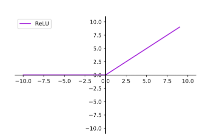

# 了解神经网路

参考文献：`https://blog.csdn.net/AI_dataloads/article/details/132986294?spm=1001.2014.3001.5502`;

神经网络是一种受到生物神经系统启发的人工智能模型，它重现了大脑中神经元之间相互连接的方式。神经网络在诸多领域中取得了显著成就，如图像识别、自然语言处理和语音识别等。

### 神经元

神经元是生物神经系统的工作单位，也是人工神经网络的灵感来源。

神经元的结构：每个神经元都由细胞体、树突和轴突组成。细胞体包含核心部分，树突接收来自其他神经元的信号，而轴突将信号传递给其他神经元。

信号传递：神经元之间的通信是通过电化学信号完成的。当信号通过树突传递到细胞体时，如果达到一定阈值，神经元就会触发并将信号传递给下一个神经元。

### 人工神经元

将生物神经元的概念转化为数学模型，即人工神经元。人工神经元是神经网络的基本构建块，负责对输入进行处理和传递信号。输入可以类比为神经元的树突，而输出可以类比为神经元的轴突，计算则可以类比为细胞核。

输入和权重：人工神经元接收多个输入，每个输入都有一个相关联的权重，这相当于人工神经网络的记忆。这些权重决定了每个输入对神经元的影响程度。

激活函数：在人工神经元中，激活函数决定了神经元是否激活（发送信号）。常见的激活函数包括Sigmoid、ReLU和Tanh。

神经网络:是由大量的节点（或称“神经元”）和之间相互的联接构成。而由两层神经元组成的神经网络称之为--“感知器”（Perceptron）,感知器只能线性划分数据。在输入和权值的线性加权和叠加了一个函数g（激活函数），加权计算公式为：

$$
z = g(W * X) 
$$

### 神经网络 - 层层堆叠

现在我们可以将多个人工神经元组合在一起，形成神经网络。神经网络由多个层组成，包括输入层、隐藏层和输出层，也称为多层感知器。

在神经网络中需要默认增加偏置神经元（节点），这些节点是默认存在的。它本质上是一个只含有存储功能，且存储值永远为1的单元。在神经网络的每个层次中，除了输出层以外，都会含有这样一个偏置单元。（如下图）

输入层：接收原始数据的输入，例如图像像素或文本单词。

隐藏层：这是神经网络的核心部分，包含多个层次的神经元。隐藏层负责从输入中学习特征并生成有用的表示。

输出层：根据学到的特征生成最终的输出，可以是分类标签、数值或其他任务相关的结果。

输入层的节点数：与特征的维度匹配

输出层的节点数：与目标的维度匹配。

中间层的节点数：目前业界没有完善的理论来指导这个决策。一般是根据经验来设置。较好的方法就是预先设定几个可选值，通过切换这几个值来看整个模型的预测效果，选择效果最好的值作为最终选择。

注意事项：

1. 设计一个神经网络时，输入层与输出层的节点数往往是固定的，中间层则可以自由指定；

2. 神经网络结构图中的拓扑与箭头代表着预测过程时数据的流向，跟训练时的数据流有一定的区别；

3. 结构图里的关键不是圆圈（代表“神经元”），而是连接线（代表“神经元”之间的连接）。每个连接线对应一个不同的权重（其值称为权值），这是需要训练得到的。

### 训练神经网络 - 损失函数和反向传播算法

经网络的关键部分之一是训练过程。在训练中，神经网络通过与真实数据进行比较来调整权重，以使其能够做出准确的预测。

反向传播算法：是训练神经网络的核心算法。它通过计算误差并反向传播，以更新每个神经元的权重和偏差，从而减小预测误差。

损失函数：损失函数用于度量预测和实际值之间的差异。训练的目标是最小化损失函数。

### 结论

神经网络是人工智能领域的关键技术，它们的构造基于神经元的灵感，并结合了数学、统计和机器学习的原理。通过构建和训练神经网络，我们能够解决各种各样的问题，从图像识别到自然语言处理。