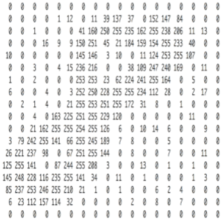

# 卷积神经网络

参考文章：`https://blog.csdn.net/AI_dataloads/article/details/133250229`;

卷积神经网络（Convolutional Neural Network，CNN）是一种在计算机视觉领域取得了巨大成功的深度学习模型。它们的设计灵感来自于生物学中的视觉系统，旨在模拟人类视觉处理的方式。在过去的几年中，CNN已经在图像识别、目标检测、图像生成和许多其他领域取得了显著的进展，成为了计算机视觉和深度学习研究的重要组成部分。

## 图像原理

在了解卷积神经网络前，我们先来看看图像的原理。图像在计算机中是一堆按顺序排列的数字，数值为0到255。0表示最暗，255表示最亮。 如下图：




> 第二张图的数字是取反后的结果。

上图是只有黑白颜色的灰度图，而更普遍的图片表达方式是RGB颜色模型，即红、绿、蓝三原色的色光以不同的比例相加，以产生多种多样的色光。RGB颜色模型中，单个矩阵就扩展成了有序排列的三个矩阵，也可以用三维张量去理解。

其中的每一个矩阵又叫这个图片的一个channel（通道），宽, 高, 深来描述。


## 卷积神经网络的优势

在传统神经网络中，我们要识别下图红色框中的图像时，我们很可能识别不出来，因为这六张图的位置都不通，计算机无法分辨出他们其实是一种形状或物体。


传统神经网络原理如下图：


我们希望一个物体不管在画面左侧还是右侧，都会被识别为同一物体，这一特点就是不变性。为了实现平移不变性，卷积神经网络（CNN）等深度学习模型在卷积层中使用了卷积操作，这个操作可以捕捉到图像中的局部特征而不受其位置的影响。


## 卷积

在卷积神经网络中，卷积操作是指将一个可移动的小窗口（称为数据窗口，如下图绿色矩形）与图像进行逐元素相乘然后相加的操作。这个小窗口其实是一组固定的权重，它可以被看作是一个特定的滤波器（filter）或卷积核。这个操作的名称“卷积”，源自于这种元素级相乘和求和的过程。这一操作是卷积神经网络名字的来源。


上图这个绿色小窗就是数据窗口。简而言之，卷积操作就是用一个可移动的小窗口来提取图像中的特征，这个小窗口包含了一组特定的权重，通过与图像的不同位置进行卷积操作，网络能够学习并捕捉到不同特征的信息。

下图中蓝色的框就是指一个数据窗口，红色框为卷积核（滤波器），最后得到的绿色方形就是卷积的结果（数据窗口中的数据与卷积核逐个元素相乘再求和）。


### 卷积要注意的问题

a. 步长stride：每次滑动的位置步长。

b. 卷积核的个数：决定输出的depth厚度。同时代表卷积核的个数。

c. 填充值zero-padding：在外围边缘补充若干圈0，方便从初始位置以步长为单位可以刚好滑倒末尾位置，通俗地讲就是为了总长能被步长整除。

以上图为例，那么：

- 数据窗口每次移动两个步长取 3*3 的局部数据，即 stride=2 。
- 两个神经元，即 depth=2 ，意味着有两个滤波器。
- zero-padding=1 。

假设有一个大小为 4x4 的输入图像：

```python
[[1, 2, 3, 4],
 [5, 6, 7, 8], 
[9, 10, 11, 12], 
[13, 14, 15, 16]]
```

现在，我们要应用一个 3x3 的卷积核进行卷积操作，步幅（stride）为 1，且要使用填充（padding）为 1。 **如果不使用填充，卷积核的中心将无法对齐到输入图像的边缘，导致输出特征图尺寸变小。** 假设我们使用步幅（stride）为 1 进行卷积，那么在不使用填充的情况下，输出特征图的尺寸将是 2x2。

所以我们要在它的周围填充一圈0，填充为 1 意味着在输入图像的周围添加一圈零值。添加填充后的图像：

```python
[[0, 0, 0, 0, 0, 0], 
[0, 1, 2, 3, 4, 0], 
[0, 5, 6, 7, 8, 0], 
[0, 9, 10, 11, 12, 0], 
[0, 13, 14, 15, 16, 0], 
[0, 0, 0, 0, 0, 0]]
```

现在，我们将 3x3 的卷积核应用于这个填充后的输入图像，计算卷积结果，得到大小不变的特征图。

数据填充的主要目的是确保卷积核能够覆盖输入图像的边缘区域，同时保持输出特征图的大小。这对于在CNN中保留空间信息和有效处理图像边缘信息非常重要。

### 卷积神经网络的模型


上面红框框起来的部分便可以理解为一个 **滤波器** ，即带着一组 **固定权重的神经元** 。多个滤波器叠加便成了 **卷积层** 。

## 卷积神经网络的构造


### 输入层
输入层接收原始图像数据。图像通常由三个颜色通道（红、绿、蓝）组成，形成一个二维矩阵，表示像素的强度值。

### 卷积和激活
卷积层将输入图像与卷积核进行卷积操作。然后，通过应用激活函数（如ReLU）来引入非线性。这一步使网络能够学习复杂的特征。

### 池化层
池化层通过减小特征图的大小来减少计算复杂性。它通过选择池化窗口内的最大值或平均值来实现。这有助于提取最重要的特征。

### 多层堆叠
CNN通常由多个卷积和池化层的堆叠组成，以逐渐提取更高级别的特征。深层次的特征可以表示更复杂的模式。

### 全连接和输出
最后，全连接层将提取的特征映射转化为网络的最终输出。这可以是一个分类标签、回归值或其他任务的结果。

---


---

## 图片经过卷积后的样子

与人眼观看事物原理相似，卷积神经网络可以看到事物的轮廓。


## 代码

### 图像分类

```python
import torch
import torch.nn as nn
import torch.optim as optim
from torchvision import datasets, transforms
import matplotlib.pyplot as plt

# 定义卷积神经网络模型
class CNN(nn.Module):
    def __init__(self):
        super(CNN, self).__init__()
        # 定义卷积层、池化层和全连接层
        self.conv1 = nn.Conv2d(1, 32, kernel_size=3, stride=1, padding=1)
        self.conv2 = nn.Conv2d(32, 64, kernel_size=3, stride=1, padding=1)
        self.conv3 = nn.Conv2d(64, 128, kernel_size=3, stride=1, padding=1)
        self.pool = nn.MaxPool2d(kernel_size=2, stride=2, padding=0)
        self.fc1 = nn.Linear(128 * 3 * 3, 512)
        self.fc2 = nn.Linear(512, 10)  # 10 类（数字 0-9）

    def forward(self, x):
        x = self.pool(torch.relu(self.conv1(x)))
        x = self.pool(torch.relu(self.conv2(x)))
        x = self.pool(torch.relu(self.conv3(x)))
        x = x.view(-1, 128 * 3 * 3)  # Flatten layer
        x = torch.relu(self.fc1(x))
        x = self.fc2(x)
        return x

# 数据预处理
transform = transforms.Compose([
    transforms.ToTensor(),  # 将图像转化为张量
    transforms.Normalize((0.5,), (0.5,))  # 标准化
])

# 加载 MNIST 数据集
train_dataset = datasets.MNIST(root='./data', train=True, download=True, transform=transform)
test_dataset = datasets.MNIST(root='./data', train=False, download=True, transform=transform)

train_loader = torch.utils.data.DataLoader(train_dataset, batch_size=64, shuffle=True)
test_loader = torch.utils.data.DataLoader(test_dataset, batch_size=64, shuffle=False)

# 初始化模型、损失函数和优化器
model = CNN()
criterion = nn.CrossEntropyLoss()  # 交叉熵损失函数
optimizer = optim.Adam(model.parameters(), lr=0.001)

# 训练模型
def train(model, train_loader, criterion, optimizer, num_epochs=5):
    model.train()
    for epoch in range(num_epochs):
        running_loss = 0.0
        for images, labels in train_loader:
            optimizer.zero_grad()  # 清零梯度
            outputs = model(images)  # 前向传播
            loss = criterion(outputs, labels)  # 计算损失
            loss.backward()  # 反向传播
            optimizer.step()  # 更新参数
            
            running_loss += loss.item()
        
        print(f"Epoch [{epoch+1}/{num_epochs}], Loss: {running_loss/len(train_loader):.4f}")

# 测试模型
def test(model, test_loader):
    model.eval()
    correct = 0
    total = 0
    with torch.no_grad():  # 禁用梯度计算
        for images, labels in test_loader:
            outputs = model(images)
            _, predicted = torch.max(outputs, 1)  # 预测类别
            total += labels.size(0)
            correct += (predicted == labels).sum().item()

    accuracy = 100 * correct / total
    print(f"Test Accuracy: {accuracy:.2f}%")

# 可视化预测结果
def display_image(index):
    image, label = test_dataset[index]
    image = image.squeeze().numpy()  # 去除额外的维度
    plt.imshow(image, cmap='gray')
    plt.title(f"True: {label}")
    plt.show()

# 训练模型并测试
train(model, train_loader, criterion, optimizer, num_epochs=5)
test(model, test_loader)

# 显示测试集中的第一张图片和预测结果
display_image(0)

```

**卷积神经网络（CNN）模型**

CNN 类定义了一个简单的卷积神经网络。模型包括三个卷积层、三个池化层和两个全连接层。

第一层卷积层的输入是一个单通道（灰度）图像，输出 32 个特征图。

第二层卷积层将 32 个特征图转换为 64 个特征图，第三层将 64 个特征图转换为 128 个特征图。

每一层卷积后都有一个最大池化层来减少空间维度。

最后使用两个全连接层将特征映射到 10 类输出。

**数据预处理**

使用 torchvision.transforms.Compose 来组合多个数据预处理操作：

- transforms.ToTensor() 将图像数据转换为张量格式。

- transforms.Normalize((0.5,), (0.5,)) 对图像进行标准化处理，使其像素值范围从 [0, 1] 转换为 [-1, 1]。

- 使用 datasets.MNIST 加载 MNIST 数据集，并将数据加载器（train_loader 和 test_loader）用于训练和测试。

**训练模型**

在 train() 函数中，使用交叉熵损失函数（CrossEntropyLoss）和 Adam 优化器来训练模型。

每个 epoch 结束时，输出训练损失。

**测试模型**

在 test() 函数中，使用测试集评估模型准确率。

通过 torch.no_grad() 禁用梯度计算，加速推理过程。

**可视化预测结果**

display_image() 用于显示测试集中的某个图像及其预测结果。

**训练和测试**

训练：运行代码后，模型会进行 5 个周期的训练，训练损失会在每个 epoch 输出。

测试：训练完成后，测试集的准确率会被输出。

可视化：使用 display_image() 函数显示测试集中的一张图片及其模型预测的结果。

**进一步优化**

训练时间：MNIST 数据集较小，训练速度较快。可以通过调整卷积层和全连接层的数量来提高模型复杂度。

数据增强：可以使用 torchvision.transforms 中的其他方法（如随机旋转、裁剪等）来增加训练数据，防止过拟合。

