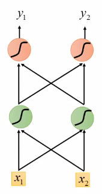

# 循环神经网络

> 参考文章：`https://zhuanlan.zhihu.com/p/123211148`; `https://zhuanlan.zhihu.com/p/32085405`; `https://zhuanlan.zhihu.com/p/32481747`;

## RNN

### 介绍

循环神经网络（Rerrent Neural Network, RNN），RNN对具有序列特性的数据非常有效，它能挖掘数据中的时序信息以及语义信息，利用RNN的这种能力，使深度学习模型在解决语音识别、语言模型、机器翻译以及时序分析等NLP领域的问题时有所突破。

序列特性就是符合时间顺序，逻辑顺序，或者其他顺序就叫序列特性，举几个例子：

- 人类的自然语言符合某个逻辑或规则的字词拼凑排列起来，这就是符合序列特性。

- 语音每一帧每一帧的衔接起来，才凑成了我们听到的话，这也具有序列特性。

- 股票，随着时间的推移，会产生具有顺序的一系列数字，这些数字也是具有序列特性。

### 循环神经网络的优势

我们先来看一个NLP（自然语言处理）很常见的问题，命名实体识别，举个例子，现在有两句话：

第一句话：I like eating apple！（我喜欢吃苹果！）

第二句话：The Apple is a great company！（苹果真是一家很棒的公司！）

现在的任务是要给apple打Label，我们都知道第一个apple是一种水果，第二个apple是苹果公司，假设我们现在有大量的已经标记好的数据以供训练模型，当我们使用全连接的神经网络时，我们做法是把apple这个单词的特征向量输入到我们的模型中（如下图），在输出结果时，让我们的label里，正确的label概率最大，来训练模型，但我们的语料库中，有的apple的label是水果，有的label是公司，这将导致，模型在训练的过程中，预测的准确程度， **取决于训练集中哪个label多一些** ，这样的模型对于我们来说完全没有作用。问题就出在了我们没有结合上下文去训练模型，而是单独的在训练apple这个单词的label，这也是全连接神经网络模型所不能做到的，于是就有了我们的循环神经网络。


### 循环神经网络的结构及原理


上图就是RNN的结构，先不要管右边的W，只看X,U,S,V,O，这幅图就变成了全连接神经网络，如下所示：


其中X是一个向量，也就是某个字或词的特征向量，作为输入层，如上图也就是3维向量，U是输入层到隐藏层的参数矩阵，在上图中其维度就是3X4，S是隐藏层的向量，如上图维度就是4，V是隐藏层到输出层的参数矩阵，在上图中就是4X2，O是输出层的向量，在上图中维度为2。

将RNN结构展开后如下所示：


举个例子，有一句话是，I love you，那么在利用RNN做命名实体识别时，上图中的 $X_{t-1}$ 代表的就是 `I` 这个单词的向量， $X$ 代表的是 `love` 这个单词的向量， $X_{t+1}$ 代表的是 `you` 这个单词的向量，以此类推。注意到，上图展开后，W一直没有变，W其实是每个时间点之间的权重矩阵，RNN之所以可以解决序列问题，是因为它能记住每一时刻的信息，每一时刻的隐藏层不仅由该时刻的输入层决定，还由上一时刻的隐藏层决定，公式如下，其中 $O_{t}$ 代表 t 时刻的输出, $S_{t}$ 代表 t 时刻的隐藏层的值：

$$
O_{t} = g(V \cdot S_{t})
$$

$$
S_{t} = f(U \cdot X_{t} + W \cdot S_{t-1})
$$

在整个训练过程中，每一时刻所用的都是同样的W。

### 示例

假设现在我们已经训练好了一个RNN，如图，我们假设每个单词的特征向量是二维的，也就是输入层的维度是二维，且隐藏层也假设是二维，输出也假设是二维，所有权重的值都为1且没有偏差且所有激活函数都是线性函数，现在输入一个序列，到该模型中，我们来一步步求解出输出序列：




W在实际的计算中，在图像中表示非常困难 ，所以我们可以想象上一时刻的隐藏层的值是被存起来，等下一时刻的隐藏层进来时，上一时刻的隐藏层的值通过与权重相乘，两者相加便得到了下一时刻真正的隐藏层，如图 $a1$ , $a2$ 可以看做每一时刻存下来的值，当然初始时 $a1$ , $a2$ 是没有存值的，因此初始值为0：


当我们输入第一个序列，【1,1】，如下图，其中隐藏层的值，也就是绿色神经元，是通过公式 $S_{t} = f(U \cdot X_{t} + W \cdot S_{t-1})$ 计算得到的，因为所有权重都是1，所以也就是 $1 * 1 + 1 * 1 + 1 * 0 + 1 * 0 = 2$ （由于篇幅关系，原作者只详细列了其中一个神经元的计算过程），输出层的值4是通过公式 $O_{t} = g(V \cdot S_{t})$ 计算得到的，也就是 $2 * 1 + 2 * 1 = 4$ ，得到输出向量【4,4】：


当【1,1】输入过后，我们的记忆里的 $a1$ , $a2$ 已经不是0了，而是把这一时刻的隐藏状态放在里面，即变成了2，如图，输入下一个向量【1,1】，隐藏层的值通过公式 $S_{t} = f(U \cdot X_{t} + W \cdot S_{t-1})$ 得到 $1 * 1 + 1 * 1 + 1 * 2 + 1 * 2 = 6$ ，输出层的值通过公式 $O_{t} = g(V \cdot S_{t})$，得到 $6 * 1 + 6 * 1 = 12$ ，最终得到输出向量【12,12】：


同理，该时刻过后 $a1$ , $a2$ 的值变成了6，也就是输入第二个【1,1】过后所存下来的值，同理，输入第三个向量【2,2】，如图，细节过程不再描述，得到输出向量【32,32】：


由此，我们得到了最终的输出序列为：


至此，一个完整的RNN结构我们已经经历了一遍，我们注意到，每一时刻的输出结果都与上一时刻的输入有着非常大的关系，如果我们将输入序列换个顺序，那么我们得到的结果也将是截然不同，这就是RNN的特性，可以处理序列数据，同时对序列也很敏感。

## LSTM

LSTM，是四个单词的缩写，Long short-term memory，翻译过来就是长短期记忆，是RNN的一种，比普通RNN高级（上面讲的那种），基本一般情况下说使用RNN都是使用LSTM，现在很少有人使用上面讲的那个最基础版的RNN，因为那个存在一些问题，LSTM效果好，当然会选择它了！

使用LSTM而不是RNN，原因在于梯度消失和爆炸的问题，上面那个最基础版本的RNN，每一时刻的隐藏状态都不仅由该时刻的输入决定，还取决于上一时刻的隐藏层的值，如果一个句子很长，到句子末尾时，它将记不住这个句子的开头的内容详细内容，具体原因可以看原作者之前写的文章：`https://zhuanlan.zhihu.com/p/76772734`。

LSTM通过它的“门控装置”有效的缓解了这个问题，这也就是为什么我们现在都在使用LSTM而非普通RNN。

### LSTM的特点

RNN什么信息它都存下来，因为它没有挑选的能力，而LSTM不一样，它会 **选择性的存储信息** ，它有门控装置。如下图，普通RNN只有中间的Memory Cell（记忆细胞）用来存所有的信息，而从下图我们可以看到，LSTM多了三个Gate，也就是三个门，这里的门是用来控制每一时刻信息记忆与遗忘的。


依次来解释一下这三个门：

1. Input Gate：中文是输入门，在每一时刻从输入层输入的信息会首先经过输入门，输入门的开关会决定这一时刻是否会有信息输入到Memory Cell。
2. Output Gate：中文是输出门，每一时刻是否有信息从Memory Cell输出取决于这一道门。
3. Forget Gate：中文是遗忘门，每一时刻Memory Cell里的值都会经历一个是否被遗忘的过程，就是由该门控制的，如果打卡，那么将会把Memory Cell里的值清除，也就是遗忘掉。

先经过输入门，看是否有信息输入，再判断遗忘门是否选择遗忘Memory Cell里的信息，最后再经过输出门，判断是否将这一时刻的信息进行输出。

### 内部结构

LSTM的结构图，是一个时间点上的内部结构，就是整个工作流程中的其中一个时间点，也就是如下图：


我们类比着来学习，首先看图中最中间的地方，Cell，我们上面也讲到了memory cell，也就是一个记忆存储的地方，这里就类似于普通RNN的 $S_{t}$ ，都是用来存储信息的，这里面的信息都会保存到下一时刻，其实标准的叫法应该是 $h_{t}$ ，因为这里对应神经网络里的隐藏层，所以是hidden的缩写，无论普通RNN还是LSTM其实t时刻的记忆细胞里存的信息，都应该被称为 $h_{t}$ 。再看最上面的 $a$ ，是这一时刻的输出，也就是类似于普通RNN里的 $O_{t}$ 。最后，我们再来看这四个 $Z$ , $Z_{i}$ , $Z_{f}$ , $Z_{o}$ ，这四个相辅相成，才造就了中间的Memory Cell里的值，你肯定要问普通RNN里有个 $X_{t}$ 作为输入，那LSTM的输入在哪？别着急，其实这四个 $Z$ , $Z_{i}$ , $Z_{f}$ , $Z_{o}$ , 都有输入向量 $X_{t}$ 的参与。对了，在解释这四个分别是什么之前，我要先解释一下上图的所有这个符号。


都代表一个激活函数，LSTM里常用的激活函数有两个，一个是tanh，一个是sigmoid。


$$
Z = tanh(W[x_{t}, h_{t-1}])
$$

$$
Z_{i} = \sigma(W_{i}[x_{t}, h_{t-1}])
$$

$$
Z_{f} = \sigma(W_{f}[x_{t}, h_{t-1}])
$$

$$
Z_{o} = \sigma(W_{o}[x_{t}, h_{t-1}])
$$

其中 $Z$ 是最为普通的输入，可以从上图中看到， $Z$ 是通过该时刻的输入 $X_{t}$ 和上一时刻存在memory cell里的隐藏层信息 $h_{t}$ **向量拼接** ，再与权重参数向量 $W$ 点积，得到的值经过激活函数tanh最终会得到一个数值，也就是 $Z$ ，激活函数将其转换成 **-1到1** 之间的值，注意只有 $Z$ 的激活函数是tanh，因为 $Z$ 是真正作为输入的，其他三个都是门控装置。

再来看 $Z_{i}$ ，input gate的缩写i，所以也就是输入门的门控装置， $Z_{i}$ 同样也是通过该时刻的输入 $X_{t}$ 和上一时刻隐藏状态，也就是上一时刻存下来的信息 $h_{t-1}$ 向量拼接，在与权重参数向量 $W_{i}$ 点积（注意每个门的权重向量都不一样，这里的下标i代表input的意思，也就是输入门）。得到的值经过激活函数sigmoid的最终会得到一个 **0-1** 之间的一个数值，用来作为输入门的控制信号。

以此类推， $Z_{f}$， $Z_{o}$ 分别是缩写forget和output的门控装置，原理与上述输入门的门控装置类似，最终结果为0到1之间的数值， **1表示该门完全打开，0表示该门完全关闭** 。

下面开始进一步介绍这四个状态在LSTM内部的使用。


$\bigodot$ 是Hadamard Product，也就是操作矩阵中对应的元素相乘，因此要求两个相乘矩阵是同型的。 $\bigoplus$ 则代表进行矩阵加法。

LSTM内部主要有三个阶段：

1、忘记阶段。这个阶段主要是对上一个节点传进来的输入进行 **选择性忘记** 。简单来说就是会 “忘记不重要的，记住重要的”。

具体来说是通过计算得到的 $z^{f}$ （f表示forget）来作为忘记门控，来控制上一个状态的 $c^{t-1}$ 哪些需要留哪些需要忘。

2、选择记忆阶段。这个阶段将这个阶段的输入有选择性地进行“记忆”。主要是会 **对输入 $x^{t}$ 进行选择记忆** 。哪些重要则着重记录下来，哪些不重要，则少记一些。当前的输入内容由前面计算得到的 $z$ 表示。而选择的门控信号则是由 $z^{i}$ （i代表information）来进行控制。

将上面两步得到的结果相加，即可得到传输给下一个状态的 $c^{t}$ 。也就是上图中的第一个公式。


3、输出阶段。这个阶段将决定 **哪些将会被当成当前状态的输出** 。主要是通过 $z^{o}$ 来进行控制的。并且还对上一阶段得到的 $c^{o}$ 进行了放缩（通过一个tanh激活函数进行变化）。

与普通RNN类似，输出 $y^{t}$ 往往最终也是通过 $h^{t}$ 变化得到。

## GRU

GRU（Gate Recurrent Unit）是循环神经网络（Recurrent Neural Network, RNN）的一种。和LSTM（Long-Short Term Memory）一样，也是为了解决长期记忆和反向传播中的梯度等问题而提出来的。

相比LSTM，使用GRU能够达到相当的效果，并且相比之下更容易进行训练，能够很大程度上提高训练效率，因此很多时候会更倾向于使用GRU。

### GRU结构

GRU的输入输出结构与普通的RNN是一样的。

有一个当前的输入 $x^{t}$ ，和上一个节点传递下来的隐状态（hidden state） $h^{t-1}$ ，这个隐状态包含了之前节点的相关信息。

结合 $x^{t}$ 和 $h^{t-1}$ ，GRU会得到当前隐藏节点的输出 $y^t$ 和传递给下一个节点的隐状态 $h^{t}$ 。


首先，我们先通过上一个传输下来的状态 $h^{t-1}$ 和当前节点的输入 $x^{t}$ 来获取两个门控状态。如下图2-2所示，其中 $r$ 控制重置的门控（reset gate）， $z$ 为控制更新的门控（update gate）。


得到门控信号之后，首先使用重置门控来得到“重置”之后的数据 $h^{t-1'} = h^{t-1} \bigodot r$ ，再将 $h^{t-1'}$ 与输入 $x^{t}$ 进行拼接，再通过一个tanh激活函数来将数据放缩到-1~1的范围内。即得到如下图所示的 $h'$ 。


这里的 $h'$ 主要是包含了当前输入的 $x^{t}$ 数据。有针对性地对 $h'$ 添加到当前的隐藏状态，相当于“记忆了当前时刻的状态”。


> 图2-4中的 $\odot$ 是Hadamard Product，也就是操作矩阵中对应的元素相乘，因此要求两个相乘矩阵是同型的。$\oplus$ 则代表进行矩阵加法操作。

---

最后介绍GRU最关键的一个步骤，我们可以称之为”更新记忆“阶段。

在这个阶段，我们同时进行了遗忘了记忆两个步骤。我们使用了先前得到的更新门控 $z$ （update gate）。

更新表达式： $h^{t} = (1 - z) \odot h^{t-1} + z \odot h'$

门控信号（这里的 $z$ ）的范围为0~1。门控信号越 **接近1** ，代表 **“记忆”** 下来的数据越多；而越 **接近0** 则代表 **“遗忘”** 的越多。

GRU很聪明的一点就在于，我们使用了同一个门控 $z$ 就同时可以进行遗忘和选择记忆（LSTM则要使用多个门控）。

$(1 - z) \odot h^{t-1}$ 表示对原本隐藏状态的 **选择性“遗忘”** 。这里的 $(1-z)$ 可以想象成遗忘门（forget gate），忘记 $h^{t-1}$ 维度中一些不重要的信息。

$z \odot h'$ 表示对包含当前节点信息的 $h'$ 进行 **选择性“记忆”** 。

可以看到，这里的遗忘 $(1-z)$ 和选择 $z$ 是联动的。也就是说，对于传递进来的维度信息，我们会进行选择性遗忘，则遗忘了多少权重 $(1-z)$ ，我们就会使用包含当前输入的 $h'$ 中所对应的权重进行弥补 $z$ 。以 **保持一种“恒定”状态** 。


## 代码

### 情感分析

> torch == 2.2.0; torchtext == 1.17.0

```python
import torch
from torch import nn
from torchtext.datasets import IMDB
from torchtext.data.utils import get_tokenizer
from torch.utils.data import DataLoader
import torch.optim as optim
import random
from torch.nn.utils.rnn import pack_padded_sequence, pad_packed_sequence

# 1. 加载数据集
train_data, test_data = IMDB(split='train'), IMDB(split='test')

# 2. 定义分词器
tokenizer = get_tokenizer('basic_english')


# 3. 创建词汇表
def build_vocab_from_iterator(iterator):
    vocab = {}
    for label, line in iterator:
        for word in tokenizer(line):
            if word not in vocab:
                vocab[word] = len(vocab)
    return vocab


train_iter = iter(train_data)
vocab = build_vocab_from_iterator(train_iter)
vocab_inv = {index: word for word, index in vocab.items()}

# 4. 限制每个样本的单词数不超过 100
MAX_LENGTH = 100


def truncate_text(text):
    tokens = tokenizer(text)
    return tokens[:MAX_LENGTH]


# 5. 准备数据：返回文本的长度以及对应的文本和标签
def text_to_tensor(text, vocab):
    tokens = tokenizer(text)
    return torch.tensor([vocab.get(word, 0) for word in tokens], dtype=torch.long), len(tokens)


# 只选取 1000 个训练样本和 20 个测试样本
train_data = [(text_to_tensor(text, vocab), label) for label, text in random.sample(list(IMDB(split='train')), 1000)]
test_data = [(text_to_tensor(text, vocab), label) for label, text in random.sample(list(IMDB(split='test')), 20)]


# 6. 数据加载器需要按长度排序
def collate_fn(batch):
    texts, labels = zip(*batch)
    lengths = [len(text) for text, _ in texts]
    padded_texts = torch.nn.utils.rnn.pad_sequence([text for text, _ in texts], batch_first=True, padding_value=0)
    labels = torch.tensor([1.0 if label == 'pos' else 0.0 for label in labels])
    return padded_texts, lengths, labels


train_loader = DataLoader(train_data, batch_size=32, shuffle=True, collate_fn=collate_fn)


# 7. 定义GRU模型
class SentimentAnalysisGRU(nn.Module):
    def __init__(self, vocab_size, embed_dim, hidden_dim):
        super(SentimentAnalysisGRU, self).__init__()
        self.embedding = nn.Embedding(vocab_size, embed_dim)
        self.gru = nn.GRU(embed_dim, hidden_dim, batch_first=True)
        self.fc = nn.Linear(hidden_dim, 1)
        self.sigmoid = nn.Sigmoid()

    def forward(self, x, lengths):
        x = self.embedding(x)
        packed_input = pack_padded_sequence(x, lengths, batch_first=True, enforce_sorted=False)
        packed_output, hn = self.gru(packed_input)
        out, _ = pad_packed_sequence(packed_output, batch_first=True)
        out = self.fc(hn[-1])  # Using the last hidden state
        return self.sigmoid(out)


# 8. 初始化模型
model = SentimentAnalysisGRU(len(vocab), 100, 128)

# 9. 定义损失函数和优化器
criterion = nn.BCELoss()
optimizer = optim.Adam(model.parameters(), lr=0.001)


# 10. 训练模型
def train(model, data_loader):
    model.train()
    for inputs, lengths, labels in data_loader:
        optimizer.zero_grad()
        outputs = model(inputs, lengths)
        loss = criterion(outputs.squeeze(), labels)
        loss.backward()
        optimizer.step()
    print("Training completed!")


train(model, train_loader)


# 11. 测试模型
def test(model, test_data):
    model.eval()
    correct = 0
    total = 0
    predictions = []

    for text, label in test_data:
        inputs, length = text  # Unpack the text and length
        inputs = inputs.unsqueeze(0)  # Add batch dimension
        length = torch.tensor([length])  # Ensure length is a tensor

        label = torch.tensor([1.0 if label == 'pos' else 0.0])
        outputs = model(inputs, length)
        predicted = (outputs.squeeze() > 0.5).float()
        predictions.append((predicted.item(), label.item(), "pos" if predicted.item() == 1 else "neg"))

        correct += (predicted == label).sum().item()
        total += 1

    print(f"Accuracy: {correct / total:.4f}")
    return predictions


# 12. 获取并打印 5 个测试样本的预测结果
predictions = test(model, test_data)

# 打印前 5 个测试样本的结果
for i in range(5):
    predicted_label, true_label, label_text = predictions[i]
    text_tensor, label = test_data[i]  # 获取评论文本的 Tensor
    # 获取评论的单词并用空格连接起来
    comment_text = ' '.join([vocab_inv[idx.item()] for idx in text_tensor[0]])  # 修改此行

    print(f"Sample {i + 1}:")
    print(f"Review Text: {comment_text}")
    print(f"Predicted: {label_text}, True: {'pos' if true_label == 1.0 else 'neg'}")
    print("-" * 50)
```

