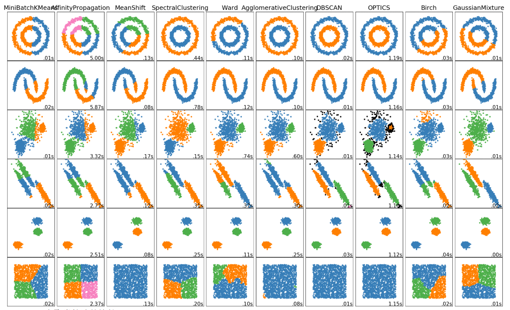
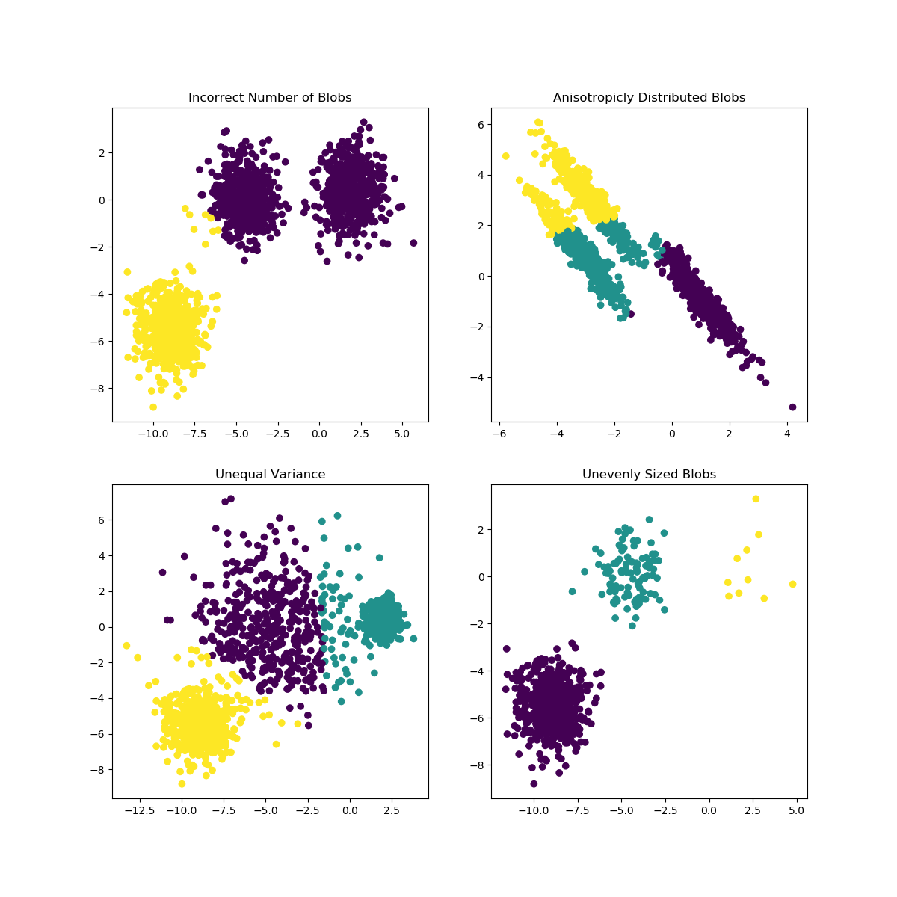
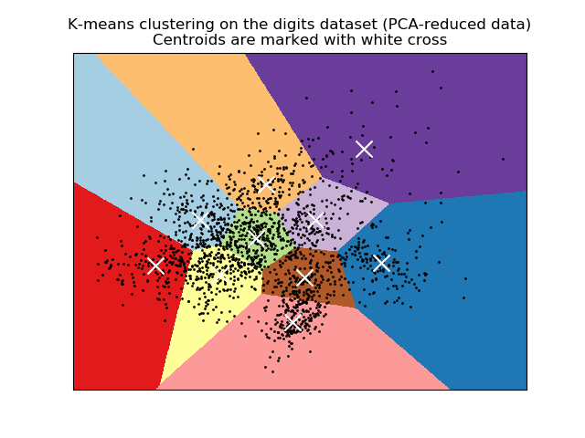
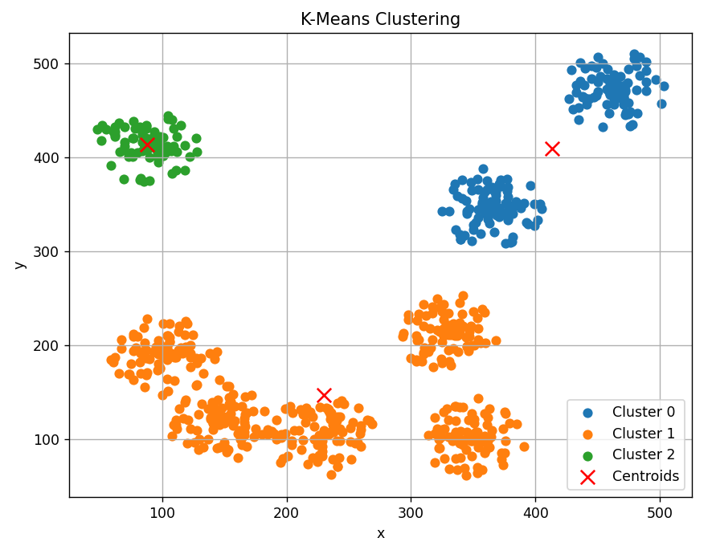

# 普通聚类方法

## 聚类介绍

聚类是一种**无监督学习**方法，目的是将数据根据其特性划分为多个组（簇），使得同一簇内的数据点具有较高的相似性，而不同簇之间的差异性较大。聚类常用于数据探索和分析，帮助理解数据的结构。

主要聚类方法：
1. **K-Means**：将数据分为预定义数量 \(k\) 的簇，优化簇内数据的紧密性。
2. **层次聚类**：基于层次树的结构分组，可以是自顶向下或自底向上。
3. **DBSCAN**：基于密度的聚类方法，适用于不规则形状的簇。
4. **高斯混合模型 (GMM)**：基于概率分布的聚类方法，假设数据来自多个高斯分布。

典型应用：
- 客户分群
- 图像分割
- 文本分析
- 基因数据分类

例如：将购物平台的用户根据消费行为聚类成不同的用户群体。



## 聚类方法

### K-Means

#### 介绍

KMeans 算法通过把样本 **分离成 n 个具有相同方差的类** 的方式来对数据进行聚类，最小化一个称为惯量或簇内平方和的准则（见下文）。该算法需要指定簇的数量。它可以很好地扩展到大量样本，并已经在许多不同领域的应用领域被广泛使用。

k-means 算法将一组 **N样本X划分成K个不相交的簇C** ,每个都用该簇中样本的均值 $\mu_{j}$ 描述。 这个均值通常被称为**簇的 “质心”** ; 尽管它们处在同一个空间，但它们通常 **不是从X中挑选出的点** ，虽然它们是处在同一个空间。

K-means算法旨在选择一个质心, 能够 **最小化惯性或簇内平方和** 的标准：

$$
\sum_{i=0}^{n} \min {\mu_{j} \in C}\left(\left|x_{i}-\mu_{j}\right|^{2}\right)
$$

惯性被认为是测量簇内聚程度的尺度。它有很多缺点:

- 惯性假设簇是凸的，各项同性的，但并不总是这样。它对细长的簇或具有不规则形状的流形反应很差。
- 惯性不是一个归一化度量： 我们只知道当惯量的值越低越好，零是最优的。但是在非常高维的空间中，欧氏距离往往会膨胀。在 k-means 聚类算法之前运行主成分分析(PCA)等降维算法可以缓解这个问题并加快计算速度。



K-means 通常被称为 Lloyd 算法。简单来说，算法有三个步骤。第一步是选择初始质心，最基本的方法是 **从数据集X中选择K个样本** 。初始化之后，K-means由其他两个步骤之间的循环组成。第一步将每个 **样本分配到其最近的质心** 。第二步是通过取分配给 **前一个质心** 的所有样本的 **平均值** 来创建 **新的质心** 。计算新旧质心之间的 **差值** ，算法重复最后两个步骤，直到该值 **小于阈值** 。换句话说，算法重复这个步骤，直到质心不再明显移动。



> 关于k-means的实现参考`..\python\数据分析\NumPy\02.机器学习中的numpy.md`

#### k-means++

K-means++ 是一种优化的 K-means 聚类算法的初始化方法，用于 **选择初始簇中心** 。它通过更智能的初始化方式，避免了随机选择初始簇中心可能导致的局部最优解问题，显著提高了 K-means 的聚类效果和收敛速度。

算法步骤：

- 随机选择：从数据集中 **随机选择** 一个点作为 **第一个簇中心** 。
- 计算距离：对于每个数据点，**计算** 其到已选簇中心的**最小距离（平方）** 。
- 加权选择：根据距离的平方值，按概率选择下一个簇中心。 **距离越远** 的点被选择的概率越大。
- 重复：重复步骤 2 和 3，直到选择出k个簇中心。
- K-means 开始：使用这些簇中心作为初始点，运行标准的 K-means 算法。

优点：

- 更均匀的簇中心分布：初始簇中心分布更合理，减少聚类结果偏差。
- 收敛速度更快：减少迭代次数。
- 更好的聚类质量：降低局部最优解的概率。

> 关于k-means++的实现参考`..\python\数据分析\NumPy\02.机器学习中的numpy.md`

#### 代码

##### 创建KMeans

```python
from sklearn.cluster import KMeans

# 创建 KMeans 对象
kmeans = KMeans(n_clusters=3, random_state=42)
```

主要参数：
- n_clusters：指定簇的数量（默认为 8）。示例：n_clusters=3

- init：初始聚类中心的初始化方法，有以下常用值。
    - 'k-means++'（默认）：一种智能初始化方法，提高收敛速度。
    - 'random'：随机初始化。
    - 自定义初始化（提供初始中心的数组）。

- n_init：K-Means 聚类运行的初始化次数（默认为 10）。算法会多次运行并返回最佳结果。

- max_iter：单次运行中 K-Means 算法的最大迭代次数（默认为 300）。

- tol：容忍度，用于判断算法是否收敛（默认为 1e-4）。

- random_state：设置随机数种子，以保证结果可重复。

- algorithm：算法类型，默认为 'lloyd'。有以下可选值。
    - 'lloyd'：标准 K-Means 算法。
    - 'elkan'：改进版算法（速度更快，但只适用于欧几里得距离）。

主要属性：
- cluster_centers_：簇中心的坐标数组。

- labels_：每个样本所属的簇标签。

- inertia_：簇内样本到其簇中心的平方距离和，表示模型的误差。

- n_iter_：实际迭代的次数。

##### 训练

```python
kmeans.fit(X)
```

- X：形状为 `(n_samples, n_features)` 的二维数组，表示数据样本。

- 无返回值。

##### 训练并预测

```python
labels = kmeans.fit_predict(X)
print(labels)  # 每个点的簇标签
```

- 参数同 `fix(X)`。

- 返回值为一个数组，形状为 `(n_samples,)`，表示每个样本的簇标签。

##### 预测

```python
new_labels = kmeans.predict(X_test)  # 对新数据点预测簇
print(new_labels)
```

- 参数类型同 `fix(X)`。

- 一个数组，形状为 `(n_samples,)`，表示每个新样本的簇标签。

##### 训练并返回距离

```python
distances = kmeans.fit_transform(X)
print(distances)  # 每个样本到簇中心的距离
```

- 参数同 `fix(X)`。

- 返回一个数组，形状为 `(n_samples, n_clusters)`，表示每个样本到所有簇中心的距离。


##### 示例

```python
import pandas as pd
import matplotlib.pyplot as plt
from sklearn.cluster import KMeans

# 1. 读取数据
data = pd.read_csv('kmeans.csv')
X = data[['x', 'y']]

# 2. K-Means 聚类
kmeans = KMeans(n_clusters=3, random_state=42)  # 指定3个簇
kmeans.fit(X)

# 聚类标签
data['cluster'] = kmeans.labels_

# 3. 可视化结果
plt.figure(figsize=(8, 6))
# 将 data['cluster'] 转换为一个集合（set），自动去掉重复值。
for cluster in set(data['cluster']):
    cluster_points = data[data['cluster'] == cluster]
    plt.scatter(cluster_points['x'], cluster_points['y'], label=f'Cluster {cluster}')
    
# 绘制簇中心
centers = kmeans.cluster_centers_
plt.scatter(centers[:, 0], centers[:, 1], c='red', marker='x', s=100, label='Centroids')

plt.title('K-Means Clustering')
plt.xlabel('x')
plt.ylabel('y')
plt.legend()
plt.grid()
plt.show()
```

结果：



##### 找到合适的簇数量k

###### 轮廓系数

衡量样本的聚类质量，分数在 -1 到 1 之间，越接近 1 越好。

步骤：对不同的k执行聚类；计算每个样本的轮廓系数；选择轮廓系数平均值最高的k。

```python
"""
这里假设已经有了数据data和模型model
"""

from sklearn.metrics import silhouette_score
import matplotlib.pyplot as plt

# 初始化变量
k_values = range(2, 11)  # k 的取值范围
silhouette_scores = []

# 遍历不同的 k 值
for k in k_values:
    model.n_clusters = k  # 设置簇的数量
    labels = model.fit_predict(data)  # 聚类并获取标签
    score = silhouette_score(data, labels)  # 计算轮廓系数
    silhouette_scores.append(score)  # 保存得分

# 找到最优 k 值
best_k = k_values[silhouette_scores.index(max(silhouette_scores))]
print(f"最优的 k 值为: {best_k}")

# 可视化轮廓系数
plt.plot(k_values, silhouette_scores, marker='o')
plt.xlabel('Number of Clusters (k)')
plt.ylabel('Silhouette Score')
plt.title('Silhouette Analysis for Optimal k')
plt.show()

```

```python
"""
完整代码，但是数据集来自北信科机器学习课程
"""

import pandas as pd
import matplotlib.pyplot as plt
from sklearn.cluster import KMeans
from sklearn.preprocessing import StandardScaler
from sklearn.metrics import silhouette_score

class myCluster():
    def __init__(self):
        self.model = KMeans(random_state=42)

        data = pd.read_csv('kmeans.csv')
        self.data = data

    def standard(self, data):
        scaler = StandardScaler()
        data_scaler = scaler.fit_transform(data)
        # 转换为 DataFrame，保持原来的列名
        data_scaled_df = pd.DataFrame(data_scaler, columns=data.columns)
        return data_scaled_df

    def find_k(self, model, data):
        k_values = range(3, 12)
        silhouette_scores = []

        for k in k_values:
            model.n_clusters = k
            self.fit(data)
            labels = self.model.labels_
            score = silhouette_score(data, labels)
            silhouette_scores.append(score)

        best_k = k_values[silhouette_scores.index(max(silhouette_scores))]
        print(f"最优的k值为 {best_k}")

        # 可视化轮廓系数
        plt.plot(k_values, silhouette_scores, marker='o')
        plt.xlabel('Number of Clusters (k)')
        plt.ylabel('Silhouette Score')
        plt.title('Silhouette Analysis for Optimal k')
        plt.show()

        model.n_clusters = best_k


    def fit(self, data):
        self.model.fit(data)

    def draw(self, data):
        plt.figure(figsize=(8, 6))

        # 绘制簇
        for cluster in set(data['cluster']):
            cluster_point = data[data['cluster'] == cluster]
            plt.scatter(cluster_point['x'], cluster_point['y'], label=f'Cluster {cluster}')

        # 绘制簇中心
        centers = self.model.cluster_centers_
        plt.scatter(centers[:, 0], centers[:, 1], c='red', marker='x', s=100, label='Centroids')

        plt.title('KMeans Clustering')
        plt.xlabel('x')
        plt.ylabel('y')
        plt.legend()
        plt.grid()
        plt.show()

    def run(self):
        data = self.standard(self.data)
        self.find_k(self.model, data)
        self.fit(data)
        data['cluster'] = self.model.labels_
        self.draw(data)


def main():
    cluster = myCluster()
    cluster.run()
```

